# 🤯超列表:一个列表来统治他们所有人。19 年 7 月

> 原文：<https://dev.to/xenoxdev/ultra-list-one-list-to-rule-them-all-july-19-1lgd>

所以我想这是一件事了。这是我们要经常做的事，因为你们似乎很喜欢。抱歉耽搁了。是的，我知道现在已经是八月了，但是从现在开始就是这样了。我想你不会介意的，因为我们正在做一个很酷的新开源项目，你们会喜欢的！这个我不能说太多，只知道跟音乐有关。敬请期待！

无论如何，超能力者会活下去！

这提醒了我，你们看过新的狮子王电影吗？我看了，我觉得那很棒！《奇异事物》第三季也在这个月上映，你打赌我马上就看了。我们似乎永远都在等待！蜘蛛侠:远离家乡也很棒。

你们这个月看了什么？在评论里说说吧。

不管怎样，我们开始吧，好吗？

### 赠品🎁

重要的事情先来！让我们探索免费的东西。享受吧，别忘了感谢制作者！💝

#### *Fonts*

一个人永远不会有足够的伟大的字体！

**1。去年冬天**加里斯曼工作室👉🏼[链接](https://www.dafont.com/lastwinter.font)

**2。马里亚诺·迭斯的《纽约砖块》👉🏼[链接](https://www.behance.net/gallery/83151057/NY-Bricks-Free-font)**

[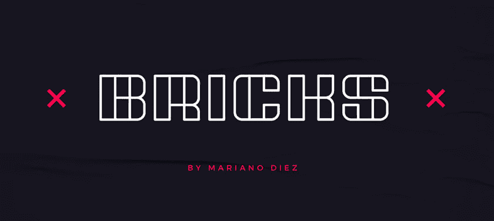](https://res.cloudinary.com/practicaldev/image/fetch/s--tk49DwA6--/c_limit%2Cf_auto%2Cfl_progressive%2Cq_auto%2Cw_880/https://thepracticaldev.s3.amazonaws.com/i/f995m9hwkajimyqbngx9.png)

**3 .**的喃喃自语由耶利米土地👉🏼[链接](https://gitlab.com/velvetyne/murmure)

**4。Twicolabs 基金会的 Le Murmure** 👉🏼[链接](https://pixelbuddha.net/freebie/lansdowne-decorative-font/)

[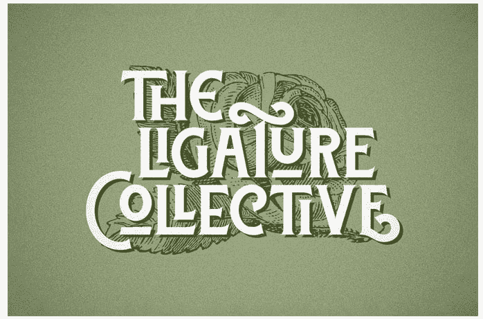](https://res.cloudinary.com/practicaldev/image/fetch/s--aazwiTNn--/c_limit%2Cf_auto%2Cfl_progressive%2Cq_auto%2Cw_880/https://thepracticaldev.s3.amazonaws.com/i/8czmeorqgigp72fktjmc.png)

* * *

#### *产品*

这个月我发现了一些很棒的产品。

**1。一些免费的浏览器工具。👉🏼[链接](https://lottatools.com)**

[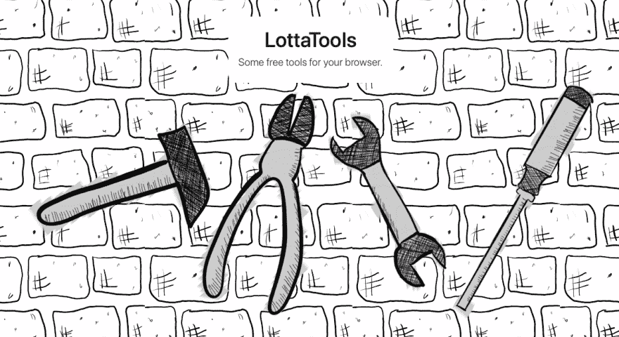](https://res.cloudinary.com/practicaldev/image/fetch/s--bAFavwgX--/c_limit%2Cf_auto%2Cfl_progressive%2Cq_auto%2Cw_880/https://thepracticaldev.s3.amazonaws.com/i/bbq6hu2e0pl0bd7r7es3.png)

**2。开发人员和设计人员的浏览器👉🏼[链接](https://sizzy.co/)**

[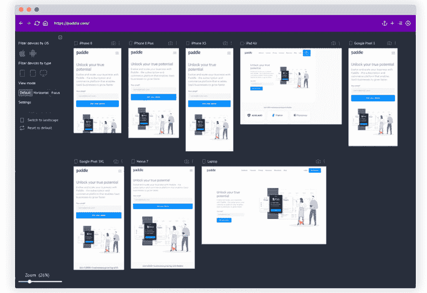](https://res.cloudinary.com/practicaldev/image/fetch/s--AoKULmgC--/c_limit%2Cf_auto%2Cfl_progressive%2Cq_auto%2Cw_880/https://thepracticaldev.s3.amazonaws.com/i/8vfjgooygo5n3plsbepr.png)

**3。Listmonk** 自主持简讯+邮件列表管理器👉🏼[链接](http://listmonk.app)

[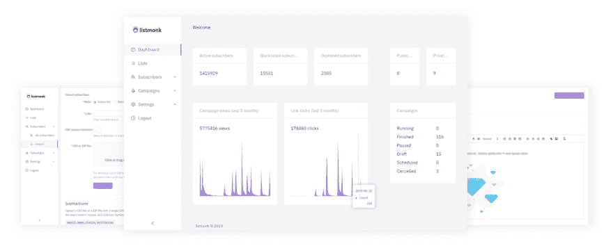](https://res.cloudinary.com/practicaldev/image/fetch/s--XiAZgASF--/c_limit%2Cf_auto%2Cfl_progressive%2Cq_auto%2Cw_880/https://listmonk.app/statimg/splash.png)

**4。简单而现代的电子书浏览器👉🏼[链接](https://johnfactotum.github.io/foliate/)**

[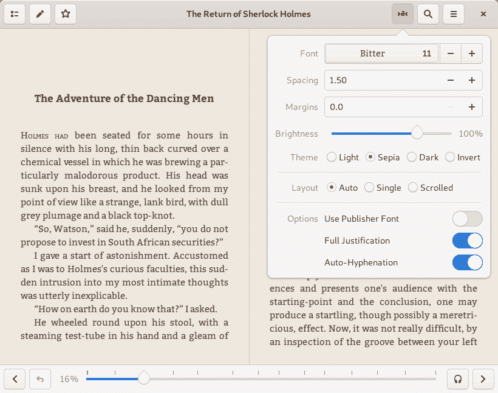](https://res.cloudinary.com/practicaldev/image/fetch/s--1-p-QwFl--/c_limit%2Cf_auto%2Cfl_progressive%2Cq_auto%2Cw_880/https://johnfactotum.github.io/foliate/screenshot.png)

**5。Ciao** HTTP 检查&测试(私有&公共)监控-检查你的 URL 的状态👉🏼[链接](https://www.brotandgames.com/ciao/)

* * *

#### *杂项*

**1。进度跟踪器**一个 HTML 组件，用于说明多步骤流程中的各个步骤👉🏼[链接](https://nigelotoole.github.io/progress-tracker/)

[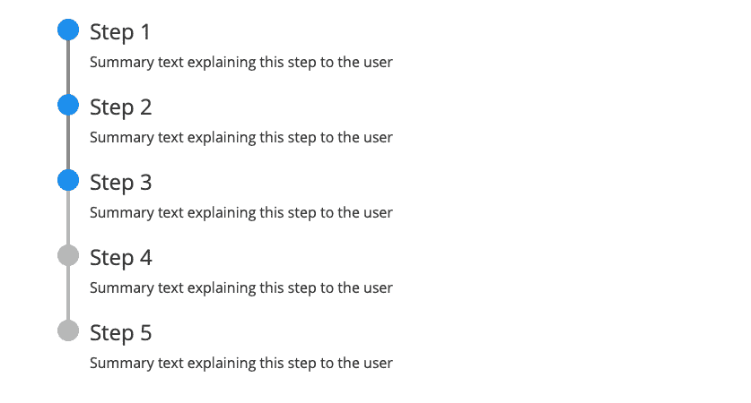](https://res.cloudinary.com/practicaldev/image/fetch/s--8_BqsYbF--/c_limit%2Cf_auto%2Cfl_progressive%2Cq_auto%2Cw_880/https://thepracticaldev.s3.amazonaws.com/i/nlht74vybufux8ym2mx6.png)

**2。等距图**为设计师、
初创公司和公司提供免费等距图👉🏼[链接](https://isometric.online)

**3。免费 iPad PSD 模型模板集**👉🏼[链接](https://www.behance.net/gallery/83047359/Free-iPad-PSD-Mockup-Template-Set/)

**3。超级图标**👉🏼[链接](https://github.com/edent/SuperTinyIcons)

[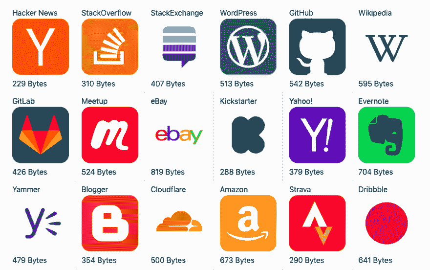](https://res.cloudinary.com/practicaldev/image/fetch/s--g5hNwDvc--/c_limit%2Cf_auto%2Cfl_progressive%2Cq_auto%2Cw_880/https://thepracticaldev.s3.amazonaws.com/i/mh4ibk4bsamwurk4squ9.png)

* * *

### VS 代码素材👩🏻‍💻

是时候向您展示我最喜欢的 IDE VS 代码的一些引人注目的主题了。给你的工作站添加一些爵士乐，使用一个好的主题。

**1。紫色的阴影**👉🏼[链接](https://rubjo.github.io/victor-mono/)

[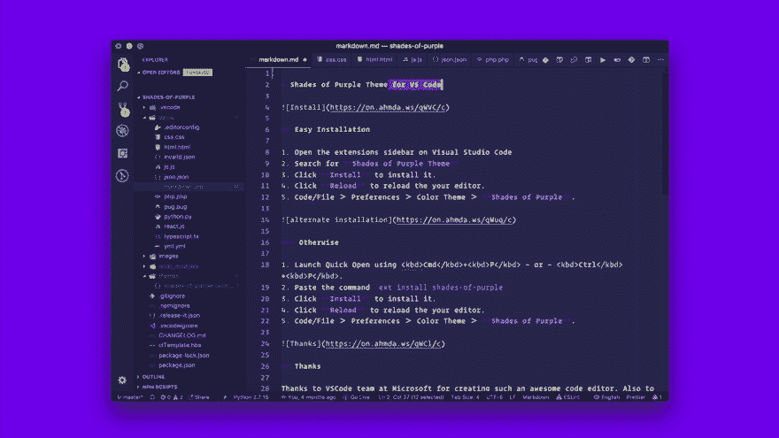](https://res.cloudinary.com/practicaldev/image/fetch/s--z9iJv-To--/c_limit%2Cf_auto%2Cfl_progressive%2Cq_66%2Cw_880/https://raw.githubusercontent.com/ahmadawais/shades-of-purple-vscode/mastimg/1_sop.gif)

**2。Svg 预览**[链接](https://marketplace.visualstudio.com/items?itemName=SimonSiefke.svg-preview)

[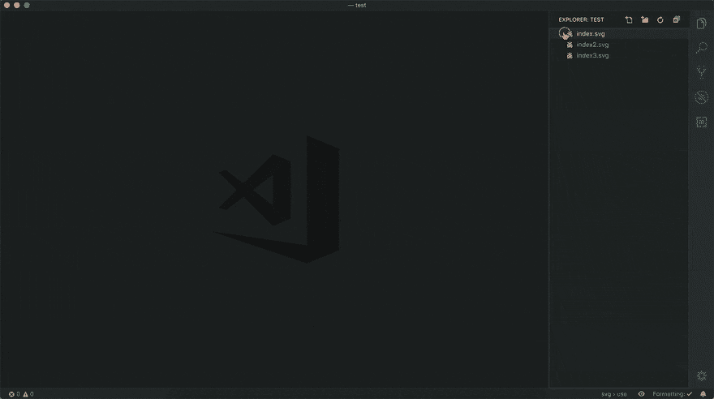](https://res.cloudinary.com/practicaldev/image/fetch/s--9aNa1MVP--/c_limit%2Cf_auto%2Cfl_progressive%2Cq_66%2Cw_880/https://github.com/SimonSiefke/vscode-svg-preview/raw/master/demo_images/demo.gif)

**3。大胡子主题**👉🏼[链接](https://marketplace.visualstudio.com/items?itemName=BeardedBear.beardedtheme)

[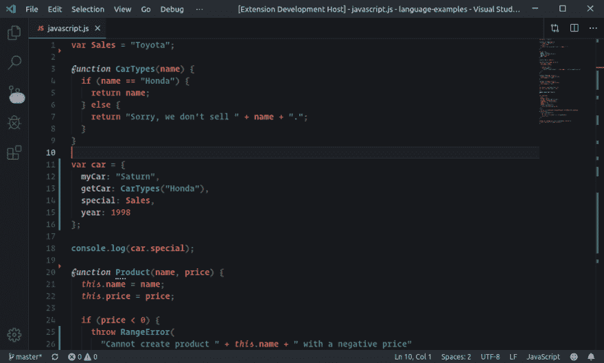](https://res.cloudinary.com/practicaldev/image/fetch/s--jmYwivZD--/c_limit%2Cf_auto%2Cfl_progressive%2Cq_auto%2Cw_880/https://raw.githubusercontent.com/BeardedBear/bearded-theme/master/assets/syntax-javascript.png)

* * *

### 图书馆🗃

设计人员和开发人员不断地制作库来改进他们的工作流程。这里有一些很酷的！

**1。jExcel v3**JavaScript 电子表格👉🏼[链接](https://bossanova.uk/jexcel/v3/)

[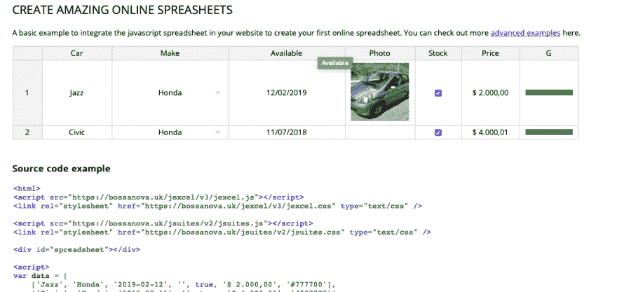](https://res.cloudinary.com/practicaldev/image/fetch/s--yBxgRyS5--/c_limit%2Cf_auto%2Cfl_progressive%2Cq_auto%2Cw_880/https://thepracticaldev.s3.amazonaws.com/i/yogxio8ufnimfxxo4y7n.png)

**2。css** 一个 CSS3 支持的悬停效果的集合，应用于链接。👉🏼[链接](http://ianlunn.github.io/Hover/)

[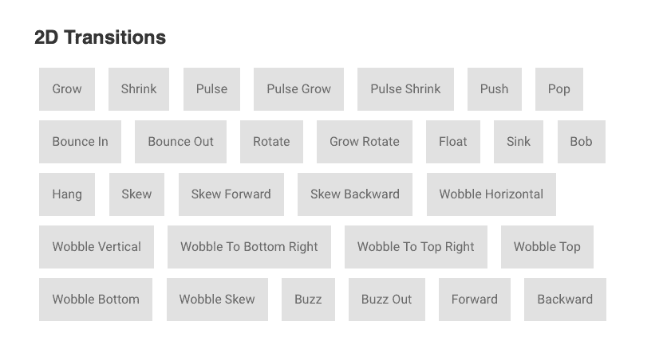](https://res.cloudinary.com/practicaldev/image/fetch/s--DjZOJT2o--/c_limit%2Cf_auto%2Cfl_progressive%2Cq_auto%2Cw_880/https://thepracticaldev.s3.amazonaws.com/i/jyttljcvhlmctfbhjfg4.png)

**3。可移动的**可移动的是可拖动的、可调整大小的、可缩放的、可旋转的、可弯曲的👉🏼[链接](https://github.com/daybrush/moveable)

[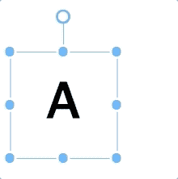](https://res.cloudinary.com/practicaldev/image/fetch/s--tPgBukOd--/c_limit%2Cf_auto%2Cfl_progressive%2Cq_66%2Cw_880/https://raw.githubusercontent.com/daybrush/moveable/master/deimg/draggable.gif)

* * *

### 指南/备忘单📓

有了这些，你的生活会轻松一点。

**1。层叠**中的 CSS 自定义属性👉🏼[链接](https://www.smashingmagazine.com/2019/07/css-custom-properties-cascade/)

**2。优秀电子应用的秘密**👉🏼[链接](https://jlongster.com/secret-of-good-electron-apps)

[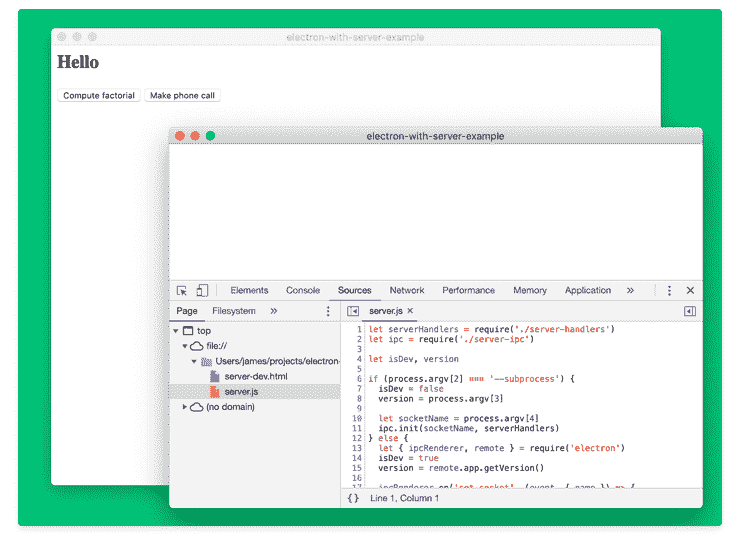](https://res.cloudinary.com/practicaldev/image/fetch/s--NmOv4ovD--/c_limit%2Cf_auto%2Cfl_progressive%2Cq_auto%2Cw_880/https://thepracticaldev.s3.amazonaws.com/i/1mktzgyl59ao8ctpai68.png)

**3。2019 年 JavaScript 的成本**👉🏼[链接](https://v8.dev/blog/cost-of-javascript-2019)

[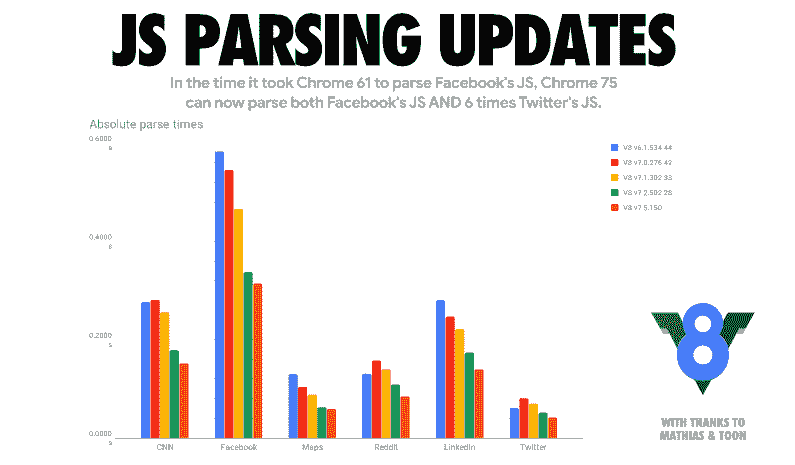](https://res.cloudinary.com/practicaldev/image/fetch/s--MtUGiBmF--/c_limit%2Cf_auto%2Cfl_progressive%2Cq_auto%2Cw_880/https://thepracticaldev.s3.amazonaws.com/i/epubzeexwc37g7xzad7v.png)

**4。JavaScript:我不知道这个**👉🏼[链接](https://www.youtube.com/watch?v=kIhITzw0CG8)

[https://www.youtube.com/embed/kIhITzw0CG8](https://www.youtube.com/embed/kIhITzw0CG8)

* * *

### 来自 XenoX 团队🔥

**1。本月开源项目！这是给所有板球迷的。一个简单的 CLI 工具，给你实时更新，每当比赛正在进行。
如果你喜欢，就去叉它，添加新功能！对 [Dev Sengupta](https://github.com/debopamsengupta) 为 CriCLI 添加了一些令人敬畏的新功能大声欢呼。谢谢老兄。**

我在另一篇文章中写了更多。一定要看看我们为克里奇录制的小短剧！

## 文章不再可用

CriCLI 在 ProductHunt 上也做得很好。每日第五产品！你可以在这里查看！

**2。所以上个月我们推出了多元宇宙。从现在开始，XenoX 中的所有合作项目和开发人员都将在这里列出。我们已经有一堆新面孔兴奋地做出贡献。**

但是到目前为止，7 月份的明星贡献者是 Rajesh，也就是 Stereoraj！他给 DevtoCLI 应用程序添加了期待已久的书签功能！现在你可以直接从应用程序中收藏你最喜欢的故事。

[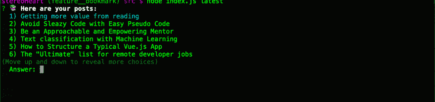](https://res.cloudinary.com/practicaldev/image/fetch/s--zFQY-PTh--/c_limit%2Cf_auto%2Cfl_progressive%2Cq_66%2Cw_880/https://thepracticaldev.s3.amazonaws.com/i/ykdyfoo1hac2xz4lmswy.gif)

为拉吉热烈鼓掌。你做到了，伙计！

顺便说一句，伙计们，你可以看看下面的 XenoX 多元宇宙。有关如何加入的说明，请参见自述文件。超级简单。😊

##  [【团队异种】](https://github.com/teamxenox) / [异种多篇](https://github.com/teamxenox/XenoXMultiverse)

### 🔥🚀XenoX 集合！！

<article class="markdown-body entry-content container-lg" itemprop="text">

# XenoX 多元宇宙

随着 XenoX 多元宇宙的开始，我们正在使事情正式化。XenoX 团队最初是我的梦想，只是一个开发人员的小团队，为了好玩而从事开源项目。但几个月来，它变得越来越大，越来越强。因此，我想正式宣布团队 XenoX 开源计划。这是 XenoX 上所有项目和所有合作开发人员的主列表。

如果你也想成为开源英雄，只需写下你的名字，你就可以加入并开始贡献自己的力量！

## 如何加入团队？💪🏼

1.  叉回购。
2.  把你的名字加到这个文件上。
3.  提交拉取请求。

就是这样。你都准备好了。团队中会有人联系你，正式欢迎你加入团队。干杯！

## 接缝

*   萨尔萨克·夏尔马 <g-emoji class="g-emoji" alias="fire" fallback-src="https://github.githubassets.cimg/icons/emoji/unicode/1f525.png">🔥</g-emoji>
*   [乌特卡什塔尔瓦尔](https://github.com/sarthology)🎸
*   [拉杰特·夏尔马](https://github.com/sharmarajat01) <g-emoji class="g-emoji" alias="headphones" fallback-src="https://github.githubassets.cimg/icons/emoji/unicode/1f3a7.png">🎧</g-emoji>
*   [rajesh main Ali](https://github.com/Stereoraj)
*   帕万 …

</article>

[View on GitHub](https://github.com/teamxenox/XenoXMultiverse)

如果你喜欢我们的工作，加入我们的团队，和我们一起释放开源开发的力量。💪不管你是初学者还是老手，每个人都受欢迎。

* * *

## 最后一件事！

[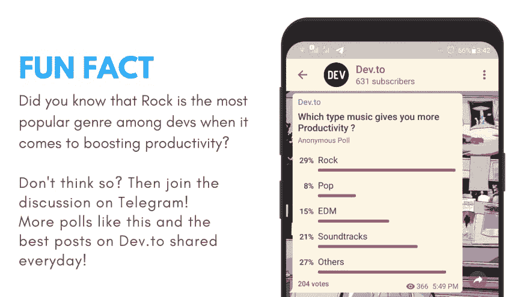](https://res.cloudinary.com/practicaldev/image/fetch/s--T7j52mzz--/c_limit%2Cf_auto%2Cfl_progressive%2Cq_auto%2Cw_880/https://thepracticaldev.s3.amazonaws.com/i/76xlewq1o9vecs9l3ydg.png)

我们的 Dev.to Telegram 频道现在有 600 多人！这个月让它达到 1000 吧。[加入频道！](http://bit.ly/devtg)

* * *

## 感谢

好了，这次到此为止，伙计们。希望你喜欢这个。下期帖子再见！如果你喜欢这篇文章，把它分享给你的朋友和家人，他们会从中受益。如果你想在下一篇文章中加入一些你自己的东西，请在 Twitter 上发消息给我。或者有什么建议，欢迎在下面评论。

Tada!

