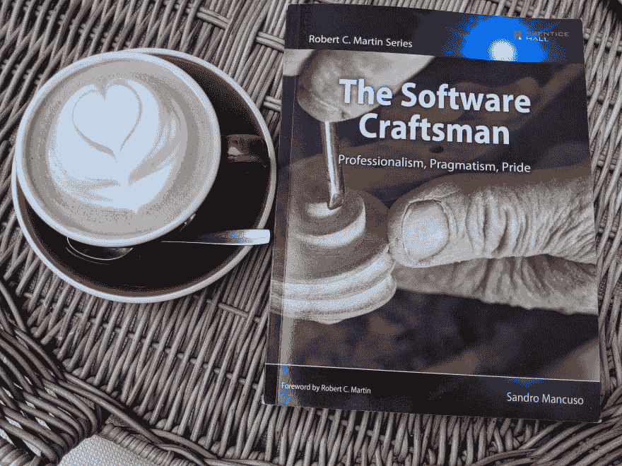
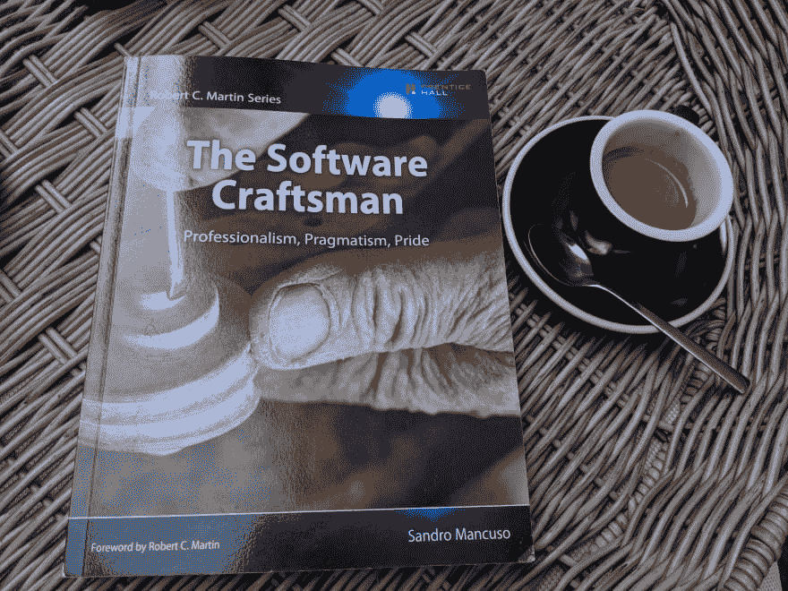

# 软件工匠——简评

> 原文：<https://dev.to/colaru/the-software-craftsman-a-short-book-review-17dk>

我过去常常在假期带一本书去看一些有趣的东西。在我的假期里，有些时候我有时间阅读。尤其是当我在等飞机的时候，我在飞行时间或者在西班牙太阳下的海滩上。

这个假期我带着软件工匠(T2)桑德罗·曼库索(T3)写的《专业主义、实用主义和骄傲》。我以为要花整个假期才能读完这本书。我错了，因为我在 4 天内读了它，因为它抓住了我。

迄今为止，这是我今年读过的最好的一本书——尽管它没有一行代码。也许是因为它是用作者职业生涯中的真实故事写成的，许多故事对我来说是“似曾相识”的。

我还将这本书的内容与这个迷人的鲍伯·马丁叔叔视频演示相关联- [编程的未来](https://www.youtube.com/watch?v=ecIWPzGEbFc)，这是编程的过去和未来。我也是同时看到这篇文章的，也是第一次听说飞机失事是因为外包软件。材料是这个[波音公司的 737 Max 软件外包给 9 美元一小时的工程师](https://www.bloomberg.com/news/articles/2019-06-28/boeing-s-737-max-software-outsourced-to-9-an-hour-engineers)。

## **图书结构**

我将在每一部分用我最喜欢的一个主要观点来介绍这本书的章节。

第一部分是对当前规划工作的回顾。

1.  21 世纪的软件开发 90 年代的资历“编写别人看不懂的代码会让你马上成为高级开发人员。”
2.  敏捷 -敏捷转型是假的，因为“项目经理变成了 Scrum 大师。敏捷成了旧工作方式的新名称”
3.  **软件工艺**—《软件工艺宣言》的介绍和说明
4.  **软件工艺态度** -让自己跟上时代
5.  **工作软件**——“工作软件是不够的”以及为什么“开发人员害怕接触现有代码”来添加新功能
6.  英雄、善意和专业精神 -学习如何说“不”并给出替代方案(不..但是)
7.  **技术实践** -引入 XP 实践
8.  **漫漫长路**——“假设金钱不在考虑范围内——知识型员工的动力来自三个方面:自主、精通和目标。”

第二部分是关于我们必须做些什么来退出当前的状态。

1.  招聘 -前三章是关于招聘的，因为这是改变一些事情的第一步
2.  **面试软件工匠**——“面试是双向的。”
3.  面试反模式 -不要让候选人看起来像个傻瓜
4.  士气低落的代价 -我们如何失去它，我们如何通过注入激情来恢复它
5.  学习文化——我们必须在公司创造一种学习文化
6.  推动技术变革 -怀疑论者:无知的人、从众的人、愤世嫉俗的人、被烧伤的人、时间紧迫的人、老板、非理性的人、冷漠的人、受委屈的人、无能的人、象牙塔建筑师、缺乏安全感的人、粉丝
7.  **务实的工艺** -'...能够像他们改变主意一样悄无声息地修改代码
8.  软件工匠的职业 -激情是关键词

## **一些随意的想法**

我试图在这里揭露这本书给我留下深刻印象的东西，但顺序并不固定。

**外包问题**

笔者在巴西一家外包公司工作的经历给我留下了深刻的印象。在那里，他被迫把车停在公司停车场，因为加班，他没有足够的时间通勤。他的同事晚上来找他，询问关于这个项目的问题。

外包项目问题:

*   错误的想法是**图表和规格是唯一重要的事情**因为**写代码很简单，开发人员不重要**他们就像工厂工人
*   错误的想法是，我们将呆在我们的小隔间里，我们将为团队生产漂亮的规格-他们将创造出我们神奇的产品

**像 90 年代那样编写代码的老方法(今天仍有许多人在使用)**

*   **神秘的编写代码**类似于我们在学校学习的算法和**日常使用的 IDE 调试器**
*   错误的做法是**将通用代码编写到极致**而从不编写特定代码，这也是起源于学校的东西(这是一种过早的优化)
*   代码可以写得如此不干净，以至于**我们变得害怕做出改变**即使我们今天在 ide 中拥有所有这些非凡的重构工具
*   随着时间的推移，事情变得越来越糟；首先离开的是好的开发者。其余的会留下来，让悲剧变得更大

**公司内部的职业生涯**

*   许多人正在参与政治游戏，希望成为管理层的一员，而不是软件工匠
*   这就是为什么有人从东欧说，如果你**超过 30 岁，你是公司的开发人员，那么你就是失败者**
*   有时候我们要对管理层说“不”；事实上，我们必须给出替代方案...但是
*   抵制变革的公司中的怀疑论者类型被很好地描述了:**无知的人、从众的人、愤世嫉俗的人、被烧伤的人、被时间压榨的人、老板、不理性的人、冷漠的人、受委屈的人、无能的人、象牙塔建筑师、缺乏安全感的人、粉丝**
*   把**程序员当成工厂工人的问题**

**Scrum 和 XP**

Scrum 过程是关于“制造正确的软件”，而 XP 技术是关于“制造正确的软件”

*   这两者之间需要一种平衡
*   Scrum 没有被很好地采用(因为**管理者正在成为 scrum 大师**，**认证被认为足够**等等)。)
*   Scrum 和精益创业正在为企业创造价值

## **励志资源链接**

*   编程的未来-[https://www.youtube.com/watch?v=ecIWPzGEbFc](https://www.youtube.com/watch?v=ecIWPzGEbFc)
*   波音事故-[https://www . Bloomberg . com/news/articles/2019-06-28/Boeing-s-737-max-software-outsourced-to-9-a-hour-engineers](https://www.bloomberg.com/news/articles/2019-06-28/boeing-s-737-max-software-outsourced-to-9-an-hour-engineers)
*   极限编程-[http://www.extremeprogramming.org/](http://www.extremeprogramming.org/)