# 安装 Windows

> 原文：<https://dev.to/th3n00bc0d3r/installing-windows-3837>

注:如果连接了台式机，您应该只有一个硬盘，否则打开机箱并拔出第二个硬盘的电缆。

现在你应该有一个像这样的循环加载，让我们等待，让它继续。

[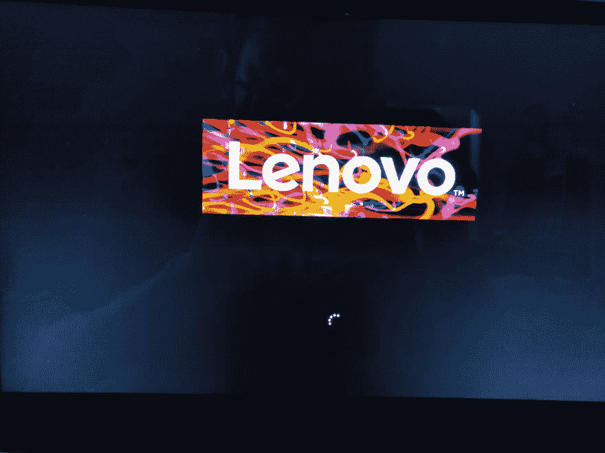](https://res.cloudinary.com/practicaldev/image/fetch/s--hW_NyikB--/c_limit%2Cf_auto%2Cfl_progressive%2Cq_auto%2Cw_880/https://thepracticaldev.s3.amazonaws.com/i/l619awk92tl485igqwki.jpg)

欢迎安装 windows，很高兴你做得很好，但请点击下一步。

现在点击立即安装

[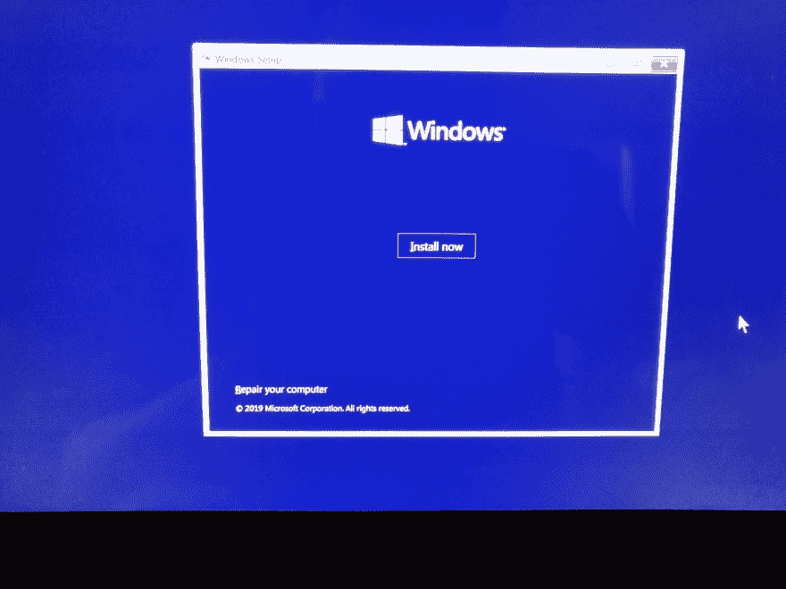](https://res.cloudinary.com/practicaldev/image/fetch/s--WZGvtnKx--/c_limit%2Cf_auto%2Cfl_progressive%2Cq_auto%2Cw_880/https://thepracticaldev.s3.amazonaws.com/i/3oqidunppljwjpyc9kun.jpg)

它应该以“安装正在启动”开始。

[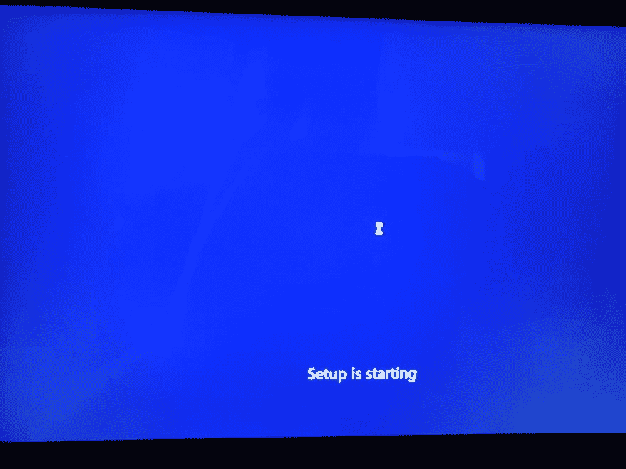](https://res.cloudinary.com/practicaldev/image/fetch/s--bJ6hlfHx--/c_limit%2Cf_auto%2Cfl_progressive%2Cq_auto%2Cw_880/https://thepracticaldev.s3.amazonaws.com/i/3x52dmw8no69mgh72y9m.jpg)

谁在乎协议是什么，只要选中我接受，然后单击下一步

[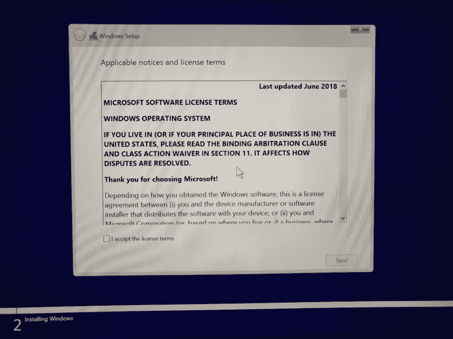](https://res.cloudinary.com/practicaldev/image/fetch/s--Su6KaVH3--/c_limit%2Cf_auto%2Cfl_progressive%2Cq_auto%2Cw_880/https://thepracticaldev.s3.amazonaws.com/i/kq3obq6i7zighyam8n8j.jpg)

好吧，等等，我们不是升级 windows，我们会**自定义，安装 Windows(高级)**，耶！Guyz 欢迎来到高级 IT 人员的世界。

[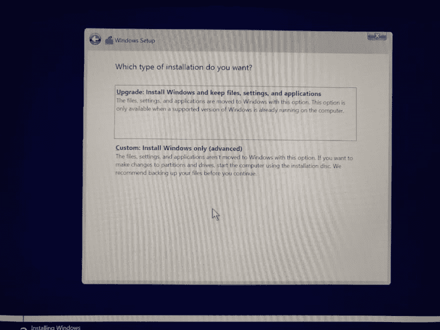](https://res.cloudinary.com/practicaldev/image/fetch/s--pZfCXAEL--/c_limit%2Cf_auto%2Cfl_progressive%2Cq_auto%2Cw_880/https://thepracticaldev.s3.amazonaws.com/i/yijj5cga85v10nxnx9c1.jpg)

好的，所以不要害怕，这是我们定义空间以及如何利用空间的地方。首先，单击这些驱动器中的每一个，然后从下面开始单击“delete”。希望你已经备份了所有的数据。

[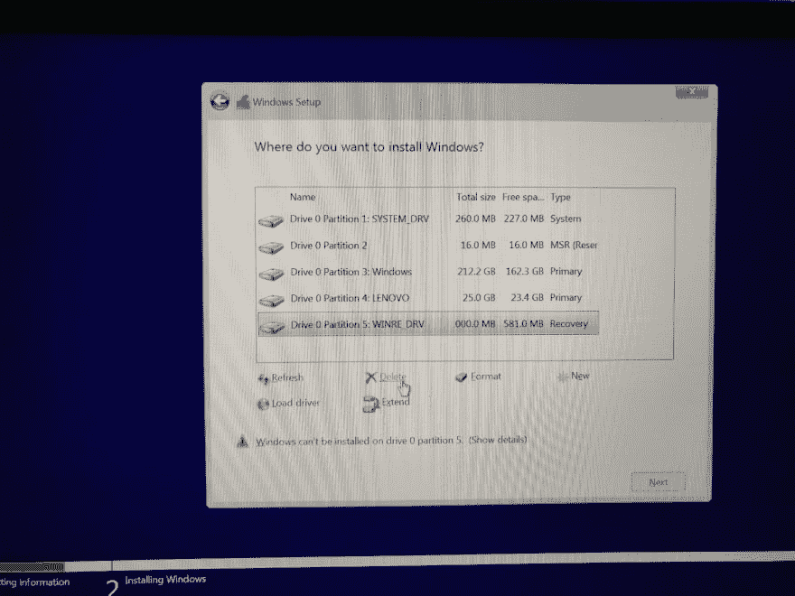](https://res.cloudinary.com/practicaldev/image/fetch/s--YXxnOMps--/c_limit%2Cf_auto%2Cfl_progressive%2Cq_auto%2Cw_880/https://thepracticaldev.s3.amazonaws.com/i/lp63m6nsb57byt3rikhp.jpg)

它会弹出这样一条信息，点击确定即可。

[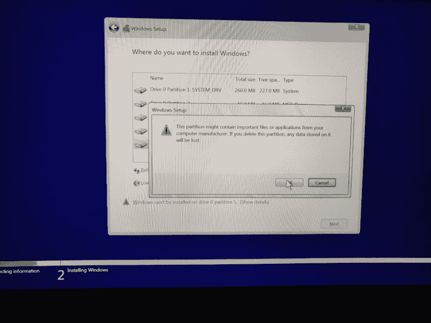](https://res.cloudinary.com/practicaldev/image/fetch/s--WvkIPomv--/c_limit%2Cf_auto%2Cfl_progressive%2Cq_auto%2Cw_880/https://thepracticaldev.s3.amazonaws.com/i/s83m2tpskwuvl5vzw4zq.jpg)

一旦你删除了所有的驱动器，也就是分区，你将有一个驱动器 0 未分配的空间。

[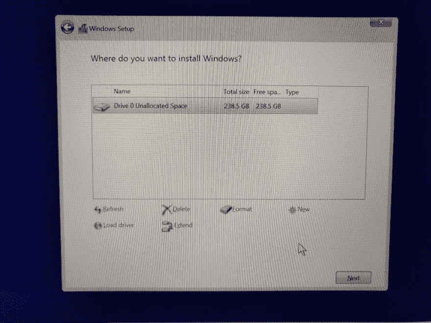](https://res.cloudinary.com/practicaldev/image/fetch/s--lXmUabh8--/c_limit%2Cf_auto%2Cfl_progressive%2Cq_auto%2Cw_880/https://thepracticaldev.s3.amazonaws.com/i/dm2j8gq6ep72q998l70p.jpg)

现在，我们将创建一个我们称之为 c 盘的分区，在那里我们将安装 windows。所以点击驱动器 0，然后点击新建。

[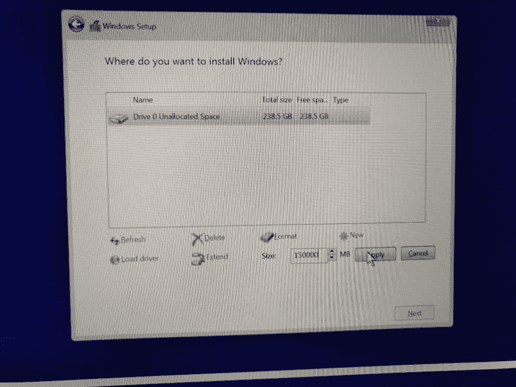](https://res.cloudinary.com/practicaldev/image/fetch/s--8u1OB93U--/c_limit%2Cf_auto%2Cfl_progressive%2Cq_auto%2Cw_880/https://thepracticaldev.s3.amazonaws.com/i/aao8gbi9p89ajg8zxml4.jpg)

一旦你点击新建，它会询问你的大小。现在，我将安装 LInux 作为第二个操作系统，这是我强烈推荐的开发操作系统，因此，如果您对 **_linux _** 不感兴趣，并希望继续使用 windows，您可以使用您想要的所有空间，如果不是，我给了 windows 150，000 MB，总计约 150GB，现在单击“apply”。

[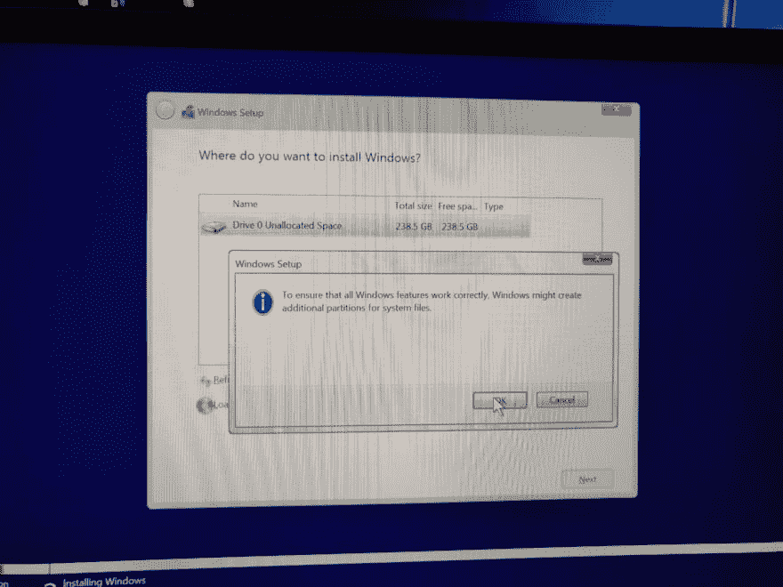](https://res.cloudinary.com/practicaldev/image/fetch/s--i27Maek5--/c_limit%2Cf_auto%2Cfl_progressive%2Cq_auto%2Cw_880/https://thepracticaldev.s3.amazonaws.com/i/i7yz6kg2cn0im53zl3m9.jpg)

现在会弹出一条消息，只需点击 ok，让它做所有令人头疼的事情，创建它想要创建的东西。

[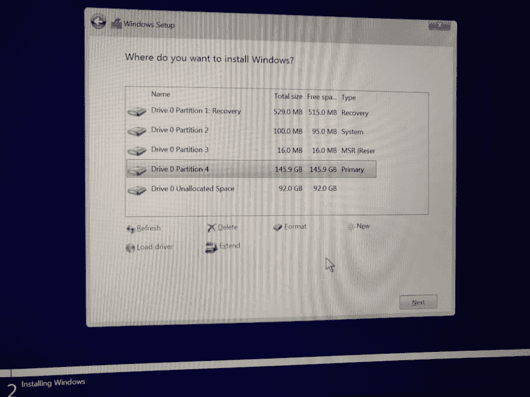](https://res.cloudinary.com/practicaldev/image/fetch/s--wprpLfZ_--/c_limit%2Cf_auto%2Cfl_progressive%2Cq_auto%2Cw_880/https://thepracticaldev.s3.amazonaws.com/i/wxihlmp5yvzd3e2nv44u.jpg)

它应该吐出这样的东西，让它自生自灭，然后让我们点击下一步。额外的分区是引导分区，它需要自己管理，我们真的不需要知道它们是如何工作的。

[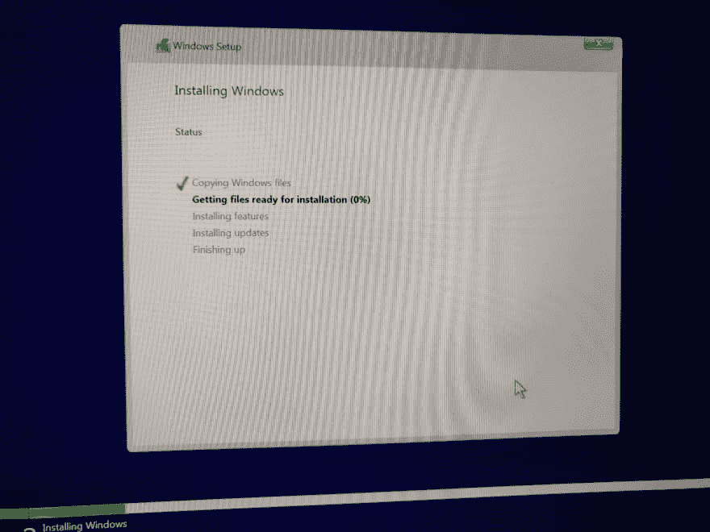](https://res.cloudinary.com/practicaldev/image/fetch/s--RyhHvMMm--/c_limit%2Cf_auto%2Cfl_progressive%2Cq_auto%2Cw_880/https://thepracticaldev.s3.amazonaws.com/i/kvt4j6yjii2xea4qu8ol.jpg)

现在它应该开始安装 windows，你应该有一个这样的屏幕。给自己拿杯咖啡或茶或啤酒，让我们放松一下。

[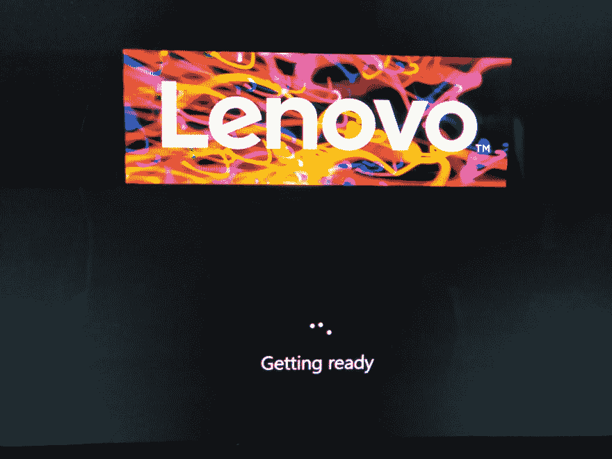](https://res.cloudinary.com/practicaldev/image/fetch/s---mOmMLme--/c_limit%2Cf_auto%2Cfl_progressive%2Cq_auto%2Cw_880/https://thepracticaldev.s3.amazonaws.com/i/erk5c4zjad7nzgmms0ll.jpg)

现在它会自动重启，到时候你会收到一条信息，比如准备好了。

[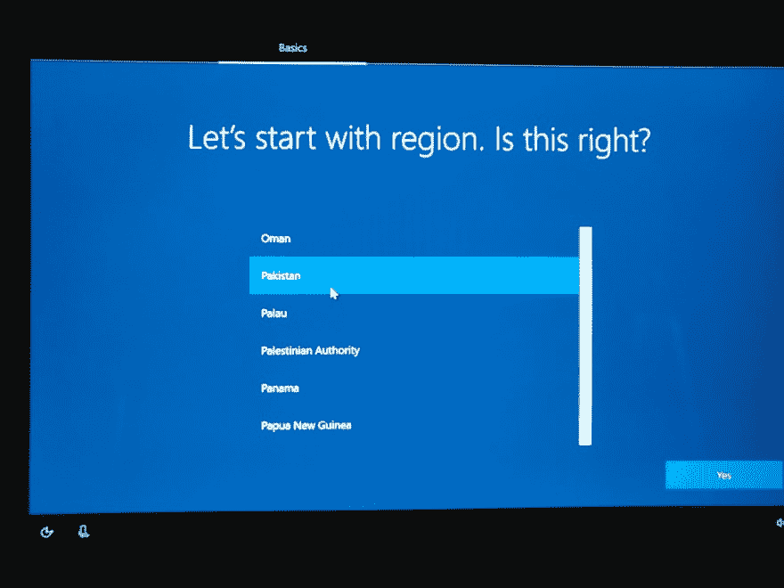](https://res.cloudinary.com/practicaldev/image/fetch/s--HSFOCRl7--/c_limit%2Cf_auto%2Cfl_progressive%2Cq_auto%2Cw_880/https://thepracticaldev.s3.amazonaws.com/i/9to56gi749qfs0otjjdo.jpg)

好，现在选择你的地区，我选择了巴基斯坦。

你真的只需点击“是”,我们不需要改变任何键盘布局。有时候，默认是好的！

[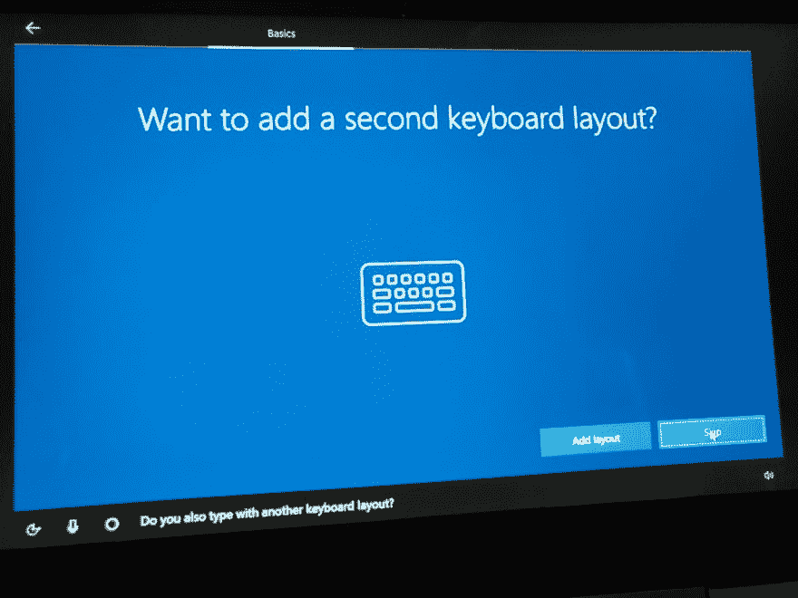](https://res.cloudinary.com/practicaldev/image/fetch/s--Cb3J9Vlz--/c_limit%2Cf_auto%2Cfl_progressive%2Cq_auto%2Cw_880/https://thepracticaldev.s3.amazonaws.com/i/ts31sxeoosh0bn88w6y7.jpg)

单击跳过此屏幕。我们不需要额外的曼波 jambo 布局。

[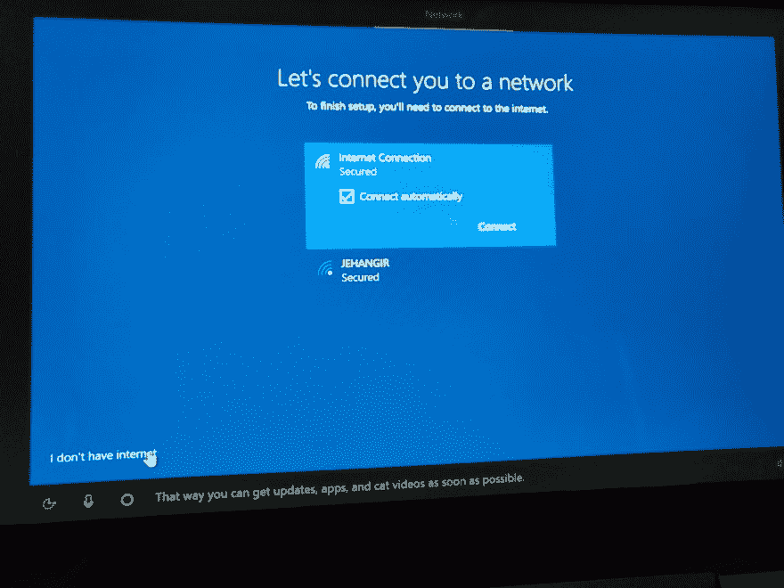](https://res.cloudinary.com/practicaldev/image/fetch/s--yk9-lt4X--/c_limit%2Cf_auto%2Cfl_progressive%2Cq_auto%2Cw_880/https://thepracticaldev.s3.amazonaws.com/i/wtsun4hjq1c31qqldbia.jpg)

在安装过程中，我真的不喜欢等待，所以我只是不打算连接到互联网。点击我没有互联网。我知道那是谎言。骗子骗子裤子着火了！！！

[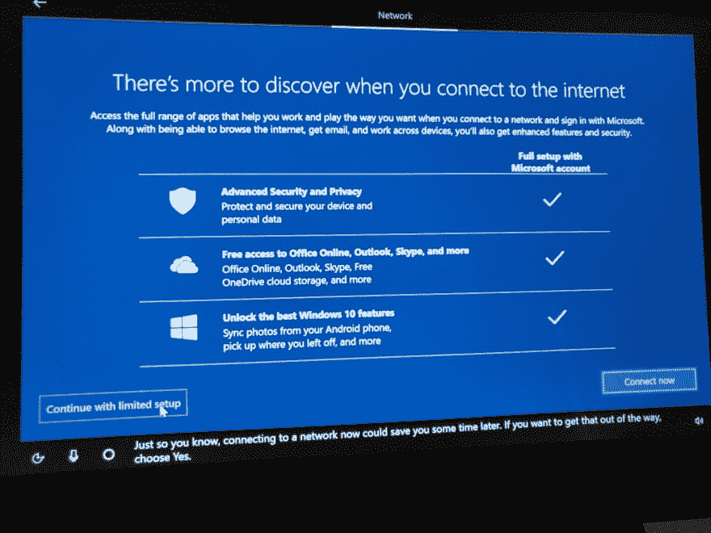](https://res.cloudinary.com/practicaldev/image/fetch/s--pKe37iQ_--/c_limit%2Cf_auto%2Cfl_progressive%2Cq_auto%2Cw_880/https://thepracticaldev.s3.amazonaws.com/i/36biz2ggnjyyfyr4bhpx.jpg)

这是一个新消息，我发现在最新的窗口，因为昨天，点击继续与有限的设置。

[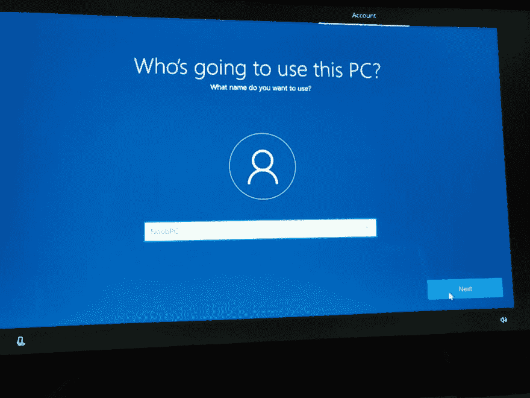](https://res.cloudinary.com/practicaldev/image/fetch/s--_xzSlk13--/c_limit%2Cf_auto%2Cfl_progressive%2Cq_auto%2Cw_880/https://thepracticaldev.s3.amazonaws.com/i/1ntacu2lw6d47b91j3nz.jpg)

给你的电脑起个名字，我把它命名为 NOOBPC，如果你喜欢，你也可以给它命名。

我在 windows 上不怎么用密码，但是如果你有什么问题，你可以在这里用密码。

[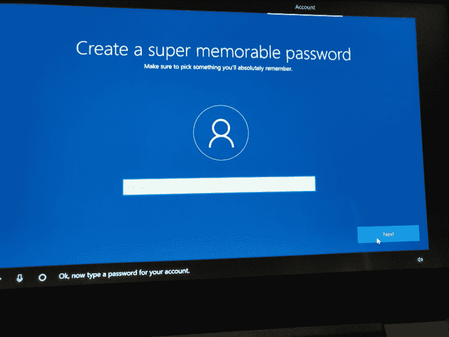](https://res.cloudinary.com/practicaldev/image/fetch/s--xz0GukWw--/c_limit%2Cf_auto%2Cfl_progressive%2Cq_auto%2Cw_880/https://thepracticaldev.s3.amazonaws.com/i/xd6hcyxm670omplfssq9.jpg)

同样没有这个，不喜欢保留活动历史。

[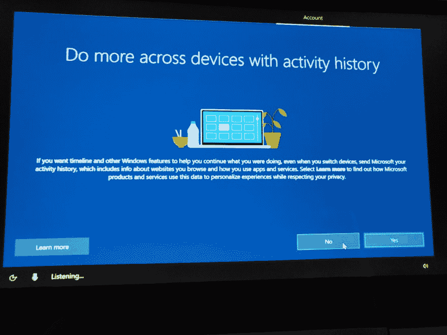](https://res.cloudinary.com/practicaldev/image/fetch/s--qD-h0UKb--/c_limit%2Cf_auto%2Cfl_progressive%2Cq_auto%2Cw_880/https://thepracticaldev.s3.amazonaws.com/i/cl1wwqo850v828ua3905.jpg)

点击接受，让我们进入桌面。该死的要求太多了。

[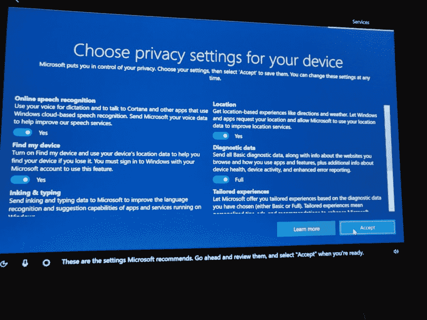](https://res.cloudinary.com/practicaldev/image/fetch/s--z-stiFWc--/c_limit%2Cf_auto%2Cfl_progressive%2Cq_auto%2Cw_880/https://thepracticaldev.s3.amazonaws.com/i/a80d1k7etj1mdeolnasi.jpg)

好了，现在它会说只是一会儿，但它需要一分钟左右。我应该起诉他们。

[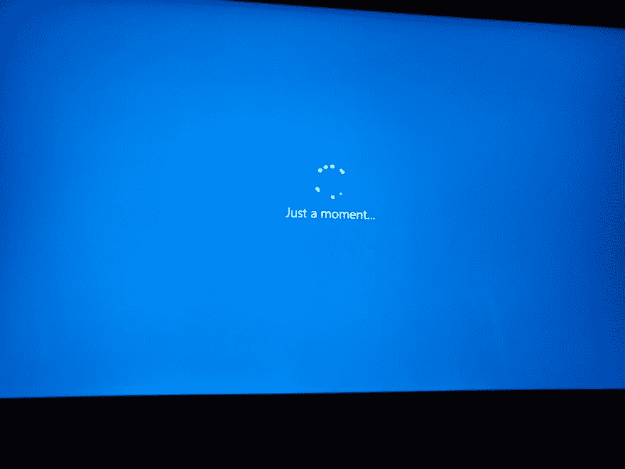](https://res.cloudinary.com/practicaldev/image/fetch/s--0xlGsigC--/c_limit%2Cf_auto%2Cfl_progressive%2Cq_auto%2Cw_880/https://thepracticaldev.s3.amazonaws.com/i/a4ukfu61zem8zd3kznjn.jpg)

欢迎来到 windows，宝贝，欢迎来到 Windows，对于第一次来的人，聚会的人，现在你可以安装你自己的 Windows 了。这是独立的世界。

[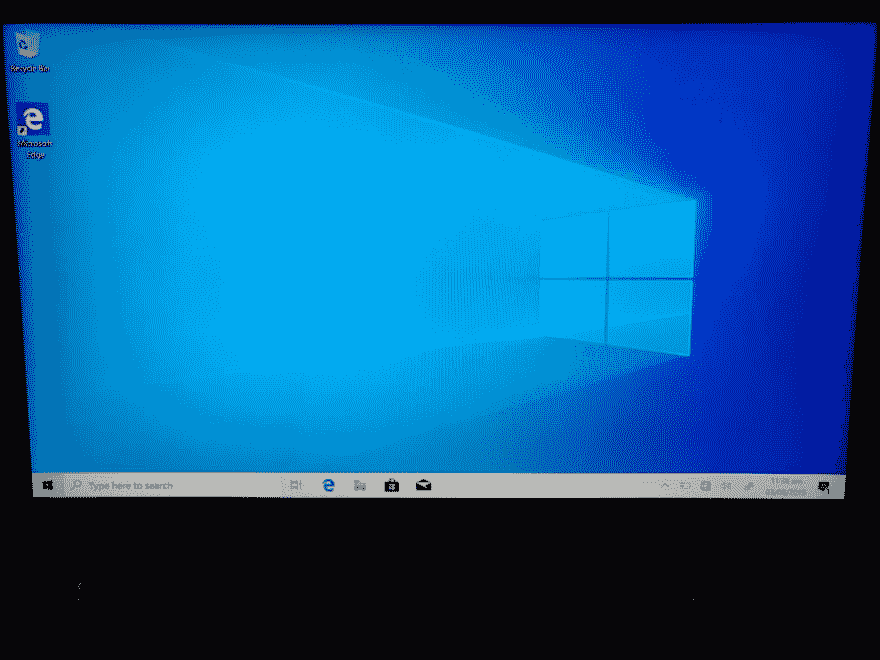](https://res.cloudinary.com/practicaldev/image/fetch/s--9GBNRZag--/c_limit%2Cf_auto%2Cfl_progressive%2Cq_auto%2Cw_880/https://thepracticaldev.s3.amazonaws.com/i/1ol11bez5ayoqxoa10wf.jpg)

[下一步:安装驱动程序，调整窗口](https://dev.to/th3n00bc0d3r/installing-drivers-tweaking-windows-2dpe)

[Noob 指数](https://dev.to/th3n00bc0d3r/noob-guides-index-4mne)