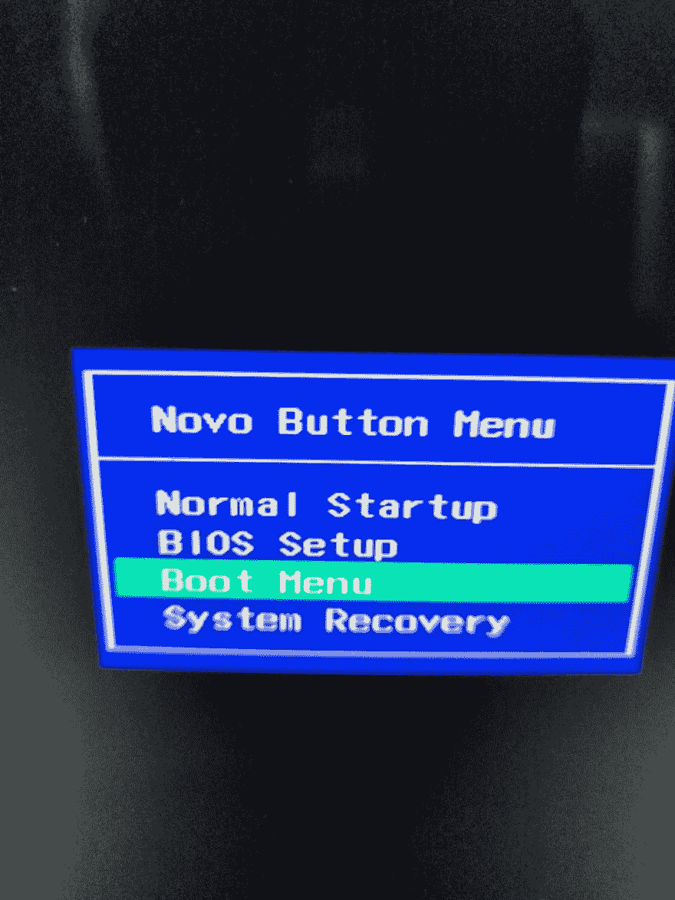
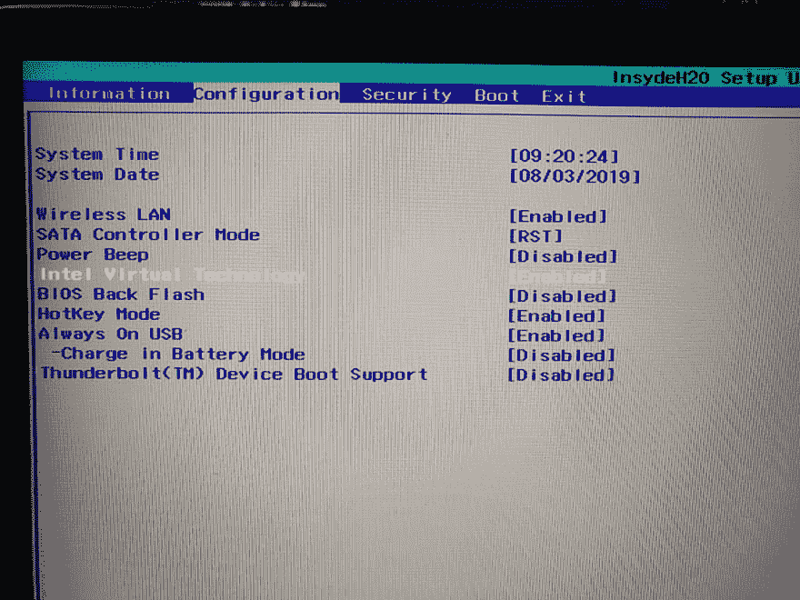
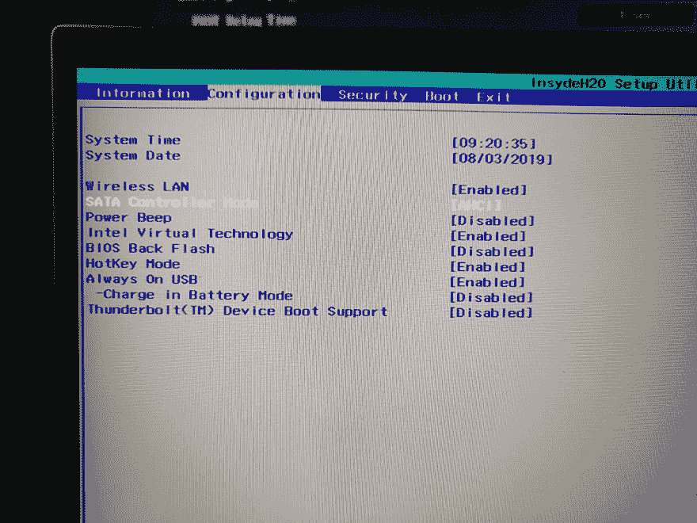
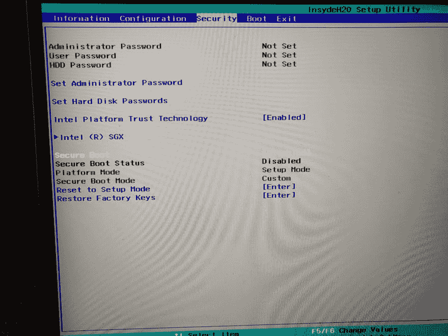
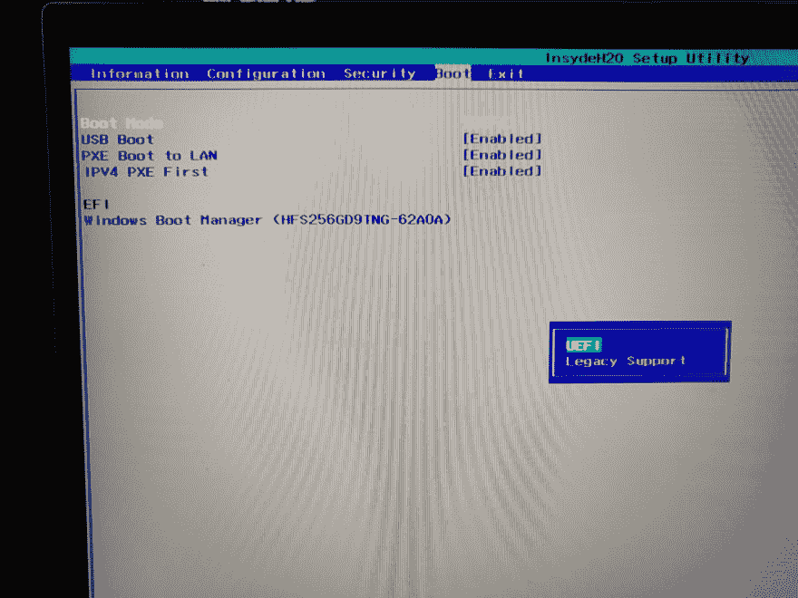
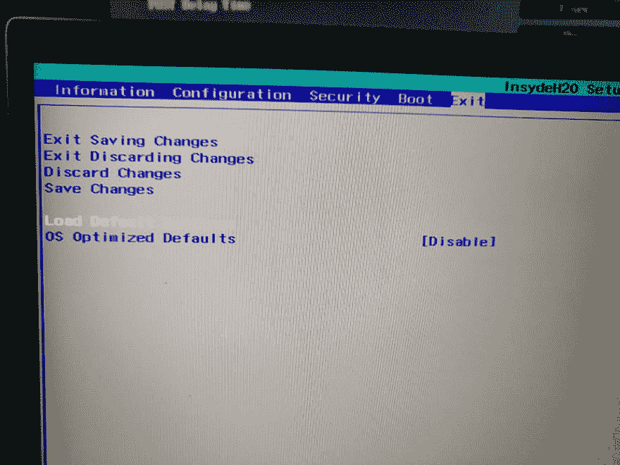
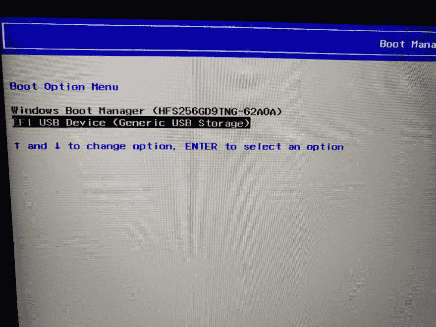

# 配置 BIOS

> 原文：<https://dev.to/th3n00bc0d3r/configuring-bios-5ep5>

太好了，现在我们有一个 USB，上面有一个 windows installer。根据我的经验，这是人们最害怕的部分，我认为他们不应该害怕。

"人类总是害怕自己不理解的东西""

所以，你可以理解，我认为我们在智力上比猿强得多。现在你需要完全关闭你的笔记本电脑或电脑。所有制造商进入 bios 的方式都有些相同和不同。打开计算机后，您应该尝试下列操作之一；

*   开机时重复按键盘上的 DEL 键
*   开机时重复按键盘上的 F2 键
*   开机时按下键盘上的 TAB 键
*   索尼笔记本电脑有一个红色辅助按钮，但当电脑完全关闭时按下它。

欢迎我的是这样的启动菜单，对你们来说会有所不同，但在很多方面是相似的。我们只需要进入 BIOS 设置

这就像一个 BIOS 设置屏幕，你应该受到欢迎。

现在，首先进入退出菜单，强烈推荐，对于这台计算机它有获取默认值，对于一些它将加载设置默认值。我认为你应该从一个干净的工厂重置开始，只要选择那个选项。选择后，返回主选项卡。

现在，我们进入该 BIO 的“高级”菜单，在某些情况下，它将是“配置”选项卡，并启用英特尔(R)虚拟化技术或英特尔虚拟化技术，在某些计算机中，它将是“CPU 管理”选项卡，我说只是浏览它。该选项用于虚拟化，我们将在本教程的编码部分使用它。

现在尝试在硬盘驱动器或其他什么地方找到，它说，SATA 控制器模式，确保它应该设置为 AHCI，而不是 ATA，RTSR 或一些 RAID 0。

BIOS 中应该有一些安全设置，我喜欢禁用安全引导，这样会更快。

现在，在启动菜单中，确保外部设备启动已启用，这里是 USB 启动，以便我们可以从 USB 启动 windows installer，否则它不会允许从 USB 启动。

是的，启动模式，所以在一些旧电脑上，你可能找不到它，不用担心，你只需要在 MBR 模式下安装，但现在大多数情况下，选择 UEFI。

现在，您可以进入 Exit 选项卡，并在执行此操作之前退出保存更改

现在，我们又需要启动菜单了，所以也许在一些键盘上的 F12 键和一些 F8 键中，你可以选择或者直接进入启动菜单。

一旦你选择了它，你将会看到你漂亮的 USB 和它的设备名称，在菜单中选择类似这样的东西。选择它，让我们继续前进

[下一步:安装 Windows](https://dev.to/th3n00bc0d3r/installing-windows-3837)

[Noob 指数](https://dev.to/th3n00bc0d3r/noob-guides-index-4mne)