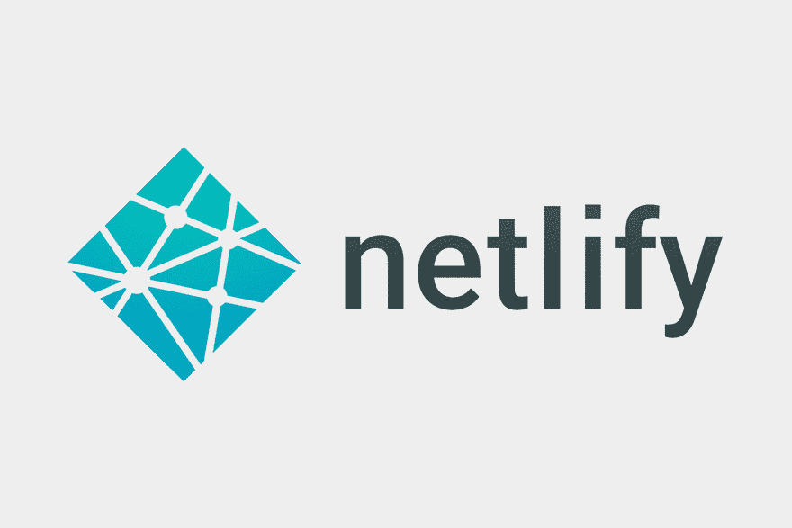

# 我如何使用 Nuxt.js 和 Contentful 加速我的作品集网站的故事

> 原文：<https://dev.to/pimpledeveloper/story-of-how-i-speeded-up-a-website-for-my-portfolio-using-nuxt-js-and-contentful-4il4>

我想分享一下我是如何使用 Nuxt.js 更快地制作我的作品集的。

当为我的作品集创建一个网站的想法跃入脑海时，我问自己我的首要任务应该是什么。答案是网页的加载速度，因为当网站让我等待他们的网页建立时，这让我很恼火，尤其是当接收情况很糟糕的时候。因此，我不希望它发生在我的投资组合上。

## 以下是我的主要想法，可以让我的投资组合更快。

1.  仅在构建过程中调用 API 来获取数据。
2.  在构建过程中将所有必要的数据放入 JSON 文件中，以便完成第一个步骤。

通过实现这两个，就不需要在客户端调用 API 了。

## 我为它所用的技术

1.  Nuxt.js
2.  Netlify
3.  满足的

如果你不熟悉这些技术，让我给你介绍一下。

## Nuxt.js

[](https://res.cloudinary.com/practicaldev/image/fetch/s--E1tjUeF2--/c_limit%2Cf_auto%2Cfl_progressive%2Cq_auto%2Cw_880/https://thepracticaldev.s3.amazonaws.com/i/3aapoxtxobrz28p8gqnc.png) 
Nuxt.js 是一个创建 Vue.js 应用的框架。它还可以帮助您轻松构建服务器呈现的 Vue.js 应用程序。
最重要的是，它有能力用 generate 命令生成静态网站。听起来这已经满足了我的需求，不是吗？

## Netlify

[](https://res.cloudinary.com/practicaldev/image/fetch/s--KSYZqR2h--/c_limit%2Cf_auto%2Cfl_progressive%2Cq_66%2Cw_880/https://thepracticaldev.s3.amazonaws.com/i/l1e029lzneghskhm39jw.gif) 
Netlify 为静态网站提供托管服务。
它为你提供了一个易于使用的用户界面和直观的工作流程。如何在网络上部署一个静态站点可能会让你大吃一惊。
只需将你的代码推送到 Github。
就这样。太简单了，连我奶奶都能做。

## 心满意足

[](https://res.cloudinary.com/practicaldev/image/fetch/s--ycSLAB_S--/c_limit%2Cf_auto%2Cfl_progressive%2Cq_auto%2Cw_880/https://thepracticaldev.s3.amazonaws.com/i/okhfqmeseslmn2bz3u10.png) 
知足者无头 CMS。
Contentful 让你写的帖子可以通过 API 访问，让你可以在任何地方获取你的内容。你可以在 markdown 中写文章。

## 让我们深入了解更多细节。

作为复习，以下是我想要达到的目标。

1.  调用 API 在服务器端获取数据。这可以重新表述为，在用户访问我的投资组合之前，我的投资组合完全需要的所有数据都必须准备好。
2.  在构建过程中将所有必要的数据放入 JSON 文件中，以便完成第一个步骤。

这些想法听起来很容易，但当我坐在笔记本电脑前时，我意识到我不知道如何实现它们。所以我搜索了很多，遇到了 Nuxt 模块，这些模块在启动 Nuxt 时会被顺序调用。
Nuxt.js 在进入下一步之前等待每个模块准备就绪。
除此之外，模块可以很容易地为某些入口点注册钩子。
就我阅读的文档来看，在构建过程中，调用 API、获取内容并将其放入 JSON 文件都可以在一个模块中完成。
如果有可能做到这一点，用户就不会再等内容出现在网络浏览器上那么久了。
这无疑是我的救命稻草。所以我决定跟着它走。

让我们在模块中创建 JSON 文件。这是模块的源代码。

```
const { createClient } = require('../plugins/contentful')
const { getConfigForKeys } = require('../lib/config.js')
const ctfConfig = getConfigForKeys([
  'CTF_PAGE_TYPE_ID',
  'CTF_SPACE_ID',
  'CTF_CDA_ACCESS_TOKEN'
])
const client = createClient()
import fs from 'fs'
module.exports = function postScraper(moduleOptions) {
  this.nuxt.hook('build:before', async ({ app }) => {
    const writeData = (path, data) => {
      return new Promise((resolve, reject) => {
        try {
          fs.writeFile(path, JSON.stringify(data), () => {
            resolve(`${path} Write Successful`)
          })
        } catch (e) {
          console.error(`${path} Write Failed. ${e}`)
          reject(`${path} Write Failed. ${e}`)
        }
      })
    }

    // fetch post data from contentful
    client.getEntries({
      'content_type': ctfConfig.CTF_PAGE_TYPE_ID,
    }).then(posts => {
      const ids = []
      posts.items.forEach((post) => {
        writeData(`./static/posts/data/${post.sys.id}.json`, post)
        ids.push(post.sys.id)
      })
      this.options.generate.routes = ids.map(id => `/news/${id}`)
    })
  })
} 
```

如您所见，我只是调用了 Contentful 文档中编写的 API，并为我的博客文章数据创建了 JSON 文件。您可能知道也可能不知道路线是用文章 id 生成的，因为需要为单个博客文章生成动态路线。
要显示内容，您只需使用“导入”功能导入 json 文件。

```
async asyncData({ params }) {
    const post = await import(`~/static/posts/data/${params.id}.json`)
    return {post: post.default}
} 
```

[http://powerbiseminar.com/tokyobasic/](http://powerbiseminar.com/tokyobasic/)

这都是我做的，让我的投资组合更快。通过创建我的作品集，我学到了 Nuxt.js 的强大和灵活性。

没有 Nuxt 模块我是做不到的。我觉得我在这个项目中没有充分利用这个框架。Nuxt 模块有助于扩展 Nuxt.js 的核心功能。我真的很想深入研究 Nuxt.js，充分利用它。
我确信我的解决方案并非完美无缺，但这是我经过大量研究后能想到的最佳方案。

感谢您的阅读。