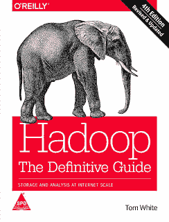

# Java 开发人员的 10 个最佳 Apache Hadoop 资源

> 原文：<https://dev.to/javinpaul/10-apache-hadoop-tutorials-books-and-courses-for-java-and-web-developers-1ml1>

*披露:这篇文章包括附属链接；如果您从本文提供的不同链接购买产品或服务，我可能会收到报酬。*
 
大家好，如果你正在寻找在线学习 Hadoop 的机会，或者正在寻找一些不错的教程，那么你来对地方了。在这篇文章中，我将分享一些学习 Hadoop 的最佳资源，包括教程、书籍和在线课程。您可以在方便的时间和地点使用这些资源学习 Hadoop。

## 学习 Hadoop 最好的教程、书籍、课程有哪些？

为了不浪费你更多的时间，这里是我从雅虎、tutorialspoint、vogella、 [Udemy](https://medium.com/javarevisited/15-best-udemy-courses-programmers-can-buy-on-black-friday-and-cyber-monday-2020-a803874f41d9) 、 [Pluralsight](https://medium.com/javarevisited/top-10-pluralsight-courses-to-learn-programming-and-software-development-during-covid-19-stay-at-30b7d8a4f88f) 、 [Coursera](https://medium.com/javarevisited/top-15-free-coursera-courses-and-certifications-for-it-professionals-384207d56f45) 和 Cloudera 列出的一些学习 Hadoop 的最佳课程、教程和书籍。其中一些也是免费的。他们将帮助您自学 Apache Hadoop。

### 1。终极实践 Hadoop(【udemy.com】T2)

在线学习 Hadoop 的绝佳课程。它非常全面，涵盖了 Hadoop、MapReduce、HDFS、 [Spark](https://www.java67.com/2018/05/top-5-free-big-data-courses-to-learn-Hadoop-Apache-Spark.html) 、Pig、Hive、HBase、 [MongoDB](https://javarevisited.blogspot.com/2019/01/top-5-mongodb-online-training-courses.html) 、 [Cassandra](https://javarevisited.blogspot.com/2019/03/top-5-nosql-database-web-developers-should-learn.html) 、Flume——不胜枚举！超过 25 项技术。

### 2。Hadoop 教程(【tutorialspoint.com】T2)

又一个牛逼的免费学习 Hadoop 的教程。本教程是为有志于使用 Hadoop 框架学习[大数据分析基础知识并成为 Hadoop 开发人员的专业人士准备的。软件专业人员、分析专业人员和 ETL 开发人员是本课程的主要受益者。](https://medium.com/javarevisited/top-10-courses-to-learn-big-data-and-hadoop-best-of-lot-23ef8691633f)

### 3。Hadoop 的构建模块——HDFS、MapReduce 和 YARN(【pluralsight.com】)

处理数十亿条记录需要对分布式计算有深刻的理解。在本课程中，您将了解 Hadoop，这是一个开源分布式计算框架，可以帮助您做到这一点。

### 4。雅虎！Hadoop 教程(【developer.yahoo.com】T2)

本教程包括以下旨在教您如何使用 Hadoop 分布式数据处理环境的材料:

*   Hadoop 0.18.0 发行版(包括全部源代码)
*   运行 Ubuntu Linux 并预先配置了 Hadoop 的虚拟机映像
*   运行虚拟机映像的 VMware Player 软件
*   该教程将指导您了解 Hadoop 安装和操作的许多方面。

总的来说，这是一个针对初学者和有经验的开发人员学习 Hadoop 的深入教程。

### 5。面向绝对初学者的大数据和 Hadoop(【udemy.com】T2

对于任何初学者来说，这都是一门很好的课程，可以让他们以简化的方式熟悉基本的大数据和 Hadoop 概念。本课程也非常注重实践，因为您不仅将学习如何从头安装和构建 Hadoop 集群，还将学习在生产或实际环境中管理 Hadoop 集群。

### 6。深度 Hadoop MapReduce(【udemy.com】T2)

MapReduce 框架在处理数据方面最接近 Hadoop。它被认为是 Hadoop 中的一个原子处理单元，这就是它永远不会过时的原因。如果你想学习 Hadoop 中的这个基本概念，那么这是最好的入门课程。

### 7。“Hadoop 入门”教程(【cloudera.com】T2)

无论您是计算机科学专业的学生还是经验丰富的开发人员，开始使用 Apache Hadoop 堆栈都是一个挑战。有许多可移动的部分，除非您在具有示例数据的更广泛的用例环境中获得每个部分的实践经验，否则攀登将是陡峭的。

遵循本教程使用 Cloudera 的 QuickStart VM 或 Docker 映像作为沙盒环境，将为您提供如何开始使用 CDH(cloud era 的平台，包含 Hadoop 和相关项目)中提供的一些工具的示例，以及如何通过 Cloudera Manager 管理您的服务。这也会让你体会到“提出更大的问题”意味着什么

本教程结束时，您将了解如何使用 CDH 的一些强大工具，并知道如何设置和执行一些基本的商业智能和分析用例。

### 8。Apache Hadoop -教程(【vogella.com】T2)

Lars Vogel 的另一个有趣的 Hadoop 教程。在本教程中，您将从零开始学习如何使用 Apache Hadoop。首先，您将学习一些基本概念，如什么是 Apache Hadoop、什么是 MapReduce、Hadoop 文件系统或 HDFS 等，然后通过在您的本地机器上安装和使用 Apache Hadoop 获得一些实际操作。

### 9。Hadoop 平台和应用框架(【coursera.org】T2

这是从 Hadoop 和大数据入手的另一个好资源。对于希望了解用于争论和分析大数据的核心工具的程序员新手或商务人士来说，这尤其有用。在没有任何经验的情况下，您将有机会通过 Hadoop 和 Spark 框架(业界最常见的两个框架)进行实践。

### 10。Hadoop:权威指南(【Amazon.com】T2)

权威指南在某种程度上是“Hadoop 圣经”,在使用 Hadoop 时可以作为很好的参考，但是不要期望它为编写 Map Reduce 提供简单的入门教程。这本书对于真正理解一切是如何工作的以及所有的系统是如何配合在一起的非常好。

以上是关于学习 Apache Hadoop 的一些**最佳资源。我也包括了一些课程和书籍，因为它们提供了更全面的学习，而且大多数时候是最好的起点。如果你有任何你认为应该在这个列表中的 Hadoop 课程，请随意留言。**

其他**编程文章**你可能喜欢的
[完整的 Web 开发者路线图](https://javarevisited.blogspot.com/2019/02/the-2019-web-developer-roadmap.html#axzz5lw0q4I4s)
[Java 程序员应该学习的 10 件事](https://javarevisited.blogspot.com/2017/12/10-things-java-programmers-should-learn.html#axzz5atl0BngO)
[学习 Python 进行软件开发的 10 个理由](https://javarevisited.blogspot.com/2018/05/10-reasons-to-learn-python-programming.html)
[10 个工具每个 Java 开发者都应该知道的](http://www.java67.com/2018/04/10-tools-java-developers-should-learn.html)
[学习 Java 编程语言的 10 个理由](http://javarevisited.blogspot.sg/2013/04/10-reasons-to-learn-java-programming.html)
[10 个框架 Java 和 Web 开发者应该学习](http://javarevisited.blogspot.sg/2018/01/10-frameworks-java-and-web-developers-should-learn.html)
[成为更好的 Java 的 10 个技巧 5 要学习的 Java 框架](http://javarevisited.blogspot.sg/2018/05/10-tips-to-become-better-java-developer.html)
[10 种可以学习的编程语言](http://www.java67.com/2017/12/10-programming-languages-to-learn-in.html)
[10 个测试库每个 Java 开发者都应该知道的](https://javarevisited.blogspot.sg/2018/01/10-unit-testing-and-integration-tools-for-java-programmers.html)

感谢您阅读本文。如果你喜欢这篇文章，请鼓掌，想拍多少次就拍多少次，并在脸书、LinkedIn、Twitter 和电子邮件上与你的朋友和同事分享。