# 10 本书、教程和课程，供初学者学习 Angular

> 原文：<https://dev.to/javinpaul/10-books-tutorials-and-courses-to-learn-angular-in-2019-2m0l>

*披露:这篇文章包括附属链接；如果您从本文提供的不同链接购买产品或服务，我可能会收到报酬。*

[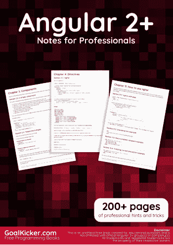](https://javarevisited.blogspot.com/2019/04/10-free-angular-and-react-courses-for.html) 
大家好，如果你对学习 [Angular framework](https://angular.io/) 感兴趣，这是开发基于组件的 Web GUI 的最流行的 JavaScript 框架之一，并寻找一些像课程、教程和书籍这样的优秀资源，那么你来对地方了。

在本文中，我将分享一些学习 Angular 框架的最佳资源，如书籍、教程和课程，以前称为 [Angular JS](http://www.java67.com/2018/01/top-5-free-angular-js-online-courses-for-web-developers.html) ，现在简称为 [Angular](https://javarevisited.blogspot.com/2018/06/5-best-courses-to-learn-angular.html) 。

它是由谷歌支持的，因此你不应该担心它会在几年内过时并失去相关性。你在学习 Angular 的过程中所做的任何投资都会在未来几年给你带来丰厚的回报。

根据 StackOverflow 的调查，Angular 是仅次于 Node.js 的第二大流行框架，也是 JavaScirpt 在 web 开发人员中流行的主要原因之一。

[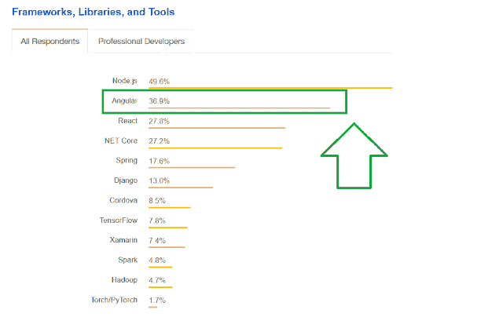](https://javarevisited.blogspot.com/2018/06/5-best-courses-to-learn-angular.html)

## 为 Web 开发人员准备的一些最好的课程、教程和书籍

不浪费你更多的时间，这里有我最喜欢的学习 Angular 2+的课程、教程和书籍。列表包含免费和付费资源，适合初学者和中级前端开发者。

### **1。** [**【棱角分明】(原棱角分明 2)——完整指南**](https://click.linksynergy.com/fs-bin/click?id=JVFxdTr9V80&subid=0&offerid=323058.1&type=10&tmpid=14538&RD_PARM1=https%3A%2F%2Fwww.udemy.com%2Fthe-complete-guide-to-angular-2%2F)

我先告诉你，我是 Max 的教学风格和他的课程的忠实粉丝。它们可能是网上学习 Angular 的最佳资源，毫不奇怪，它们也是 Udemy 上的畅销书。

本课程将帮助您学习 Angular (Angular 2+，包括 Angular 8)并构建出色的反应式 web 应用程序。

教员----@ maximilian black fill er

只需查看课程预览，因为它们是免费的，不会占用你太多时间。我相信你会爱上这门课程的。

[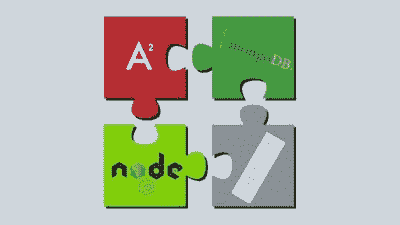](https://click.linksynergy.com/fs-bin/click?id=JVFxdTr9V80&subid=0&offerid=323058.1&type=10&tmpid=14538&RD_PARM1=https%3A%2F%2Fwww.udemy.com%2Fthe-complete-guide-to-angular-2%2F)

### 2。**[《Ng-书-棱角分明大全》(2021 年版)](https://gumroad.com/a/221148275/FlvVl)**

这本书也被称为 Ng-Book，经常被称为 Angular 的圣经。如果你正在寻找一个简单而详细的角度世界指南，那么这本书是给你的。该书涵盖了 Angular 9 中的以下主题(取决于您购买的版本)。另外，还有什么比框架开发者自己写的书更好的呢？

第一章介绍如何编写第一个 Angular 9 应用程序，第二章介绍如何使用注释和类型将数据绑定到组件以及 Typescript 的介绍。如果你愿意，你也可以将这本书与 Udemy 上 Maximilian 的[**Angular-The Complete Guide**](https://click.linksynergy.com/fs-bin/click?id=JVFxdTr9V80&subid=0&offerid=323058.1&type=10&tmpid=14538&RD_PARM1=https%3A%2F%2Fwww.udemy.com%2Fthe-complete-guide-to-angular-2%2F)课程结合起来，该课程也涵盖 Angular 9，是任何寻求主动学习的人的可靠资源。

[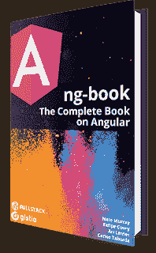](https://gumroad.com/a/221148275/FlvVl)

它的价格是 79 美元，你可以在亚马逊或者他们自己的网站上购买。他们还提供了一个免费章节，你可以在这里下载[的 PDF 文件。](https://gumroad.com/a/221148275)

### [3。专业人士的角度 2 注意事项](https://goalkicker.com/Angular2Book/)

我是 StackOverflow 的忠实粉丝，每天在做大量编程和 web 开发任务时都会使用它。

这里有很多优秀的开发人员和专家，你有很好的机会向他们学习经验。

*一本书怎么样，由 StackOverflow 内容组成？*嗯，专业人士用的棱角分明的 2 号纸币就是这样。这是一本 200 多页的免费电子书，充满了来自 StackOverflow 的技巧和提示。

但是，如果你不介意花几块钱学习像 Angular 这样有价值的东西，那么我也推荐你看看内特·默里、费利佩·库里、阿里·勒纳和卡洛斯·塔沃尔达的 **[ng-book](https://gumroad.com/a/221148275/FlvVl)** 。这是一本关于 Angular 9 的深入、完整、最新的书，受到 Angular 专家的强烈推荐。如果你想检查，你可以在这里免费下载第一章。

### **3。** [**一个棱角分明的教程——一步步引导你的第一个棱角分明的 5 App**](https://www.toptal.com/angular/angular-5-tutorial)

顾名思义，Toptal 是一个寻找任何技术领域顶尖人才的网站，但它也包含一些关于不同技术的最深入的教程。

如果你是 Angular 的新手，那么你可以从这个 Angular 5 教程开始你的旅程。不需要以前的角度经验。

[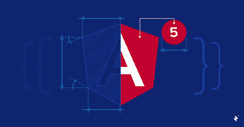](https://www.toptal.com/angular/angular-5-tutorial)

### **4。** [**学习和理解 AngularJS - $10**](https://click.linksynergy.com/fs-bin/click?id=JVFxdTr9V80&subid=0&offerid=323058.1&type=10&tmpid=14538&RD_PARM1=https%3A%2F%2Fwww.udemy.com%2Flearn-angularjs%2F)

Anthony Alicea 的一个很好的课程，旨在掌握 AngularJS 或 Angular 及其背后的 JavaScript 概念，设计定制指令，并构建单页面应用程序。

如果你是 JavaScript T1 和 T2 Angular T3 的初学者，那么你可以参加这个课程，开始你在 web 开发美丽世界的旅程。

讲师-安东尼·阿里西亚

[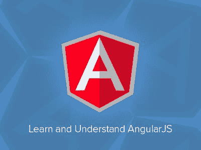](https://click.linksynergy.com/fs-bin/click?id=JVFxdTr9V80&subid=0&offerid=323058.1&type=10&tmpid=14538&RD_PARM1=https%3A%2F%2Fwww.udemy.com%2Flearn-angularjs%2F)

### **5。** [**棱角分明——教程:英雄之旅**](https://angular.io/tutorial)

这是 Angular 团队的官方教程，因此也是从头开始学习 Angular 的最新资源。

英雄之旅教程涵盖了 Angular 的基础知识。

在本教程中，您将构建一个应用程序，帮助职业介绍所管理其英雄稳定。

[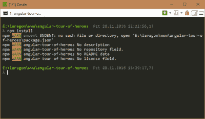](https://angular.io/tutorial)

### **6。** [**忙碌开发者的棱角速成班**](https://click.linksynergy.com/fs-bin/click?id=JVFxdTr9V80&subid=0&offerid=323058.1&type=10&tmpid=14538&RD_PARM1=https%3A%2F%2Fwww.udemy.com%2Fangular-crash-course%2F) \

这是 Udemy 的另一个最畅销的角度课程，顾名思义，这是一个以 go 开始的速成课程。

如果你学习 Angular 4 (Angular 2+)的时间有限，参加这个课程，只需 10 个小时就能学会 Angular！

讲师-莫什·哈迈达尼([莫什·哈迈达尼](https://medium.com/u/d7edf712005?source=post_page-----e8a8e2c490c2----------------------)

[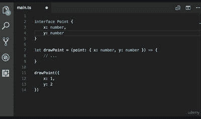](https://click.linksynergy.com/fs-bin/click?id=JVFxdTr9V80&subid=0&offerid=323058.1&type=10&tmpid=14538&RD_PARM1=https%3A%2F%2Fwww.udemy.com%2Fangular-crash-course%2F)

### **7。** [**无棱角 2+-**](https://click.linksynergy.com/fs-bin/click?id=JVFxdTr9V80&subid=0&offerid=323058.1&type=10&tmpid=14538&RD_PARM1=https%3A%2F%2Fwww.udemy.com%2Fgetting-started-with-angular-2%2F)入门

这是一个从 Udemy 学习 Angular 的免费课程，也是一个很棒的课程。通过遵循 Ryan Chenkie 在本课程中的说明，您可以轻松学会如何构建您的第一个 Angular 2+应用程序。

Udemy 中的免费角课程主要是为了营销目的而创建的，但它们并不缺乏质量，因为教师希望推广他们最好的内容，以获得 Udemy 平台上数百万学生的关注。

讲师-瑞安·陈琪([瑞安·陈琪](https://medium.com/u/d6abd3cce78?source=post_page-----e8a8e2c490c2----------------------))

### **8。** [**棱角分明——掌握基本功——无**](https://click.linksynergy.com/fs-bin/click?id=JVFxdTr9V80&subid=0&offerid=323058.1&type=10&tmpid=14538&RD_PARM1=https%3A%2F%2Fwww.udemy.com%2Fangular-mastering-the-basics%2F)

这是另一个免费学习 Angular 的很棒的课程。与马克斯的课程或 T2 的付费课程相比，这是一个相对较短的课程，但它是免费的。

如果你想从一个免费的资源开始，这是从零开始学习角度基础的完美选择。

讲师-vish was Gopinath([@ vish was](https://dev.to/vishwas)Gopinath)

[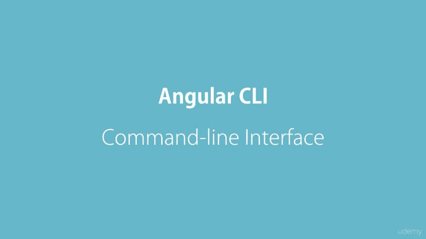](https://click.linksynergy.com/fs-bin/click?id=JVFxdTr9V80&subid=0&offerid=323058.1&type=10&tmpid=14538&RD_PARM1=https%3A%2F%2Fwww.udemy.com%2Fangular-mastering-the-basics%2F)

### **9。** [**棱角分明快速速成**](https://click.linksynergy.com/fs-bin/click?id=JVFxdTr9V80&subid=0&offerid=323058.1&type=10&tmpid=14538&RD_PARM1=https%3A%2F%2Fwww.udemy.com%2Fgetting-started-with-angular-2%2F)

Udemy 的另一个超棒的免费角度课程。您可以通过本课程学习使用 2°、4°、5°、6°及更大角度。

这是一门快节奏的课程，非常适合忙碌的开发人员或急于从项目开始学习 Angular 的人。

讲师-埃德温·迪亚兹

[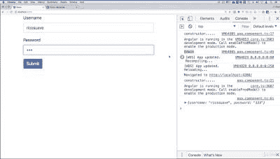](https://click.linksynergy.com/fs-bin/click?id=JVFxdTr9V80&subid=0&offerid=323058.1&type=10&tmpid=14538&RD_PARM1=https%3A%2F%2Fwww.udemy.com%2Fgetting-started-with-angular-2%2F)

### **10。** [**棱角分明:入门-复数视线**](https://pluralsight.pxf.io/c/1193463/424552/7490?u=https%3A%2F%2Fwww.pluralsight.com%2Fcourses%2Fangular-2-getting-started-update)

这是 Pluralsight 的最佳角度课程之一。在本课程中，您将通过快速了解 Angular 的组件、模板和服务，学习如何创建出色的 web 应用程序，并了解最新的应用程序开发技术。

讲师-黛博拉·库拉塔

[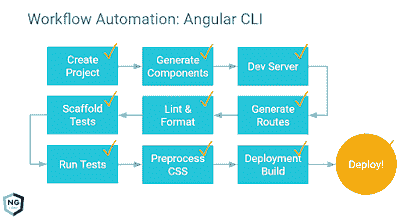](https://pluralsight.pxf.io/c/1193463/424552/7490?u=https%3A%2F%2Fwww.pluralsight.com%2Fcourses%2Fangular-2-getting-started-update)

像任何其他 Plurlasight 课程一样，您需要一个月或年的会员资格才能参加本课程。

月会员费约为 29 美元，[年会员费约为 299 美元(](https://pluralsight.pxf.io/c/1193463/424552/7490?u=https%3A%2F%2Fwww.pluralsight.com%2Fpricing)[节省 14%](https://pluralsight.pxf.io/c/1193463/424552/7490?u=https%3A%2F%2Fwww.pluralsight.com%2Fpricing) )，不仅可以参加这门课程，还可以参加 5000 多门其他技术课程。

如果你不确定，你也可以试试 [10 天免费试用](http://pluralsight.pxf.io/c/1193463/424552/7490?u=https%3A%2F%2Fwww.pluralsight.com%2Flearn)，它可以让你免费观看 200 分钟的课程内容。

以上就是学习 Angular 2+框架的一些**最佳教程和在线课程。我还包括一些课程和书籍，因为它们提供了更全面的学习，而且大多数时候是最好的起点。如果你有任何其他的角度教程，你认为应该在这个列表中，然后随时下降的说明。**

你可能喜欢的其他**编程和网络开发课程**

*   [网络开发者路线图](https://hackernoon.com/the-2019-web-developer-roadmap-ab89ac3c380e)
*   [面向 Java 开发者的 5 门免费 Spring 框架课程](http://www.java67.com/2017/11/top-5-free-core-spring-mvc-courses-learn-online.html)
*   [初学者学习 Web 开发的五大课程](https://javarevisited.blogspot.com/2018/02/top-5-online-courses-to-learn-web-development.html)
*   [学习大数据和 Apache Spark 的 5 门课程](http://javarevisited.blogspot.com/2017/12/top-5-courses-to-learn-big-data-and.html)
*   [面向 Web 开发人员的十大 JavaScript 教程和课程](https://javarevisited.blogspot.com/2018/06/top-10-courses-to-learn-javascript-in.html)
*   [初学者学习 Spring Boot 的五大课程](https://javarevisited.blogspot.com/2018/05/top-5-courses-to-learn-spring-boot-in.html)
*   [面向 Java 开发人员的最佳 Apache Kafka 课程](https://javarevisited.blogspot.com/2018/04/top-5-apache-kafka-course-to-learn.html)
*   [初学者学习 React Native 的 5 门课程](http://javarevisited.blogspot.sg/2018/02/5-react-native-courses-to-learn-mobile-development-using-JavaScript.html)
*   [Web 开发人员学习 TypeScript 的五大课程](https://javarevisited.blogspot.com/2018/07/top-5-courses-to-learn-typescript.html)
*   [React JS 开发者路线图](https://hackernoon.com/the-2018-react-js-roadmap-4d0a43814c02)
*   [学习 React 框架的 5 门免费课程](http://www.java67.com/2018/02/5-free-react-courses-for-web-developers.html)
*   [面向 Web 开发人员的五大免费 JavaScript 课程](http://www.java67.com/2018/04/top-5-free-javascript-courses-to-learn.html)

## 期末备注

谢谢，你坚持到了文章的结尾...祝您在 Angular 的 Web 开发之旅中好运！这当然不容易，但是通过遵循这些资源，你离成为你一直想成为的 Angular 开发者又近了一步。

如果你喜欢这篇文章，那么请分享给你的朋友和同事，别忘了在 Twitter 上关注 [javinpaul](https://twitter.com/javinpaul) ！

> P.S. -如果你需要更多的免费资源，你可以查看这个[免费 Angular 2+课程](http://www.java67.com/2018/01/top-5-free-angular-js-online-courses-for-web-developers.html)的列表，开始你的准备。