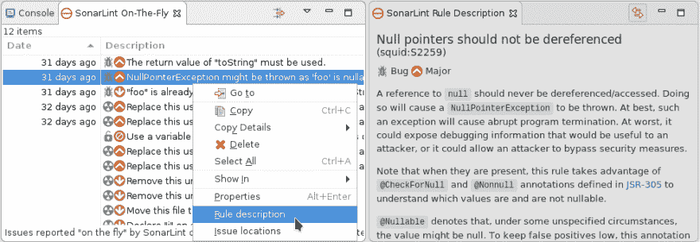
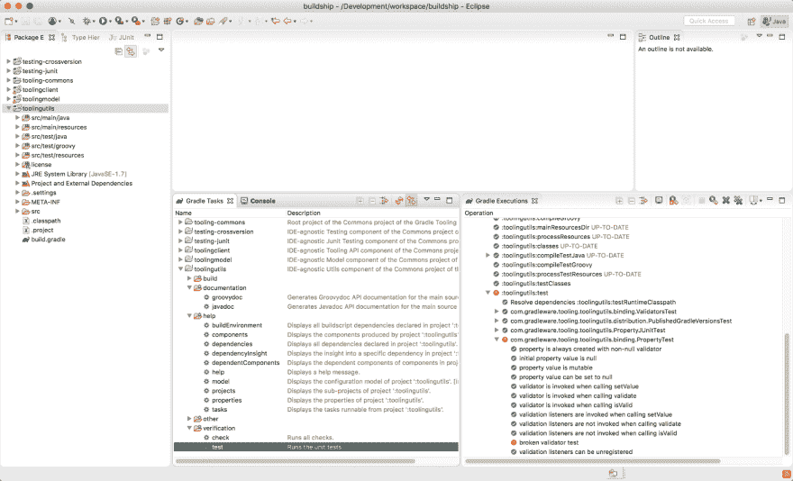
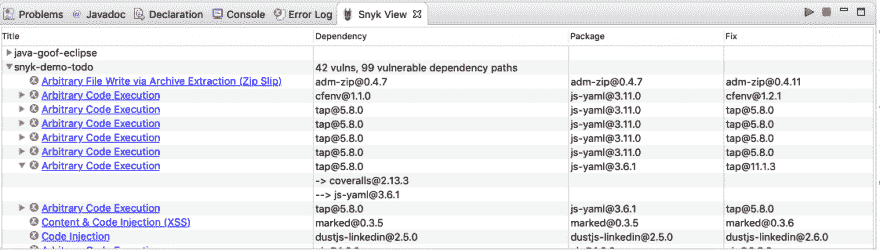
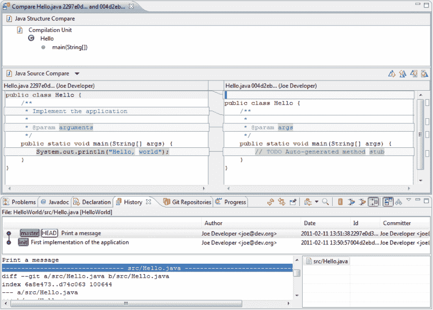
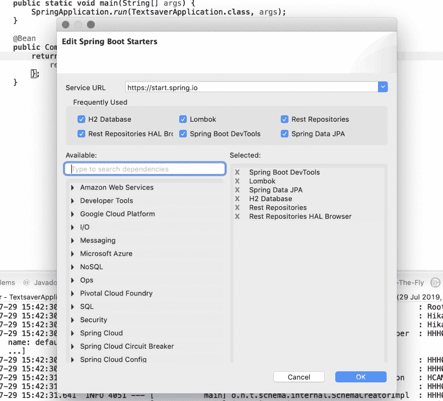

# 10 个不可或缺的 Eclipse 插件

> 原文：<https://dev.to/brianverm/10-eclipse-plugins-you-shouldn-t-code-without-o0c>

开发人员主要从他们喜欢的 IDE(集成开发环境)开始工作。因此，好的 IDE 扩展和插件变得越来越重要。在这篇博客中，我检查了 Eclipse IDE 插件，然后将范围缩小到我添加到自己的工具包中的前 10 个最有用的插件。我在这里推荐的所有 IDE 扩展都是产品级的，它们可以在 Eclipse 市场上买到。更重要的是，这些插件都是免费的。所以，事不宜迟…让我们来看看清单吧！

## 索纳林

SonarLint 是一个 Eclipse IDE 插件，其工作方式类似于拼写检查器。这个插件分析你的代码，检测潜在的错误，并帮助你在开发过程中解决质量问题。SonarLint 插件为您提供最常用语言的即时反馈，包括 Java、Javascript 和 Python。

SonarLint 依赖于一组规则 SonarRules，其中包括 PMD、CheckStyle 和 Findbugs 规则等等。这意味着这个插件基本上是一个一站式商店。此外，该插件与 SonarQube 或 SonarCloud 集成，使您能够使用您的应用程序应该遵守的质量配置文件。

[Eclipse Marketplace 链接](https://marketplace.eclipse.org/content/sonarlint)

## 建造等级积分

虽然与 Maven 不同，Gradle 并没有与 Eclipse 进行本地集成，但是这个插件可以让您在任何情况下都可以从 IDE 中无缝地工作。开发、导入和运行 Gradle 项目与本地支持的 Maven 项目一样方便。

多亏了这个插件，导入或创建基于 Gradle 的项目非常有效。此外，支持编辑。gradle files 是一个重要的特性，不管你使用的是 Groovy 还是 Kotlin DSL(特定领域语言)。

Buildshop Gradle 集成与我的 2019 Eclipse 版本无缝配合；事实上，它是如此之好，以至于感觉它是一个本地特性。在我看来，我认为这应该被认为是一个默认的集成，并自动与 Eclipse 一起发布。

[Eclipse Marketplace 链接](https://marketplace.eclipse.org/content/buildship-gradle-integration)

## Snyk Vuln 扫描仪

Eclipse 的 Snyk 插件扫描您的依赖关系，构建一个依赖关系树，并检查任何已知的漏洞。Snyk 插件在 Eclipse 中提供了广泛的语言支持，包括 Java、Scala、JavaScript。NET、Ruby 等等。当发现一个漏洞时，该插件会向您提供关于该漏洞的信息，甚至在可用时提供可能的修复。

我个人喜欢集成视图向我显示漏洞来自哪里以及它有多深的事实。大多数情况下，漏洞源于间接依赖，很难发现。现在我可以分析我是否需要用一个更新的版本来解决这个问题，或者我可以选择完全排除这个依赖。当发现一个漏洞时，该插件提供一个到 Snyk 网站的链接，该网站提供关于漏洞严重性和其他重要信息的见解。它帮助我对我的项目做出正确的决定。

[Eclipse Marketplace 链接](https://marketplace.eclipse.org/content/snyk-vuln-scanner)

## 埃及

Git 是目前使用最广泛的版本控制系统。这是一个分布式版本控制系统，这意味着每个开发人员都有代码每次修订的完整历史副本。这使得各种操作都非常快:分支、合并和历史查询只是几个例子。

EGit 提供了多种视图，因此您可以用一种简单的方式执行各种 Git 操作，而无需记住 Git 命令。像简单分支、恢复单个文件和交互式 diff 视图这样的操作只是这个插件值得一试的几个方面。

EGit 以一种清晰易用的方式将所有这些引入到 Eclipse 中。

[Eclipse Marketplace 链接](https://marketplace.eclipse.org/content/egit-git-integration-eclipse)

## 弹簧工具 4 为 Spring Boot

Spring Tools 4 是 Eclipse 的一个集成工具包。这是一个为支持您的 Spring-boot 企业应用程序而构建的工具包。与 Spring Initialzr 的平滑集成使您能够通过几个简单的步骤构建和运行 Spring Boot 应用程序。它帮助您浏览特定于 Spring 的代码，以便更好地理解和调整您的 Spring Boot 应用程序。最重要的是，该插件有助于一些智能 Spring Boot 特定的代码完成和来自运行应用程序的运行时信息。

如果您在 Eclipse 中使用 Spring Boot 进行开发，这种集成为您提供了在 Eclipse IDE 中运行和监控应用程序的工具。特定于 Spring Boot 的代码补全非常有用。在我看来，安装这个插件是显而易见的，它让 Eclipse 中的 Spring Boot 开发变得更加容易。

[Eclipse Marketplace 链接](https://marketplace.eclipse.org/content/spring-tools-4-spring-boot-aka-spring-tool-suite-4)

这些只是我的前 10 名中的前 5 名。
想了解以下 5 点？
[阅读更多...](https://snyk.io/blog/10-eclipse-plugins-you-shouldnt-code-without/)