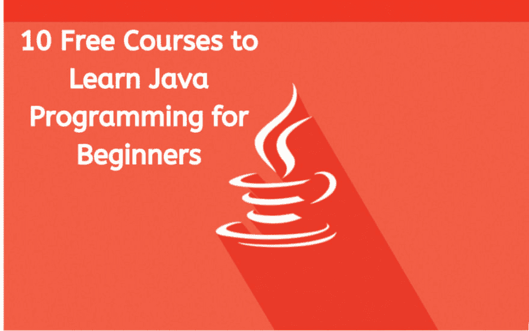
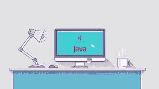
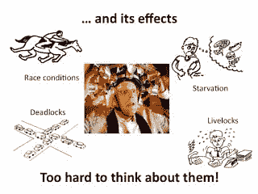
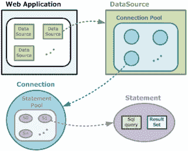
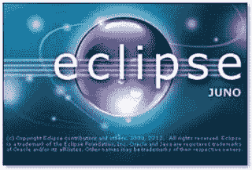
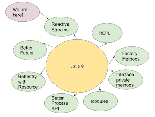

# 2022 年 10 大最佳免费 Java 课程[更新]

> 原文：<https://dev.to/javinpaul/10-free-courses-to-learn-java-in-depth-3ikn>

*披露:这篇文章包括附属链接；如果您从本文提供的不同链接购买产品或服务，我可能会收到报酬。*

 
互联网上充满了有用的资源。不管你想学什么，总有一些有用的东西是免费的。你只需要投入你的时间和精力。同时，在互联网上[免费教程](https://javarevisited.blogspot.com/2018/06/top-10-courses-to-learn-javascript-in.html)和[课程](https://javarevisited.blogspot.com/2018/08/top-5-free-java-8-and-9-courses-for-programmers.html)的汪洋大海中，很难做出选择。

一不小心就把大部分时间花在浏览和换课程上，什么都没学到。这就是精选清单的用处所在。策展是我的爱好和激情。我喜欢阅读[书籍](https://medium.com/javarevisited/10-books-java-developers-should-read-in-2020-e6222f25cc72)和[课程](https://javarevisited.blogspot.com/2020/04/top-5-courses-to-become-full-stack-java-developer-with-Angular-and-Reactjs.html#axzz6Nq9yk7Sc)，这可以让我收集有用的资源并与你们分享。

今天我分享 [10 门 Java 编程课程](https://www.java67.com/2018/08/top-10-free-java-courses-for-beginners-experienced-developers.html)，初学者可以免费使用学习 Java。

尽管重点放在初级 Java 课程上，因为初学者最需要指导和帮助，但我也尝试加入对中级和有经验的 Java 开发人员非常有用的免费课程。

对于有经验的 Java 开发人员来说，这些是一些真正重要的[技能](https://javarevisited.blogspot.com/2020/03/top-20-skills-java-developers-can-learn.html#axzz6k4XBgTw4)、[工具](https://medium.com/javarevisited/10-tools-and-libraries-every-software-developers-should-learn-e05e636a5577)和[技术](https://javarevisited.blogspot.com/2019/10/the-java-developer-roadmap.html#axzz6N3akNoox)。如果你对它们不熟悉，现在可能是学习它们来提升你的职业和技能的时候了。

## 2022 年 10 门免费 Java 课程供初学者学习

为了不浪费你更多的时间，这里是我列出的一些最好的免费 Java 课程，供初学者和有经验的程序员学习[核心 Java](https://javarevisited.blogspot.com/2020/04/top-10-advanced-core-java-courses-for-experienced-developers.html) 、[集合](https://medium.com/javarevisited/7-best-java-collections-and-stream-api-courses-for-beginners-in-2020-3ad18d52c38)、[多线程](https://medium.com/javarevisited/8-best-multithreading-and-concurrency-courses-for-experienced-java-developers-8acfd3b25094)、 [Docker](https://javarevisited.blogspot.com/2019/05/top-5-courses-to-learn-docker-and-kubernetes-for-devops.html) 、 [Jenkins](https://medium.com/javarevisited/7-best-courses-to-learn-jenkins-and-ci-cd-for-devops-engineers-and-software-developers-df2de8fe38f3) ，以及专业 Java 开发所需的其他重要工具和技能。

### 1。完全初学者的 Java 教程

这是 Udemy 上[最受欢迎的免费 Java 课程。大概是有先发优势，但是课程质量还是挺好的。](https://www.udemy.com/java-tutorial/?ranMID=39197&ranEAID=JVFxdTr9V80&ranSiteID=JVFxdTr9V80-UfB4ehpx3sT93US_xK8IFg&LSNPUBID=JVFxdTr9V80)

如果你是编程初学者，或者知道一种编程语言，但也想学习 Java，那么你可以报名参加这个课程。它是免费的，我想它在 Udemy 上永远是免费的。

链接加入课程- [**Java 完全初学者教程**](https://www.udemy.com/java-tutorial/?ranMID=39197&ranEAID=JVFxdTr9V80&ranSiteID=JVFxdTr9V80-UfB4ehpx3sT93US_xK8IFg&LSNPUBID=JVFxdTr9V80)

### 2。在[Coursera]上用 Java 进行面向对象编程

这是一门[中级 Java 课程](https://click.linksynergy.com/deeplink?id=JVFxdTr9V80&mid=40328&murl=https%3A%2F%2Fwww.coursera.org%2Flearn%2Fobject-oriented-java)。如果你有一些软件开发的经验或者有[计算机科学](https://medium.com/javarevisited/10-best-software-development-courses-certifications-from-coursera-4ccc59aae201)的背景，那么你可以参加这个免费课程学习面向对象编程。

完成[本课程](https://click.linksynergy.com/deeplink?id=JVFxdTr9V80&mid=40328&murl=https%3A%2F%2Fwww.coursera.org%2Flearn%2Fobject-oriented-java)后，你应该能够用 Java 开发一个面向对象的应用程序，利用现有库的能力，如何构建图形用户界面，以及如何使用一些核心算法来搜索和排序数据。

而且，最好的部分是它是基于项目的，所以你会得到一些急需的实践和编码。

链接加入课程-[**Java 面向对象编程**](https://click.linksynergy.com/deeplink?id=JVFxdTr9V80&mid=40328&murl=https%3A%2F%2Fwww.coursera.org%2Flearn%2Fobject-oriented-java)

### 3。Java 多线程[免费]

多线程是 Java 编程的一个基本部分，也可能是区分优秀 Java 开发人员和普通 Java 开发人员的最重要的特性。

对能够编写健壮的并发代码的 Java 开发人员有很高的要求。他们也获得很高的薪水。

如果你真的想在 Java 世界中脱颖而出，多线程和并发性是你需要征服的一个领域，那么[本课程](https://click.linksynergy.com/fs-bin/click?id=JVFxdTr9V80&subid=0&offerid=323058.1&type=10&tmpid=14538&RD_PARM1=https%3A%2F%2Fwww.udemy.com%2Fjava-multithreading%2F)将免费帮助你做到这一点。

链接加入课程- [**Java 多线程**](https://click.linksynergy.com/fs-bin/click?id=JVFxdTr9V80&subid=0&offerid=323058.1&type=10&tmpid=14538&RD_PARM1=https%3A%2F%2Fwww.udemy.com%2Fjava-multithreading%2F)

顺便说一句，如果你有预算花一些钱在值得学习的东西上，那么 [**将并发和多线程应用于常见的 Java 模式**](https://pluralsight.pxf.io/c/1193463/424552/7490?u=https%3A%2F%2Fwww.pluralsight.com%2Fcourses%2Fjava-patterns-concurrency-multi-threading) 由 [José Paumard](https://medium.com/@jose.paumard) 在 Pluralsight 上开发也是非常好的，但是，当然，这不是免费的。

你需要一个 [Pluralsight 会员](http://pluralsight.pxf.io/c/1193463/424552/7490?u=https%3A%2F%2Fwww.pluralsight.com%2Flearn)才能进入该课程，费用大约为每月 29 美元/每年 299 美元，但也可以访问他们的 5000 多门在线课程库。

### 4。通过构建项目练习 Java

学习一门新的编程语言，没有比构建项目更好的方法了。这就是我所说的主动学习。在你开始写代码和创建项目之前，你不能仅仅通过阅读书籍或观看在线课程来学习。这让你的思维活跃起来。

你熟悉现实世界的需求，然后根据你所学到的知识找到答案。简而言之，使用本课程进行更多的参与式和基于项目的学习。

链接加入课程(免费)- [**通过搭建项目练习 Java**](https://click.linksynergy.com/fs-bin/click?id=JVFxdTr9V80&subid=0&offerid=323058.1&type=10&tmpid=14538&RD_PARM1=https%3A%2F%2Fwww.udemy.com%2Fpractice-java-by-building-projects%2F)

强烈推荐给任何学习 Java 的人的免费课程。

顺便说一句，如果你觉得这个课程的理论有点轻，那么你也可以将它与 [**完整的 Java 大师班**](https://click.linksynergy.com/fs-bin/click?id=JVFxdTr9V80&subid=0&offerid=323058.1&type=10&tmpid=14538&RD_PARM1=https%3A%2F%2Fwww.udemy.com%2Fjava-the-complete-java-developer-course%2F) 结合起来，这是学习 Java 的最佳和最新的课程之一，但不是免费的。

### 5。Java 数据库连接:JDBC 和 MySQL【学习 JDBC】

JDBC 是 Java API 不可或缺的一部分，因为大多数用 Java 创建的真实应用程序都必须使用数据库。

即使你正在使用像 [Hibernate](https://medium.com/javarevisited/top-5-hibernate-online-training-courses-for-beginners-and-advance-java-programmers-469460596b2b) 、 [JPA](https://www.java67.com/2021/01/spring-data-jpa-interview-questions-answers-java.html) 或 [IBatis](https://ibatis.apache.org/) 这样的高级框架，也需要对 JDBC 有很好的了解，本课程将为你提供这些。它使用 MySQL 作为示例数据库，因为它也是免费的，并教你如何使用 JDBC 在 Java 中操作数据库。

链接加入课程(免费)- [**Java 数据库连接:JDBC 和 MySQL**](https://click.linksynergy.com/fs-bin/click?id=JVFxdTr9V80&subid=0&offerid=323058.1&type=10&tmpid=14538&RD_PARM1=https%3A%2F%2Fwww.udemy.com%2Fhow-to-connect-java-jdbc-to-mysql%2F)

总的来说，对于希望提高 JDBC 技能的初学者和中级 Java 开发人员来说，这是一门完美的课程。

### 6。面向绝对初学者的 Java【学习核心 Java】

这是另一个针对 Java 开发者的初级课程。如果你是来自 [C](https://medium.com/javarevisited/10-best-c-programming-courses-for-beginners-2c2c1f6bcb12) 、 [C++](https://hackernoon.com/top-5-free-c-courses-to-learn-programming-in-2019-d27352277da0) 或 [Python](https://javarevisited.blogspot.com/2019/09/5-websites-to-learn-python-for-free.html) 背景的计算机科学毕业生或程序员，那么你可以通过这门课程快速掌握 Java 编程。

这是一个很短的课程，不是很全面，但从初学者的角度提供了一个很好的概述。

链接免费加入课程- [**Java 绝对初学者**](https://click.linksynergy.com/fs-bin/click?id=JVFxdTr9V80&subid=0&offerid=323058.1&type=10&tmpid=14538&RD_PARM1=https%3A%2F%2Fwww.udemy.com%2Fjava-for-absolute-beginners-c%2F)

### 7。面向初学者的 Eclipse IDE:提高您的 Java 生产率[学习 Eclipse]

毫无疑问, [IntelliJIDEA](https://itnext.io/top-5-intellijidea-and-android-studio-courses-for-java-and-android-programmers-afcc27309b60) 正在迅速赢得与 [Eclipse](https://javarevisited.blogspot.com/2020/05/top-5-courses-to-learn-eclipse-ide-for-java-developers.html) 的战争，取代它成为最流行的 Java IDEs，但它仍然是一个非常好的 IDE。它是免费的，你不需要支付许可费，这是 IntelliJIDEA 完整版所需要的。

作为一名 Java 开发人员，很好地了解您的 IDE 是必须的，本课程将教您如何高效地使用 Eclipse。强烈推荐任何开始 Java 开发的程序员使用。

链接加入课程- [**Eclipse IDE 初学者**](https://click.linksynergy.com/fs-bin/click?id=JVFxdTr9V80&subid=0&offerid=323058.1&type=10&tmpid=14538&RD_PARM1=https%3A%2F%2Fwww.udemy.com%2Fluv2code-eclipse-ide-for-beginners%2F)

* * *

### 8。Java 9 简单易用的新特性-概述

这是一门需要熟悉的[优秀课程](https://click.linksynergy.com/fs-bin/click?id=JVFxdTr9V80&subid=0&offerid=323058.1&type=10&tmpid=14538&RD_PARM1=https%3A%2F%2Fwww.udemy.com%2Fjava-9-new-features-in-simple-way-overview%2F)——Java 9 中引入了一些令人兴奋的新特性，比如 Java 的[模块系统](https://www.amazon.com/Java-Module-System-Nicolai-Parlog/dp/1617294284/?tag=javamysqlanta-20)，对流程和[流 API](http://www.java67.com/2014/04/java-8-stream-examples-and-tutorial.html) 的改进，引入了用于创建[不可变](https://javarevisited.blogspot.com/2018/02/java-9-example-factory-methods-for-collections-immutable-list-set-map.html)集合的静态工厂方法，等等。

如果您已经了解 Java，并且只是想更新您的知识以了解新的 Java 特性，那么这是适合您的课程。更重要的是，它是免费的，你将在一个地方找到所有重要的 Java 9 变化。

链接加入本课程(免费)- [**Java 9 新特性简单明了**](https://click.linksynergy.com/fs-bin/click?id=JVFxdTr9V80&subid=0&offerid=323058.1&type=10&tmpid=14538&RD_PARM1=https%3A%2F%2Fwww.udemy.com%2Fjava-9-new-features-in-simple-way-overview%2F)

* * *

### 9。Java 编程基础

这是针对 Java 程序员或任何想学习 Java 的人的另一门[初级课程](https://click.linksynergy.com/fs-bin/click?id=JVFxdTr9V80&subid=0&offerid=323058.1&type=10&tmpid=14538&RD_PARM1=https%3A%2F%2Fwww.udemy.com%2Fjava-programming-basics%2F)。它免费且简短，这使得初学者在进入更全面和更困难的课程之前获得一个概述是完美的。

如果想学 Java，又没有编程经验，可以利用这门课同时学习 Java 和编程基础。

链接免费加入本课程- [**Java 编程基础知识**](https://click.linksynergy.com/fs-bin/click?id=JVFxdTr9V80&subid=0&offerid=323058.1&type=10&tmpid=14538&RD_PARM1=https%3A%2F%2Fwww.udemy.com%2Fjava-programming-basics%2F)

### 10。面向 Java 开发人员的实用 Docker

Docker 正在成为基于云的应用程序世界中越来越重要的工具。

如果您对基于云的 Java 开发和利用容器快速建立新实例感兴趣，那么这是您开始学习的最佳课程。

链接加入本课程- [**面向 Java 开发者的动手 Docker**](https://click.linksynergy.com/fs-bin/click?id=JVFxdTr9V80&subid=0&offerid=323058.1&type=10&tmpid=14538&RD_PARM1=https%3A%2F%2Fwww.udemy.com%2Fintroduction-to-docker-for-java-developers%2F)

而如果你能在学习上花点钱，那么 [**云原生 Java**](https://www.amazon.com/Cloud-Native-Java-Designing-Resilient/dp/1449374646?tag=javamysqlanta-20) 作者[乔希·龙](https://medium.com/@joshlong)的书就是一本很棒的书。

如果你热衷于学习 Docker，并寻找更多的选项和选择，那么你也可以看看这个为开发者社区的程序员提供的免费 Docker 课程列表。

以上就是针对初学者的一些免费 Java 编程课程。如果你想学习 Java，那么这些课程足以让你成为 Java 专家。正如我所说的，这些课程涵盖了 Java 编程的广阔领域，从核心 Java 到高级 Java，从多线程到 JDBC，从 Eclipse 到 Docker。因此，它对初学者和中级 Java 程序员同样有用。即使是专家也能从这些课程中学到一些东西。

* * *

### 期末备注

感谢阅读这篇文章。你可能会想，有这么多东西要学，有这么多课程要参加，但你不需要担心。

很有可能你已经知道了大部分的东西，而且也有很多有用的资源，像[书籍](https://medium.com/swlh/top-10-java-books-for-programmers-all-time-great-82b0ee0b831a)和[教程](https://javarevisited.blogspot.com/2018/07/java-8-tutorials-resources-and-examples-lambda-expression-stream-api-functional-interfaces.html)供你使用。

我是 Udemy 课程的特别粉丝，不是因为如果你买了这篇文章中提到的付费课程我会得到报酬，而是因为它们非常实惠，并且以很少的金额提供了很多价值，但是，当然你可以自由选择你想要的课程。

说到底，你应该对这里提到的事情有足够的知识和经验。

祝您的 Java 之旅好运！这当然不容易，但是通过学习这些课程，你离成为你一直想成为的 Java 程序员又近了一步

> 如果你知道任何其他免费的 Java 课程，虽然不在列表中，但对初学者很有帮助，请在这里随意评论。祝学习一切顺利。

### 更多免费 Java 编程资源

1.  [面向 Java 开发者的 5 门免费 Spring 框架课程](http://www.java67.com/2017/11/top-5-free-core-spring-mvc-courses-learn-online.html)
2.  [2022 年学习 Web 开发的五大课程](https://javarevisited.blogspot.com/2018/02/top-5-online-courses-to-learn-web-development.html)
3.  [学习大数据和 Apache Spark 的 5 门课程](http://javarevisited.blogspot.com/2017/12/top-5-courses-to-learn-big-data-and.html)
4.  [面向 Web 开发人员的十大 JavaScript 教程和课程](https://javarevisited.blogspot.com/2018/06/top-10-courses-to-learn-javascript-in.html)
5.  [2022 年学习 Spring Boot 的五大课程](https://javarevisited.blogspot.com/2018/05/top-5-courses-to-learn-spring-boot-in.html)
6.  [5 门免费的数据结构与算法课程](https://javarevisited.blogspot.com/2018/01/top-5-free-data-structure-and-algorithm-courses-java--c-programmers.html)
7.  [面向程序员和开发人员的 5 门免费 Linux 课程](http://www.java67.com/2018/02/5-free-linux-unix-courses-for-programmers-learn-online.html)
8.  [学习 React JS 框架的 5 门免费课程](http://www.java67.com/2018/02/5-free-react-courses-for-web-developers.html)
9.  [初学者学习 Java 数据结构的 10 门免费课程](http://www.java67.com/2019/02/top-10-free-algorithms-and-data.html)

* * *

> **P.S. -如果你只是想从一门课程开始从头到尾学习 Java，那么，我认为** [**完整的 Java 大师班**](https://click.linksynergy.com/fs-bin/click?id=JVFxdTr9V80&subid=0&offerid=323058.1&type=10&tmpid=14538&RD_PARM1=https%3A%2F%2Fwww.udemy.com%2Fjava-the-complete-java-developer-course%2F) **可能是最好的开始。**