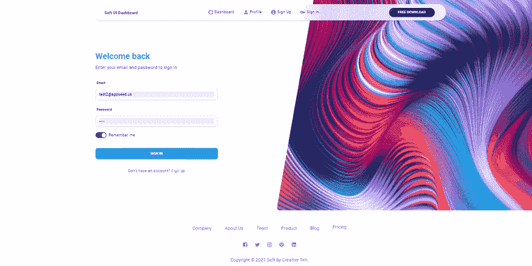
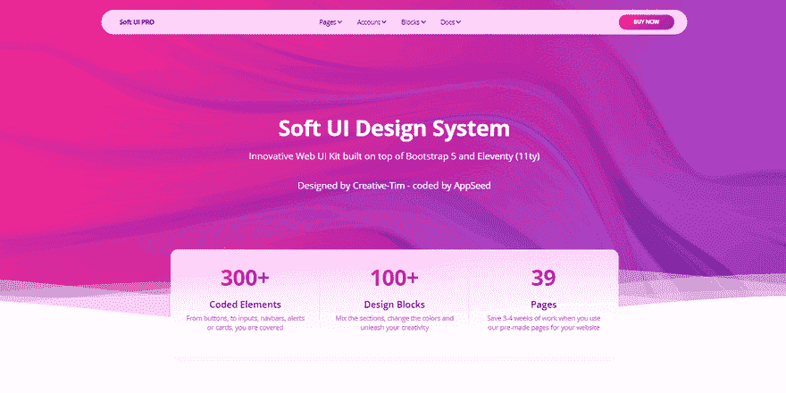

# 我如何用自动化工具构建了 100 多个开源应用

> 原文：<https://dev.to/sm0ke/100-open-source-apps-built-with-automation-tools-3jmj>

各位编码员好，

我是一名自由开发者，使用自动化 **[开发工具](https://appseed.us/developer-tools/)** 、 **HTML 解析**，以及简单的 UI 就绪**样板代码**增强了基本模块(认证、数据库、工具)，用不同的语言和架构开发了 100 多个应用。

免费的在麻省理工学院许可下发布在 Github 上(免费，允许无限拷贝)，我将在本文中提到一些。

* * *

## 关于自动化过程

我决定建立一个自动化的工作流程，基于我过去两年的自由职业经验，主要基于反馈和客户需求:

*   客户不断要求各种各样的设计可供选择
*   应用程序应该以现代技术交付(这让我的生活更容易，但并不是在所有情况下都是如此)
*   使用低预算将传统应用迁移到新技术。

为了解决所有这些问题和挑战，我建立了一个半自动的工作流程:

*   使用 Python / BS4 编写的 HTML 解析器从平面 HTML 文件中提取各种模板引擎(Jinja2、PUG、Blade)的组件
*   将处理过的设计注入现有的**样板代码** : Django / Flask 管理仪表板、静态站点、Jamstack、简单的 Flask Web 应用
*   使用木偶师和 Selenium 自动执行最小测试集。

* * *

## [反应柔和的仪表盘](https://appseed.us/product/soft-ui-dashboard/api-server-nodejs/react/) `fullstack`

用一个创新的管理模板为 **Material-UI** 和 **React** 开始你的开发。[软 UI Dashboard React](https://appseed.us/product/soft-ui-dashboard/api-server-nodejs/react/) 由 70 多个前端独立元素组成，如按钮、输入、导航条、导航标签、卡片或提醒，让您自由选择和组合。该产品附带了一个简单的 JWT 认证流程:登录/注册/注销。

> 🚀内置有 **[React App 生成器](https://appseed.us/generator/react/)**

*   ✅创新**软 UI 设计** -由[创意制作-Tim](https://bit.ly/3fKQZaL)
*   ✅反应，还原，还原-坚持
*   ✅认证:`JWT Tokens`，
*   ✅ `OAuth` via GitHub
*   ✅全栈就绪使用:
    *   [节点 API](https://github.com/app-generator/api-server-nodejs) `free product`
    *   [节点 API Mongo](https://github.com/app-generator/api-server-nodejs) `free product`

## ✨ [达塔艾布尔姜戈](https://appseed.us/product/datta-able/django/) `latest dashboard`

Django 框架中的 AppSeed 平台在现代 Bootstrap 4 仪表板模板**达塔 Able** 之上生成管理仪表板。Django 代码库提供了认证、数据库、ORM 和部署脚本。

*   👉[达塔·艾布尔·姜戈](https://appseed.us/product/datta-able/django/) - `Product page`
*   👉[达塔·艾布尔·姜戈](https://django-datta-able.appseed-srv1.com/) - `LIVE demo`

* * *

## ✨ [姜戈材料工具包](https://appseed.us/product/material-kit/django/) `latest app`

为那些喜欢大胆元素和漂亮网站的人设计的**材料工具包 2** 随时准备帮助你创建令人惊叹的网站和网络应用。`Material Kit 2`由 60 多个独立的前端元素组成，如按钮、输入、导航条、导航标签、卡片或提醒，让您自由选择和组合。

*   👉 [Django 材料包](https://appseed.us/product/material-kit/django/) -产品页面
*   👉 [Django 材料包](https://django-material-kit.appseed-srv1.com/) -实时应用

* * *

## ✨全栈 [React 应用](https://appseed.us/apps/react/)

项目使用`two-tier`架构模式构建，前端部分使用 React，不同的 API 服务器由 Node JS、Flask、Django 提供支持。

*   🔥 [React Node JS Berry](https://appseed.us/product/react-node-js-berry-dashboard) -全栈 seed 项目
*   🔥 [React Node JS 软仪表板](https://appseed.us/product/node-js-react-soft-dashboard) -全栈 seed 项目
*   🔥 [Django React](https://appseed.us/product/django-react-datta-able) 达塔-全栈开源示例

* * *

* * *

## ✨ [烧瓶仪表盘](https://appseed.us/admin-dashboards/flask)

所有的管理仪表板都在 **Flask** 微框架中编码，带有 SQLite 数据库、认证 ORM 和 Docker、HEROKU 的部署脚本

* * *

*   🔥[烧瓶达塔表](https://appseed.us/admin-dashboards/flask-datta-able) -产品页面
*   🔥[烧瓶仪表盘氩气](https://appseed.us/admin-dashboards/flask-boilerplate-dashboard-argon) -产品页面
*   🔥[烧瓶明星管理](https://appseed.us/admin-dashboards/flask-star-admin) -产品页面
*   🔥[亚特兰蒂斯 Lite - Flask](https://appseed.us/admin-dashboards/flask-dashboard-atlantis-dark) -产品页面

* * *

* * *

## ✨ [姜戈仪表盘](https://appseed.us/admin-dashboards/django)

简单的 Django 启动器，增强了基本模块、认证和部署脚本。

* * *

*   🔥 [Django 仪表盘氩气](https://appseed.us/admin-dashboards/django-dashboard-argon) -产品页面
*   🔥 [Django 仪表板电压](https://appseed.us/admin-dashboards/django-dashboard-volt) -产品页面
*   🔥 [Django 亚特兰蒂斯黑暗](https://appseed.us/admin-dashboards/django-dashboard-atlantis-dark) -产品页面
*   🔥 [Django 明星管理](https://appseed.us/admin-dashboards/django-star-admin) -产品页面

* * *

* * *

## ✨ [静态地点](https://appseed.us/static-site)

免费与商业，原型在[十一](https://www.11ty.io/) (11ty)和**帕尼尼 SSG** 之上。工具:Webpack，Sass/SCSS，Babel，Light-server，PostCSS，CSSnano。

* * *

*   🔥[十一软 UI 设计](https://appseed.us/product/eleventy-soft-ui) -产品页面
*   🔥[十一软 UI 设计](https://eleventy-soft-ui.appseed-srv1.com/) -现场演示

* * *

* * *

## [【flask 应用】](https://appseed.us/apps/flask-apps)

基于知名 UI 套件的免费网络应用，配备了身份验证、SQLite 数据库、ORM 和干净的代码库。

* * *

*   🔥 [Flask Pixel UI Kit](https://appseed.us/apps/flask-apps/flask-pixel-bootstrap-uikit) -建立在`accessibility first` UI Kit 之上的免费应用
*   🔥[烧瓶应用 IraDesign](https://appseed.us/apps/flask-apps/flask-illustrations-iradesign) -产品页面
*   🔥 [Flask Pixel PRO](https://appseed.us/apps/flask-apps/flask-pixel-uikit-pro) -产品页面

* * *

* * *

## 其他(生成的)应用和样板文件

*   [全栈](https://github.com/app-generator?utf8=%E2%9C%93&tab=repositories&q=fullstack) -带 Vue、React 前端的双层架构- MIT 许可证
*   Nodejs、Laravel 和 Flask [样板代码](https://github.com/app-generator/boilerplate-code) - MIT 许可证

* * *

后续步骤

*   增强 [HTML 解析器](https://github.com/app-generator/html-parser),将传统 HTML 设计转换成 Vue、React、Angular 主题
*   从基于 Bootstrap 的设计开始，为现代框架(GatsbyJS、Gridsome、HUGO)生成主题
*   设计从遗留 CSS 框架(Bootstrap)到布尔玛和 Tailwind 的迁移。
*   添加更多要在管道中使用的样板文件:Django、Fastify..你说吧。

* * *

> **感谢阅读！**如需更多资源，请随时访问:

*   ✨更多[免费仪表盘](https://appseed.us/admin-dashboards/open-source)在 Django 制作，Flask 和 [React](https://appseed.us/apps/react)
*   ✨更多[管理仪表板](https://www.admin-dashboards.com/) -一个巨大的产品索引