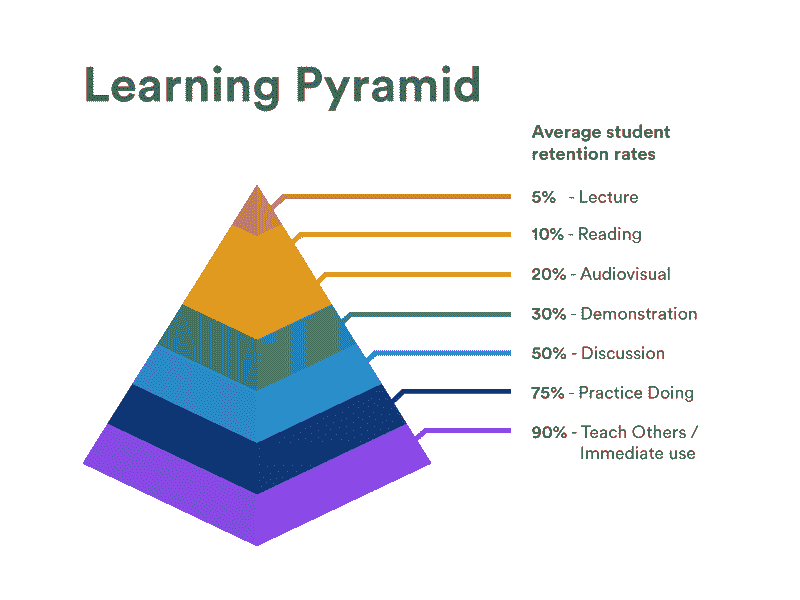
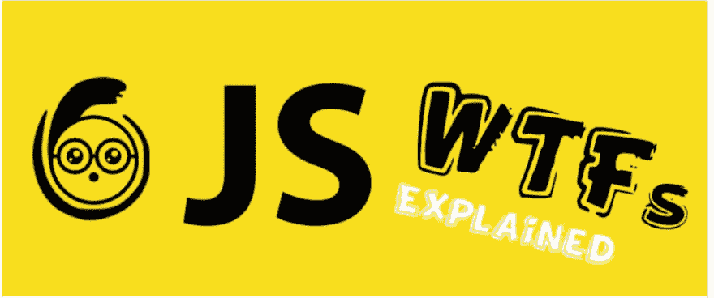
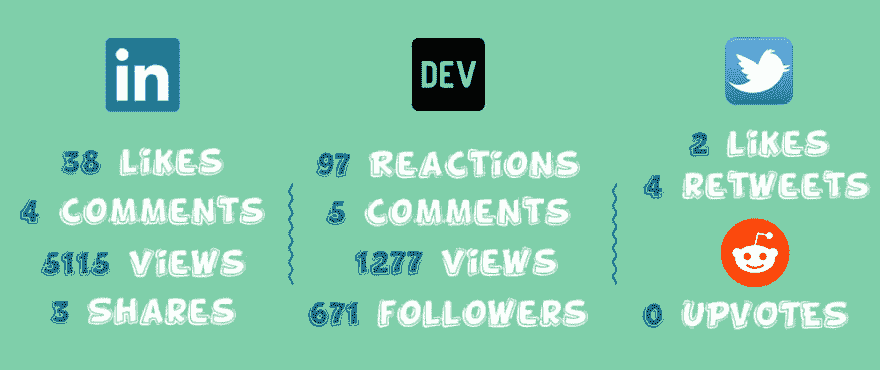
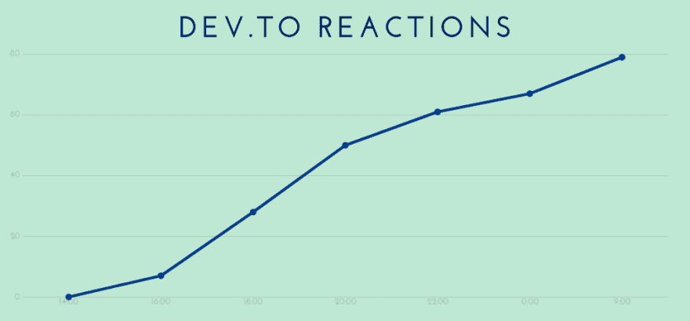
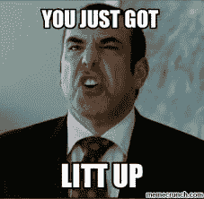
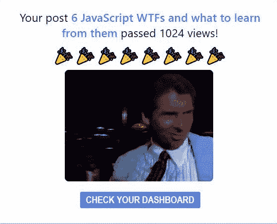

# 对我第一篇技术文章的 100 个反应——技巧和见解

> 原文：<https://dev.to/andreib123/100-reactions-at-my-first-technical-article-tips-and-insights-g33>

所以，如果你在这里，这意味着你至少曾经考虑过 ***写一篇文章*** 或者你已经这样做了。**(或者只是好奇)**

范围是呈现我的 ***【路线图】*** 写我的第一篇技术文章，简单搞笑**(我希望)**并给你需要自己做的主要元素**(或者可能改进你的流程)**。

我在网上发布的第一篇技术文章名叫***[《6 个 JavaScript WTFs 及向它们学习什么》](%5Bhttps://dev.to/andreib123/6-javascript-wtfs-and-what-to-learn-from-them-406d%5D(https://l.messenger.com/l.php?u=https%3A%2F%2Fdev.to%2Fandreib123%2F6-javascript-wtfs-and-what-to-learn-from-them-406d&h=AT2TYpN1yUgmrJA8ZHwKiTDUQ_eN3UNi1tXWlfqExEwrBkYtAiBoHqFOm1N-M5G9XZRSuqwbRJMI9AWLS54Fm7_FYfk_9P3VxueoCPw2ks2HvTrrbMzAnTH-6SeU9vOTqdjtdw))*** 。如果你还没有的话，请检查一下，并用那个有趣的 ***反馈*** 打我。

在我们开始之前，这里有一些关于我的事情。我是一名罗马尼亚 ***全栈*** 开发者，在这个领域工作了将近 ***3 年*** ，对*web 技术感兴趣，尤其是 ***ReactJS*** ，注重实践，热衷于帮助他人找到自己的**编程热情****提高自己的技能**。*

 *我写上一篇文章的原因与我的中期目标有关，那就是为初学者创造面向网络的内容。*(也是为了以后提高我的技能)*

为什么 ***写*** ？三个原因:

首先，你是在回馈社会，帮助他人，这是*。对我来说，这是最大的动力，它让我充实。**(如果这不是你，为了接下来的两个原因跟我裸奔)***

 *第二，它帮助你 ***学习*** 。等等，我不是应该已经精通这门学科了吗？是的，但是当你深入研究它的时候，你可以从你的知识中找到一些 ***缺失的部分*** ，并且解释一个概念可能会让你发展得更好。以 ***学习金字塔*** 作为这个的论据。

最后，在大多数工作中，一项重要的技能是向他人传授知识的能力**。这样，你发展了这个能力，建立了一个 ***【作品集】*** 。**

 **这个介绍已经太长了，让我们从我过去几周的旅程开始吧。

**T4】**

### 找话题

我的第一个难题是:我应该写些什么？我知道我对**网站开发**感到兴奋，这是我的强项，但是人们想从我这里了解什么呢？什么内容会给他们带来价值？

该过程如下:

*   在文档中进行头脑风暴。关键词、技术、主题等等..我在试着开动脑筋。

*   我的下一站是谷歌，尤其是谷歌趋势。我想发现人们想要了解的关于*网络开发、JavaScript、ReactJS* 和其他的东西。我不能说它给了我答案，但我注意到人们对与 JavaScript 相关的**一般话题**(当然是废话)有很大兴趣

*   在那之后，我想了很多关于复杂的 JavaScript 面试问题，这些问题总有一点 T2 的小技巧。

*   最终，我决定把之前的想法和我想帮助别人**理解**那些概念的愿望结合起来，而不仅仅是回忆答案。

因此，我决定主题将是关于 JavaScript 中发生的奇怪事情，T2 用例子解释了。还有，文章要**不拘小节**、**友善**和**搞笑**。*(我希望我得到那个角色)*

### 标题

我知道你在想什么。为什么要在内容写出来之前选择一个标题呢？一点都不**肤浅**？我会说，是也不是。

选择你的标题可能有助于你阐明文章的大背景，你将应用的一般方法。

我给你举个例子。我的第一篇文章可以有多种形式，有相似的内容。这可能只是一篇**有趣的文章**，其中我没有任何解释地揭露了 WTFs，或者也许我可以选择**面试问题**而不是 WTFs，更少乐趣，更有成效。你说到点子上了。

现在，我们来解剖一下文章的标题，*“6 个 JavaScript WTFs 以及向它们学习什么”*。我的目标是**总结**内容，并添加一些**小点击诱饵碎屑**。

内容由**“Javascript、WTFs 和 learn”**描述，而 clickbait 仅由**“6”、**格式化，这有助于提供特定的东西，也因为大脑会被数字吸引。*(“JavaScript wtf 和向它们学习什么”听起来不太好，对吧？)*

如果你想更深入地了解这个主题，我会推荐下面这篇文章:[通过这个练习选择你的下一篇文章主题](https://dev.to/gsto/choose-your-next-article-topic-with-this-exercise-17m2)作者[格伦·斯托瓦尔](https://dev.to/gsto)

### 构建一个结构

我的简单构建从文章的主要部分开始:**引言、内容和结论**。对于他们中的每一个，我开始添加**小要点**和主要观点。

例如，对于结论，我想说的是当面临问题时查看官方文档的习惯，那些 wtf 很有趣，但是 T2 可能隐藏着错误，这是我在 T4 写技术文章的第一次尝试。

### 开始开发每个点

在结构准备好之后，重点是**实现**每个小创意和**为 WTFs 研究**。

我试着读足够多的书，以确保我完全理解这个主题，因此能够以一种简单的方式展示它。每次 WTF 后我都会问自己以下问题:*内容够清楚了吧？它正确地解释了主题？*

同样，对于他们中的每一个，我的想法是添加尽可能多的**代码示例**，以便*可视化*解释。

最后，我想到了一些适合那个案例的**搞笑图片**，想法是让文章更友好。*(但不能过度使用)*

### 标记或文本

我的方法是将内容**直接写成标记**。我在这方面没有太多经验，所以我谷歌了一个在线标记工具，我的选择是 **[StackEdit](https://stackedit.io/app)** 。它有一个简单的界面，有我需要的一切。

对于这篇文章，我已经把内容写成了文本，最后我会把它转换成标记。到目前为止，我可以说**的写作过程更快**，但我应该看看我会投入多少时间来改变它。

请在评论中告诉我什么方法最适合你。

### 准备发布

除了好的内容和展示信息的能力，文章的**【推广】**和总体方面也是必不可少的。

首先，我用 Photoshop 制作了一张封面图片，这张图片可以让**吸引你的注意力**。如果你不熟悉 Photoshop，你可以使用其他免费的在线工具如 **[Canva](http://canva.com)** 来创建它。我听从了 **[编辑指导](https://dev.to/p/editor_guide)** 的建议，做成 *1000px x 420px* 。

研究发表文章的最佳时间和日期。由于这是我的第一篇文章，我也考虑到了这一方面，我发现 **[这篇](https://dev.to/daolf/-what-is-the-best-time-to-post-on-devto-a-data-backed-answer--1kob)** 文章提出了*(基于数据)*什么可能是最佳选择。我结合了大多数 dev.to 成员来自美国的事实，选择了**周一 14:00(布加勒斯特时间)**。

### 回顾

复习也很有价值，因此，我*把整篇文章读了几遍*，用 **[语法上的](https://app.grammarly.com)** 来纠正一些错别字或错误，也请其他人给我一些反馈。

此外，我为社交媒体平台写了一个简短的描述，并准备发表。

**T4】**

### 社交媒体

我在社交媒体战略中的第一步是确定我的**公众**应该在的**平台**，并试图抓住他们的**注意力** *(以及他们生命中的 5-8 分钟)*。我知道不是每个人都是社交媒体人，但我认为，在这种情况下，你应该把它视为帮助你与公众接触的*过程*。

我使用的平台是:

**Dev.to** 作为发布平台。这个平台是一个推荐，我发现它非常适合第一步。是**免费**、**流行**和**为开发者打造**。

**LinkedIn** ，在那里 a 有一个 **2000** 的人脉网络。我认为 LinkedIn 是一个我可以找到我的观众的地方，这些人以**学习**和**发展**为导向，并开始建立我的投资组合。

Twitter，我只为这篇文章开了一个账户，因为它在罗马尼亚不是很受欢迎。

Reddit 是最大的平台之一。很难相信，但我在 Reddit 上也没有账户*(你可以这样评价我)*，但我知道这里有很多观众，所以我试了试。

为什么不是**脸书**或者 **Instagram** ？我认为**我的目标**不在这两个平台上。*(至少目前如此)*

### 数字，数字，数字

**T4】**

**Dev.to** :文章的主要活动就发生在这里。它超出了我对我的第一篇文章*(这是盲目拍摄)*的预期，我很高兴看到**对我的内容和写作风格的兴趣**。关注者的数量也让我吃惊，我们一会儿会谈到它。

LinkedIn :我对这种环境更加放松，因为我在这里的生活是从 5 年前开始的。活动**开始很慢**，但最后，很高兴看到人们欣赏这些内容。

**推特**:我*没有在这个上面投入太多精力*。我刚刚在我的 0 关注者帐户上分享了这篇文章，并希望一切顺利。

**Reddit** :我**惨败**。我的第一个和第二个帖子被**删除了**，而我在另一个 JS 小组的第三个帖子没有得到任何支持

### 反应进度

另一个有趣的方面是我点击发布按钮后的感受。在最初的两个小时里，我尝到了一些**躁动**和**担忧**。

文章只得到 **5-8 个反应** *(内心深处我知道那些是我的朋友)*，LinkedIn 帖子 **3-4 个赞**。那一刻我说，好吧，这不适合我，我**失败了**，我应该专注于其他事情。

大约在 **18:20** 我下班后，我骑上我的电动滑板车“行驶”了 10 分钟。之后，我检查 dev.to，奇妙的事情发生了。几乎 **40 个反应**，所有的数字都上去了，我收到了一些**正面评论**。很难解释这种感觉，但它是**点燃的**。

2 个小时我有其他活动安排*(在那里我没有检查我的手机)*之后，反应几乎达到了 **60** ，浏览量上升，另一个动机剂量。

那一刻，我只想拿起我的笔记本电脑，开始挖掘我的下一个话题。之后一直涨到早上。

文章活动的生命周期差不多是**24 小时**。*(是的，短命)*

这个故事的寓意是，对你的内容要有耐心，尽可能多地接受 T2 的新鲜反馈。

**注意:**罗马尼亚布加勒斯特的时区(UTC/GMT +3 小时制)

### 追随者

我没有考虑的一个方面是来自 dev.to 平台的**追随者**。随着这篇文章获得关注，关注者的数量开始上升，两周内几乎达到了 **700** 。*(谢谢大家)*

看着这些数字，我意识到社区中有人认为我的内容**有用**和**有价值**。这给了我动力，让我精力充沛地继续这条路。

### 注释

LinkedIn 上的评论都是正面的，其中两条来自熟人，两条来自 T2，两条来自我从未交谈过的人。

dev.to 平台上有**三条**正面评论，一条**中立** *(我无法从中解码感受)*和**一条**建设性/负面。*(那个人给我指出了文章中值得商榷的部分)*

我回应了他们所有人*(没花我多长时间)*，我认为他们是伟大的激励者。

附:这是我见过的最搞笑的**浏览量成绩**通知。

**T4】**

我这篇文章的目标是**分享我的故事**和**帮助其他人**开始创作内容。几周前我收到的建议当然是**【开始】**。你内心深处知道这是真的，但有时很难做到*“就这么做”*。借此文，我想给人民信任墙加一块**小砖。**

在你设法开始之后，把你自己的注意力集中在**提供高质量的内容**上。再次，**研究**你的主题和现有内容，以便获得一个强有力的背景，然后给**带来新的东西**，永远记住**你的目标受众**。

可能前面的几点看起来不太符合，其实并不是这样。你可以**强迫你的大脑开始**做你正在考虑的任务，然后**集中**全力以赴。

不要试图让它更完美。甚至[本·哈尔彭](https://dev.to/ben)都说 **85%** 完美胜过 **100%** 完美。*(查他的[篇](https://dev.to/ben/some-of-my-writing-principles-k4e)论写作原则)*

感谢您在决赛中阅读它，我希望它对您有所帮助，并且您获得了 1%的动力。

快乐写作！📰****