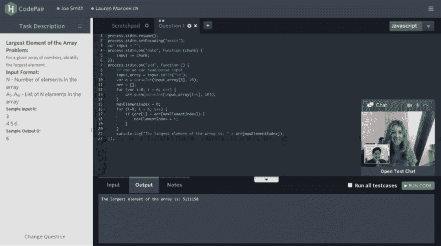
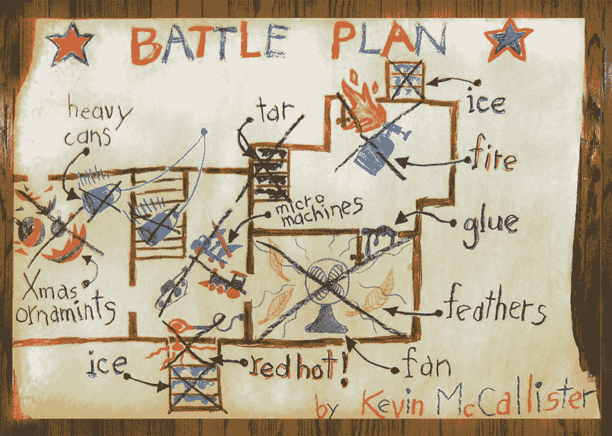
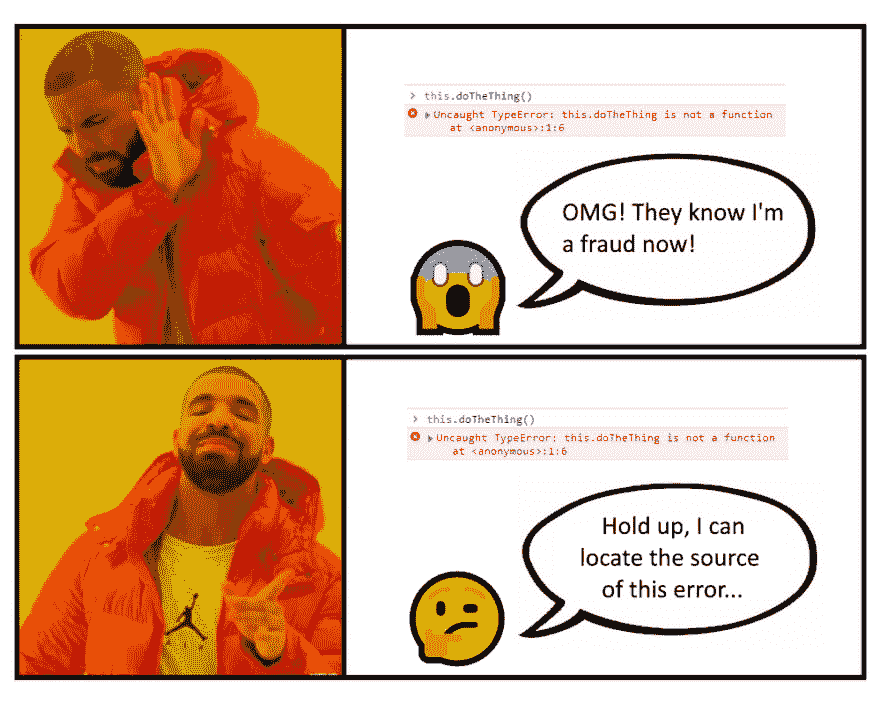

# 如何准备下一次面试

> 原文：<https://dev.to/nicklarsen/how-to-prepare-for-your-next-interview-dkc>

你的下一次面试就要到了，你感到兴奋、紧张，你肯定正在经历一些你不习惯的明显的焦虑。采访*是*一件大事！你的生活发生了巨大的变化，你会遇到很多新的人，你会关注全新的问题，你会觉得你必须再次向一群人证明自己。最重要的是，你将不得不面对你的一些魔鬼，比如在其他人面前编程，在计时器上解决问题。

###### [图片来源](https://www.hackerrank.com/products/codepair/)

很大程度上，这种焦虑来自于不知道面试中会发生什么，也不想在这种情况下待太久。不想在这种情况下待太久是几乎每个人都面临的现实问题，不幸的是我没有解决办法。我确实有一个解决方案，告诉你应该期待什么，这样你就能很快得到一份让你满意的工作。

我们将涵盖你被评估的主要话题，并在面试结束时给出一些如何提高你在每个领域的地位的建议。首先，我们将分解关键主题，然后我们将更详细地解释它们，最后，我们将涵盖几乎肯定会被问到的最常见的问题模式。

## 解决问题的过程

你被雇佣来解决问题。这一点我再重申也不为过。你是*不是*来这里写代码的，你是来*解决问题的*。问题可以是产品相关的，代码相关的，人员相关的，过程相关的，无论什么，你的工作就是解决问题。编写代码只是实现问题解决方案的一种方法。当你面试时，期望是你将编写代码来实现解决方案，所以这是他们将要测试你的，然而，真正决定面试是否通过的是你解决问题的技能。所以让我们来分解一下解决问题的过程，看看所有的部分是如何组合在一起的。

### 问题描述

问题是对需要完成的事情的描述。问题是类似于“我们需要按升序排列数组中的所有项目”。这就是排序问题。有很多方法可以解决分类问题，你也可以不用电脑来分类，比如把病历放在文件柜里。问题陈述只是一种描述，它不以任何方式暗示特定的解决方案。

有很多问题，但只是为了突出你在工作中可能遇到的一些常见问题，比如:

*   我们需要更多的顾客在我们的网站上买东西
*   我们需要让您更容易找到问题的答案
*   我们需要识别我们网站上的有毒内容

如果你在工作中遇到过这些问题中的任何一个，你的大脑可能会因为你阅读了那些问题陈述而充满想法，这就是关键，一个问题可以有大量的解决方案。你的工作是找到解决手头问题的好办法。

### 走近

方法是关于如何解决问题的高层次想法。它没有指定实施细节，只是提供了解决方案关键组件的概要。想出一个有效的方法是解决问题的实际行动。这就是为什么你不是来编码的，你是来解决问题的。你需要想出有效的、可行的方法来解决每个问题。一旦你有了它，任何人都有可能去实现它。

继续排序示例，一种方法类似于“找到最小值并将其放在第一个位置，然后对剩余的未排序元素重复这个过程，直到所有元素都排序完毕”。这是一个完全有效和可行的方法。同样，请注意它并没有指定一个特定的算法，它只是一个关于如何解决问题的一般想法，并且它可以以多种方式实现。这种通用方法是众多排序算法的基础，我们一会儿会讲到。

一旦你有了方法，**你就解决了问题**；你已经完成了受雇于你的主要任务。人们在这里犯的一个非常常见的错误是“用代码思考”，这实质上意味着你只考虑你所熟悉的工具。你可能听过这样一句话“如果你只有一把锤子，所有的问题看起来都像钉子”。如果你想不出用你知道的工具来解决它的方法，那么突然间你就卡住了。这是一个巨大的错误。这就像试图修理浴室的淋浴墙，但你唯一知道如何使用的工具是胶带，所以你开始描述如何使用胶带将瓷砖固定在墙上。相反，您应该将该方法描述为将瓷砖贴在墙上，这样您仍然解决了问题，并且您可以稍后再考虑实现细节。

###### [图片来源](http://www.startribune.com/top-20-home-inspection-photos-from-2015/364228611/)

相反，我强烈建议你像人一样解决所有问题，而不是像电脑一样。想想如果你有一个装满医疗记录的文件柜，你必须按字母顺序分类，你会怎么做？你会在第一次尝试时就想出最有效的答案吗？可能不会，但是你*会*去解决问题，一旦问题解决了，我们有了可行的解决方案，我们就可以迭代。如果你没有一个可行的解决方案，你就会破产，也不会得到这份工作。只是天真地解决它，我们稍后会找到更好的解决方案。

### 技巧

技术是解决方案的实际实现细节。这是你开始谈论具体算法以及如何将它们应用于给你的数据的时候。如上所述，有很多不同的方法来实现基于先找到最小值的排序。一些最常见的是选择排序、冒泡排序和插入排序，但还有许多其他排序。有很多技术可以实现一种方法。我相信你很清楚，这些不是快速排序算法。这不是重点，重点是你解决了问题。

###### [图片来源](https://slate.com/culture/2015/11/home-alone-hit-theaters-25-years-ago-heres-how-they-filmed-its-bonkers-finale.html)

当你研究方法的细节并应用各种技术来解决问题时，你可能会发现它们很慢。在这一点上，你有一个很好的迹象，你需要修改你的方法。在排序的情况下，重复寻找最小值的方法本质上归结为执行局部比较，即在数组中并排的项目。相反，如果你比较的是相距较远的物品，那么当你交换这些物品时，你可以一次消除多个倒置。这是另一大类排序算法的基础，即快速排序和合并排序，但还有其他算法。

这种从解决问题到识别导致你采用其他方法的局限性的来回是你通过第一手经验所学到的很大一部分。你没有在第一次尝试时就想出最好的方法也没关系，同样最重要的是你要有一个可行的解决方案。这里有一个很长的哲学对话，但它的要点是，你应该明白，我们明天可能会为任何问题提出更好的算法，甚至是我们认为今天已经解决了的问题。因此，不要担心试图提出最佳解决方案，一个可行的解决方案值 99%的功劳。通常，如果在问题描述中指定了算法允许使用的最大时间或内存量，那么您只需要担心性能。

### 代码

代码非常简单，它是您编写的实现解决方案的实际文本。我不会在这里说太多，因为我们真正关心的只有一件事，那就是你写的代码在你运行时是有效的。在面试中，不要太担心如何写出完美风格的代码，只要尽快找到可行的解决方案就行了。

## 理解关键技能

既然你对解决问题的过程有了一个很好的想法，让我们看看你如何突出公司正在寻找的特定技能。

### 解决问题的技巧

如果还不清楚，你是被雇来解决问题的。重点放在第一点上；在开始对每个问题进行编码之前，口头宣布一种方法。这给了面试官一个机会来确保你的方法是有效的，并确保你在实施过程中朝着给定的方法努力。当他们确信这种方法可行时，就开始编码。

这里的另一个要点是，当你宣布一个有效的方法时，你在面试的编码部分有更多的回旋余地，因为他们知道你想做什么。当你未能宣布一种方法时，你是在迫使面试官完全基于你的代码的输出以及它是否通过了所有的测试用例来判断你解决问题的技能。只要在开始之前宣布一个有效的方法，你就能在解决问题的技巧上获得满分。好的面试官会在你开始编码之前强迫你说出你的方法，但是你应该在下次面试的时候养成这个习惯。

我也想在面试时再次强调像人一样解决问题。关键是你的面试官相信你的解决方案会起作用，所以在解释你的方法时，表达清楚和易于理解是非常重要的。聪明通常很难理解，也更难实施，所以在面试中避免聪明通常是个好主意。

### 编码技巧

编码技能是采用给定方法并将其转换成工作代码的能力。这是*而不是*解决问题，这是强调你熟悉的技巧和你对所选语言的了解。如果让你选择自己的语言，*总是*选择你最熟悉的语言，在这一点上不要例外，因为你只会妨碍自己。如果他们告诉你你必须用什么语言来写，那它就是什么。

除了你能不能在面试前的时间内写出可工作的代码之外，关于编码技能没有太多可说的。对于大多数公司来说，这部分评分几乎完全是二元的，你要么通过，要么失败。风格无关紧要，但是你仍然应该致力于表达性和可分析性。表达性代码易于理解，可解析代码更容易找出哪些代码行与其他代码行匹配，例如，确保一个块中的所有语句都有相同的缩进。如果你的代码有效，风格并不重要，但是当代码无效时，更具表达性和可分析性的代码会让面试官更容易帮你找到小错误。

### 调试技巧

调试是定位错误来源的过程。这不是解决问题，这不是编码，这只是侦查工作，一旦你确定了问题的来源，然后你就回到编码或解决问题的领域。这项技能非常有价值，因为陷入面试几乎是必然的，而调试是你摆脱困境的方法。

###### [图片来源](https://www.dvdizzy.com/manyadventures-bluray.html)

在面试中，有三种主要的僵局需要排除。首先是语法错误，您可以通过查看编译器输出中的行号来确定大多数错误的来源。请转到该行并解决问题。

第二个是逻辑错误，这是你在面试中遇到的最常见的阻塞错误。调试这些错误也很简单，但是从来没有人真正教过它，在学校里没有，在训练营里没有，在工作中也没有，你只是对它有一种感觉，但幸运的是，这里有关于如何有效地做它的初级读本。首先设定你的期望。你写的每一行代码都有一些值，它会产生一些新的值。一个接一个地找到代码行，在那里违反了前一行的预期输出。在每个语句后使用打印行来验证当前状态是否符合您的预期。其中一个*将*最终与您的预期不同，然后您就完成了调试。这真的很简单，但是很多人都没有做到，所以在面试中很突出。使用这种**有条理的**方法来定位逻辑错误的来源。

如果没有可用的编译器，那么使用一个最小的例子，一个操作一个操作地遍历你的代码，跟踪所有的变量(我指的是*所有的*变量)。**不要跳过操作！**这是我在没有编译器的情况下写代码时看到的最常见的错误；他们只阅读他们预期会发生的事情，而不跟踪实际发生的事情。这是一件非常自然的事情，也是你通常不能有效地编辑自己作品的原因之一，因为你倾向于阅读你打算写的东西，而不是你实际写的东西。跟踪所有的变量，如果有必要的话把它们写下来，并确保在每个语句中明确地大声说出这些值，尤其是像`if`和`for`循环条件这样的条件。

您遇到的第三种错误是超时错误。当您编写效率低下的代码时，就会发生这种情况，并且它在大型数据集上运行太慢。这通常是一个更难修复的错误，因为它清楚地表明你的方法是行不通的。如果输出是正确的，但是花费的时间太长，那么打印中间结果是没有用的。相反，你需要对每一行进行计时，找出花费时间最长的行。*不要猜测*哪些线路很慢，因为除非你是专家，否则你几乎肯定会错！对每条线进行时间*，然后当你发现慢的部分时，考虑其他可能更快的方法。*

作为一名开发人员，调试技能对你的长期成功至关重要，但这需要时间来培养。不要担心这是不是你现在最纠结的部分，只要在你每次遇到错误的时候专注于对你的过程做一些小的改进。

作为被采访者，调试可能真的令人沮丧，尤其是在你的前几次采访中，因为你觉得你写了一个 bug 看起来很糟糕。告诉你一个秘密，bug 经常发生。在你做开发人员的整个过程中，你每年只会编写几次无 bug 代码。然后在几个星期或几个月内，会有人来帮你找到漏洞。当你在面试中写一个 bug 时，最重要的是要意识到不要惊慌。只需从代码编写模式切换出来，尽可能无缝地切换到调试模式。练习面试问题更多的是掌握这种转变，而不是学习编写无 bug 代码。

## 在最初几次技术面试中，你几乎肯定会被问到的问题

第一件事是，在你开始前几次面试之前，你需要练习一些技术性的面试问题。你可以在很多网站上这样做，比如 [leetcode](http://leetcode.com/) 、[黑客等级](https://www.hackerrank.com/)、[codi ty](https://www.codility.com/)、 [project Euler](https://projecteuler.net/) 以及很多其他网站。在这些网站上实习的最大好处是，很多时候公司会把这些网站作为在那里找到工作的第一个过滤器，所以熟悉它们可以帮助缓解早期的焦虑。除此之外，在你进入技术面试之前做一些简单的编码将有助于你提高解决问题的技巧。

接下来是学习如何在面试中谈论你自己，我之前已经写过了，所以好好读一下吧。

至于你会遇到的技术问题，我不能肯定地告诉你，但你可以做一点功课，帮助你有一个想法。这里有一些非常常见的问题类型，它们是大量面试问题的基础，只是措辞不同。

首先是字符串操作。只需学习你选择的语言中所有的字符串操作函数。这包括正则表达式。你不需要成为这些方面的专家，但是你需要这些方面的实用知识。我还强烈建议学习常见的解析函数，比如如何将字符串转换为整数或双精度。虽然您可能不需要在面试中解析 CSV 文件，但您的函数通常会以字符串格式输入。准备好将它转换成解决问题的可行格式将会省去大量查找文档的时间。

第二个真正常见的事情是提高问题的运行时复杂性，这些问题可以使用嵌套列表天真地解决。这已经写了一次又一次，所以去读一下[这个写得很好的例子](https://dev.to/healeycodes/solving-puzzles-with-high-performance-javascript-3o4k)。jist 是将其中一个列表预处理到一个集合或映射中，以便实现快速查找。

就这样了。总结一下，了解面试你的人需要什么技能，然后学习常见的问题类型，练习练习练习，当你在面试中写错误时不要惊慌，只需专注于快速定位错误的来源。

如果你有任何问题，请随时联系，你可以在 [mentors.codingcoach.io](https://mentors.codingcoach.io/) 上找到我的信息，或者在下面的评论中或在 reddit 上发布。