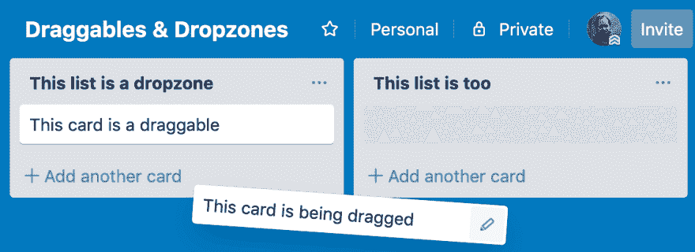
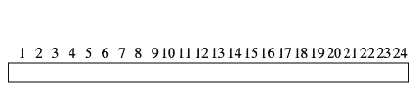
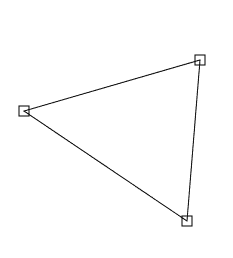
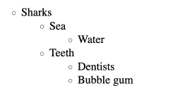

# 不使用 Draggables 和 Dropzones 进行拖放

> 原文：<https://dev.to/noredink/drag-drop-without-draggables-dropzones-2be5>

为什么构建拖放 ui 如此困难？它们已经存在了一段时间，所以我们认为它们是一个已经解决的问题是情有可原的。当然有高质量的库来帮助我们构建拖放 ui，最近我们甚至有了一个官方的 HTML5 拖放 API！这是怎么回事？

我得出的结论是，问题的很大一部分在于我们对工具的选择。Draggables 和 dropzones 通常是错误的抽象，选择不同的工具可以大大简化拖放 ui 的构造。

对于“拖放”这样一个宽泛的术语来说，这是一个相当全面的陈述，所以让我们来看三个没有 draggables 或 dropzones 的拖放 ui 的例子。这些例子来自真实的项目，但是在这篇文章中，我将它们简化为拖放的基本要素。我将在这篇文章中包括我认为最相关的代码片段，并提供完整源代码的链接。

在开始举例之前，让我们先快速回顾一下 draggables 和 dropzones。

## 一个关于 Draggables 的复习& Dropzones

draggable 是当用户按下光标时跟随光标的 UI 元素。dropzone 是一个 UI 元素，当我们在它上面释放一个 draggable 时，它会获得一个事件。

例如，让我们看看应用程序 [Trello](https://trello.com/) 。Trello 允许我们将卡片组织成列表。我们可以把卡片做成可拖动的，把列表做成拖放区。这样，每当一张卡被放在列表中时，我们都会得到一个事件，我们可以用这个事件来更新我们的应用程序的状态和卡的新位置。

[](https://res.cloudinary.com/practicaldev/image/fetch/s--ZtivznQK--/c_limit%2Cf_auto%2Cfl_progressive%2Cq_auto%2Cw_880/https://i.imgur.com/x9lpraW.png)

仔细观察，虽然事情并不清楚。例如，在真正的 Trello 应用程序中，没有必要将一张卡片放在列表的顶部。我们可以把一张卡片放在一些空白的地方，它会移动到列表中离我们放卡片的地方最近的地方。这对用户来说更好，但不清楚如何使用 draggables 和 dropzones 创建这种行为。

## 我们的第一个例子，时隙选择器

我们的第一个例子是选择一天中某个时间段的 UI。这个 UI 将一天表示为一个水平条，我们可以在其中使用拖放来选择一个时间段。

[](https://res.cloudinary.com/practicaldev/image/fetch/s--HGz4jZjs--/c_limit%2Cf_auto%2Cfl_progressive%2Cq_66%2Cw_880/https://i.imgur.com/U0Ft47l.gif)

我想从想象 draggables 和 dropzones 的实现看起来像什么开始这些例子。在第一个例子中，我们甚至不清楚 draggables 和 dropzones 是什么。我们可以将时间滑块设置为可拖动的，因为即使我们没有拖动时间滑块本身，单击其中的任何位置都会启动拖动操作。整个屏幕可以作为一个 dropzone，因为用户应该能够在任何地方释放光标来完成拖动。这种方法已经让人觉得很粗糙了，而且我们还没有写任何代码！

让我们从零开始，不要假设 draggables 或 dropzones。正如我们经常做的那样，我们将通过设计一个模型来开始构建我们的 Elm 应用程序。我们的应用程序需要存储一个时隙，它只不过是开始和结束的时间。

```
-- In this example a time slot always covers whole hours,
-- but we could make this minutes or seconds if we wanted.
type alias Model =
    { selectionStart : Hour, selectionEnd : Hour }

type alias Hour =
    Int 
```

现在我们转向实现拖放行为，没有 draggables 和 dropzones。当用户按下时，我们将光标所在的小时存储为时隙的`selectionStart`字段。然后，随着光标的移动，我们将更新时隙的`selectionEnd`字段，直到用户释放。

在任何时候，我们都需要知道光标在哪个小时。如果我们知道光标的位置以及屏幕上滑块的位置和尺寸，我们就可以计算出这一点。让我们乐观一点，假设我们只是得到了拖动事件的信息。如果是这样，我们可以这样设计我们的`Msg`类型:

```
type alias Msg =
    { event : DragEvent
    , cursor : Coords
    , sliderPosition : Rect
    }

type DragEvent
    = Start
      -- We don't need to do anything special on a Stop event, so we can treat
      -- it the same as a Move event.
    | MoveOrStop

type alias Coords =
    { x : Float, y : Float }

type alias Rect =
    { x : Float, y : Float, width : Float, height : Float } 
```

这个`Msg`中的信息足以计算出光标所在的小时。

```
cursorAtHour : Msg -> Hour
cursorAtHour { cursor, sliderPosition } =
    let
        dx =
            cursor.x - sliderPosition.x

        atMost =
            min

        atLeast =
            max
    in
    (24 * (dx / sliderPosition.width))
        |> floor
        -- Ensure we get a number between 0 and 23, even if the cursor moves to
        -- the left or right of the slider.
        |> atMost 23
        |> atLeast 0 
```

剩下要做的就是在我们的`update`函数中使用`cursorAtHour`。当我们得到一个`Start`事件时，我们用它来更新模型中的`selectionStart`字段，当我们得到一个`MoveOrStop`事件时，更新`selectionEnd`字段。

```
update : Msg -> Model -> Model
update msg model =
    let
        hour =
            cursorAtHour msg
    in
    case msg.event of
        Start ->
            if coordsInRect msg.cursor msg.sliderPosition then
                { selectionStart = hour
                , selectionEnd = hour
                }

            else
                model

        MoveOrStop ->
            { model
                | selectionEnd = hour
            }

coordsInRect : Coords -> Rect -> Bool
coordsInRect =
    Debug.todo "Implementation omitted for brevity." 
```

我们有一个应用程序！嗯，差不多，我们还没有讨论这些`Msg`将来自哪里。这是 JavaScript 的一部分，我稍后会详细介绍。那些想先睹为快的人可以看看[时间滑块源代码](https://ellie-app.com/6gbc3wS5CYVa1)。

## 第二个例子，多边形编辑器

我们的第二个例子是一个编辑多边形的工具。我们希望用户能够选择一个多边形的顶点，并将其移动到其他地方。

[](https://res.cloudinary.com/practicaldev/image/fetch/s--Oq0Ng3Yn--/c_limit%2Cf_auto%2Cfl_progressive%2Cq_66%2Cw_880/https://i.imgur.com/tpsNuZS.gif)

看到那些顶点了吗？那些看起来真像拖布！但是这些顶点很小，很容易被忽略，所以我们希望我们的 draggables 更大。我们可以通过使位于这些顶点中心的`div`元素不可见来实现这一点，但当`div`元素如此接近以至于重叠时，这就给我们带来了麻烦。此时，单击不会选择最近的折点，而是顶部折点。

我们将把这些可拖动的东西放在工具箱里，看看没有它们我们能走多远。像往常一样，我们首先定义一个模型来存储我们正在编辑的多边形。

```
type alias Model =
    { polygon : Polygon
    , draggedVertex : Maybe Id
    }

type alias Polygon =
    Dict Id Coords

type alias Id =
    Int 
```

当用户按下顶点来选择它时，拖动开始。为此，我们需要计算离光标最近的顶点，如果我们知道光标和所有顶点的位置，就可以做到这一点。让我们创建一个包含这些位置的`Msg`类型。我们可以重用前面例子中的`Coords`和`Rect`类型。

```
type alias Msg =
    { event : DragEvent
    , cursor : Coords
    , handlers : List ( Id, Rect )
    }

type DragEvent
    = Start
    | Move
    | Stop 
```

完美！现在我们可以计算用户点击时离光标最近的矩形。

```
closestRect : Coords -> List ( id, Rect ) -> Maybe id
closestRect cursor handlers =
    handlers
        |> List.map (Tuple.mapSecond (distance cursor << center))
        -- Find the vertex closest to the cursor.
        |> List.sortBy Tuple.second
        |> List.head
        |> Maybe.map Tuple.first

center : Rect -> Coords
center =
    Debug.todo "Implementation omitted for brevity"

distance : Coords -> Coords -> Float
distance =
    Debug.todo "Implementation omitted for brevity" 
```

一旦我们找到了用户选择的顶点，我们必须在每个`Move`事件中将它移动到光标处。产生的`update`函数如下所示。

```
update : Msg -> Model -> Model
update { event, cursor, handlers } model =
    case event of
        Start ->
            { model
                | draggedVertex =
                    handlers
                        |> List.filter
                            (\( _, handler ) ->
                                distance cursor (center handler) < 25
                            )
                        |> closestRect cursor
            }

        Move ->
            case model.draggedVertex of
                Just id ->
                    { model | polygon = Dict.insert id cursor model.polygon }

                Nothing ->
                    -- The user is dragging the cursor, but nothing was picked up on the
                    -- start event. We'll sit this one out.
                    model

        Stop ->
            { model | draggedVertex = Nothing } 
```

就这样吧！我再次跳过了生成消息的 JavaScript，我保证我们一会儿就会谈到它。感兴趣的人可以获得完整的[多边形编辑器源代码](https://ellie-app.com/6gbMHDr6SbGa1)！

## 最后一个例子:一个大纲编辑器

我们的最后一个例子是一个大纲编辑器。提纲是一种工具，用于组织我们对一个主题的想法，但是创建一个与想法相关的概念列表，每个概念都有自己相关的想法，等等。下图显示了一个可以使用拖放重新排列的轮廓示例。我们将通过不创建和删除节点来保持我们的范围较小。

[](https://res.cloudinary.com/practicaldev/image/fetch/s--rJOPHNKa--/c_limit%2Cf_auto%2Cfl_progressive%2Cq_66%2Cw_880/https://i.imgur.com/0MuKonT.gif)

我们将首先为我们的大纲编辑器创建一个模型。它需要跟踪两件事:大纲本身和我们正在拖动的节点。

```
type alias Model =
    { outline : List OutlineNode
    , draggedNode : Maybe DraggedNode
    }

type alias DraggedNode =
    -- For simplicity sake we're going to use the node's contents as an id.
    -- We get away with that here because we can ensure the nodes are unique:
    -- the user will not be able to edit them in this example.
    { node : String
    , cursorOnScreen : Coords
    , cursorOnDraggable : Coords
    }

type alias OutlineNode =
    Tree String

type Tree a
    = Tree
        { node : a
        , children : List (Tree a)
        } 
```

现在我们需要为拖动开始、移动和结束事件编写行为。

当用户按下节点时，拖动开始。我们可以在每个节点上放置一个`onClick`处理程序来检测这种情况何时发生。在这篇文章中我们将跳过这个实现，但是它是完整的[大纲编辑器源代码](https://ellie-app.com/6gbMfDjCnH4a1)的一部分！

然后，当用户拖动一个节点时，我们需要更新该节点在大纲中的位置。这部分我们将详细讨论。

最后是拖动停止事件。我们已经在用户移动光标时改变了轮廓，所以这里剩下要做的就是通过将`draggedNode`设置为`Nothing`来将模型改变为非拖动状态。

### 移动轮廓中的节点

最具挑战性的部分是决定用户的意图是什么。他们是打算将拖动的节点移动到另一个节点的前面、后面，还是嵌套在它下面？

使用 dropzones，我们可以在那些当用户移动到它们上面时会激活的位置绘制不可见的框，但是体验不太可能很好。如果盒子太小，用户就不会花太多时间在上面，导致界面大部分时间都没有反应。如果框太大，它们会开始重叠，导致最上面的框接收拖动的节点，即使它不是最近的。即使我们得到了正确的框，未来更新改变页面样式可能会移动框，破坏拖放交互。

让我们忘记 dropzones，想想我们想要的行为。大纲中有候选位置，我们可以在那里放置一个被拖动的节点。当用户移动时，我们希望将拖动的节点显示在离光标最近的位置。为了找出哪个位置最近，我们需要知道它们都在哪里。为此，我们将在 DOM 中每个可以插入拖动节点的位置放置不可见元素。与 dropzones 方法相反，我们不会费心给这些元素任何特殊的尺寸或位置。我们希望他们只是随着页面上的内容流动，并让我们知道他们的位置。这些不是空投区，而是信标。

除了它们在 DOM 中的坐标，我们的信标还需要描述它们在大纲中的位置。信标可以定义它相对于轮廓中另一个节点的位置。

```
type CandidatePosition
    = Before String
    | After String
    | PrependedIn String
    | AppendedIn String 
```

我们将为这种类型创建一个 JSON 编码器，这样我们可以用包含其在大纲中的位置的数据属性来标记每个信标元素。然后，我们将设置 JavaScript 来查找 DOM 中具有这种数据属性的所有元素，并在每次拖动事件时将它们的坐标反馈给我们。这将允许我们为包含屏幕上我们的信标位置的拖动事件定义一个类型。

```
type alias DragMsg =
    { cursor : Coords
    , beacons : List Beacon
    }

type alias Beacon =
    ( CandidatePosition, Rect ) 
```

还记得多边形例子中的`closestRect`函数吗？这就是我们需要找到的最接近光标的`CandidatePosition`！一旦我们知道哪个候选位置是最近的，我们所需要的就是一个函数来将一个节点移动到它在大纲中的新位置。这是一个很难写的函数，但它与 drag & drop 没有太大关系，所以我在这里跳过了实现。我用[大纲编辑器源代码](https://ellie-app.com/6gbMfDjCnH4a1)包含了一个解决方案。对于那些对如何实现这样的数据转换感兴趣的人，我参考了早先[关于转换函数](https://dev.to/jwoudenberg/conversion-functions-five-stars-2l87)的帖子，其中包括一个类似的树操作问题的例子。

## 必要的 JavaScript

我承诺过我会重新研究让这些例子工作所需的 JavaScript。所有三个例子都使用相同的 JavaScript 代码，因为它们有相同的需求。在每个例子中，页面上都有一个或多个 Html 元素，当拖动交互发生时，我们需要跟踪它们的位置和尺寸。我们的 JavaScript 代码需要做的是在鼠标被按下、移动和释放时生成事件，并将我们想要跟踪的所有元素的位置与这些事件捆绑在一起。我们通过给这些元素一个带有“信标 ID”的数据属性来识别它们。

有很多方法来编写这段代码，我不认为我的特别有见地，所以我不会在这里重印它。这些例子的 [draggable.js 源代码](https://gist.github.com/jwoudenberg/38d5f63dcdbb288525f1694f238bd4ed)可供感兴趣的人使用。

## 结论

当我们需要执行一项复杂的任务时，很自然地开始寻找一个库来为我们做繁重的工作。为了构建拖放交互，库为我们提供了 draggables 和 dropzones，但是它们通常不适合拖放 ui，在这篇文章中我们已经看到了三个。

拖放库总是一个坏主意吗？我不这么认为。特别是有专门的拖放部件的库，比如可重新排列的列表，例如 [annaghi/dnd-list](https://package.elm-lang.org/packages/annaghi/dnd-list/latest/) 。尽可能使用它们可以节省大量时间。可能在一些 ui 中，draggables 和 dropzones 正是正确的抽象。如果你遇到了其中的一个，请给我发个短信，我很想了解一下！拖拽&覆盖了令人难以置信的广泛的功能，所以通常没有现成的解决方案。对于那些人，我会认真考虑 draggables 和 dropzones 是有助于构建 UI 还是会使它更难。

如果你建立自己的拖放行为，我推荐使用“信标元素”。这些是被标记的常规 DOM 元素，因此我们可以在每次拖动事件中访问它们的位置。因为信标元素不需要*做*任何事情，任何使用任何定位策略的元素都可以是信标。这种被动的性质将信标与 draggables 或 dropzones 区分开来，这两者都包括行为。

我展示了构建拖放 ui 的不同方法。在这种方法中，我们订阅告诉我们 DOM 中发生了什么的拖放事件，根据这些事件更新模型的状态，最后更新屏幕以反映模型的新状态。这无非是榆树建筑。我希望这篇文章中的例子表明编写拖放逻辑并不是一项艰巨的任务。

感谢 Ary、Blake、Brian 和 Stö ffel 对草稿的评论！