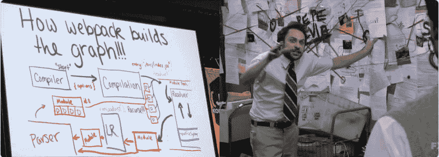
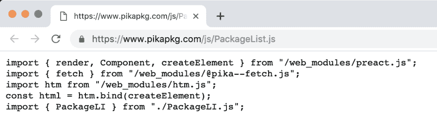

# 没有 Webpack 的未来

> 原文：<https://dev.to/pika/a-future-without-webpack-ago>

*注:这篇文章最初发表于 [pika.dev](https://www.pika.dev/blog/pika-web-a-future-without-webpack) 。*

那是 1941 年。你叫理查德·哈贝尔。你在哥伦比亚广播公司旗下的纽约实验电视演播室工作。你将要做世界上第一个主要的电视新闻广播，有 15 分钟的播放时间。你是做什么的？

在一个只知道无线电的世界里，你坚持你所知道的。也就是你看新闻。“大多数(电视)新闻节目都以哈伯尔朗读剧本为特色，只是偶尔会有地图或静态照片的剪影。”再过一段时间，才会有人在电视新闻中播放真实的视频片段。

[](https://res.cloudinary.com/practicaldev/image/fetch/s--ZlgCVJz1--/c_limit%2Cf_auto%2Cfl_progressive%2Cq_auto%2Cw_880/https://thepracticaldev.s3.amazonaws.com/i/mrekui9j5l9de37smh9b.jpg)

作为 2019 年的 JavaScript 开发人员，我可以理解。我们有了这个新的 JavaScript 模块系统 [(ESM)](https://flaviocopes.com/es-modules/) ，它在网络上本地运行。然而，我们继续使用捆扎机来完成我们建造的每一件东西。为什么？

在过去的几年里，JavaScript 捆绑已经从一个仅用于生产的优化变成了大多数 web 应用程序的一个必需的构建步骤。不管你喜欢它还是讨厌它，都很难否认 bundlers 给 web 开发增加了大量新的复杂性——这是一个一直以其观点来源、易于上手的特质而自豪的开发领域。

@pika/web 是将 web 开发从 bundler 要求中解放出来的一种尝试。**2019 年，你应该用捆扎机，因为你想用，而不是因为你需要用。**

<figure>

[](https://res.cloudinary.com/practicaldev/image/fetch/s--AAsetzkD--/c_limit%2Cf_auto%2Cfl_progressive%2Cq_auto%2Cw_880/https://thepracticaldev.s3.amazonaws.com/i/cm7c1to4rr2eq48x6ffe.png)

<figcaption>[Credit: @stylishandy](https://twitter.com/stylishandy/status/1105049564237754373)</figcaption>

</figure>

## 我们为什么捆绑

JavaScript 捆绑是对一个旧概念的现代诠释。回到过去(lol ~6 年前),在生产中将 JavaScript 文件缩小并连接在一起是很常见的。这将加速你的站点，并绕过 HTTP/1.1 的 2+并行请求瓶颈。

这种不错的优化是如何成为绝对的开发需求的？嗯，这是最疯狂的部分:大多数 web 开发人员从来没有明确要求捆绑。相反，我们得到了捆绑作为其他东西的副作用，一些我们非常想要的东西: **npm。**

NPM——当时代表“Node.js 包管理器”——正在成为有史以来最大的代码注册中心。前端开发者想要参与其中。唯一的问题是它的 Node.js 风格的模块系统(Common.js 或 CJS)如果不捆绑就不能在网上运行。于是 Browserify、 [Webpack](https://webpack.js.org) 和现代 web bundler 都诞生了。

<figure>

[](https://res.cloudinary.com/practicaldev/image/fetch/s--nv7HJKEB--/c_limit%2Cf_auto%2Cfl_progressive%2Cq_auto%2Cw_880/https://www.pika.dev/static/img/bundling-cra-graph-2.jpg)

<figcaption>[Create React App visualized:](https://npm.anvaka.com/#/view/2d/react-scripts) 1,300 dependencies to run "Hello World"</figcaption>

</figure>

## 复杂性斯德哥尔摩综合症

今天，如果不使用像 [Webpack](https://webpack.js.org) 这样的捆绑器，几乎不可能为 web 构建。希望您使用类似 [Create React App (CRA)](https://facebook.github.io/create-react-app/) 这样的东西来快速入门，但即使这样也会安装一个复杂的 200.9MB `node_modules/`目录，其中包含 1300 多个不同的依赖项，仅仅是为了运行“Hello World！”

像理查德·哈贝尔一样，我们都沉浸在这个 bundlers 的世界里，很容易忽略事情会有什么不同。我们现在有这些伟大的现代 ESM 依赖项[(NPM 上有近 50，000 个！)](https://dev.to/about/stats)。是什么阻止我们直接在网上运行它们呢？

嗯，有几件事。😕自己编写 web 原生 ESM 代码足够简单，确实有些没有依赖关系的 npm 包可以直接在 web 上运行。不幸的是，大多数人仍然无法参选。这可能是由于软件包本身的传统依赖关系，或者 npm 软件包按名称导入依赖关系的特殊方式。

这也是@pika/web 被创建的原因。

## @pika/web:没有捆绑器的 web 应用

## /[积雪场](https://github.com/pikapkg/snowpack)

### 现代 web 应用的近乎即时的构建工具。

<article class="markdown-body entry-content container-lg" itemprop="text">

[](https://github.com/pikapkg/snowpack/actions)

### 什么是积雪场？

Snowpack 是一个用于 web 应用程序开发的现代轻量级工具链。传统的开发捆绑软件，如 webpack 或 package，需要在每次保存单个文件时重建&重新捆绑整个应用程序。这在更改文件和在浏览器中看到这些更改之间引入了延迟，有时会慢到几秒钟。

Snowpack 解决了这个问题，它为开发中的应用**提供服务。**任何时候你改变一个文件，Snowpack 从来不会重建一个以上的文件。没有捆绑可言，只有几毫秒的单个文件重建，然后通过 HMR 在浏览器中即时更新。我们称这种新方法为 **O(1)构建工具。**你可以在我们的 [Snowpack 2.0 发布帖中了解更多信息。](https://www.snowpack.dev/posts/2020-05-26-snowpack-2-0-release/)

当您准备好向用户部署您的 web 应用程序时，您可以添加回一个传统的捆绑器，如 Webpack 或 package。有了 Snowpack，您…

</article>

[View on GitHub](https://github.com/pikapkg/snowpack)

[@pika/web](https://github.com/pikapkg/web) 安装现代 npm 依赖项的方式是让它们在浏览器中本地运行，即使它们本身也有依赖项。就是这样。它不是一个构建工具，也不是一个捆绑器(无论如何，从传统意义上来说)。@pika/web 是一个依赖安装时工具，它可以让你极大地减少对其他工具的需求，甚至完全跳过 [Webpack](https://webpack.js.org) 或 [Parcel](https://parceljs.org/) 。

```
npm install && npx @pika/web
✔ @pika/web installed web-native dependencies. [0.41s] 
```

@pika/web 检查您的`package.json`清单中是否有导出有效 ESM“模块”入口点的`"dependencies"`，然后将它们安装到本地的`web_modules/`目录中。@pika/web 适用于任何 ESM 包，甚至是具有 ESM & Common.js 内部依赖项的包。

已安装的软件包在浏览器中运行，因为@pika/web 将每个软件包捆绑到一个 web 可用的 ESM `.js`文件中。例如:整个“preact”包被安装到`web_modules/preact.js`。这处理了包可能在内部做的任何不好的事情，同时保留了原始的包接口。

*“啊哈！”你可能会说。 *[“那只是在异地隐藏捆绑！”](https://twitter.com/TheLarkInn/status/1102462419366891522)**

**完全正确！** @pika/web 在内部利用捆绑来输出 web 原生 npm 依赖项，这是我们许多人最初开始使用捆绑器的主要原因！

有了@pika/web，捆绑器的所有复杂性都被内化到了一个单独的安装时工具中。如果你不想的话，你永远都不需要接触 bundler 的其他配置。但是当然，你可以继续使用你喜欢的任何其他工具:增强你的开发体验( [Babel](https://babeljs.io/) ， [TypeScript](https://www.typescriptlang.org) )或者优化你在产品中的发布方式( [Webpack](https://webpack.js.org) ， [Rollup](https://rollupjs.org/) )。

这就是@pika/web: Bundle 的全部意义，因为你想要，而不是因为你需要。

<figure>

[](https://res.cloudinary.com/practicaldev/image/fetch/s--y4-VStZ6--/c_limit%2Cf_auto%2Cfl_progressive%2Cq_auto%2Cw_880/https://www.pika.dev/static/img/bundling-view-source.png)

<figcaption>["view-source" is back!](https://www.pika.dev/js/pages/SearchPage.js)</figcaption>

</figure>

## 表现

以这种方式安装每个依赖项(作为单个 JS 文件)比大多数 bundler 设置有一个很大的性能提升:依赖项缓存。当您将所有的依赖项捆绑到一个大的`vendor.js`文件中时，更新一个依赖项会迫使您的用户重新下载整个包。相反，使用@pika/web，更新单个包不会破坏用户缓存的其余部分。

@pika/web 将您从 bundlers 推出的这一整类性能 footguns 中拯救出来。[捆绑包中的重复代码](https://formidable.com/blog/2018/finding-webpack-duplicates-with-inspectpack-plugin/)、[由于未使用/无关的代码导致首页加载缓慢](https://medium.com/webpack/better-tree-shaking-with-deep-scope-analysis-a0b788c0ce77)、[web pack 生态系统升级中的问题和缺陷](https://medium.com/@allanbaptista/the-problem-with-webpack-8a025268a761)...整篇文章和工具都致力于解决这些问题。

需要说明的是，不捆绑应用程序源代码也不完全是阳光和玫瑰。大型 JavaScript 文件确实比更小、更细粒度的文件压缩得更好。虽然多个较小的文件在 [HTTP/2](https://developers.google.com/web/fundamentals/performance/http2/#request_and_response_multiplexing) 上加载得一样好，但是浏览器在进行后续的导入请求之前会浪费解析时间。

这一切都归结于性能、缓存效率和您能接受的复杂度之间的权衡。再说一遍，这就是@pika/web 的全部要点:添加捆绑器是因为它对您的情况有意义，而不是因为您没有其他选择。

[](https://res.cloudinary.com/practicaldev/image/fetch/s--fxeYMo41--/c_limit%2Cf_auto%2Cfl_progressive%2Cq_auto%2Cw_880/https://www.pika.dev/static/img/bundling-legos.jpg)

## 鼠兔网络应用策略

@pika/web 彻底改变了我们的 web 开发方式。以下是我们用来构建 [pika.dev](https://dev.to/) 的过程，以及我们如何建议你在 2019 年构建下一个 web 应用:

1.  对于新项目，跳过捆绑器。使用现代 ESM 语法编写应用程序，并使用@pika/web 安装在 web 上本地运行的 npm 依赖项。不需要工具。
2.  在进行过程中添加工具。如果你想要一个类型系统，添加 [TypeScript](https://www.typescriptlang.org) ，如果你想要使用实验性的 JavaScript 特性，添加 [Babel](https://babeljs.io/) ，如果你想要 JSmini 化，添加 [Terser](https://github.com/terser-js/terser) 。6 个多月过去了， [pika.dev](https://dev.to/) 依然愉快地处于这个阶段。
3.  当您觉得有必要并且有时间时，可以尝试为您的应用程序源代码添加一个简单的捆绑器。性能测试一下吧。第一页加载速度更快吗？第二页加载？如果有，出货！
4.  随着应用的增长，不断优化 bundler 配置。
5.  当你有足够的钱，请一个网络包专家。恭喜你！如果你有足够的资源雇佣一个网络包专家，你就正式成功了。