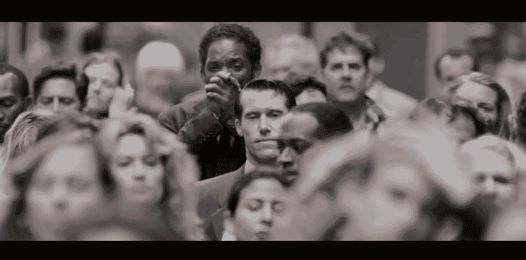

# 简单的事情很重要！

> 原文：<https://dev.to/chintukarthi/simple-things-do-matter-395k>

想象力。这个术语是多么强大。

你有没有从不同寻常的角度思考问题？类似于代码中的边缘情况？好吧，让我把范围缩小一点，让它更有意义。

->想象你走在你的头脑被完全占据的路上。

当你向你想去的目的地迈出一步时，比如说你的家。有一只蚂蚁领先你一步，有着和你几乎一样的故事，想要到达它的家。你们两个思想不同，生活也不同。对你来说，一只实际上并不存在的蚂蚁的生活可能是一个笑话。对于蚂蚁来说，你是一个巨人(双关语)的生活可能会断章取义。但不知何故你们会有交集。你将要采取的下一步可能会粉碎蚂蚁的希望。
好的。在我们考虑另一种情况时，请坚持这个想法。

->想象你正在看一部电影，你非常喜欢这部电影，因为你最喜欢的男女主角是主角，你不想错过他们在电影中的任何一个镜头。

有没有考虑过关注边上人物(不那么重要的人物)而不是主角？
引用这句话，我想分享《追求幸福》中的一个场景。我希望你们都知道并喜欢这个场景。
 
但是我要你看看威尔·史密斯面前的这个人。他在这部电影中扮演什么角色？我敢打赌，我们大多数人都没有注意到这一点，因为我们在电影中的这一点上与威尔·史密斯有情感上的联系，从来没有注意过这种情况。他是电影的一部分，但除了提供完美的电影体验，让观众不会感到奇怪之外，他没有扮演任何角色。相反，他们可以将这个场景与一个走在街上的人的日常生活联系起来。

我可以接受许多情景，但为了长话短说，我想就此打住。

第一个例子中的蚂蚁，你可能会遇到，有 50%的可能性，蚂蚁可能会死，但你永远不会意识到，因为你戴着耳机在手机里听泰勒·斯威夫特的最新歌曲。

就威尔·史密斯的角色而言，他对你来说是不存在的。但是，他也有自己的生活，他是自己故事的主角，谁知道威尔·史密斯可能是他电影中的配角。😅

那么我们为什么要关注生活中所有这些简单的事情呢？

因为简单的事情蕴含着很多意义，可能会改变我们的视角。所以下次当你走在路上或看你最喜欢的角色的电影时，记住，
**简单的事情很重要！**