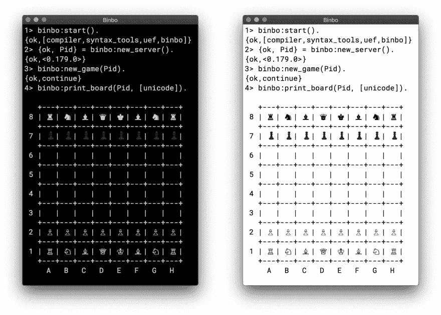

# 二郎，国际象棋和棋盘。预计有一天会出现的应用程序

> 原文：<https://dev.to/dobro/erlang-chess-and-bitboards-the-application-that-was-supposed-to-appear-one-day-22ni>

我发现没有用 Erlang 写的象棋表示。于是，我写了**宾博**。

[](https://res.cloudinary.com/practicaldev/image/fetch/s--f-2cSUdi--/c_limit%2Cf_auto%2Cfl_progressive%2Cq_auto%2Cw_880/https://thepracticaldev.s3.amazonaws.com/i/8ecq4mukdp61gs7vzd1w.png)

Binbo 是一个用纯 Erlang 语言编写的象棋程序，使用了 T2 的 Bitboards。它的基本目标是用于人们在线下棋的游戏服务器。

之所以称之为`Binbo`，是因为它的基础是一个 **bin** ary **bo** ard，只包含*0*和*1*(`0`和`1`)，因为这是 Bitboards 作为内部棋盘表示的主要意义。

宾博也使用[魔法位板](https://www.chessprogramming.org/Magic_Bitboards)的方法进行**闪电般的**移动一代滑动棋子(车、主教和女王)。

**注意:**这不是一个象棋引擎，但它可能是一个很好的起点。它可以为运行在分布式 Erlang 节点上的多个象棋引擎扮演核心角色(关于棋步生成和验证)，因为 Binbo 本身就是一个 OTP 应用程序。

## 特性

*   极快的动作生成和验证。
*   没有瓶颈。每个游戏都是一个 Erlang 进程(`gen_server`)，有自己的游戏状态。
*   能够创建虚拟机中允许的尽可能多的 Erlang 进程并发游戏。
*   支持 [PGN](https://ru.wikipedia.org/wiki/Portable_Game_Notation) 加载。
*   所有的国际象棋规则都包括在内:
    *   [路人移动](https://en.wikipedia.org/wiki/En_passant)；
    *   [阉割](https://en.wikipedia.org/wiki/Castling)；
    *   [五十步走法则](https://en.wikipedia.org/wiki/Fifty-move_rule)；
    *   [三重重复](https://en.wikipedia.org/wiki/Threefold_repetition)；
    *   [缺料拉深](http://www.e4ec.org/immr.html)；
*   在 Erlang shell: ♙ ♘ ♗ ♖ ♕ ♔ ♟ ♞ ♝ ♜ ♛ ♚中对棋盘可视化的 Unicode 国际象棋符号支持
*   UCI 协议支持。
*   跨平台应用。它可以在 Linux、Unix、Windows 和 macOS 上运行。
*   准备在游戏服务器上使用。

## 宾博和魔法棋盘

如上所述，Binbo 使用[魔法位板](https://www.chessprogramming.org/Magic_Bitboards)，这是滑动棋子(车、象和皇后)移动生成的最快解决方案。在[这里](https://stackoverflow.com/questions/16925204/sliding-move-generation-using-magic-bitboard/30862064#30862064)和[这里](http://vicki-chess.blogspot.com/2013/04/magics.html)也可以找到对这种方法的很好的解释。

主要问题是找到索引的*,然后使用它在预先初始化的移动数据库中查找滑动块的合法移动。*指数*的公式为:*

*在 C/C++中:*

```
magic_index = ((occupied & mask) * magic_number) >> shift; 
```

*二郎:*

```
MagicIndex = (((Occupied band Mask) * MagicNumber) bsr Shift). 
```

*其中:*

*   `Occupied`是所有棋子的位棋盘。
*   `Mask`是给定方块的棋子攻击掩码。
*   `MagicNumber`是幻数，参见[寻找幻数](https://www.chessprogramming.org/Looking_for_Magics)。
*   `Shift = (64 - Bits)`，其中`Bits`是对应于给定方块的攻击掩码的位数。

*幻数*和*班次*的所有值都是预先计算好的，并存储在 [binbo_magic.hrl](https://github.com/DOBRO/binbo/blob/master/include/binbo_magic.hrl) 中。

准确地说，宾博使用的是[奇特的魔法位板](https://www.chessprogramming.org/Magic_Bitboards#Fancy)。这意味着所有的移动都存储在一个表格中，每个方块都有自己的大小。在 *C/C++* 中，这样的表实际上是二维数组，任何移动都可以通过简单的查找来访问:

```
move = global_move_table[square][magic_index] 
```

*若详:*

```
moves_from = global_move_table[square];
move = moves_from[magic_index]; 
```

`moves_from`桌子的大小取决于放置它的棋子和方块。例如:

*   对于`A1`上的车，`moves_from`的大小为`4096` (2^12 = 4096，攻击掩码需要 12 位)；
*   对于`A1`上的 bishop，它是`64` (2^6 = 64，攻击掩码需要 6 位)。

Erlang 中没有二维数组，也没有全局变量可以帮助我们从任何地方快速访问移动表**。**

那么，宾伯是如何战胜这一点的呢？嗯，很简单:)。

Erlang 给了我们 tuple*tuple*和 *maps* 的强大功能，通过它们的*索引/键*快速查找*元素/值*。

由于棋盘上的方格数是常量(总是 **64** 对吧？)，我们的`global_move_table`可以构造成一个 64 个元素的*元组*，这个*元组*的每个元素都是一个*映射*，包含*键值*关联为`MagicIndex => Moves`。

*若详，举棋:*

```
GlobalMovesTable = { MoveMap1, ..., MoveMap64 } 
```

*其中:*

```
MoveMap1  = #{
  MagicIndex_1_1 => Moves_1_1,
  ...
  MagicIndex_1_K => Moves_1_K
},
MoveMap64 = #{
  MagicIndex_64_1 => Moves_64_1, ...
  ...
  MagicIndex_64_N => Moves_64_N
}, 
```

然后我们从一个方块开始查找合法的移动，比如说，`E4`(元组的第 29 个元素):

```
E4 = 29,
MoveMapE4   = erlang:element(E4, GlobalMovesTable),
MovesFromE4 = maps:get(MagicIndex, MovesMapE4). 
```

为了计算*魔法指数*，我们还需要给定方块的*攻击面具*。生成的每个*攻击掩码*都存储在一个由 64 个元素组成的*元组*中:

```
GlobalMaskTable = {Mask1, Mask2, ..., Mask64} 
```

其中`Mask1`、`Mask2`、...、`Mask64`是*位板*(整数)。

最后，如果我们需要从`E4` :
得到所有的移动

```
E4 = 29,
Mask = erlang:element(E4, GlobalMaskTable),
MagicIndex = ((Occupied band Mask) * MagicNumber) bsr Shift,
MoveMapE4   = erlang:element(E4, GlobalMovesTable),
MovesFromE4 = maps:get(MagicIndex, MovesMapE4). 
```

接下来，没有全局变量？**我们让他们全球化**！

我们如何最快地从任何地方到达*移动台*和*攻击面具***？**

 **[ETS](http://erlang.org/doc/man/ets.html) ？不要！使用 ETS 作为*静态术语*的存储，我们得到了由于查找期间额外的数据复制而产生的开销。

现在我们来看看最快的解决方案。

当 Binbo 启动时，所有的*移动工作台*被初始化。一旦这些表(*元组*，实际上)被初始化，它们就被“注入”到在 Binbo start 编译的**动态生成模块中。然后，为了获取这些值，我们只需调用一个 *getter 函数* ( `binbo_global:get/1`),将参数作为相应动态模块的名称。**

这个令人敬畏的技巧在 MochiWeb 库中使用，参见模块 [mochiglobal](https://github.com/mochi/mochiweb/blob/master/src/mochiglobal.erl) 。

使用 [persistent_term](http://erlang.org/doc/man/persistent_term.html) (从 OTP 21.2 开始)存储静态数据也是一个好主意。但是对于动态模块来说，这似乎不是一个更好的方法，原因如下。当宾博停下来时，它把它们**卸下**，因为它们不再需要了。它应该对`persistent_term`数据做类似的事情，比如说，删除所有*未使用的项*来释放内存。在这种情况下，我们会遇到在所有进程中扫描*堆*的问题。

因此，使用带有大量静态数据的动态模块似乎更合理，尽管由于这些模块的运行时编译，它会显著降低应用程序的启动速度。**