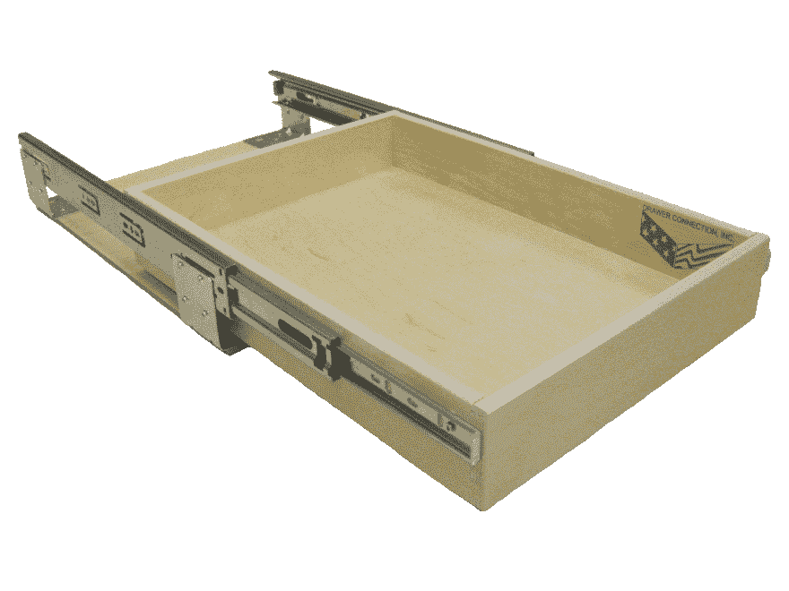
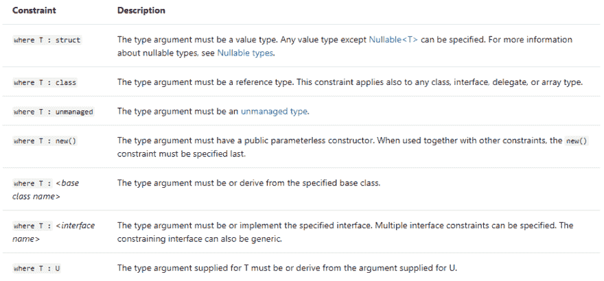

# C#泛型类型约束快速浏览

> 原文：<https://dev.to/daneb/quick-tour-of-c-generic-type-constraints-3l5h>

[上次](https://dev.to/daneb/quick-tour-of-generics-in-c-2fea)我们看了一些泛型的基础知识。让我们进一步了解泛型，并考虑类型约束。

> *类型约束*是对泛型使用的类型的限制。

```
public class AGenericClass<T> where T : IComparable<T> { } ...
public class UsingEnum<T> where T : System.Enum { } ...
public class GenericList<T> where T : Employee ... 
```

约束通过限制类型参数来通知编译器类型参数必须具有的功能。如果没有任何约束，类型参数可以是任何类型。对泛型*施加约束增加了受约束类型及其继承层次结构*中所有类型支持的操作和方法调用的数量。

### 澄清

所以如果我有一个木制抽屉，它几乎可以放任何东西。事实上，很可能很难把东西整理好，放回原处。并且随着抽屉的不断打开和关闭，人们也不太可能有效地取出他们的纸张、钢笔、尺子、订书机等。
[](https://res.cloudinary.com/practicaldev/image/fetch/s--UcYvLhP3--/c_limit%2Cf_auto%2Cfl_progressive%2Cq_auto%2Cw_880/http://www.stevesshelves.com/wp-content/uploads/2012/06/Logo.png) 
但是假设我们有一个用内层木头分隔的抽屉。突然间，事物有了自己的位置，并且在访问方面更加结构化。这就是类型约束的作用。它们施加限制，为泛型类型提供更人性化和更安全的接口- < T >。

[](https://res.cloudinary.com/practicaldev/image/fetch/s--hP9Pks8n--/c_limit%2Cf_auto%2Cfl_progressive%2Cq_auto%2Cw_880/https://raw.githubusercontent.com/daneb/dev.to/master/7constraints.png)

在使用泛型时，有 7 个约束可以考虑，所以让我们回顾几个来了解如何使用它们。

### 值类型约束

```
where T : struct 
```

这将类型参数约束为一个值，而不是引用类型。
什么是*有效*的例子:

*   投票数
*   UploadedFiles

*无效*的例子:

*   交换<object>*   报告内容

    ### 引用类型约束

    ```
    where T : class 
    ```

    这将类型参数约束为引用类型，而不是值类型。
    例子只是我们刚刚在**值类型约束**中看到的相反情况。也就是说，类型参数< T >可以是任何类、接口、数组或委托。

    ### 构造函数类型约束

    ```
    where T : new() 
    ```

    这将类型参数约束为具有一个公共的无参数构造函数。

    *snip 摘自 [C#深度](https://csharpindepth.com/)*

    ```
    public T CreateInstance<T>() where T : new()
    {
       return new T();
    } 
    ```

    这个方法返回您指定的任何类型的一个新实例，当然受到类型在其构造函数中不能有参数这一事实的约束。当使用[工厂方法设计模式](https://sourcemaking.com/design_patterns/factory_method)时，这是一个有用的约束。

    ### 样本使用界面约束</object>