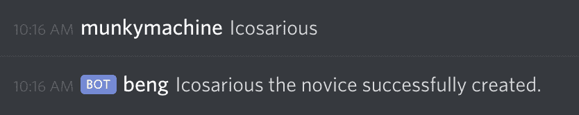
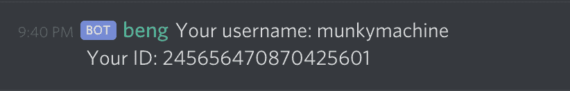
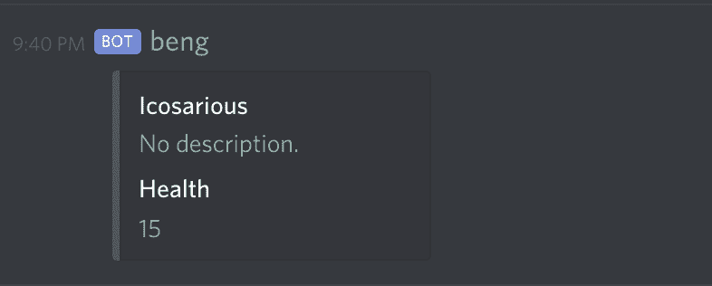

# 战斗引擎开发日志#1 -简介

> 原文：<https://dev.to/kamajigames/battle-engine-devlog-1-introduction-9i4>

在这第一篇 devlog 帖子中，我想介绍一下战斗引擎，简称为 *beng* ，一个冒险游戏 discord bot。

基于很久以前的一个游戏，复活后带回了一个基于文本的，类似流氓的地牢爬虫，你可以和你的朋友一起玩。

设置游戏时，每个人都需要一个用户和一个角色，
,您可以用下面的命令创建它:

```
.beng create 
```

然后你会收到来自 beng 的 DM，询问你想给你的角色取什么名字。

[](https://res.cloudinary.com/practicaldev/image/fetch/s--R81DUEvL--/c_limit%2Cf_auto%2Cfl_progressive%2Cq_auto%2Cw_880/https://thepracticaldev.s3.amazonaws.com/i/y3k35w5hlt7y3yl9wnkx.png)

提供您想要的角色名称将创建一个用户和角色。

[](https://res.cloudinary.com/practicaldev/image/fetch/s--0KC96woL--/c_limit%2Cf_auto%2Cfl_progressive%2Cq_auto%2Cw_880/https://thepracticaldev.s3.amazonaws.com/i/8wg5mhoch2aflr7n2tqz.png)

要检查用户状态，

```
.beng user-info 
```

[](https://res.cloudinary.com/practicaldev/image/fetch/s--EKL-ppod--/c_limit%2Cf_auto%2Cfl_progressive%2Cq_auto%2Cw_880/https://thepracticaldev.s3.amazonaws.com/i/0r2d2jnva9fxgfy5o0lv.png)

要检查角色状态，

```
.beng info 
```

[](https://res.cloudinary.com/practicaldev/image/fetch/s--4KUPR6pP--/c_limit%2Cf_auto%2Cfl_progressive%2Cq_auto%2Cw_880/https://thepracticaldev.s3.amazonaws.com/i/ham0s4g78xo7xcjmx7vl.png)

接下来，还可以查看可用命令的完整列表:

```
.beng help 
```

下一篇博客，我将开始一次冒险并邀请你的朋友。

《战斗引擎》由创作者杰夫·塞科德(布拉什科)和马特·帕克(芒克机器)为您带来。

来和我们打声招呼吧！[加入战斗引擎不和](https://discord.gg/cG2ReFR)。

想帮忙或报告一个错误？查看当前问题，并在 GitLab 上为 [Battle Engine 投稿。欢迎所有技能和经验水平，无论是内容写作，艺术，发展，或只是想法！](https://gitlab.com/kamajigames/battle-engine)