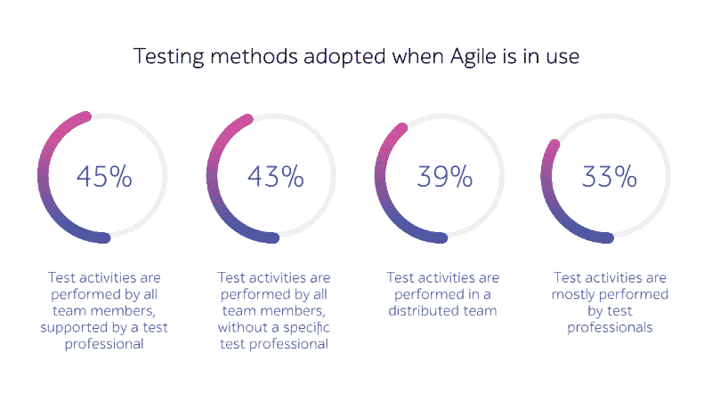
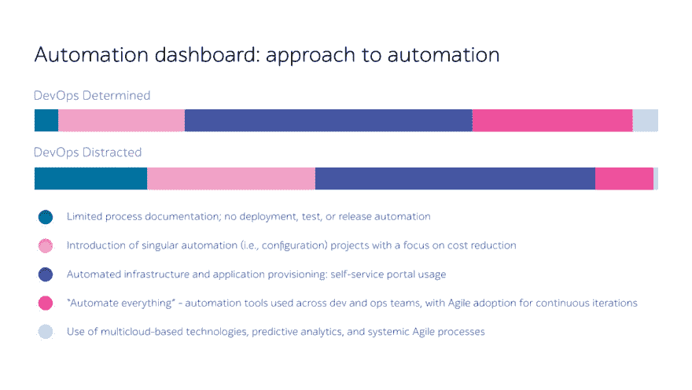

# 通过 DevOps 获得更多价值:测试自动化中不断发展的角色

> 原文：<https://dev.to/a1qa_testing/get-more-value-with-devops-the-evolving-role-in-test-automation-4jgc>

在过去的十年中，全球和各垂直行业的公司都实施了开发运维及敏捷方法，以推出能够满足消费者需求的完美解决方案。

现在不再需要采用 DevOps 实践，相反，重点是完善这种方法并不断提高这一过程的效率。大多数企业希望改进交付流程，并在生产过程中提供稳定性和安全性。

这种方法不可逆转地导致了测试自动化到 CI/CD 管道中的集成，加速了反馈，并改善了团队之间的协作。

在本文中，我们将简要关注测试自动化在 DevOps 中的作用，从最佳 SDLC 模型的讨论转移到该方法的持续过程。

## 瀑布模型与混合模型

不久以前，企业曾经完全基于经典的瀑布模型开发他们的解决方案，在开发阶段之后进行检查。

让我们解释一下为什么这种情况不会总是发生。假设您计划构建一个庞大的计费解决方案，该解决方案至少有 1000 个子系统，并且每个月都会发布一个新版本。这意味着您必须测试系统，并确保一切工作顺利(包括所有 1，000 个子系统)。

但是如果你在一周前增加了一个新的功能会怎么样呢？现在，您必须检查整个软件，这可能需要几周、几个月甚至更长时间。

诸如此类的例子表明，如今，对于使开发过程更快、更清晰、更可控的有意义的方法有着巨大的需求，DevOps(以及 [Agile](https://www.a1qa.com/blog/understanding-agile-testing-6-questions-answered/) )就是其中之一。

根据 2018-19 年世界质量报告(WQR ),公司正在采用最好的敏捷方法，并将它们与瀑布模型优势(例如，总项目范围的清晰定义和文档)相结合，以建立一种方便的混合方法。它允许项目管理办公室改善长期项目的结果，并更有效地应对风险和不确定性。

*来源:[https://www . capgemini . com/service/world-quality-report-2018-19/](https://www.capgemini.com/service/world-quality-report-2018-19/)*

按照 WQR，组织测试职责的方法(在敏捷和非敏捷之间)表明混合模型对大多数公司来说是更好的。

## 下定决心，但不要分心

本文中我们要强调的是 [DevOps 练习](https://www.a1qa.com/blog/how-devops-is-changing-software-testing/)。现在这种方法的使用越来越多，每个人都可以看到它带来的价值。

*来源:[https://www . Gartner . com/smarterwithgartner/8-steps-to-get-devo PS-right](https://www.gartner.com/smarterwithgartner/8-steps-to-get-devops-right)*

简单地从应用程序代码开发开始，在 DevOps 管道的所有阶段实现自动化是极其重要的。

IDC 关于 DevOps 的最新报告证明了这一趋势。超过四分之一的 DevOps 确定的组织(这些统计数据基于最近对 420 家大型欧洲企业的研究)持有“自动化一切”的态度。

*来源:[https://www . micro focus . com/en-us/assets/application-delivery-management/the-journey-to-being-devo PS-determined](https://www.microfocus.com/en-us/assets/application-delivery-management/the-journey-to-becoming-devops-determined)*

在 DevOps 环境中，主要目标是在保证质量的情况下以更快的速度交付应用程序。这种方法正在迅速改变公司使用连续应用程序更新进行软件开发的方式。

DevOps 包含了四个基本的正在进行的过程:**持续交付、持续测试、持续集成和持续监控。**

手动检查模式会显著降低流程速度。为了获得 DevOps 实践的全部好处，组织必须平稳地将测试自动化集成到他们的 CI/CD 管道中。这几乎是确保高频率发布并符合“高质量高速度”范例的唯一方法。

在这种情况下，企业获得的好处是多方面的:维护和升级的成本降低，过程的标准化，将孤立的团队(开发、QA 和操作)聚集在一起，等等。

## 关于持续测试要知道什么

现在让我们仔细看看在 DevOps 工作中通常实现的技术，我们认为这些技术是最重要的。

*   **连续交付(CD)** 是一种技术实践，用于缩短开发周期，降低发布的风险和成本，并在任何给定的时刻提供软件调整。

由于连续测试(CT)的存在，CD 成为可能。

*   **持续测试**是执行频繁而彻底的检查的过程，旨在降低整个 SDLC 中的业务风险。

CT 很大程度上依赖于测试自动化(因为它是交付管道的一个基本部分)，但又不同于 it。

为了使连续测试实践提高整体产品质量，必须构建四个支柱来支持它:确保代码质量，确定代码可以在没有人工干预的情况下通过环境，确保创建的功能是正确的，以及最后，确保交付最佳的用户体验。

理解自动化本身并不能实现测试的连续性，但是它有助于评估风险并降低风险，这一点很重要。持续测试将应用程序变成了一个可持续交付的应用程序，因为所做的调整可以在任何给定的时刻可靠地部署。

*   **持续监控**用于评估软件在生产中运行时的健康状况。

通过实时收集、排序和分析日志和指标，人们可以了解应用程序的修改和更新如何影响软件产品的客户体验。通过持续监控，您可以主动控制服务，减轻风险问题，找到问题的根源，并采取纠正措施。

通过使用所有这些概念，QA 工程师可以在早期 SDLC 阶段发现缺陷(修复成本相对较低)——这有助于减少与交付时间表相关的问题。

## 结果

DevOps 方法已经成为许多希望提供卓越客户体验和实现其他多用途业务价值的企业的常见做法。

为了实现这些目标，人们必须理解测试自动化在工作中的作用。[选择可以无缝集成到项目中的最优测试自动化解决方案](https://www.a1qa.com/services/testing_automation/)，保持发布周期短，持续得到反馈，组织团队的进度，得到预期的结果甚至更多！