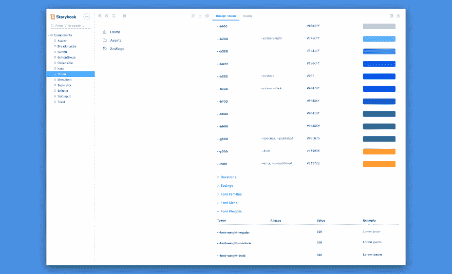

# 使用故事书管理设计令牌

> 原文：<https://dev.to/psqrrl/managing-design-tokens-using-storybook-5975>

**TL；DR:** 我建立了一个[故事书插件，从你的样式表和资产文件中生成设计令牌文档](https://github.com/UX-and-I/storybook-design-token)。

**查看这里的演示:**【https://storybook-design-token.netlify.com/ T2】

作为一名前端开发人员，我构建了许多 ui 组件库，使产品团队能够根据底层设计系统构建软件。在这样做的时候，我的一个主要问题就是保持设计和开发的同步。将设计语言翻译成代码是一个持续的过程，在设计系统的整个生命周期中会有设计变更，在我的情况下，设计语言很可能以各种草图文件的形式交付。

为了缩小设计和开发之间的差距，我喜欢评估将尽可能多的设计系统文档转移到浏览器中的方法，并为设计系统的关键部分创建单点真理。这意味着超越 ui 组件，深入研究底层设计语言。虽然像 Sketch 和 Figma 这样的工具对于起草、原型制作和传达软件的外观和感觉非常有用，但它们分散了设计系统的知识，使得查找和访问这些信息更加困难。让它们更接近实际的产品(即代码)有助于维护一个活的文档，减少过时的风险。

## 设计令牌

虽然组件为我们的产品提供了构建模块，但设计令牌定义了一组属性，我们可以用它们来塑造组件的外观。典型地，他们定义了像排版，颜色，间隔或者设计系统的图标。看看 [Salesforce 收集的设计令牌](https://www.lightningdesignsystem.com/design-tokens/)来获得一些不错的例子。Brad Frost 最近将[设计符号放在他的原子设计原则](http://bradfrost.com/blog/post/extending-atomic-design/)的上下文中。

从开发人员的角度来看，设计令牌的好处是什么？在大多数情况下，它们可以被描述为变量(例如 css 自定义属性或 sass 变量)和图标文件等资产。

## 用故事书管理设计令牌

Storybook 是一个很好的工具，可以在一个隔离的环境中开发可重用的组件库，同时也可以为使用你的库的产品团队创建简洁的视觉和技术文档。如果您需要构建一个可重用的组件库，我强烈建议您尝试一下。它适用于所有主流的 JavaScript 框架，或者只是普通的 HTML 和 CSS。

### 把代币设计成故事

Storybook 使用故事来描述组件及其不同的状态。这些故事由开发人员以小模板的形式编写，展示组件的示例用法。IBM 的故事书提供了一个包含各种组件的好例子。

我第一次尝试在 Storybook 中加入设计符号是通过手工编写故事，以一些简单的 html 表格的形式列出我们的符号。很快就变得一团糟。我现在不得不在组件样式、草图文件和我的故事之间同步，而不是在我的组件样式和草图文件之间同步令牌。此外，我发现自己经常在设计令牌故事和组件故事之间跳跃，以找到我想要在组件中使用的正确令牌。(故事书一次只给你看一个故事。)

### 介绍[故事书设计令牌插件](https://github.com/UX-and-I/storybook-design-token)

幸运的是，Storybook 为插件开发提供了一个很好的 API，你可以用它来扩充你的故事。有一些很棒的插件可以自动生成组件文档，提供 a11y 测试，显示源代码，以及更多的功能。

与我手动维护的设计令牌故事作斗争，我决定写一个插件，在组件故事旁边显示我们所有的设计令牌，同时也消除了手动维护设计令牌列表的需要。它通过解析 css 或 sass 样式表和资产文件(目前只有 SVG 文件)来生成设计令牌文档，并提供完整的示例。此外，它还允许您使用样式表中的注释将设计标记组织成组。通过这种方式，您还可以定义标记示例应该如何呈现(例如，作为颜色、边框半径、方框阴影等)。下面是一个 css 样式表中带注释标记的小例子。

```
/**
 * @tokens Colors
 * @presenter Color
 */

:root {
  --n0: #fff; /* Optional token description */
  --n100: #fbfbfb;
  --n200: #edeeef;
  --n300: #e4e5e7;
  --primary: var(--n300);  /* --primary will be listed as an alias of --n300 */
}

/**
 * @tokens Border Radius
 * @presenter BorderRadius
 */

:root {
  --border-radius-m: 4px;
  --border-radius-l: 8px;
} 
```

Enter fullscreen mode Exit fullscreen mode

看看[演示](https://storybook-design-token.netlify.com/)看看它做什么，或者查看[回购](https://github.com/UX-and-I/storybook-design-token)更完整的功能列表和使用指南。

[](https://res.cloudinary.com/practicaldev/image/fetch/s--mJswFT_1--/c_limit%2Cf_auto%2Cfl_progressive%2Cq_auto%2Cw_880/https://thepracticaldev.s3.amazonaws.com/i/s64bw0bi0u2c54z27zhx.png)

我真的很想听到你的反馈。你能好好利用这个插件吗？你如何在你的设计系统中处理设计符号？随着其[最新测试版](https://github.com/storybookjs/storybook/issues/7430)，Storybook 引入了更多工具来在浏览器中记录你的设计系统。你是否看到设计成果正在从静态设计工具转向浏览器？