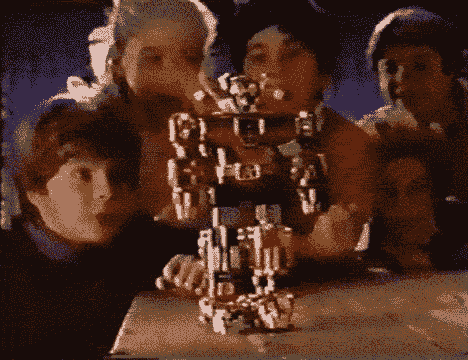

# Marie Kondo 您的带函数的 Javascript 代码

> 原文：<https://dev.to/raddevon/marie-kondo-your-javascript-code-with-functions-45ja>

*上升形态的封面图像*

在本系列的前一篇文章中，[我们探讨了回调函数](https://raddevon.com/articles/javascript-callback-functions/)。如果您已经阅读了整个系列，那么您已经很好地掌握了 Javascript 中的函数，包括它们的用途、如何声明它们以及如何传递它们。

我在之前的一篇文章中提到过，你应该努力争取那些**做一件事情**的函数。在本文中，我将查看我在 Github 上的一些旧代码，看看我们是否可以重构它，以便函数遵循这一原则。首先，让我们看一些案例，在这些案例中，您可能想要重构代码以使用您所了解的函数。

## 何时重构为函数

### 留下来

D.R.Y .是一个重要的软件原则。它代表“不要重复自己。”如果你发现自己在代码中一遍又一遍地重复一个值，那就是使用变量的好时机。如果你发现自己在不同的地方重复了几行代码，那就是你开始执行一个函数的时候了。

不要重复你的代码行，写一个包含相同代码行的函数，并在每次需要时调用它。这使得你的代码更容易阅读，因为你的函数名应该反映代码行的行为。这也使您的代码更容易重构。如果您在代码行中发现一个 bug，您可以在函数中更改它们，现在对函数的每个调用都被修复了。

### 为可读性

考虑使用“for”循环来处理数组中的每一项。名为`movies`的数组的“for”循环将像这样开始:

```
for (var i = 0; i < movies.length; i++) {… 
```

<svg width="20px" height="20px" viewBox="0 0 24 24" class="highlight-action crayons-icon highlight-action--fullscreen-on"><title>Enter fullscreen mode</title></svg> <svg width="20px" height="20px" viewBox="0 0 24 24" class="highlight-action crayons-icon highlight-action--fullscreen-off"><title>Exit fullscreen mode</title></svg>

这对我来说一直是不可思议的。其实并没有传达什么意思。这只是你作为程序员要记住的东西，但是**我讨厌我的程序“可读”的想法，仅仅因为我记住了一些惯例**。除此之外，`i`是一个可怕的变量名，我们被教导要避免它……*除了*在这种情况下，这是习惯。那不适合我。

我更喜欢调用数组的`forEach`方法并传入一个函数。

```
movies.forEach(function(movie) {… 
```

<svg width="20px" height="20px" viewBox="0 0 24 24" class="highlight-action crayons-icon highlight-action--fullscreen-on"><title>Enter fullscreen mode</title></svg> <svg width="20px" height="20px" viewBox="0 0 24 24" class="highlight-action crayons-icon highlight-action--fullscreen-off"><title>Exit fullscreen mode</title></svg>

你仍然需要记住一些东西来写这段代码，但是它比 for 循环更容易阅读和推理你在做什么。作为一个额外的好处，你现在可以在迭代时将每个数组项称为`movie`(因为这是我们给回调函数的参数起的名字),而不是毫无意义的`movies[i]`。

### 当你的功能做得太多的时候

这就是我们今天要看的，所以让我们直接跳到例子中，开始分解这个 Voltron。

[](https://res.cloudinary.com/practicaldev/image/fetch/s--hJx0SzDk--/c_limit%2Cf_auto%2Cfl_progressive%2Cq_66%2Cw_880/https://raddevon.com/wp-content/uploads/2019/07/splitting-voltron.gif)

## 重构胡茨克勒扣豆茎

几年前，当我决定转行的时候，我写了一个猜数字游戏 ( [回购链接](https://github.com/raddevon/huckle-buckle-beanstalk))作为一个训练营的项目。大部分逻辑都被锁在一个名为 compareGuess 的函数中(见第 20 行)，这也是我想要关注的。让我们把它分成几个不同的功能，每个功能有一个单独的职责。

```
// Generate random number for guessing
var number = Math.floor(Math.random()*101);

// Global for previous guess
var previousGuess;

// Global for number of guesses
var numGuesses = 1;

function isNormalInteger(str) {
    return (/^[1-9]\d*$/).test(str);
}

// Checks to see if the guess is within the parameters given
function validGuess(guess) {
    return isNormalInteger(guess) && +guess <= 100 && +guess >= 1;
}

// Compare the guess to the number and previous guess. Place feedback on the page for the player.
function compareGuess(event) {
    event.preventDefault();
    // Grab the guess from the text input field
    var guess = $('#guess').val();

    if (validGuess(guess)) {
        // Turn off any error messages
        $('.error').addClass('off').removeClass('on');

        // Convert guess value to an integer for comparison
        guess = parseInt(guess, 10);
        // Feedback for a correct guess. Show the reset button to start a new game.
        if (guess === number) {
            $('#guess-vs-number').text('You got it! The number was ' + number + '.');
            $('#guess-vs-guess').hide();
            $('#num-guesses').text('You made ' + numGuesses + ' guesses.');
            $('#reset').removeClass('off');
        // Feedback for a low guess
        } else if (number > guess) {
            $('#guess-vs-number').text('Higher than ' + guess);
        // Feedback for a high guess
        } else {
            $('#guess-vs-number').text('Lower than ' + guess);
        }

        // Blank out the guess input field and return focus to it
        $('#guess').val('').focus();
        // Increment number of guesses
        numGuesses++;

        if (previousGuess) {
            // Find distances of the current and previous guesses from the actual number
            var previousDistance = Math.abs(number - previousGuess);
            var currentDistance = Math.abs(number - guess);

            // Feedback for guess versus previous guess comparison
            if (guess === previousGuess) {
                $('#guess-vs-guess').text("Same guess!");
            } else if (currentDistance < previousDistance){
                $('#guess-vs-guess').text("Getting warmer...");
            } else if (currentDistance > previousDistance) {
                $('#guess-vs-guess').text("Getting colder...");
            } else {
                $('#guess-vs-guess').text("Same distance...");
            }
        }
        // Set new previous guess
        previousGuess = guess;

        // Display the response
        $('.response').removeClass('off');
    } else {
        // Give error for invalid guess. Blank out the guess field and return focus.
        $('.error').removeClass('off').addClass('on');
        $('#guess').val('').focus();
    }
}

// Bind a click of the reset button to browser reload
$('#guess-form').on('click', '#reset', function(event) {
    event.preventDefault();
    location.reload();
});

// Bind form submission to the compareGuess function
$('#guess-form').submit(compareGuess);

// Bind enter key to the compareGuess function for browsers that don't always interpret an enter press as a form submission.
$('#guess').keypress(function(e) {
    if (e.which == 13) {
    compareGuess();
    }
}); 
```

<svg width="20px" height="20px" viewBox="0 0 24 24" class="highlight-action crayons-icon highlight-action--fullscreen-on"><title>Enter fullscreen mode</title></svg> <svg width="20px" height="20px" viewBox="0 0 24 24" class="highlight-action crayons-icon highlight-action--fullscreen-off"><title>Exit fullscreen mode</title></svg>

`compareGuess`的前几行实际上是比较猜测的一部分，但是，在我检查第 32 行的猜测是否正确之后，我给出正确的答案反馈，这可能是一个单独的函数。该函数可能如下所示:

```
function showCorrectFeedback() {
  $('#guess-vs-number').text('You got it! The number was ' + number + '.');
  $('#guess-vs-guess').hide();
  $('#num-guesses').text('You made ' + numGuesses + ' guesses.');
  $('#reset').removeClass('off');
} 
```

<svg width="20px" height="20px" viewBox="0 0 24 24" class="highlight-action crayons-icon highlight-action--fullscreen-on"><title>Enter fullscreen mode</title></svg> <svg width="20px" height="20px" viewBox="0 0 24 24" class="highlight-action crayons-icon highlight-action--fullscreen-off"><title>Exit fullscreen mode</title></svg>

我可以在这里做很多重构，比如把正确的答案字符串换成模板字符串，让它看起来更好，但是我没有这么做，因为这段代码是直接在浏览器中运行的，而旧的浏览器不支持 ES6。相反，我将主要关注分解大型函数。

现在，我需要回到这段代码原来的地方，调用新的函数。

```
if (guess === number) {
  showCorrectFeedback();
// Feedback for a low guess
} else if (number > guess) {
  … 
```

<svg width="20px" height="20px" viewBox="0 0 24 24" class="highlight-action crayons-icon highlight-action--fullscreen-on"><title>Enter fullscreen mode</title></svg> <svg width="20px" height="20px" viewBox="0 0 24 24" class="highlight-action crayons-icon highlight-action--fullscreen-off"><title>Exit fullscreen mode</title></svg>

如果你已经在代码中向前看了，你可能能够预测我打算做的下一个重构。我几乎没有将显示低猜测或高猜测反馈的代码移动到它们自己的函数中，因为每一个都是单独的一行，但是为了一致性，我决定这样做。

```
function showLowGuessFeedback(guess) {
  $('#guess-vs-number').text('Higher than ' + guess);
}
function showHighGuessFeedback(guess) {
  $('#guess-vs-number').text('Lower than ' + guess);
} 
```

<svg width="20px" height="20px" viewBox="0 0 24 24" class="highlight-action crayons-icon highlight-action--fullscreen-on"><title>Enter fullscreen mode</title></svg> <svg width="20px" height="20px" viewBox="0 0 24 24" class="highlight-action crayons-icon highlight-action--fullscreen-off"><title>Exit fullscreen mode</title></svg>

我必须改变这两个参数中的一个:我必须添加一个我称为`guess`的参数。我在每个函数中引入的单行代码已经引用了`guess`，但是这种猜测不在这些新函数的范围内。相反，我们必须将猜测传递给反馈函数。我们不必为第一个函数这么做，因为它只显示了`number`，这是一个全局变量。

现在，我将用新的函数调用替换旧的代码。

```
…
} else if (number > guess) {
  showLowGuessFeedback(guess);
// Feedback for a high guess
} else {
  showHighGuessFeedback(guess);
}
… 
```

<svg width="20px" height="20px" viewBox="0 0 24 24" class="highlight-action crayons-icon highlight-action--fullscreen-on"><title>Enter fullscreen mode</title></svg> <svg width="20px" height="20px" viewBox="0 0 24 24" class="highlight-action crayons-icon highlight-action--fullscreen-off"><title>Exit fullscreen mode</title></svg>

对我来说，这两个新功能的问题是它们**有点太相似了**。事实上，除了一个单词，它们完全一样。我想我们可以用一个函数来代替。

我需要传入我想要使用的单词(或者“更高”，或者“更低”)。也许这类词有一个名称，但我不知道。我就称它们为“比较器”

```
function showGuessFeedback(comparator, guess) {
  $('#guess-vs-number').text(comparator + ' than ' + guess);
} 
```

<svg width="20px" height="20px" viewBox="0 0 24 24" class="highlight-action crayons-icon highlight-action--fullscreen-on"><title>Enter fullscreen mode</title></svg> <svg width="20px" height="20px" viewBox="0 0 24 24" class="highlight-action crayons-icon highlight-action--fullscreen-off"><title>Exit fullscreen mode</title></svg>

这意味着，我也需要改变电话。

```
…
} else if (number > guess) {
  showGuessFeedback('Higher', guess);
// Feedback for a high guess
} else {
  showGuessFeedback('Lower', guess);
}
… 
```

<svg width="20px" height="20px" viewBox="0 0 24 24" class="highlight-action crayons-icon highlight-action--fullscreen-on"><title>Enter fullscreen mode</title></svg> <svg width="20px" height="20px" viewBox="0 0 24 24" class="highlight-action crayons-icon highlight-action--fullscreen-off"><title>Exit fullscreen mode</title></svg>

我想重构的下一个代码块在第 50 行。

```
…
if (previousGuess) {
  // Find distances of the current and previous guesses from the actual number
  var previousDistance = Math.abs(number - previousGuess);
  var currentDistance = Math.abs(number - guess);

  // Feedback for guess versus previous guess comparison
  if (guess === previousGuess) {
    $('#guess-vs-guess').text("Same guess!");
  } else if (currentDistance < previousDistance){
    $('#guess-vs-guess').text("Getting warmer...");
  } else if (currentDistance > previousDistance) {
    $('#guess-vs-guess').text("Getting colder...");
  } else {
    $('#guess-vs-guess').text("Same distance...");
  }
}
… 
```

<svg width="20px" height="20px" viewBox="0 0 24 24" class="highlight-action crayons-icon highlight-action--fullscreen-on"><title>Enter fullscreen mode</title></svg> <svg width="20px" height="20px" viewBox="0 0 24 24" class="highlight-action crayons-icon highlight-action--fullscreen-off"><title>Exit fullscreen mode</title></svg>

这段代码不再是检查猜测是否正确；它告诉用户他们是变暖了(他们的猜测比前一个更接近)还是变冷了(他们的猜测比前一个更远)。让我们把它放到一个单独的函数中。

```
function showDistanceFeedback(guess) {
  if (previousGuess) {
    // Find distances of the current and previous guesses from the actual number
    var previousDistance = Math.abs(number - previousGuess);
    var currentDistance = Math.abs(number - guess);

    // Feedback for guess versus previous guess comparison
    if (guess === previousGuess) {
      $('#guess-vs-guess').text("Same guess!");
    } else if (currentDistance < previousDistance){ $('#guess-vs-guess').text("Getting warmer..."); } else if (currentDistance > previousDistance) {
      $('#guess-vs-guess').text("Getting colder...");
    } else {
      $('#guess-vs-guess').text("Same distance...");
  }
} 
```

<svg width="20px" height="20px" viewBox="0 0 24 24" class="highlight-action crayons-icon highlight-action--fullscreen-on"><title>Enter fullscreen mode</title></svg> <svg width="20px" height="20px" viewBox="0 0 24 24" class="highlight-action crayons-icon highlight-action--fullscreen-off"><title>Exit fullscreen mode</title></svg>

我们也许能进一步分解这个，但这已经是一个很大的进步了。现在我们称之为。

```
…
// Blank out the guess input field and return focus to it
$('#guess').val('').focus();
// Increment number of guesses
numGuesses++;

showDistanceFeedback(guess);

// Set new previous guess
previousGuess = guess;
… 
```

<svg width="20px" height="20px" viewBox="0 0 24 24" class="highlight-action crayons-icon highlight-action--fullscreen-on"><title>Enter fullscreen mode</title></svg> <svg width="20px" height="20px" viewBox="0 0 24 24" class="highlight-action crayons-icon highlight-action--fullscreen-off"><title>Exit fullscreen mode</title></svg>

这仍然不是令人惊奇的代码，但是在大多数情况下，每个函数现在都在做一项工作。我们给这些函数起的名字也可以让我们在几个月后回到这段代码时更容易理解这个函数。以下是该应用的所有重构 Javascript:

```
// Generate random number for guessing
var number = Math.floor(Math.random()*101);

// Global for previous guess
var previousGuess;

// Global for number of guesses
var numGuesses = 1;

function isNormalInteger(str) {
    return (/^[1-9]\d*$/).test(str);
}

// Checks to see if the guess is within the parameters given
function validGuess(guess) {
    return isNormalInteger(guess) && +guess <= 100 && +guess >= 1;
}

function showCorrectFeedback() {
  $('#guess-vs-number').text('You got it! The number was ' + number + '.');
  $('#guess-vs-guess').hide();
  $('#num-guesses').text('You made ' + numGuesses + ' guesses.');
  $('#reset').removeClass('off');
}

function showGuessFeedback(comparator, guess) {
  $('#guess-vs-number').text(comparator + ' than ' + guess);
}

function showDistanceFeedback(guess) {
  if (previousGuess) {
    // Find distances of the current and previous guesses from the actual number
    var previousDistance = Math.abs(number - previousGuess);
    var currentDistance = Math.abs(number - guess);

    // Feedback for guess versus previous guess comparison
    if (guess === previousGuess) {
      $('#guess-vs-guess').text("Same guess!");
    } else if (currentDistance < previousDistance){ $('#guess-vs-guess').text("Getting warmer..."); } else if (currentDistance > previousDistance) {
      $('#guess-vs-guess').text("Getting colder...");
    } else {
      $('#guess-vs-guess').text("Same distance...");
  }
}

// Compare the guess to the number and previous guess. Place feedback on the page for the player.
function compareGuess(event) {
    event.preventDefault();
    // Grab the guess from the text input field
    var guess = $('#guess').val();

    if (validGuess(guess)) {
        // Turn off any error messages
        $('.error').addClass('off').removeClass('on');

        // Convert guess value to an integer for comparison
        guess = parseInt(guess, 10);
        // Feedback for a correct guess. Show the reset button to start a new game.
        if (guess === number) {
            showCorrectFeedback();
        // Feedback for a low guess
        } else if (number > guess) {
            showGuessFeedback('Higher', guess);
        // Feedback for a high guess
        } else {
            showGuessFeedback('Lower', guess);
        }

        // Blank out the guess input field and return focus to it
        $('#guess').val('').focus();
        // Increment number of guesses
        numGuesses++;

        showDistanceFeedback(guess);

        // Set new previous guess
        previousGuess = guess;

        // Display the response
        $('.response').removeClass('off');
    } else {
        // Give error for invalid guess. Blank out the guess field and return focus.
        $('.error').removeClass('off').addClass('on');
        $('#guess').val('').focus();
    }
}

// Bind a click of the reset button to browser reload
$('#guess-form').on('click', '#reset', function(event) {
    event.preventDefault();
    location.reload();
});

// Bind form submission to the compareGuess function
$('#guess-form').submit(compareGuess);

// Bind enter key to the compareGuess function for browsers that don't always interpret an enter press as a form submission.
$('#guess').keypress(function(e) {
    if (e.which == 13) {
    compareGuess();
    }
}); 
```

<svg width="20px" height="20px" viewBox="0 0 24 24" class="highlight-action crayons-icon highlight-action--fullscreen-on"><title>Enter fullscreen mode</title></svg> <svg width="20px" height="20px" viewBox="0 0 24 24" class="highlight-action crayons-icon highlight-action--fullscreen-off"><title>Exit fullscreen mode</title></svg>

## 重构你自己的代码

如果您已经阅读了这个 Javascript 函数系列，您应该对函数有足够的了解，可以开始寻找机会通过使用它们来改进您自己的代码。如果你有一些旧代码你已经有一段时间没看了，**通过把它拿出来并使用函数来练习你所学到的东西，这些函数会使你的代码变得更好。**

学习写代码真的很有趣……但是光靠**代码不会让你工作**。😢报名参加**免费辅导会议**🎓在 [Rad Devon](https://raddevon.com/) 如果你想获得帮助，将你所知道的代码转化为实际的职业生涯。💰

## 本系列文章

1.  [你的应用手册:为什么要使用 Javascript 函数](https://raddevon.com/articles/your-apps-playbook-why-use-functions-in-javascript/)
2.  [声明 Javascript 函数](https://raddevon.com/articles/declaring-javascript-functions/)
3.  [了解 Javascript 回调函数](https://raddevon.com/articles/javascript-callback-functions/)
4.  Marie Kondo 您的带函数的 Javascript 代码