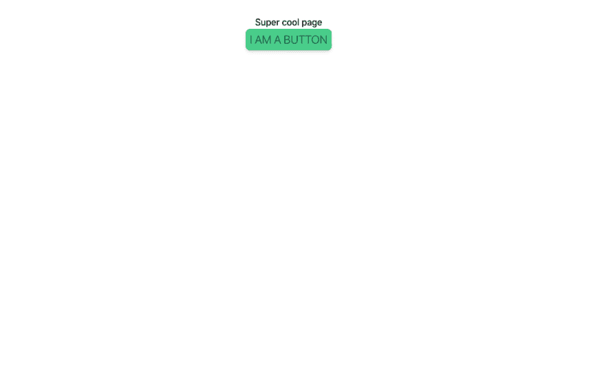
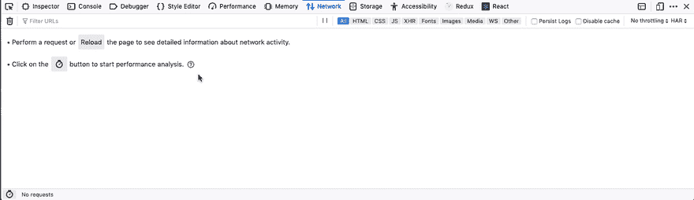
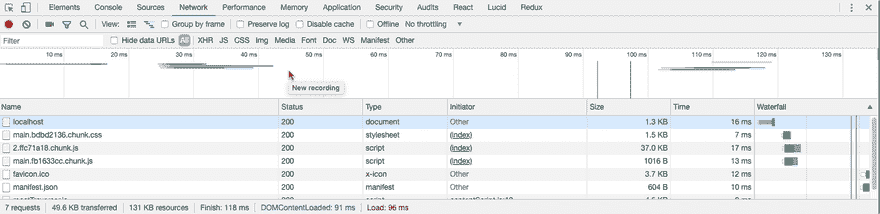

# 使用 create-react-app 设置顺风

> 原文：<https://dev.to/hagnerd/setting-up-tailwind-with-create-react-app-4jd>

## 什么是顺风？

Tailwind 是一个功能性的 CSS 框架，使用起来符合人体工程学，但级别较低，可以完全定制。您可以配置它、添加插件和覆盖默认值。它为您生成 CSS 类名，以便您可以在整个项目中使用它们。

我发现 Tailwind 特别适合开发 React 和 Vue 中的组件。

* * *

## 什么样子？

```
import React from 'react'

export default function Input(inputProps) {
  return (
    <input 
      className="px-2 py-1 text-gray-700 bg-gray-200 rounded-lg shadow-md border-2 border-gray-800 focused:border-blue-400"
      {...inputProps} 
    />
  )
} 
```

<svg width="20px" height="20px" viewBox="0 0 24 24" class="highlight-action crayons-icon highlight-action--fullscreen-on"><title>Enter fullscreen mode</title></svg> <svg width="20px" height="20px" viewBox="0 0 24 24" class="highlight-action crayons-icon highlight-action--fullscreen-off"><title>Exit fullscreen mode</title></svg>

所有这些课程是什么意思？大多数的类应该是不言自明的。`px-2`和`py-1`分别是水平(x)和垂直(y)填充。`2`和`1`是指定尺寸。

默认情况下，Tailwind 会为您生成一组您可以自定义的尺寸。尺寸 1 从`0.25rem`开始，每一步尺寸增加`0.25rem`。

类的命名遵循非常容易理解的惯例，所以一旦你开始学习一些，你就会明白如何使用大多数。例如，要设置 2 rem 的垂直边距，可以使用类名`my-8`。`m`是因为您正在设置边距，`y`是因为您只想设置垂直轴边距，`8`是因为您想要 2 rem，并且大小调整为每 rem 4。

可以接受颜色值的东西，如文本、边框或背景，有它们的前缀`text`、`border`和`bg`，后面是颜色名称`text-gray`、`border-gray`或`bg-gray`，然后是一个从 100-900 跳 100 的值。所以`text-gray-700`会让文本变成相当深的灰色，而`bg-gray-200`会让背景变成相当浅的灰色。

当聚焦的伪类对于元素是活动的时，`focused:border-blue-400`类将蓝色 400 应用于边框。

`rounded`有许多影响类的后缀，如`sm`、`lg`和`full`，如果没有后缀，默认为中等圆形边框。甚至有能力单独改变任何角落。

`shadow`与`rounded`相似，但默认是小的，没有后缀，大小一直到`2xl`。对框阴影有意义的附加修改器也是可用的，如`inner`或`outline`。

* * *

## 为什么会用？

当你进入这个流程时，就像用速记写普通的 CSS，除了你不需要在一个单独的文件中完成，你不需要想出一堆类名，你也不需要在每次改变一个元素的样式时更新两个文件。

这使得您的代码更容易删除。我们稍后会谈到这一点，但是传统的 CSS 只是 append，这意味着很难知道什么时候可以删除一些样式。

基于组件的样式，你完全可以用 Tailwind 来做，当你不再需要它的时候，你可以把样式和组件一起删除。

顺风也是完全和完全可扩展的。想要添加不同的颜色，或者改变顺风附带的颜色？你完全可以做到，而且这样做的 API 已经很好地记录了，并且很容易理解。

## 我们如何设置 create-react-app 使用 Tailwind？

让我们通过用`create-react-app`搭建一个新的 react 应用来设置我们的项目。如果你没有安装它，你可以使用 npx。

```
npx create-react-app setting-up-tailwind && cd setting-up-tailwind 
```

<svg width="20px" height="20px" viewBox="0 0 24 24" class="highlight-action crayons-icon highlight-action--fullscreen-on"><title>Enter fullscreen mode</title></svg> <svg width="20px" height="20px" viewBox="0 0 24 24" class="highlight-action crayons-icon highlight-action--fullscreen-off"><title>Exit fullscreen mode</title></svg>

现在我们需要安装一些开发依赖项。

```
yarn add -D tailwindcss autoprefixer postcss-cli 
```

<svg width="20px" height="20px" viewBox="0 0 24 24" class="highlight-action crayons-icon highlight-action--fullscreen-on"><title>Enter fullscreen mode</title></svg> <svg width="20px" height="20px" viewBox="0 0 24 24" class="highlight-action crayons-icon highlight-action--fullscreen-off"><title>Exit fullscreen mode</title></svg>

在项目的根目录下创建一个`postcss.config.js`文件，并在你喜欢的编辑器中打开它。

```
module.exports = {
  plugins: [
    require('tailwindcss'),
    require('autoprefixer'),
  ]
} 
```

<svg width="20px" height="20px" viewBox="0 0 24 24" class="highlight-action crayons-icon highlight-action--fullscreen-on"><title>Enter fullscreen mode</title></svg> <svg width="20px" height="20px" viewBox="0 0 24 24" class="highlight-action crayons-icon highlight-action--fullscreen-off"><title>Exit fullscreen mode</title></svg>

如果你有兴趣了解关于 PostCSS 的更多信息，请查看 Github

建议将 Autoprefixer 与 Tailwind 一起安装，因为 autoprefixer 会自动跟踪 caniuse.com，以查看哪些 CSS 属性仍然需要添加前缀，并且现成的 Tailwind 不提供任何供应商前缀。

现在我们应该初始化顺风。这将在我们的项目根目录下创建一个带有默认配置的 tailwind.config.js 文件。这一步是可选的，但是我通常在建立一个顺风项目时这样做，这样我就可以在以后定制东西而不必回来。

```
npx tailwind init 
```

<svg width="20px" height="20px" viewBox="0 0 24 24" class="highlight-action crayons-icon highlight-action--fullscreen-on"><title>Enter fullscreen mode</title></svg> <svg width="20px" height="20px" viewBox="0 0 24 24" class="highlight-action crayons-icon highlight-action--fullscreen-off"><title>Exit fullscreen mode</title></svg>

如果你打开它，它现在看起来相当贫瘠。也许在另一篇文章中，我会介绍如何添加插件，或者定制顺风。

```
// tailwind.config.js
module.exports = {
  theme: {
    extend: {}
  },
  variants: {},
  plugins: []
} 
```

<svg width="20px" height="20px" viewBox="0 0 24 24" class="highlight-action crayons-icon highlight-action--fullscreen-on"><title>Enter fullscreen mode</title></svg> <svg width="20px" height="20px" viewBox="0 0 24 24" class="highlight-action crayons-icon highlight-action--fullscreen-off"><title>Exit fullscreen mode</title></svg>

我们还需要为 PostCSS 创建一个输入 CSS 文件，以便用 Tailwind 进行处理。我通常将其命名为`tailwind.css`，并将其添加到我的 React 项目的`src`文件夹中，但是您可以将其命名为任何名称，并将其放在任何对您有意义的位置。

```
/* src/tailwind.css */
@tailwind base;
@tailwind components;
@tailwind utilities; 
```

<svg width="20px" height="20px" viewBox="0 0 24 24" class="highlight-action crayons-icon highlight-action--fullscreen-on"><title>Enter fullscreen mode</title></svg> <svg width="20px" height="20px" viewBox="0 0 24 24" class="highlight-action crayons-icon highlight-action--fullscreen-off"><title>Exit fullscreen mode</title></svg>

这些是顺风指令，增加了核心顺风的三个主要部分。如果不需要的话，可以通过省略一个或多个类来使你的包更小，但是为了从 Tailwind 中获得最大的收益，你可能最终至少会使用其中的一些类。

当 Tailwind(post CSS 中的第一个插件)看到这些指令时，它会用一些 CSS 替换每个`@tailwind <name>`。

为了在将来我们可能改变`tailwind.config.js`的情况下让自己更容易，我们应该在我们的`package.json`文件中添加一些脚本。将以下三个脚本添加到 scripts 对象。

```
// package.json
{
  //...
  "scripts": {
    //... place these after the four scripts created by CRA
    "build:styles": "postcss src/tailwind.css -o src/styles.css", 
    "prebuild": "yarn build:styles",
    "prestart": "yarn build:styles"
  }
} 
```

<svg width="20px" height="20px" viewBox="0 0 24 24" class="highlight-action crayons-icon highlight-action--fullscreen-on"><title>Enter fullscreen mode</title></svg> <svg width="20px" height="20px" viewBox="0 0 24 24" class="highlight-action crayons-icon highlight-action--fullscreen-off"><title>Exit fullscreen mode</title></svg>

或者如果你使用 npm 把`yarn`改成`npm run`

```
{
  //...
  "scripts": {
    //... place these after the four scripts created by CRA
    "build:styles": "postcss src/tailwind.css -o src/styles.css",
    "prebuild": "npm run build:styles",
    "prestart": "npm run build:styles"
  }
} 
```

<svg width="20px" height="20px" viewBox="0 0 24 24" class="highlight-action crayons-icon highlight-action--fullscreen-on"><title>Enter fullscreen mode</title></svg> <svg width="20px" height="20px" viewBox="0 0 24 24" class="highlight-action crayons-icon highlight-action--fullscreen-off"><title>Exit fullscreen mode</title></svg>

## 构建我们的 React 组件

让我们删除一些 create-react-app 为我们制造的不必要的东西。

```
rm src/App.test.js src/App.css src/index.css src/logo.svg 
```

<svg width="20px" height="20px" viewBox="0 0 24 24" class="highlight-action crayons-icon highlight-action--fullscreen-on"><title>Enter fullscreen mode</title></svg> <svg width="20px" height="20px" viewBox="0 0 24 24" class="highlight-action crayons-icon highlight-action--fullscreen-off"><title>Exit fullscreen mode</title></svg>

打开`src/index.js`并进行以下更改。

```
// src/index.js
import React from 'react';
import ReactDOM from 'react-dom';
import './styles.css' // <- change './index.css' to './styles.css'
import App from './App';
import * as serviceWorker from './serviceWorker';

ReactDOM.render(<App />, document.getElementById('root'));
serviceWorker.unregister(); 
```

<svg width="20px" height="20px" viewBox="0 0 24 24" class="highlight-action crayons-icon highlight-action--fullscreen-on"><title>Enter fullscreen mode</title></svg> <svg width="20px" height="20px" viewBox="0 0 24 24" class="highlight-action crayons-icon highlight-action--fullscreen-off"><title>Exit fullscreen mode</title></svg>

现在打开`src/App.js`，删除全部内容，从头开始。

```
// src/App.js
import React from "react";
import Button from "./components/button";

function App() {
  return (
    <div className="flex flex-col w-3/4 mx-auto my-12 items-center">
      <h1>Super cool page</h1>
      <Button onClick={() => console.log("I was clicked")}>
        I am a button
      </Button>
    </div>
  );
}

export default App; 
```

<svg width="20px" height="20px" viewBox="0 0 24 24" class="highlight-action crayons-icon highlight-action--fullscreen-on"><title>Enter fullscreen mode</title></svg> <svg width="20px" height="20px" viewBox="0 0 24 24" class="highlight-action crayons-icon highlight-action--fullscreen-off"><title>Exit fullscreen mode</title></svg>

让我们创建一个简单的按钮组件，这将是一个普通按钮周围的小包装，但将包含一些样式。我将这个组件放在`src`内的`components`目录中，但是你可以把它放在任何你想放的地方。

```
// src/components/button.js
import React from "react";

export default function Button({ children, ...buttonProps }) {
  return (
    <button
      className="px-2 py-1 rounded-lg bg-green-400 text-green-800 text-xl font-light uppercase shadow-md hover:shadow-lg"
      {...buttonProps}
    >
      {children}
    </button>
  );
} 
```

<svg width="20px" height="20px" viewBox="0 0 24 24" class="highlight-action crayons-icon highlight-action--fullscreen-on"><title>Enter fullscreen mode</title></svg> <svg width="20px" height="20px" viewBox="0 0 24 24" class="highlight-action crayons-icon highlight-action--fullscreen-off"><title>Exit fullscreen mode</title></svg>

如果您现在运行 yarn start，您应该会看到 PostCSS 正在为我们处理样式，然后您应该会看到类似这样的内容。

[](https://res.cloudinary.com/practicaldev/image/fetch/s--RyjJ1UIx--/c_limit%2Cf_auto%2Cfl_progressive%2Cq_auto%2Cw_880/https://thepracticaldev.s3.amazonaws.com/i/ofjwq1nujeugmrrdj884.png)

### 这样的美女。这几乎太多了！

* * *

## 在生产中检验我们的应用

因此，我们的应用程序现在看起来很棒，我们准备将它推向世界，但首先我们需要为生产而构建。

```
yarn build 
```

<svg width="20px" height="20px" viewBox="0 0 24 24" class="highlight-action crayons-icon highlight-action--fullscreen-on"><title>Enter fullscreen mode</title></svg> <svg width="20px" height="20px" viewBox="0 0 24 24" class="highlight-action crayons-icon highlight-action--fullscreen-off"><title>Exit fullscreen mode</title></svg>

现在，为了检查我们的产品构建，我们可以使用类似于`serve`的工具。要么全局安装，`yarn global add serve`要么使用 npx。

如果您全球安装，您将使用

```
serve -s build 
```

<svg width="20px" height="20px" viewBox="0 0 24 24" class="highlight-action crayons-icon highlight-action--fullscreen-on"><title>Enter fullscreen mode</title></svg> <svg width="20px" height="20px" viewBox="0 0 24 24" class="highlight-action crayons-icon highlight-action--fullscreen-off"><title>Exit fullscreen mode</title></svg>

或者想用 npx

```
npx serve -s build 
```

<svg width="20px" height="20px" viewBox="0 0 24 24" class="highlight-action crayons-icon highlight-action--fullscreen-on"><title>Enter fullscreen mode</title></svg> <svg width="20px" height="20px" viewBox="0 0 24 24" class="highlight-action crayons-icon highlight-action--fullscreen-off"><title>Exit fullscreen mode</title></svg>

太棒了。如果我自己说的话，我们的页面看起来很棒。现在，让我们在浏览器中打开开发工具，点击网络选项卡，刷新页面，看看我们的新 CSS 有多简洁...

[](https://res.cloudinary.com/practicaldev/image/fetch/s--FzZOpmqn--/c_limit%2Cf_auto%2Cfl_progressive%2Cq_66%2Cw_880/https://thepracticaldev.s3.amazonaws.com/i/okekz472vdgw6ymemptw.gif)

看看 CSS 包的大小。350KB...呀！怎么这么大！？

[](https://res.cloudinary.com/practicaldev/image/fetch/s--kiHNYsRB--/c_limit%2Cf_auto%2Cfl_progressive%2Cq_66%2Cw_880/https://thepracticaldev.s3.amazonaws.com/i/cul3usx78uu0gumn4sk4.gif)

顺风产生类。很多课。它生成的样式表超过 3000 行。但是我们现在只使用了这些类中的一小部分，所以我们能做什么呢？

## 瘦身健体

有一个名为 PurgeCSS 的实用程序，它将解析任何匹配给定文件块的文件，以便在 CSS 中使用选择器。如果选择器没有出现在任何匹配的文件中，那么它会将这些样式从 CSS 中剥离出来，最终精简构建。

PurgeCSS 有一个 PostCSS 插件，所以我们可以安装我们的新依赖项，并为`postcss.config.js`添加一些设置。

```
yarn add -D @fullhuman/postcss-purgecss 
```

<svg width="20px" height="20px" viewBox="0 0 24 24" class="highlight-action crayons-icon highlight-action--fullscreen-on"><title>Enter fullscreen mode</title></svg> <svg width="20px" height="20px" viewBox="0 0 24 24" class="highlight-action crayons-icon highlight-action--fullscreen-off"><title>Exit fullscreen mode</title></svg>

打开你的`postcss.config.js`文件，做一些补充。以下设置[直接取自顺风文件](https://tailwindcss.com/docs/controlling-file-size/#setting-up-purgecss)。

```
// postcss.config.js
const purgecss = require('@fullhuman/postcss-purgecss')({

  // Specify the paths to all of the template files in your project 
  content: [
    './src/**/*.js',
    './public/index.html',
  ],

  // Include any special characters you're using in this regular expression
  defaultExtractor: content => content.match(/[A-Za-z0-9-_:/]+/g) || []
})

module.exports = {
  plugins: [
    require('tailwindcss'),
    require('autoprefixer'),
    ...process.env.NODE_ENV === 'production'
      ? [purgecss]
      : []
  ]
} 
```

<svg width="20px" height="20px" viewBox="0 0 24 24" class="highlight-action crayons-icon highlight-action--fullscreen-on"><title>Enter fullscreen mode</title></svg> <svg width="20px" height="20px" viewBox="0 0 24 24" class="highlight-action crayons-icon highlight-action--fullscreen-off"><title>Exit fullscreen mode</title></svg>

PurgeCSS 插件中的 content 属性接受一个文件组数组，它应该检查是否包含 CSS 选择器。在一个 create-react-app 项目中，我们希望它检查我们所有的 react 组件，因此我们传递了`./src/**/*.js`，这意味着检查 src 中任何嵌套文件夹中扩展名为`.js`的文件。我们还希望它查看我们的`./public/index.html`文件，因为 Tailwind 使用了 Normalize，如果不让它检查项目的 HTML 页面，它将会删除很多我们希望它包含的 Normalize 规则。

PurgeCSS 有一些缺陷，比如它实际上不会呈现您的组件来检查动态类的使用，所以您希望在动态呈现中避免部分类名，而是坚持完整的类名。

```
import React from 'react'

// DO NOT DO THIS
function Button({ color, children }) {
  return <button className={`text-${color}`}>{children}</button>
}

const App = () => (
  <Button color="red-300">Do not click me</Button>
)

///////////////////////////////////
// Instead do this!

function Button({ color, children }) {
  return <button className={`${color}`}>{children}</button>
}

const App = () => (
  <Button color="text-red-300">Do not click me</Button>
) 
```

<svg width="20px" height="20px" viewBox="0 0 24 24" class="highlight-action crayons-icon highlight-action--fullscreen-on"><title>Enter fullscreen mode</title></svg> <svg width="20px" height="20px" viewBox="0 0 24 24" class="highlight-action crayons-icon highlight-action--fullscreen-off"><title>Exit fullscreen mode</title></svg>

我们需要做的另一件事是对我们在`package.json`中的一个脚本做一点小小的修改。在我们的`prebuild`脚本中添加`NODE_ENV=production`将为 Webpack 设置 create-react-app 在幕后使用的环境变量，并将触发 PostCSS cli 在构建我们的样式时使用 PurgeCSS。

```
// package.json
{
  "scripts": {
  //...
    "prebuild": "NODE_ENV=production yarn build:styles"
  }
} 
```

<svg width="20px" height="20px" viewBox="0 0 24 24" class="highlight-action crayons-icon highlight-action--fullscreen-on"><title>Enter fullscreen mode</title></svg> <svg width="20px" height="20px" viewBox="0 0 24 24" class="highlight-action crayons-icon highlight-action--fullscreen-off"><title>Exit fullscreen mode</title></svg>

现在，让我们为生产而构建，为我们的应用程序提供服务，打开开发工具并再次查看我们的网络选项卡。

```
yarn build && serve -s build 
```

<svg width="20px" height="20px" viewBox="0 0 24 24" class="highlight-action crayons-icon highlight-action--fullscreen-on"><title>Enter fullscreen mode</title></svg> <svg width="20px" height="20px" viewBox="0 0 24 24" class="highlight-action crayons-icon highlight-action--fullscreen-off"><title>Exit fullscreen mode</title></svg>

[](https://res.cloudinary.com/practicaldev/image/fetch/s--MLsRv_yn--/c_limit%2Cf_auto%2Cfl_progressive%2Cq_66%2Cw_880/https://thepracticaldev.s3.amazonaws.com/i/0wx5pm30wn1dltdrrtoi.gif)

好多了！

如果你想进一步瘦身，有很多关于如何控制顺风大小的文档。

* * *

现在你知道如何在你的 create-react-app 项目中设置 Tailwind，以及如何用 PurgeCSS + PostCSS 获得一些不错的成果。如果你在评论中有任何问题，或者你喜欢这篇文章，请告诉我。