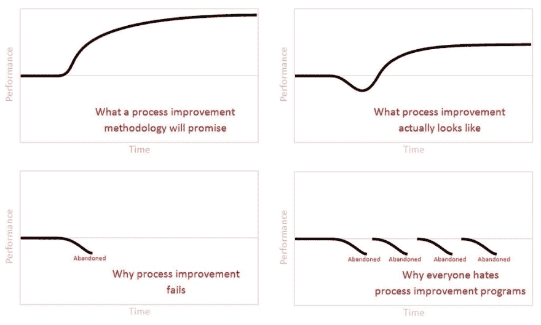
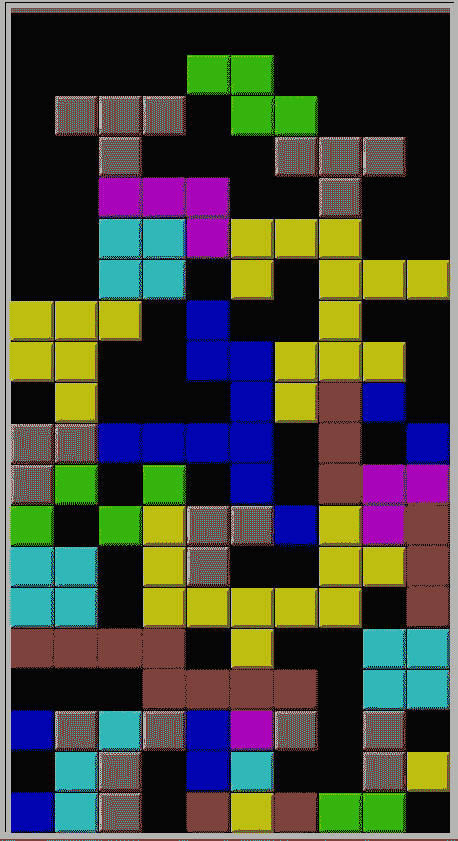
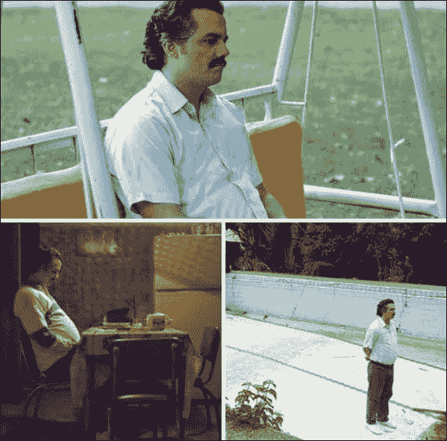
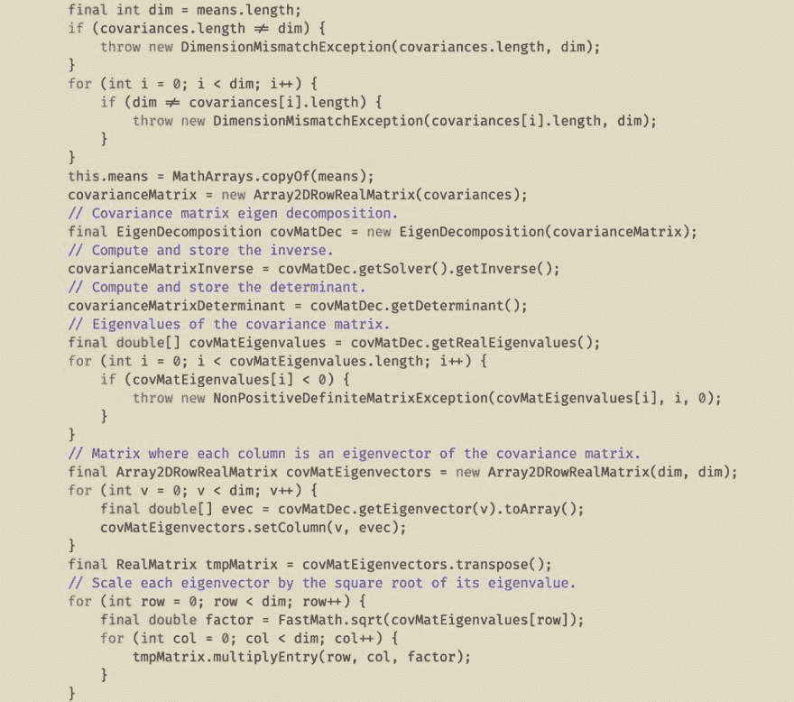

# 为什么这么严肃？精彩推文集#3

> 原文：<https://dev.to/rmnvsl/why-so-serious-collection-of-remarkable-tweets-3-mgo>

暂停一下。把工作放在一边一分钟，看看推特上有多少乐趣。许多博学的人在那里分享了大量的好建议。但是今天，我收集了一些包含有趣的，有时甚至是非常现实的内容的推文。

他们来自不同的地区:[`#development`](https://dev.to/t/development)[`#design`](https://dev.to/t/design)[`#UI`](https://dev.to/t/ui)/[`#UX`](https://dev.to/t/ux)、 [`#philosophy`](https://dev.to/t/philosophy) 、办公室与普通 [`#life`](https://dev.to/t/life) 。随机排序，没有任何偏好，并分为四个职位。

我希望我的选择会让你的星期五更加快乐！

> 马克龙[@马克龙](https://dev.to/markdalgleish)👨‍🎨我做了一个响应式设计，一辆可以变成飞机的汽车。
> T15】👩‍💻整洁——它是如何工作的？
> 
> 👨‍🎨*绘制汽车*
> 
> 👩‍💻是啊，但它是怎么变成飞机的？
> 
> 👨‍🎨*绘制平面*02:21am-02 Oct 2018127535

> 你的 httpster 好友[@ dcousineau](https://dev.to/dcousineau)好友:约会让你紧张吗？
> Me: omg 是的特别是在跨时区做数学运算的时候2016 年 8 月 03 日下午 14:4236015359

> Tommi forstrm@ forsto从我的硬盘深处找到这个。哦亲爱的。2019 年 1 月 19 日下午 17:19363908

> 一个小虚构@ asmallfiction“我一直听说奥卡姆剃刀。你知道是什么吗？”
> 
> “大概是一个叫奥卡姆的人拥有的剃刀。”
> 
> “哦。是啊，很简单。”2016 年 11 月 06 日上午 03:4431795131

> Jedd ah young[@ Jedd _ ah young](https://dev.to/jedd_ahyoung)“什么是技术债？”技术债很难解释，但一图胜千言。[#编程](https://twitter.com/hashtag/programming)[#软件开发](https://twitter.com/hashtag/softwaredevelopment)2017 年 1 月 31 日下午 22:0530442992

> Nick Takayama@ ntakayama2 年经验:“这个按钮右边有 1pt 的过多填充”
> 6 年经验:“我们为什么要做这个按钮？”2019 年 05 月 03 日下午 16:411474

> Mark Dalgleish[@ markdalgleish](https://dev.to/markdalgleish)我:“我真的很期待这次发布会。”
> 
> 大会上的我:2019 年 7 月 07 日上午 10:38153110253

> Gleb Smirnov@ gvsmirnov这里有一个空行:
> 
> 您可以在代码中使用它，使其可读性更好。看:2018 年 10 月 26 日上午 08:2246120

👆 *(click the tweet to see all images)* 👆

> <video loop="" controls=""><source src="https://video.twimg.com/ext_tw_video/1138910538954674183/pu/vid/476x270/rdR6xBF3qUvbPYX6.mp4?tag=10" type="video/mp4"></video>汤姆·贝利诺@汤姆·贝利诺我的同事们在一个开放式概念的办公室里每隔四分钟下午 16:24-2019 年 6 月 14 日

> 布鲁斯·劳森@布鲁塞尔[@ slicknet](https://twitter.com/slicknet)1964 年，我的祖父(一名煤矿工人):所以，你穿衬衫&打领带去上班，坐在办公桌前四处翻报纸，&21 岁时你的工资比我现在高？
> 我爸:是的。
> 
> 2010 年，爸爸:那么，你的公司生产一种免费产品，与其他免费产品竞争，&你生产的比我多？
> 我:是的。2019 年 1 月 18 日上午 09:5247374

这是“没那么严重”系列的第三篇帖子:

*   [为什么这么严重？#1](https://dev.to/rmnvsl/why-so-serious-1-276j)
*   [为什么这么严重？精彩推文精选#2](https://dev.to/rmnvsl/why-so-serious-collection-of-remarkable-tweets-2-10hj)
*   为什么这么严肃？精彩推文集#3👈
*   [为什么这么严重？精彩推文集#4](https://dev.to/rmnvsl/why-so-serious-collection-of-remarkable-tweets-4-28g0)

下周五见。如果你愿意，把你最喜欢的推文放在评论区。🎉