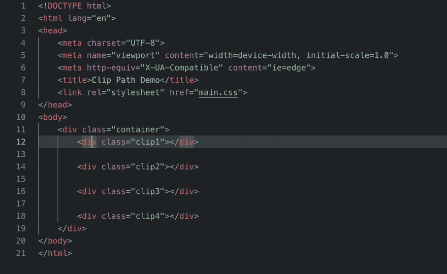
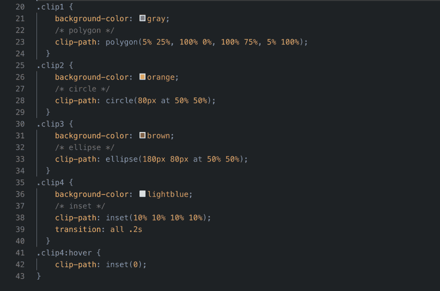
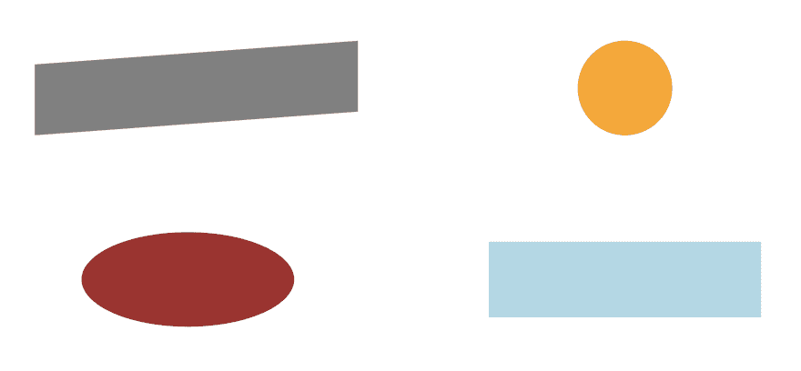

# 如何使用 CSS clip-path 属性制作令人惊叹的网站

> 原文：<https://dev.to/redvanisation/how-to-use-css-clip-path-property-to-make-amazing-websites-3of>

互联网上的大多数网页的所有或大部分元素都被设计成方形、90 度尖角的矩形或带有 CSS border-radius 属性的圆形。这无助于让你的网页设计脱颖而出！即使你使用一些渐变和不同的调色板，它看起来也会很普通。

现实世界中的形状有圆形、三角形和多边形，如果我们能在网页设计中实现这些形状，看起来会很棒。好消息是这在 CSS3 中是完全可能的！让我向您介绍 CSS clip-path 属性，我认为它是现代 web 设计中真正的游戏规则改变者。该属性帮助您在自定义形状中设置元素的样式，您可以根据需要控制和调整这些形状，甚至可以添加一些很酷的动画，使您的页面看起来很棒，甚至不需要使用 JavaScript。

那么什么是剪辑路径属性，它有什么作用呢？Clip-path 是一个新的 CSS 属性，允许你指定一个元素的特定区域来显示，而不是显示整个元素，或者换句话说，它是一个 CSS3 属性，允许你隐藏元素的某些部分，给你任何你想要的形状的可能性！酷吧？让我们看看如何使用它:
Clip-path 通常接受四个主要值:多边形()、圆()、椭圆()和插入()。这四个值中的每一个都有不同的用途:

Polygon(): clip-path:多边形(5% 25%，100% 0%，100% 75%，5% 100%)；我们将看到的第一个值是多边形，它通常有四对代表 X，Y 轴，从左上角开始，到右上角，然后是右下角，最后是左下角。就像上面的例子一样:第一个 5%代表 X 轴，之后的 25%代表第一个角(左上角)的 Y 轴，依此类推，如上所述。

circle():clip-path:circle(50% 50%处 80px 这里的第一个值是圆的大小(或轴), at 关键字后面的两个值是从容器左上角开始的 X，Y 轴和它的 CSS 位置(静态、相对或绝对…),在我们的例子中，圆在容器的中心。

ellipse():clip-path:ellipse(50% 50%时为 180px 80px 它的值与 circle 的值相同，唯一的区别是它在 at 关键字之前取了两个值，分别代表它的宽度和高度。

inset():clip-path:inset(10% 10% 10% 10%)；这是我最喜欢的值之一，它的确切作用是根据你给它的值，隐藏或剪切矩形中的元素，它也是从左上角开始顺时针方向直到左下角。它的一个常见用途是隐藏图像的一部分，使特定区域可见。当我们想制作一些很酷的动画，将它与过渡属性和:hover 选择器混合在一起时，它也非常有用。下面是对此的一个快速演示:

 
我们首先制作一个快速的 HTML5 文档，将它链接到一个 CSS 文件，并创建一个包含四个元素的容器

 
然后我们使用裁剪路径属性给元素不同的颜色和形状

在最后一个元素的 CSS 规则(clip4)中，我将所有的边剪切了 10%以使元素看起来更小，然后当鼠标悬停在元素上时，我恢复了它的原始大小，添加了一个平滑过渡效果，只是为了展示如何混合这些属性并从中获得一个不错的动画。

 
以上代码在浏览器中运行的结果

使用 clip-path 的真实世界网站:
一些网站正在使用这种很酷的新特性，它使设计从标准生成的页面中脱颖而出，它易于使用，不需要任何花哨的软件来预先制作它，例如 SVG 背景。

[https://www.redvanisation.com/](https://www.redvanisation.com/)
T3】http://www.widehive.com/artists

第一个网站是我的个人作品集，我在它的一些部分实现了 clip-path 属性，比如 hero 部分，以实现一个吸引人的设计。

第二个是一个音乐网站，他们把艺术家的图片做成不同的形状，让它们从其他内容中脱颖而出，从而产生非常漂亮的效果。

浏览器支持:
虽然这个属性很酷，但是并不是所有浏览器都支持。在本文撰写之时，唯一 100%支持它的浏览器是 Firefox 54 及以上版本的电脑浏览器和 Firefox 67 及以上版本的 Android 手机浏览器。其他主流浏览器如 Chrome 和 Safari 对它有部分支持，因此在使用该属性时，您可能希望使用后缀-webkit 来避免麻烦。
你可以点击此链接了解更多关于浏览器支持的细节:【https://caniuse.com/#search=clip-path T2】

结论:
clip-path 属性是我在 CSS3 中最喜欢的属性之一，它可以用来实现一些非常好的动画效果和很酷的形状。我在我的个人网站和我制作的一些其他网站上经常使用它，我认为它的设计非常吸引人。但是，必须小心使用该属性，并且始终使用-webkit-前缀，因为它并不被所有主流浏览器完全支持。

PS:感谢您的阅读，如果您喜欢我的文章，如果您在这里和 Twitter([https://twitter.com/redvanisation](https://twitter.com/redvanisation))上关注我，我会非常感激，这样您会在我将来发布任何新文章时得到通知。