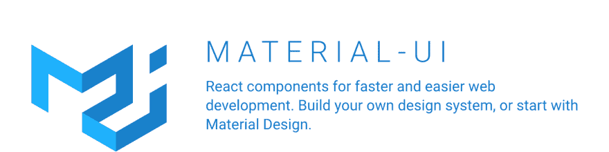
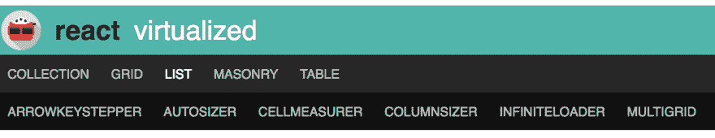
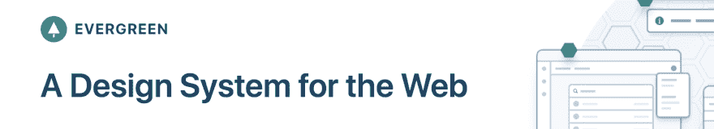
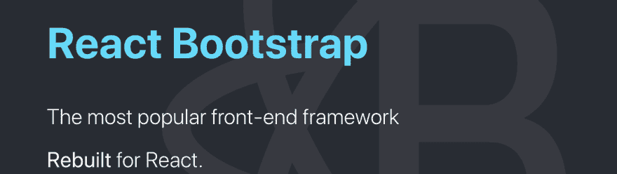
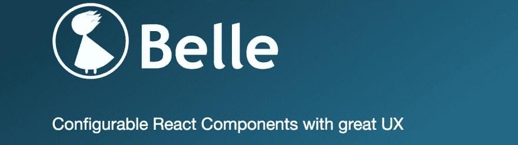
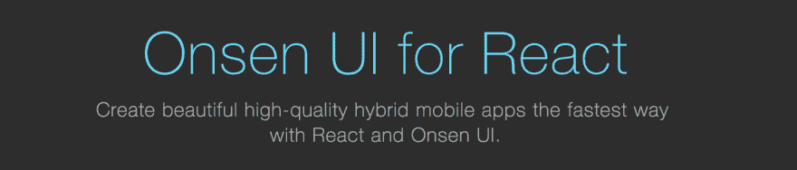

# 2019 年你应该知道的 12 大 React 组件库

> 原文：<https://dev.to/viclotana/top-12-react-component-libraries-you-should-know-about-in-2019-4j0h>

### 做出反应

React JS 是一个灵活的声明式 JavaScript 框架，用于构建优秀的用户界面。它是由脸书的团队开发的，目前被 GitHub 上超过[200 万个项目使用。用这个框架创建交互式用户界面和构建以组件为中心的应用程序相对容易。它也定期维护，并拥有发展最快的](https://github.com/facebook/react) [JavaScript 社区](https://github.com/facebook/react)。

在这篇文章中，你将看到一些你在今年的工作流程中应该熟悉的 React 组件库，重点是那些定期维护的，因为有超过 12 个库。

### 素材 UI

[Material UI](https://material-ui.com/) 是最受欢迎的 React 组件库之一，在 GitHub 上拥有超过[48000 颗星。组件和所有模板元素都是根据 Google 的材料设计指南构建的，但都是 React 组件。它附带了许多 React 模板和主题来帮助定制。它还提供了许多现成的 UI 元素，从卡片到按钮到对话框到图标和许多菜单。它还会定期更新，因为上次提交是在几天前。](https://github.com/mui-org/material-ui)

### 剑术

这是一个有趣的产品，是众多令人惊叹的进步产品之一。 [KendoReact](https://www.telerik.com/kendo-react-ui/) 专为 React 中的开发而构建，具有开箱即用的 100%原生移动支持。Kendo 附带了一组由 React 开发人员构建的组件，这些开发人员在对话框、标尺、布局、图表甚至动画方面都有丰富的经验。组件也是独立的，因为它们不需要其他依赖，而是自己反应，它还具有导入功能，以防您已经使用了现有的组件库。

### 蓝图

Blueprint 是 Palantir 团队为网络开发的基于 React 的 UI 工具包。目前它已经在 GitHub 上超过[14000 次。它可以说是数据驱动项目的最佳 React UI 库，如构建 fintech 用户界面或加密货币或金融贸易的界面。它有一个非常广泛的前端开发文档，它有很好的外观和漂亮的完成元素。](https://github.com/palantir/blueprint/)

### 反应虚拟化

如果您正在为表格、网格和大型列表构建 React 交互界面，那么 [React Virtualized](https://bvaughn.github.io/react-virtualized/#/components/List) 无疑是在您的工作流程中使用的最佳 UI 组件。GitHub 上有超过 [16，000 颗星星，并且定期更新，最后一次提交是在上个月。在 React Virtualized 的组件列表中，有一些特定于数据的组件，你可能在其他任何地方都找不到，比如 direction sorters、auto-sizer 和 masonry。这里也可以进行表格配置。React Virtualized 还自带对 Andriod 和 IOS 的移动支持。](https://github.com/bvaughn/react-virtualized)

### 常青

GitHub 上有超过[8000 颗星，](https://github.com/segmentio/evergreen) [Evergreen](https://evergreen.segment.com) 是一个令人惊叹的 React UI 框架，用于构建由[部门](https://segment.com/)创建的雄心勃勃的网络产品。它包含了精心设计的 React 组件，开箱即用。它们非常灵活，因为它们遵循 React 组件指南，它们被用作企业项目的设计语言。该文档非常易于阅读、理解和实现，其灵感来自 React 原始用户界面。它最近一次更新是在几天前，显示它定期维护。

### 反应自举

被 GitHub 上超过 129，000 个项目使用， [React Bootstrap](https://react-bootstrap.github.io/) 是使用最多的 React UI 工具包之一。由于 Bootstrap 也是 CSS 框架世界中最大的名字之一，React Bootstrap 为您带来了您已经知道的 React 组件中的 Bootstrap，因此您也可以在其中获得您最喜欢的框架，因为 Bootstrap 核心中的每个 JavaScript 都被 React 逻辑所取代。每个组件都是交互式的、可访问的，并附带了许多初学者主题，您可以从中选择，以快速跟踪您的开发过程。它还会定期维护，因为项目中的最后一次提交是在几个小时之前。

### React 工具箱

React Toolbox 是一组 React 组件，实现了构建在 CSS 模块、Webpack 和 ES6 等功能之上的 Google Material Design specification。它有一个无缝的 Webpack 集成，你可以很容易地定制它。文档中考虑了很多，而且它也是使用 React Toolbox 构建的，有一个操场可以实时测试各种组件。您可以单独或成束导入组件。GitHub 上有超过[6000 个项目在使用它，最后一次更新是在几个月前。](https://github.com/react-toolbox/react-toolbox/)

### 漂亮

Belle 是一个可配置的 React 组件工具包，它为你提供了一套 React 组件，比如 Toggle、ComboBox、Rating、TextInput、Button、Card、Select 等等。这些组件中的每一个都是为移动优化的，你可以自己定制风格。这些自由可以存在于单个组件样式表或全局样式表中。它还通过 ARIA 支持针对可访问性进行了优化。它已经在 GitHub 上被[点赞 2000 次，并且也定期维护。](https://github.com/nikgraf/belle/)

### 反应陷阱

不要与 React Bootstrap 混淆，Reactstrap 是一个简单的 Bootstrap 4 和 React 组件工具包。它附带了 create react 应用程序支持，这是一件非常重要的事情，因为很多 react 开发人员都是通过 CRA 在 CLI 中开始他们的项目的。你可以很容易地下载它与您最喜爱的软件包管理器 NPM 或纱。它包含 React Bootstrap 4 组件，支持组合和控制，不依赖于 jQuery 或 Bootstrap javascript。然而，popper 是 popovers 和自动翻转下拉菜单所必需的。它目前被 GitHub 上超过 [66，000 个项目使用，并定期维护，最后一次提交是在几天前。](https://github.com/reactstrap/reactstrap)

### 重走

Rebass 是一个 React 原始 UI 组件，构建时考虑了现代样式约定，如样式组件和情感。它有 8 个主要组件和 8 个子组件，都非常小。它有非常灵敏同时又非常容易主题化的风格属性。它有一个包含 box 和 flex 组件的 flexbox 网格，它在 GitHub 上被标星超过 5900 次，并且非常定期地维护。

### React-md

React-md 是一个 React 组件库，帮助你使用 React 组件和 Sass 创建一个完全可访问的材质设计风格的网站。由于 Sass 中的样式分离而不是内联样式，使用现有样式创建定制组件变得更加容易。它允许定制你的风格，它附带了这种易读的文档，也是用 React-md 构建的。它在 GitHub 上被标星超过【2,000 次，最后一次提交给该项目的时间是几周前，表明它定期维护。

### 温泉 UI for React

[Onsen UI for React](https://onsen.io/react/) 是一个用标记语言和 Javascript 构建的移动 UI 库，集成了 React JS。它是一个高质量的移动应用程序，支持 IOS 和 Andriod 的 UI 库。它甚至兼容其他 JavaScript 框架，如 Angular 和 Vue JS。组件使用纯 CSS，没有脚本来产生行为。也有自定义元素可供使用。它在 GitHub 上被标星超过[7500 次，并被定期维护，因为最后一次提交是在 12 天前。](https://github.com/OnsenUI/OnsenUI)

### 结论

这是对您在工作流中应该熟悉的几个 React 组件库的快速概述。还有很多，你可以根据自己的喜好做出选择。唯一要注意的重要事情应该是，如果库定期维护，快乐黑客！