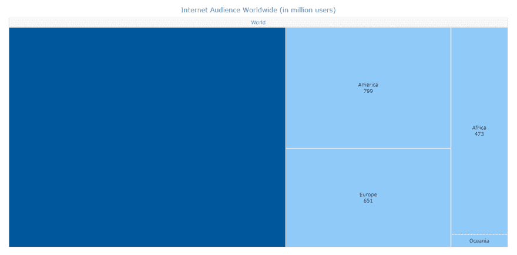
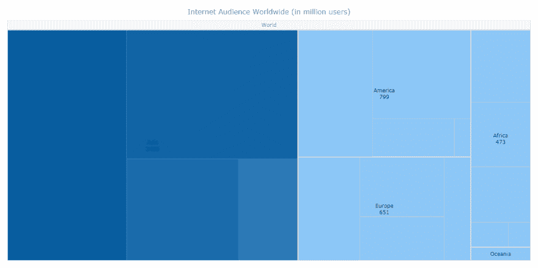
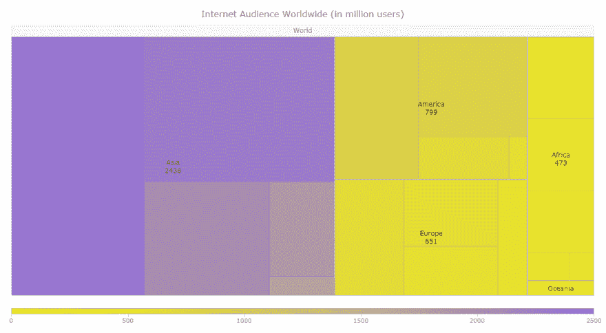
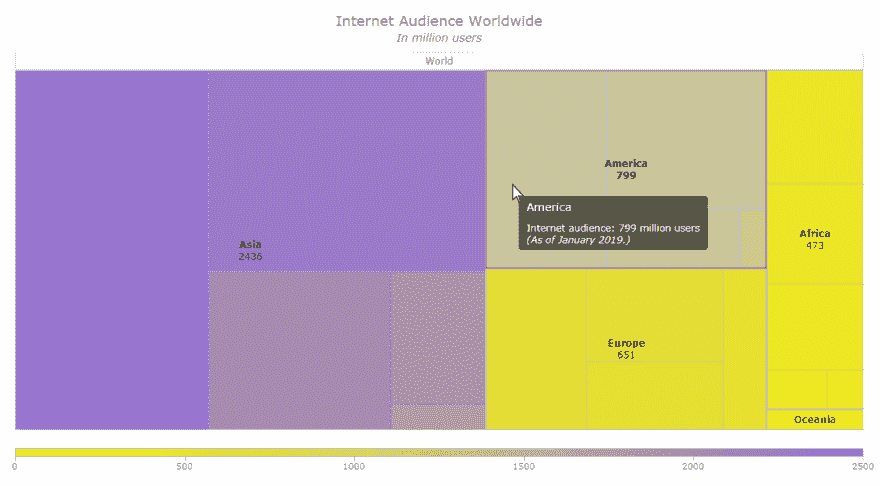
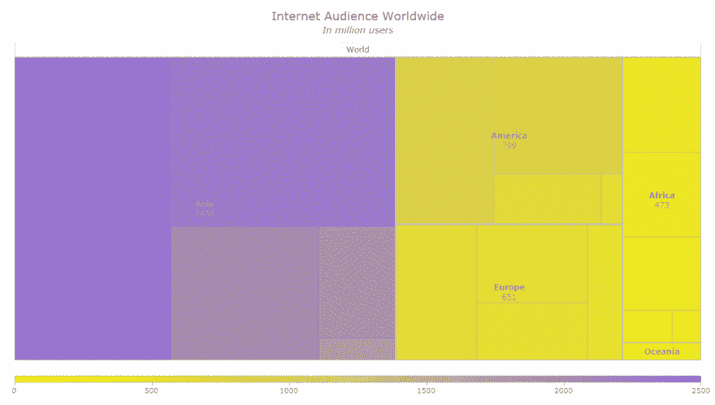

# 如何使用 JavaScript 创建树形图——初学者教程

> 原文：<https://dev.to/bugggster/how-to-create-a-treemap-chart-using-javascript-tutorial-for-beginners-2nn1>

[Treemap](https://www.anychart.com/chartopedia/chart-type/treemap/) 是一种流行的图表类型，用于分层数据可视化。现在，我将通过四个简单的步骤向您展示如何使用 JavaScript 创建一个非常酷的交互式树形图。加入我的这个快速教程，让前端 web 开发人员和 data viz 爱好者了解这个过程的核心原则。基本上，我相信至少对 HTML5 编码有一点熟悉的每个人都会喜欢这种简单的方式来制作漂亮的 JavaScript 树形图，非常适合嵌入到任何网页或应用程序中。

为了庆祝今天 8 月 1 日的万维网日，我将开发一个 JS 树形图，可视化截至 2019 年 1 月全球互联网用户数量的数据，按地区划分，可在 [Statista](https://www.statista.com/statistics/249562/number-of-worldwide-internet-users-by-region/) 上获得。

> *这是我的原始教程[的转贴，使用 JavaScript](https://www.anychart.com/blog/2019/08/01/treemap-chart-create-javascript/) 创建树形图，在这里你可以找到游乐场嵌入的交互式图表。*

# 如何创建 JavaScript 树形图

首先，这里有一个基本的东西你应该清楚地理解和记住。当使用 JavaScript 进行数据可视化时，图表通常需要四个主要步骤:

1.  首先，创建一个包含图表容器的 HTML 页面。
2.  其次，连接所有需要的脚本。
3.  第三，加载需要可视化的数据。
4.  最后，写 JS 图表代码。

现在，让我们深入研究这些简化的、一流的 JavaScript 图表的每个步骤，并构建一个令人敬畏的树形图。

## 第一步:创建 HTML 页面

在您真正开始绘制树形图之前，创建一个 HTML 页面来放置您的可视化。

下面是一个非常基本的例子，它可以看起来如何。

```
<!DOCTYPE html>
<html>
  <head>
    <title>My First JavaScript Treemap Chart</title>
    <style>
      html, body, #container {
        width: 100%;
        height: 100%;
        margin: 0;
        padding: 0;
      }
    </style>
  </head>
  <body>
    <div id="container"></div>
  </body>
</html> 
```

这里最重要的部分是，我在 HTML 代码的`<head>`部分创建了一个图表容器。它是一个块级 HTML 元素，将在其中绘制图表。欢迎您根据自己的喜好配置添加到`<head>`部分的`<style>`脚本中的图表容器参数。我希望我的 treemap 占据整个页面，所以我在 width 和 height 字段中指定了 100%来实现这一点。

你看，我还马上添加了一个相关的网页标题:“我的第一个 JavaScript 树形图。”

## 第二步:连接脚本

接下来，连接创建您想要的树形图所需的所有脚本。

我正在使用 AnyChart 的 [JavaScript 图表库](https://www.anychart.com/)，这是一个强大、灵活的解决方案，具有全面的 [API 参考](https://api.anychart.com)和[文档](https://docs.anychart.com)，免费用于非盈利用途。它具有一个模块化系统，允许我只连接那些我实际需要的图表类型和功能，这有助于减少我的 JavaScript 的大小并加快一切。

要在树形图中表示数据，需要 core 和 treemap 模块。所以我在`<head>`部分引用它们，在单独的`<script>`标签中:

```
<script>https://cdn.anychart.com/releases/v8/js/anychart-core.min.js</script>
<script>https://cdn.anychart.com/releases/v8/js/anychart-treemap.min.js</script> 
```

如果你更喜欢在本地启动这些脚本，而不是使用 [AnyChart CDN](https://cdn.anychart.com) ，你可以[将它们下载到你网站上的一个文件夹中，并使用你自己的 URL。](https://www.anychart.com/download/)

AnyChart 没有依赖关系，所以不需要连接其他任何东西。

树形图的 JavaScript 代码将被写入插入到`<body>`部分的`<script>`标签中。

查看代码框架目前的样子:

```
<!DOCTYPE html>
<html>
  <head>
    <title>My First JavaScript Treemap Chart</title>
      <script>https://cdn.anychart.com/releases/v8/js/anychart-core.min.js</script>
      <script>https://cdn.anychart.com/releases/v8/js/anychart-treemap.min.js</script>
      <style>
        html, body, #container {
          width: 100%;
          height: 100%;
          margin: 0;
          padding: 0;
        }
    </style>
  </head>
  <body>
    <script>
    <!-- The treemap chart code will be written here -->
    </script>
  </body>
</html> 
```

## 第三步:加载数据

现在，我们已经为树形图可视化准备好了地方(步骤 1)并引用了 JS 图表库脚本(步骤 2)，接下来就可以开始处理本质问题了——加载数据(步骤 3)并在树形图上绘制数据(步骤 4)。

AnyChart JS 库允许 web 开发人员从一系列处理数据的方法中进行选择。要创建树形图，必须应用树形数据模型，将数据组织成树、表或 CSV 字符串。

在这种情况下，我决定将数据组织成一棵树，每个父项都有一个包含子项数组的子数据字段:

```
var data = [
  {name: "World", children: [
    {name: "Asia", children: [
      {name: "East", value: 1000},
      {name: "Southern", value: 803},
      {name: "Southeast", value: 415},
      {name: "Western", value: 182},
      {name: "Central", value: 36}
    ]},
    {name: "America", children: [
      {name: "North", value: 346},
      {name: "South", value: 316},
      {name: "Central", value: 114},
      {name: "Caribbean", value: 23}
    ]},
    {name: "Europe", children: [
      {name: "Eastern", value: 233},
      {name: "Western", value: 183},
      {name: "Southern", value: 135},
      {name: "Northern", value: 100}
    ]},
    {name: "Africa", children: [
      {name: "Western", value: 158},
      {name: "Eastern", value: 140},
      {name: "Northern", value: 121},
      {name: "Southern", value: 34},
      {name: "Middle", value: 20}
    ]},
    {name: "Oceania", children: [
      {name: "Oceania", value: 29}
    ]}
  ]}
]; 
```

## 第四步:编写 JS 树形图

现在，让我们编写可视化代码。

整个 JS 图表代码必须包含在`<script>`标记内的`anychart.onDocumentReady()`函数中。所以首先添加功能:

```
<script>
  anychart.onDocumentReady(function() {
    // the entire code of the treemap chart will be here
  });
</script> 
```

第二步，添加步骤 3 中的数据，命令创建一个数据树:

```
anychart.onDocumentReady(function() {

  // create data
  var data = [
    {name: "World", children: [
      {name: "Asia", children: [
        {name: "East", value: 1000},
        {name: "Southern", value: 803},
        {name: "Southeast", value: 415},
        {name: "Western", value: 182},
        {name: "Central", value: 36}
      ]},
      {name: "America", children: [
        {name: "North", value: 346},
        {name: "South", value: 316},
        {name: "Central", value: 114},
        {name: "Caribbean", value: 23}
      ]},
      {name: "Europe", children: [
        {name: "Eastern", value: 233},
        {name: "Western", value: 183},
        {name: "Southern", value: 135},
        {name: "Northern", value: 100}
      ]},
      {name: "Africa", children: [
        {name: "Western", value: 158},
        {name: "Eastern", value: 140},
        {name: "Northern", value: 121},
        {name: "Southern", value: 34},
        {name: "Middle", value: 20}
      ]},
      {name: "Oceania", children: [
        {name: "Oceania", value: 29}
      ]}
    ]}
  ];

  // create a data tree
  treeData = anychart.data.tree(data, "as-tree");

}); 
```

第三，添加下面一行来创建基于数据树的树形图:

```
var chart = anychart.treeMap(treeData); 
```

四、给图表命名，让图形上显示的内容清晰:

```
chart.title("Internet Audience Worldwide (in million users)"); 
```

最后，在容器中绘制树形图的命令:

```
// set the container id
chart.container("container");

// draw the chart
chart.draw(); 
```

这就对了:看看刚刚用 JavaScript 构建的交互式树形图！

## 结果:用 JavaScript 构建的树形图

[](https://res.cloudinary.com/practicaldev/image/fetch/s--vuCRe5VH--/c_limit%2Cf_auto%2Cfl_progressive%2Cq_auto%2Cw_880/https://thepracticaldev.s3.amazonaws.com/i/zo8e9za7rfhr6a0pl26h.png)

请注意，默认情况下，树形图带有预先确定的视觉设计和交互性设置。特别是，它具有令人惊叹的向下钻取行为:当您单击一个数据点时，您可以向下钻取到它的子项。要返回并向上钻取到更高的级别，请单击标题。

欢迎您在 AnyChart 游乐场上查看这个[基本树形图示例，并在那里使用它的代码。](https://playground.anychart.com/jCUyq1p2/)

为了方便起见，下面是这个树形图的完整 HTML 代码:

```
<!DOCTYPE html>
<html>
  <head>
    <title>My First JavaScript Treemap Chart</title>
    <script>https://cdn.anychart.com/releases/v8/js/anychart-core.min.js</script>
    <script>https://cdn.anychart.com/releases/v8/js/anychart-treemap.min.js</script>
    <style>
      html, body, #container {
        width: 100%;
        height: 100%;
        margin: 0;
        padding: 0;
      }
    </style>
  </head>
  <body>
    <script>
      anychart.onDocumentReady(function() {

        // create data
        var data = [
          {name: "World", children: [
            {name: "Asia", children: [
              {name: "East", value: 1000},
              {name: "Southern", value: 803},
              {name: "Southeast", value: 415},
              {name: "Western", value: 182},
              {name: "Central", value: 36}
            ]},
            {name: "America", children: [
              {name: "North", value: 346},
              {name: "South", value: 316},
              {name: "Central", value: 114},
              {name: "Caribbean", value: 23}
            ]},
            {name: "Europe", children: [
              {name: "Eastern", value: 233},
              {name: "Western", value: 183},
              {name: "Southern", value: 135},
              {name: "Northern", value: 100}
            ]},  
            {name: "Africa", children: [
              {name: "Western", value: 158},
              {name: "Eastern", value: 140},
              {name: "Northern", value: 121},
              {name: "Southern", value: 34},
              {name: "Middle", value: 20}
            ]},  
            {name: "Oceania", children: [
              {name: "Oceania", value: 29}
            ]}  
          ]} 
        ];

        // create a data tree
        var treeData = anychart.data.tree(data, "as-tree");

        // create a treemap chart visualizing the data tree
        var chart = anychart.treeMap(treeData);

        // add a title for the chart
        chart.title("Internet Audience Worldwide (in million users)");

        // specify the container id
        chart.container("container");

        // draw the chart
        chart.draw();

      });
    </script>
  </body>
</html> 
```

# 如何定制 JS 树形图设计

因此，根据 AnyChart 库中为此图表类型配置的默认设置，上面构建的树形图具有基本的可视特性。然而，如果需要的话，可以根据你的个人喜好或公司(品牌)的设计要求，快速定制一切。

下面我将向您展示一些例子，以便您可以学习如何在几分钟或几秒钟内创建一个更好看的树形图。

## 添加提示

默认情况下，树形图只显示属于同一层次级别的数据点。但是您可以完全控制要显示的内容。例如，我想勾勒出较低级别的子项，使它们略微可见，这样任何查看图表的人(例如数据分析师)都可以在大图中对它们进行判断。

为了显示这样的提示，我使用了值为 1 的`hintDepth()`方法，这意味着我希望在树形图中显示多一层的元素:

```
chart.hintDepth(1); 
```

为了避免在显示较高级别的元素时过多地吸引较低级别的元素，我降低了提示不透明度:

```
chart.hintOpacity(0.7); 
```

[](https://res.cloudinary.com/practicaldev/image/fetch/s--w89VDjPd--/c_limit%2Cf_auto%2Cfl_progressive%2Cq_auto%2Cw_880/https://thepracticaldev.s3.amazonaws.com/i/t90c9y1f6d8fg7w3f9ec.png)

## 改变颜色

此外，您可以根据颜色快速更改树形图的设计。

例如，我想通过设置自定义填充和描边设置来更改悬停、选中和正常状态的一些外观设置。为了得到这样一张新的图片，我将`hovered()`、`selected()`和`normal()`方法与用于填充类型的`fill()` — `hatchFill()`和`stroke()`方法结合起来，在那里指定颜色和不透明度参数:

```
chart.hovered().fill("silver", 0.2);
chart.selected().fill("silver", 0.6);
chart.selected().hatchFill("backward-diagonal", "silver", 2, 20);
chart.normal().stroke("silver");
chart.hovered().stroke("gray", 2);
chart.selected().stroke("gray", 2); 
```

此外，我决定定制一个色标，将其应用于树形图，并在底部显示相应的颜色范围。跟着我顺着代码去把握思路:

```
// create and configure a custom color scale
var customColorScale = anychart.scales.linearColor();
customColorScale.colors(["Yellow", "MediumPurple"]);

// apply the custom color scale to the treemap chart
chart.colorScale(customColorScale);

// add a color range
chart.colorRange().enabled(true);
chart.colorRange().length("100%"); 
```

要查看所有支持的网页颜色及其十六进制和 RGB 代码，请参考[颜色表](https://docs.anychart.com/Appearance_Settings/Colors_Table)。

[](https://res.cloudinary.com/practicaldev/image/fetch/s--xvFg6m2x--/c_limit%2Cf_auto%2Cfl_progressive%2Cq_auto%2Cw_880/https://thepracticaldev.s3.amazonaws.com/i/762kl61mo3596h081vud.png)

## 在树形图元素中启用 HTML

最后但同样重要的是，我将向您展示如何在 HTML 的帮助下定制工具提示、标签和标题。这也很容易。

首先，通过添加带有`true`值的`useHtml()`方法，为图表的相应部分启用 HTML。

然后，随意使用 HTML。例如:

HTML 中的树形图标题:

```
// enable HTML in the chart title
chart.title().useHtml(true);
// configure the chart title
chart.title(
  "<span style='font-size:18; font-style:bold'>Internet Audience Worldwide</span><br><i><span style='font-size:14; font-style:italic'>In million users</i>"
); 
```

树状图工具提示中的 HTML:

```
// enable HTML in the chart tooltips
chart.tooltip().useHtml(true);
// configure the chart tooltips
chart.tooltip().format(
  "Internet audience: {%value} million users<br><i>(As of January 2019.)</i>"
);
HTML in treemap labels: 
```

树图标签中的 HTML:

```
// enable HTML in the chart labels
chart.labels().useHtml(true);
// configure the chart labels
chart.labels().format(
  "<span style='font-weight:bold'>{%name}</span><br>{%value}"
); 
```

[](https://res.cloudinary.com/practicaldev/image/fetch/s---gtU50G6--/c_limit%2Cf_auto%2Cfl_progressive%2Cq_auto%2Cw_880/https://thepracticaldev.s3.amazonaws.com/i/1pwu9mncg4z8e8ulehmy.png)

## 结果:用 JavaScript 构建的自定义树形图

下面是定制的 JavaScript (HTML5)树形图。不用说，您可以调整许多其他设置来获得您想要的数据可视化，并且您实际上可以修改一切。参见[树形图文档](https://docs.anychart.com/Basic_Charts/Treemap_Chart),通过代码示例和插图深入了解更多关于什么是可能的以及如何实现的细节。

[](https://res.cloudinary.com/practicaldev/image/fetch/s---icCadaG--/c_limit%2Cf_auto%2Cfl_progressive%2Cq_auto%2Cw_880/https://thepracticaldev.s3.amazonaws.com/i/6t47e5rhrh0gx9bldgx9.png)

看看 AnyChart 游乐场上这张[定制的树形图。](https://playground.anychart.com/Up2BCFGq/)

下面是这个树形图的完整 HTML 代码:

```
<!DOCTYPE html>
<html>
  <head>
    <title>My First JavaScript Treemap Chart</title>
      <script>https://cdn.anychart.com/releases/v8/js/anychart-core.min.js</script>
      <script>https://cdn.anychart.com/releases/v8/js/anychart-treemap.min.js</script>
      <style>
        html, body, #container {
          width: 100%;
          height: 100%;
          margin: 0;
          padding: 0;
        }
    </style>
  </head>
  <body>
    <script>
      anychart.onDocumentReady(function() {

        // create data
        var data = [
          {name: "World", children: [
            {name: "Asia", children: [
              {name: "East", value: 1000},
              {name: "Southern", value: 803},
              {name: "Southeast", value: 415},
              {name: "Western", value: 182},
              {name: "Central", value: 36}
            ]},
            {name: "America", children: [
              {name: "North", value: 346},
              {name: "South", value: 316},
              {name: "Central", value: 114},
              {name: "Caribbean", value: 23}
            ]},
            {name: "Europe", children: [
              {name: "Eastern", value: 233},
              {name: "Western", value: 183},
              {name: "Southern", value: 135},
              {name: "Northern", value: 100}
            ]},  
            {name: "Africa", children: [
              {name: "Western", value: 158},
              {name: "Eastern", value: 140},
              {name: "Northern", value: 121},
              {name: "Southern", value: 34},
              {name: "Middle", value: 20}
            ]},  
            {name: "Oceania", children: [
              {name: "Oceania", value: 29}
            ]}  
          ]} 
        ];

        // create a data tree
        var treeData = anychart.data.tree(data, "as-tree");

        // create a treemap chart visualizing the data tree
        var chart = anychart.treeMap(treeData);

        // set the depth of hints
        chart.hintDepth(1);
        // set the opacity of hints
        chart.hintOpacity(0.7);

        // configure the visual settings of the chart
        chart.hovered().fill("silver", 0.2);
        chart.selected().fill("silver", 0.6);
        chart.selected().hatchFill("backward-diagonal", "silver", 2, 20);
        chart.normal().stroke("silver");
        chart.hovered().stroke("gray", 2);
        chart.selected().stroke("gray", 2);

        // create and configure a custom color scale
        var customColorScale = anychart.scales.linearColor();
        customColorScale.colors(["Yellow", "MediumPurple"]);
        // apply the custom color scale to the treemap chart
        chart.colorScale(customColorScale);
        // add the color range
        chart.colorRange().enabled(true);
        chart.colorRange().length("100%");

        // enable HTML in the chart title
        chart.title().useHtml(true);
        // configure the chart title
        chart.title(
          "<span style='font-size:18; font-style:bold'>Internet Audience Worldwide</span><br><i><span style='font-size:14; font-style:italic'>In million users</i>"
        );

        // enable HTML in the chart tooltips
        chart.tooltip().useHtml(true);
        // configure the chart tooltips
        chart.tooltip().format(
          "Internet audience: {%value} million users<br><i>(As of January 2019.)</i>"
        );

        // enable HTML in the chart labels
        chart.labels().useHtml(true);
        // configure the chart labels
        chart.labels().format(
          "<span style='font-weight:bold'>{%name}</span><br>{%value}"
        );

        // set the container id
        chart.container("container");

        // draw the chart
        chart.draw();

      });
    </script>
  </body>
</html> 
```

# 包装完毕

使用 JavaScript 开发令人敬畏的交互式树形图远非火箭科学。即使是(几乎)没有编码经验的 web 开发和数据可视化新手也可以创建这些，并且基本上可以创建[任何其他 JS 图表](https://docs.anychart.com/Quick_Start/Supported_Charts_Types)、绘图、图表和图形。

现在，您已经阅读了本 JS chart 教程，请享受新知识，并在用 JavaScript/HTML5 构建简单或更复杂和高级的树形图时，在实践中很好地利用这些知识——以便在您的项目(无论是网站、移动应用程序还是任何软件)中实现最佳、最有效的分层数据可视化。

不要错过在专门的 JavaScript (HTML5)数据可视化图库中查看更多[树形图示例](https://www.anychart.com/products/anychart/gallery/Tree_Map_Charts/)。