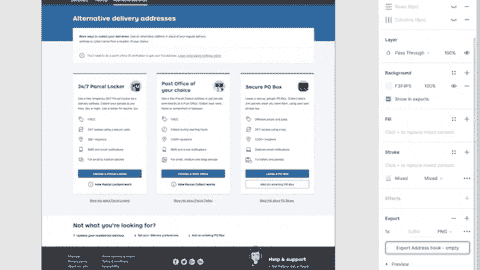

# 使用 Figma + GluePrint 比较网站和设计

> 原文：<https://dev.to/bblackwo/comparing-website-with-designs-using-figma-glueprint-4ahh>

在澳大利亚邮政，我们使用 [Figma](https://www.figma.com/features/) 来创建和分享用户界面设计。过去我们使用 Sketch+Zeplin，它有一个非常好的特性，叫做[“弹出”](https://support.zeplin.io/en/articles/1437093-comparing-app-website-with-designs-using-pop-out)。它允许你在运行的应用程序/网站上覆盖设计，以轻松查看你正在开发的 UI 是否与设计匹配。Figma 没有这个相同的特性(据我所知)。

然而，有一个解决方法，可以使用 [GluePrint](http://glueprintapp.com/) 获得与 Figma 类似的功能。

1.  将设计导出为 PNG(选择框架，然后导出为 1x PNG)。

2.  在 GluePrint 中打开图像。您可以通过滚动更改 GluePrint 的不透明度。

3.  打开你的跑步应用/网站，GluePrint 就会覆盖在上面。然后，您可以将它与设计进行比较，使其像素完美！

## 举例

它没有 Zeplin 的弹出功能方便，但它确实有效。

如果你有任何更好的想法，请在评论中告诉我。

## 发现错别字？

如果你在这篇博文中发现了一个错别字、一个可以改进的句子或者任何可以更新的内容，你可以直接在[资源库](https://github.com/BBlackwo/my-dev.to/blob/master/blog-posts/figma-pop-out/figma-pop-out.md)提交 pull 请求来更新内容。