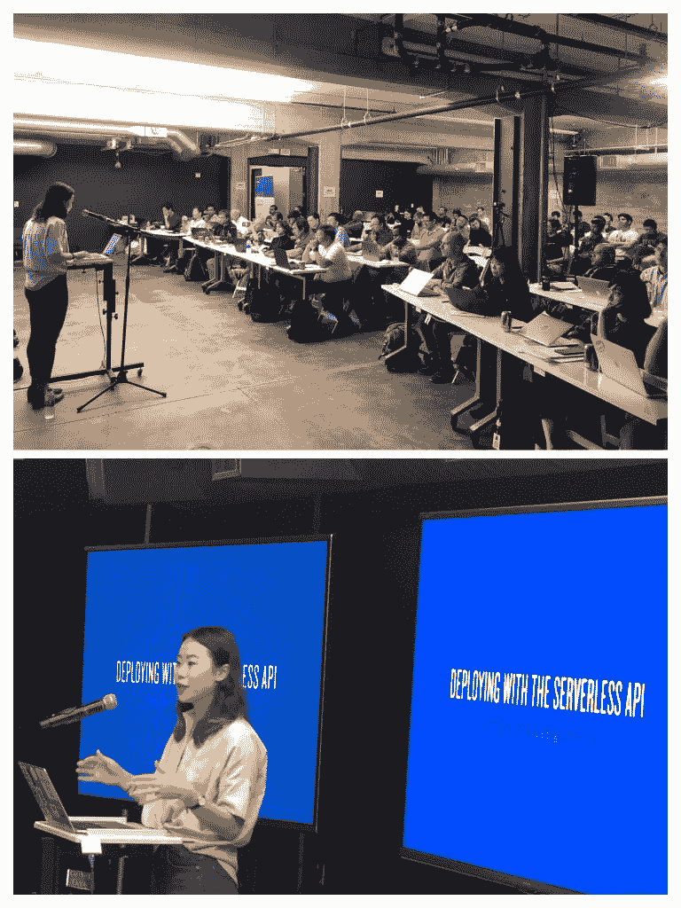
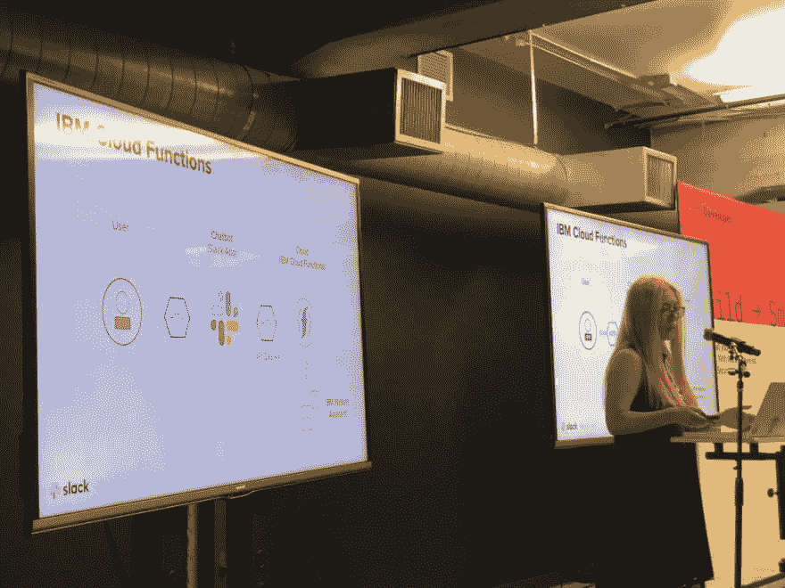
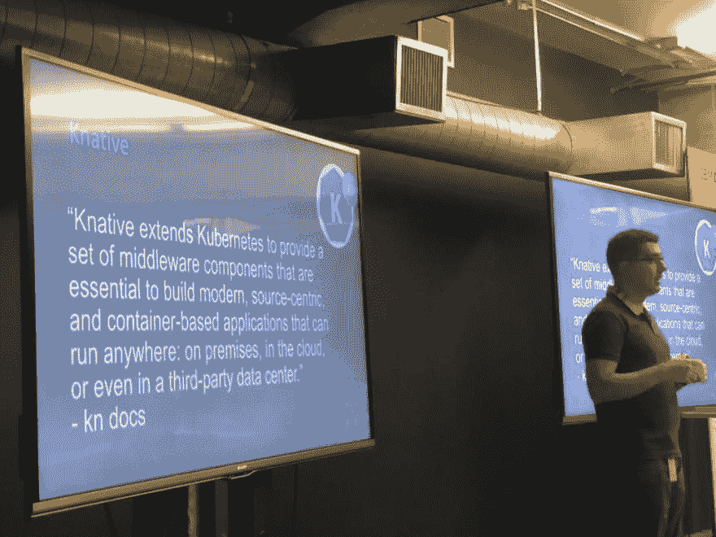
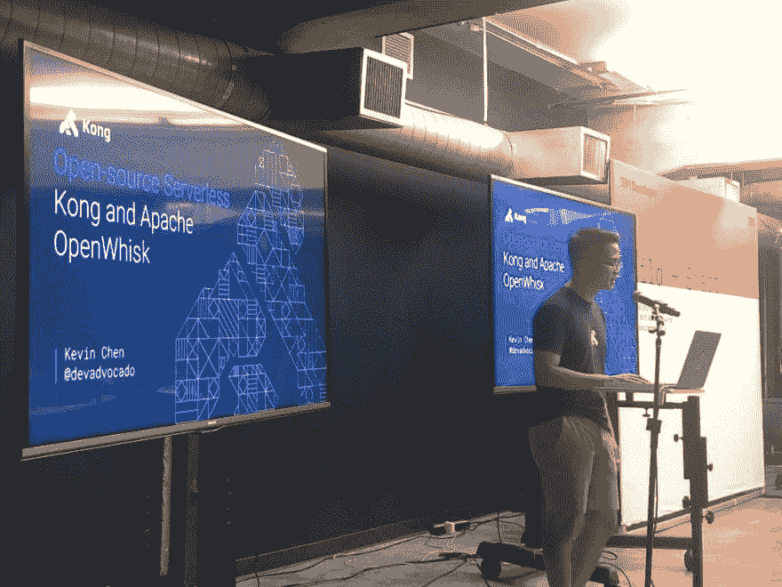
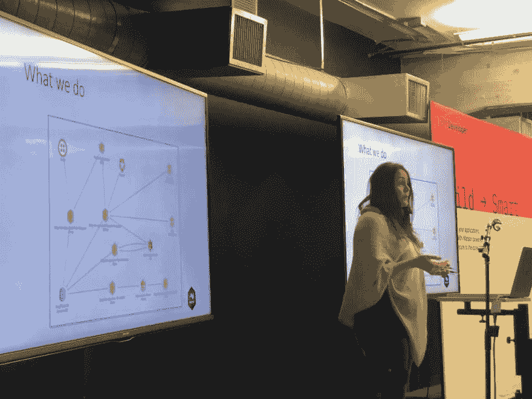
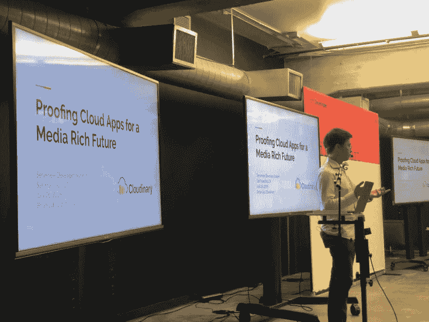
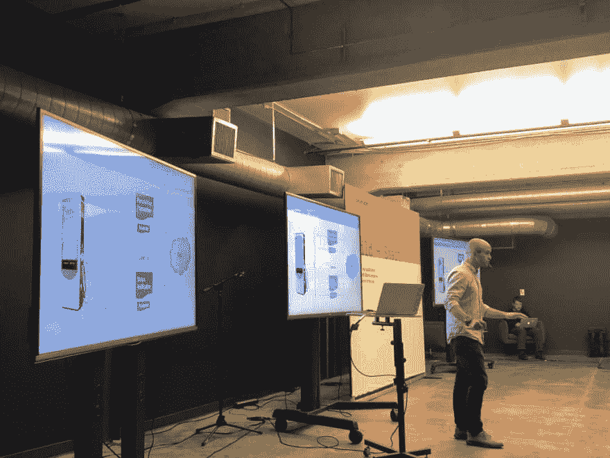
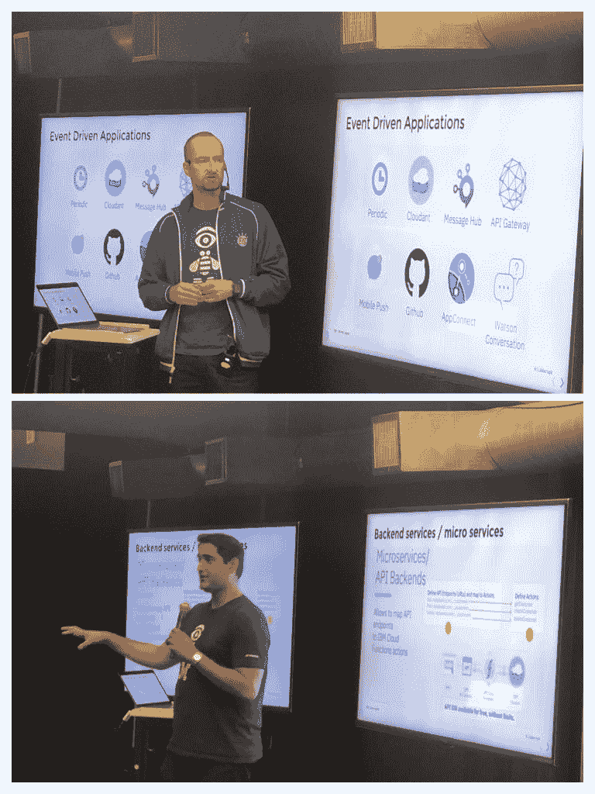

# 10 张图的无服务器开发者峰会

> 原文：<https://dev.to/maxkatz/serverless-developer-summit-in-10-pictures-2m56>

[IBM 开发者 SF](https://www.meetup.com/IBM-Developer-SF-Bay-Area-Meetup/) 举办了另一场全天活动:[无服务器开发者峰会](https://serverless-developer-summit.splashthat.com/)。110 多名技术专家花了一天时间，从来自 10 家公司的 10 名演讲者那里了解无服务器生态系统。

我们在这次峰会上也尝试了一些新的东西(我们的另外两次峰会是 [AI/ML 峰会](https://aiml-developer-summit.splashthat.com)和[区块链峰会](https://serverless-developer-summit.splashthat.com/))。在主要会谈之前，我们举办了一个实践研讨会。我们创建了三个自定进度的无服务器教程，人们可以在 10 分钟内完成。当人们进来时，他们会拿着一份打印好的教学讲义(两份或全部三份)去编码。这是获得一些实践培训的好方法。我们当然有开发者拥护者来回答任何问题。

好了，照片。

<figure> 

<figcaption id="caption-attachment-10641">戴夫·纽金特(上图)正在启动峰会。实训车间主讲座前(下)</figcaption>

</figure>

<figure> 

<figcaption id="caption-attachment-10661">来自 Twilio 的 Vinci Chen 分享了如何用无服务 API</figcaption>

</figure>

部署通信应用

<figure> 

<figcaption id="caption-attachment-10645">来自 Slack 的朋美·伊村分享了如何构建一个部署到由 IBM Cloud Functions 支持的 Slack 平台的聊天机器人(OpenWhisk)</figcaption>

</figure>

<figure>

<figcaption id="caption-attachment-10646">IBM 的尼玛·卡维亚尼分享了 Knative 如何为您的 Kubernetes 集群带来无服务器化</figcaption>

</figure>

<figure> 

<figcaption id="caption-attachment-10650">来自 Kong 的 Kevin Chen 分享了为什么在管理无服务器功能时拥有独立于云提供商的 API 网关非常重要</figcaption>

</figure>

<figure> 

<figcaption id="caption-attachment-10651">来自 Espagon 的 Shannon Hogue 分享了如何在无服务器系统中进行分布式跟踪</figcaption>

</figure>

<figure> 

<figcaption id="caption-attachment-10652">来自 StackPath 的贾斯汀分享了无服务器对边缘计算未来的影响</figcaption>

</figure>

<figure> 

<figcaption id="caption-attachment-10654">来自 Cloudinary 的 Brian Luk 谈到了 X-aaS 技术发展的影响，以及它如何导致“无服务器”架构的诞生</figcaption>

</figure>

<figure> 

<figcaption id="caption-attachment-10656">来自 Volta 的 Caleb Brewer 谈论构建云——来自 Volta 的无服务器故事</figcaption>

</figure>

IBM 的 Marek Sadowski 和 Upkar Lidder 做了最后发言，他们通过具体示例分享了无服务器的三大使用案例:

*   安全且可扩展的 API
*   后端微服务
*   事件驱动编程

<figure> 

<figcaption id="caption-attachment-10662">Marek 和 Upkar 共享无服务器的三大用例</figcaption>

</figure>

这个活动太棒了，我不得不把顶部的两张图片组合成拼贴画，并把它们算作一张。这是第 11 张照片(为什么不呢)。

Lisa Jung 是我们的社区经理，没有她，这个活动就不可能举办。凯伦·苏潘迪和阿尔琼·古杰拉尔——我们两位出色的暑期实习生在安东尼·阿曼塞的问题上给了我们很大的帮助。

<figure> 

<figcaption id="caption-attachment-10663">安东尼、阿琼、凯伦和丽莎</figcaption>

</figure>