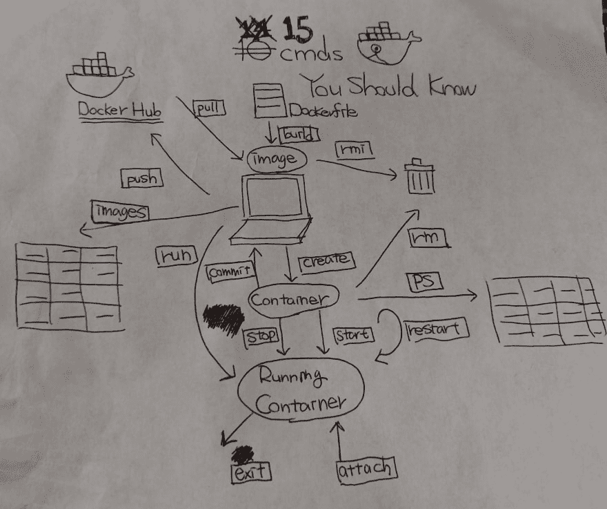

# 初学者应该知道的 15 个 Docker 命令

> 原文：<https://dev.to/0xkoji/15-docker-commands-for-beginners-4m4d>

[](https://res.cloudinary.com/practicaldev/image/fetch/s--nukLILQ7--/c_limit%2Cf_auto%2Cfl_progressive%2Cq_auto%2Cw_880/https://thepracticaldev.s3.amazonaws.com/i/4a7p6qjvqt2uu4qya9i4.jpg)

在这个帖子里，基本上，我不放期权。如果你认为这个命令缺少重要的东西，你需要检查 Docker Doc([https://docs.docker.com/](https://docs.docker.com/))

### 拉

pull 命令几乎与 git pull 相同。从 Docker hub 获取本地图像。

```
$ docker pull kojikno/conda_docker 
```

Enter fullscreen mode Exit fullscreen mode

### 推送

push 命令也和 git push 一样。该命令将您的 Docker 映像上传到 Docker Hub。这允许其他人使用您的图像，或者您可以使用来自任何机器的图像。例如，您可以将该图像用于配置项。我使用我自己的 Circle CI 图像来运行测试。免费计划允许我们进行一次私人回购。你可以让你的形象安全。以下:python3.7 是一个标签。通常，一个社区组织提供多个版本的图像。

例如，节点:最新、节点:11、节点:10 等。

```
$ docker push kojikno/conda_docker:python3.7 
```

Enter fullscreen mode Exit fullscreen mode

### 打造

该命令用于从 Dockerfile 创建一个图像。你可以在下面的帖子里看到 Docker 文件是什么。
[https://dev.to/kojikanao/learning-docker-002-images-5deb](https://dev.to/kojikanao/learning-docker-002-images-5deb)

`ml_conda_docker`是一个图像名为&的标记。

```
$ docker build -t ml_conda_docker:latest . 
```

Enter fullscreen mode Exit fullscreen mode

### 图像

该命令显示您拥有的图像。我想我已经用了这个命令很多次了 lol

```
$ docker images

REPOSITORY                  TAG                 IMAGE ID            CREATED             SIZE
arm64v8/ubuntu              latest              56c6cce7dd32        7 days ago          57.7MB
circleci/picard             latest              7d0931871af3        2 weeks ago         103MB
arm64v8/node                10.16.0-stretch     3583429b1ae9        3 weeks ago         853MB
rwmodel/runway/densedepth   cpu                 186943877dd5        8 weeks ago         1.85GB 
```

Enter fullscreen mode Exit fullscreen mode

### rmi

该命令用于删除图像。有时图像很大，所以需要删除图像，特别是当我从基于 Docker Hub 图像的容器中创建图像时。

```
$ docker rmi image_id/image_name

$ docker rmi $(docker images -q --filter "dangling=true") <-- remove images which is named none 
```

Enter fullscreen mode Exit fullscreen mode

### 创建

此命令创建一个容器，但不启动容器。

```
$ docker create image_name 
```

Enter fullscreen mode Exit fullscreen mode

### 运行

该命令用于运行容器或启动容器。你应该检查一下选项。
[https://docs.docker.com/engine/reference/run/](https://docs.docker.com/engine/reference/run/)
也可以查看我关于容器的帖子([https://dev . to/koji kanao/learning-docker-001-containers-5ac 6](https://dev.to/kojikanao/learning-docker-001-containers-5ac6))

```
$ docker run -it image_name/image_id bash 
```

Enter fullscreen mode Exit fullscreen mode

### ps

当你使用 Docker 时，它可能是你最好的朋友。
这个命令显示你正在运行的容器的信息。如果你想看到停止的容器，你可以添加`-a`。

```
$ docker ps

$ docker ps -a 
```

Enter fullscreen mode Exit fullscreen mode

### 提交

这个命令允许我们从一个容器创建一个图像。我们可以提取一个映像，添加/安装我们需要的任何东西，然后做`commit`。之后，我们可以开始运行/创建我们提交的映像的容器。
你应该知道的一件事是`commit`从你拉的图像创建一个新的图像，新图像的大小可能比原来的大。所以，如果你的机器没有足够的存储空间，你需要关心你的存储空间。

```
$ docker commit container_id iamge_name:tag 
```

Enter fullscreen mode Exit fullscreen mode

### 开始

这个命令用于开始运行一个容器。

```
$ docker start container_id/container_name 
```

Enter fullscreen mode Exit fullscreen mode

### 停止

该命令用于停止正在运行的容器。

```
$ docker stop container_id/container_name 
```

Enter fullscreen mode Exit fullscreen mode

### 退出

当你在 Docker 容器中时，你可以使用`exit`来离开那里。

```
$ exit 
```

Enter fullscreen mode Exit fullscreen mode

### 附上

该命令将本地标准输入、输出和错误流附加到正在运行的容器。

```
$ docker attach container_id/container_name 
```

Enter fullscreen mode Exit fullscreen mode

### rm

此命令删除未运行的容器。如果您放置多个 container _ id
，您可以移除多个容器

```
$ docker rm container_id/container_name

# This commands remove all exited containers.
$ docker rm $(docker ps -qa --no-trunc --filter "status=exited") 
```

Enter fullscreen mode Exit fullscreen mode

## +α

### 系统修剪

该命令用于删除未使用的数据。
如果你真的想清理你的 Docker 环境，可以使用`-a`选项。但是，该选项会删除所有未使用的数据，因此使用该选项时要小心。

```
$ docker system prune OPTIONS 
```

Enter fullscreen mode Exit fullscreen mode

### exec

这个命令允许我们在一个正在运行的容器中执行另一个进程。

```
$ docker exec option container_id/container_name 
```

Enter fullscreen mode Exit fullscreen mode

实际上，有很多命令你可以使用/应该知道，但是我想对于像我这样的初学者来说，这些命令已经足够学习 Docker 的基础知识了。

希望这对某人有用！

如果有什么不对或者遗漏了什么重要的东西，请留下评论！！！(我还在学 Docker😆)

docker Doc
T1】https://docs.docker.com/

码头工人备忘单
[https://github.com/wsargent/docker-cheat-sheet](https://github.com/wsargent/docker-cheat-sheet)

如果你不喜欢使用 CLI，你可以使用 Docker 的 GUI，比如 kite matic([https://kitematic.com/](https://kitematic.com/))，但是 CLI 可能有助于理解 Docker，因为我们需要编写 Dockerfile，docker-compose.yml

## 文章不再可用

## 文章不再可用

[](https://www.buymeacoffee.com/koji)