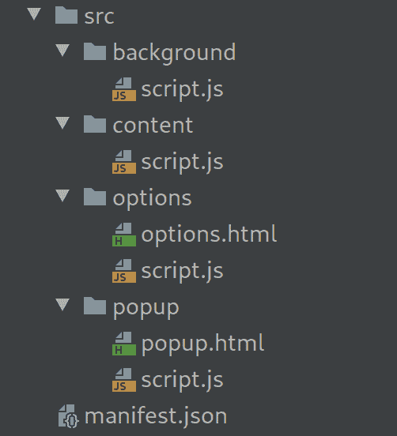
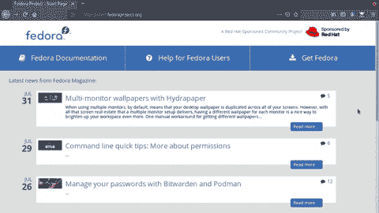

# 创建一个真正的浏览器扩展(Chrome，Firefox，基于 Chrome)

> 原文：<https://dev.to/syneware/create-a-real-browser-extension-chrome-firefox-chromium-based-56ma>

在这篇文章中，我们将创建一个真正的浏览器扩展。“真正的”我的意思是这不仅仅是一个演示，如果你在这上面多下点功夫，你可以把它作为你的第一个扩展来发布:)

## 目标

我们将创建一个浏览器扩展来帮助有视觉障碍或其他情况的人更容易地浏览网页

这个扩展将有工具，这将使用户能够改变字体大小，颜色等

## 需求/工具

*   js，html 的基础知识
*   代码编辑器(提示:如果你是学生，你可以免费获得所有的 jetbrains 软件)

**我的设置:**

*   操作系统: Fedora Linux
*   浏览器:火狐浏览器
*   网络风暴

我也在使用 [web-ext](https://developer.mozilla.org/en-US/Add-ons/WebExtensions/Getting_started_with_web-ext) ，它是一个 cli 工具，可以帮助你开发你的扩展

**例如:** `web-ext run`将会用一个新的临时配置文件启动一个新的 firefox 窗口，这样你就可以测试扩展
了，如果你在源代码中做了任何更改，它会自动为你重新加载扩展

目前 web-ext 只支持 firefox，但它会让你的生活变得更加轻松

## 扩展如何工作

在浏览器中有 3 + 1 个扩展存在的地方

*   后台:顾名思义，这个部分在后台运行，没有 UI，从这里你可以做一些很酷的事情，比如修改 http 请求

*   内容:这就是你如何在你访问的网站中注入你的 js，css 等

*   弹出窗口:在地址栏的右边放一个图标，当你点击它时，它会弹出一个窗口

*   选项:这是一个 html 页面，用户可以在其中更改扩展的设置

## 文件结构

这是我个人偏好的例子，扩展名会有类似的文件结构
[](https://res.cloudinary.com/practicaldev/image/fetch/s--ihTn4On9--/c_limit%2Cf_auto%2Cfl_progressive%2Cq_auto%2Cw_880/https://thepracticaldev.s3.amazonaws.com/i/dqzzu7rtwlmnit6b4qvx.png)

## 清单文件

所有的扩展名都需要有`manifest.json`，这是一个包含所有扩展名信息的文件

您必须添加扩展的基本信息，如名称、版本等

```
{  "name":  "Accessibility Helper",  "version":  "1.0.0",  "description":  "Accessibility Helper",  "homepage_url":  "https://github.com/chr314/accessibility-extension",  "author":  "Aslanov Christoforos",  "manifest_version":  2,  "icons":  {  "16":  "assets/icon.16.jpg",  "48":  "assets/icon.48.jpg",  "128":  "assets/icon.128.jpg"  }, 
```

<svg width="20px" height="20px" viewBox="0 0 24 24" class="highlight-action crayons-icon highlight-action--fullscreen-on"><title>Enter fullscreen mode</title></svg> <svg width="20px" height="20px" viewBox="0 0 24 24" class="highlight-action crayons-icon highlight-action--fullscreen-off"><title>Exit fullscreen mode</title></svg>

这里我们需要添加我们将使用的权限

`<all_urls>`意味着分机可以访问所有网页，你可以像`https://*.example.com/*`一样添加自定义

我们还将使用`tabs`权限来访问当前选项卡

注意不要添加不需要的权限

```
 "permissions":  [  "<all_urls>",  "tabs"  ], 
```

<svg width="20px" height="20px" viewBox="0 0 24 24" class="highlight-action crayons-icon highlight-action--fullscreen-on"><title>Enter fullscreen mode</title></svg> <svg width="20px" height="20px" viewBox="0 0 24 24" class="highlight-action crayons-icon highlight-action--fullscreen-off"><title>Exit fullscreen mode</title></svg>

`browser_action`管理当你点击地址栏右侧的扩展图标
时会打开什么

```
 "browser_action":  {  "default_title":  "Accessibility Helper",  "default_popup":  "src/popup/popup.html",  "default_icon":  {  "16":  "assets/icon.16.jpg",  "48":  "assets/icon.48.jpg",  "128":  "assets/icon.128.jpg"  }  }, 
```

<svg width="20px" height="20px" viewBox="0 0 24 24" class="highlight-action crayons-icon highlight-action--fullscreen-on"><title>Enter fullscreen mode</title></svg> <svg width="20px" height="20px" viewBox="0 0 24 24" class="highlight-action crayons-icon highlight-action--fullscreen-off"><title>Exit fullscreen mode</title></svg>

在`content_scripts`中，您可以设置网页中会注入什么

你也可以像注射`js`
一样注射`css`

```
 "content_scripts":  [  {  "matches":  [  "<all_urls>"  ],  "js":  [  "src/content/script.js"  ]  }  ]  } 
```

<svg width="20px" height="20px" viewBox="0 0 24 24" class="highlight-action crayons-icon highlight-action--fullscreen-on"><title>Enter fullscreen mode</title></svg> <svg width="20px" height="20px" viewBox="0 0 24 24" class="highlight-action crayons-icon highlight-action--fullscreen-off"><title>Exit fullscreen mode</title></svg>

## 好玩的部分(编码)

正如我们在`manifest.json`中看到的，弹出窗口是一个简单的 html 页面

我们案例中的逻辑非常简单

弹出窗口是控制面板，当你点击一个动作按钮时，一条消息被发送到当前标签页的内容来改变页面

`chrome.tabs.query()`用于获取当前标签，`chrome.tabs.sendMessage()`用于发送消息

不要担心,`chrome`名称空间在 firefox 中也受支持，对于 Firefox 和 Edge，您也可以使用带有一些优点的`browser`名称空间，比如承诺

**示例**:如果你点击字体增加按钮，对象`{action: 'font-size-increase'}`作为消息被发送到当前标签，然后内容脚本将接收消息并执行适当的操作

[https://jsfiddle.net/chr314/eowcfbk1/4//embedded//dark](https://jsfiddle.net/chr314/eowcfbk1/4//embedded//dark)

在使用`chrome.runtime.onMessage.addListener()`的内容脚本中，我们可以监听消息

在这里我们可以看到如何处理增加字体大小的消息

```
chrome.runtime.onMessage.addListener(msg => {
    if (msg.action === "font-size-decrease") {
        changeFontSize(-1);
    }
    if (msg.action === "font-size-increase") {
        changeFontSize(1);
    }
});

function changeFontSize(change) {
    let elements = document.querySelectorAll("*");
    let newFontSizes = [];
    for (let x = 0; x < elements.length; x++) {
        newFontSizes.push((parseFloat(window.getComputedStyle(elements[x]).getPropertyValue('font-size')) + change) + 'px');
    }
    for (let x = 0; x < elements.length; x++) {
        elements[x].style.fontSize = newFontSizes[x];
    }
} 
```

<svg width="20px" height="20px" viewBox="0 0 24 24" class="highlight-action crayons-icon highlight-action--fullscreen-on"><title>Enter fullscreen mode</title></svg> <svg width="20px" height="20px" viewBox="0 0 24 24" class="highlight-action crayons-icon highlight-action--fullscreen-off"><title>Exit fullscreen mode</title></svg>

# 结果

[](https://i.giphy.com/media/QYRo03OSTuHbbrUPKu/giphy.gif)

# 源代码

现在这个扩展有 3 个工具字体大小，灰度，反转颜色

可以投稿，添加更多工具:)

##  [ chr314 ](https://github.com/chr314) / [可访问性-扩展](https://github.com/chr314/accessibility-extension)

<article class="markdown-body entry-content container-lg" itemprop="text">

# 辅助功能助手浏览器扩展

这是为开发到的[教程创建的](https://dev.to/chr314/create-a-real-browser-extension-chrome-firefox-chromium-based-56ma)

这是一个浏览器扩展，帮助有视觉障碍或其他情况的人更容易浏览网页

这个扩展有工具，让用户能够改变字体大小，颜色等

[](https://camo.githubusercontent.com/7a57473d3bfc1f0067e399279e40074e3e79176a00b8fc6fb7758be677f69a3e/68747470733a2f2f6d656469612e67697068792e636f6d2f6d656469612f5159526f30334f5354754862627255504b752f67697068792e676966)

</article>

[View on GitHub](https://github.com/chr314/accessibility-extension)