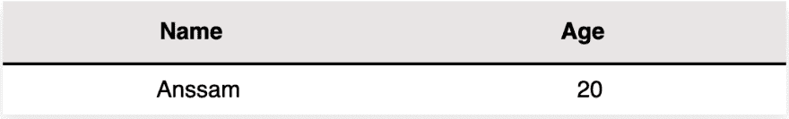
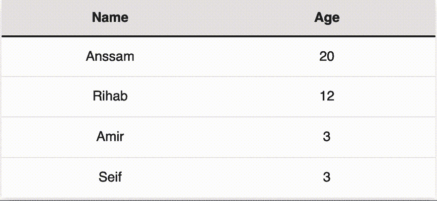

# 如何构建可重用组件

> 原文：<https://dev.to/anssamghezala/how-to-build-your-reusable-component-1mcb>

* * *

表格是用来显示数据的最常见的用户界面之一。根据表的不同，我们通常需要添加一些功能来查询和操作数据(例如搜索栏)。然而，随着表格被广泛用于显示数据，不得不复制/粘贴一个表格的相同代码块来生成另一个具有其他特性的表格可能是痛苦的。

既然我们用的是 React，应该有更好的方法来解决这个问题。这正是我们在本文中要做的。我们将利用 React 组件的能力来创建一个**可重用的 Table** 组件，它在提供特性的同时保持灵活性。

为此，Table 组件必须满足以下要求:

*   正确显示数据，同时提供定制数据显示方式的可能性
*   支持主题化系统
*   根据用户的意愿进行样式化，同时允许他们覆盖任何类型的预先添加的样式
*   支持任何种类的附加特性，比如配置表的密度

本文的目的是通过展示如何构建该组件以及如何添加功能来展示该组件，同时保持组件的灵活性并接近原始 html 表。

* * *

# 构建表格组件

## 文件设置

首先，我们必须设置一些东西:
1- **index.js** :模拟用户如何使用表格。这是我们调用表格组件的地方。

```
import React from "react";
import ReactDOM from "react-dom";

import Table from "./Table/Table";

import "./styles.css";

function App() {
  ...
  return (
    <div className="App">
      <Table ... />
    </div>
  );
}

const rootElement = document.getElementById("root");
ReactDOM.render(<App />, rootElement); 
```

2- **Table.js** :实际组件。它由一个简单的接收一些属性并返回一个表的功能组件，以及代表标题、表数据和表行的其他功能表组件组成。用户不会看到这个文件，因为它代表了表组件后面的**逻辑**。

```
import React from "react";

export default function Table(props) {
  return <table {...props} />; }

Table.TH = function TH(props) {
  return <th {...props} />; };

Table.TR = function TR(props) {
  return <tr {...props} />; };

Table.TD = function TD(props) {
  return <td {...props} />; }; 
```

3- **stylesheet.css** :模拟用户如何设置表格的样式。在这里，我们可以向表格组件添加我自己的样式。

```
.App {
  font-family: sans-serif;
  text-align: center;
} 
```

现在我们已经设置了文件，让我们考虑如何**显示**表格数据。

# 特性#1:制作一个和 html 表格完全一样的表格。

假设您想要显示以下数据:

[](https://res.cloudinary.com/practicaldev/image/fetch/s--P8XdHSns--/c_limit%2Cf_auto%2Cfl_progressive%2Cq_auto%2Cw_880/https://miro.medium.com/max/1400/1%2AtOz0B4iHAa2QyIQ9acIGyQ.png)

有两种方法可以做到:

## 1-使用表导出组件

用户可以使用`Table.TR`、`Table.TD`和`Table.TH`创建该表，如下:

```
function App() {
  ...
  return (
    <div className="App">
      <Table>
        <thead>
           <Table.TR>
             <Table.TH>Name</Table.TH>
             <Table.TH>Age</Table.TH>
           </Table.TR>
        </thead>
        <tbody>
           <Table.TR>
             <Table.TD>Anssam</Table.TD>
             <Table.TD>20</Table.TD>
           </Table.TR>
        </tbody>
      </Table>
    </div>
  );
} 
```

这里的优点是用户可以添加图标，图像，表格…来定制行。

## 2-使用数据道具对象

假设用户只希望向表格显示一些“原始文本数据”。在这种情况下，用户必须简单地将他们的数据作为一个**属性**传递给表格组件，比如:

```
function App() {
  const data = [
    {
      Name: "Anssam",
      Age: "20"
    }
  ];

  return (
    <div className="App">
      <Table data={data}/>
    </div>
  );
} 
```

并且数据会自动显示！

好吧，但这是怎么做到的呢？

注意数据对象的结构:
`const [data = [{Name: "Anssam", Age: "20"}];`

这是一个由**个对象**组成的数组，每个对象代表一个表格**行**。对象的**键**是列，如表**标题**所示，而**值**是该特定列某行的**数据**。

我们的表格组件有用户希望显示的数据，所以让我们首先尝试从这些数据中提取表格的**标题**。

### a)表头

还记得我们的数据道具对象的结构吗？我们可以从数据本身的任何元素的**键**中提取标题。为此，我们只需使用`Object.keys(SOME_DATA_ELEMENT)`函数返回对象的键数组，如表**标题**所示。

让我们使用数据数组的第一个对象来获取标题。

```
const firstRow = props.data[0];
const headers = Object.keys(firstRow); 
```

`headers`是包含表格标题的数组。然而，这不是我们想要呈现的:我们想要两个`th` header 元素，每个包含一列的标题。是时候使用我们的`Table.TH`组件了！

```
const headerComponents = headers.map(el => <Table.TH>{el}</Table.TH>); 
```

现在，我们可以将它们包装在一个`Table.TR`组件中，并要求我们的表格功能组件将它们呈现为:

```
export default function Table({ children, ...props }) {
const firstRow = props.data[0];
const headers = Object.keys(firstRow);
const headerComponents = headers.map(el => <Table.TH>{el}</Table.TH>);
  return (
    <table {...props}>
            <Table.TR>
              {headers.map(el => (
                <Table.TH>{el}</Table.TH>
              ))}
            </Table.TR>
    </table>
  );
} 
```

### b)表体数据

现在让我们来看看如何呈现表数据，如表体中的行。在深入研究之前，让我们先了解一下如何呈现下表中的数据:

[](https://res.cloudinary.com/practicaldev/image/fetch/s--P8XdHSns--/c_limit%2Cf_auto%2Cfl_progressive%2Cq_auto%2Cw_880/https://miro.medium.com/max/1400/1%2AtOz0B4iHAa2QyIQ9acIGyQ.png)

我们已经有了来自部分 **a)** 的标题，但是现在我们需要一个值为“Anssam”和“20”的行:

```
<tr>
  <td>Anssam</td>
  <td>20</td> </tr> 
```

> *数据道具对象结构快速提醒:
> [{姓名:“安萨姆”，年龄:“21”}]*

查看我们的数据属性，我们可以使用函数`Object.values(SOME_DATA_ELEMENT)`直接提取特定行的值。这个函数返回一个数组值(例如["Anssam "，" 20"])。我们还知道，我们必须为数据属性中的每个元素呈现一行，为此，我们使用`SOME_ARRAY.map(SOME_FUNCTION)`函数遍历每个元素:

```
const rows = props.data.map(el => (
    <Table.TR>
      {Object.values(el).map(el => (
        <Table.TD>{el}</Table.TD>
      ))}
    </Table.TR>
  )); 
```

现在我们可以把它添加到我们的表格渲染函数中，得到如下结果:

```
export default function Table({ children, ...props }) {
  ....
  const rows = props.data.map(el => (
    <Table.TR>
      {Object.values(el).map(el => (
        <Table.TD>{el}</Table.TD>
      ))}
    </Table.TR>
  ));
  return (
    <table {...props}>
      ....
          <tbody>{rows}</tbody>
    </table>
  );
} 
```

有后🎉！我们已经完成了简单地将数据显示到表中:)让我们来尝试一下样式吧！

# 功能#2:向我们的表格添加样式，使其成为“可定制的样式”

假设用户希望使表格组件的样式依赖于其状态。一种方法是添加条件 CSS 类名，并根据组件的状态调用它们。然而，这可能是锅炉板，降低可读性。

因此，我们需要使用一个支持动态样式的工具，比如 [styled-components](https://www.styled-components.com/) ！ ***样式化组件*** 利用标记的模板文字来样式化我们的组件。它跟踪页面上呈现的组件，并注入它们的样式。

1-我们首先建立一个 **styled.js** 文件，包含每个组件的所有样式:

```
export const Table = styled.table`
  table-layout: fixed;
  ...
  width: 100%;
  display: table;
`; 
```

> ***注意**:注意款式。**表**？这基本上就是说我们的 const `Table`基本上是一个表 dom 元素。如果我们希望它是一个 div，我们会做 styled.div.*

2-然后我们将这种风格归因于我们的组件:

```
export default function Table({ children, ...props }) {
  return (
    <Styled.Table {...props}>
         ...
    </Styled.Table>
  );
} 
```

正如你所看到的，样式是直接绑定到组件上的，所以我们不需要引入类名，或者浏览无数的 CSS 文件来检查类名用于哪个组件。

等等…如果有人将表格组件添加到他们的项目中，并希望覆盖样式，该怎么办？

他们可以**自己定制**！表格组件支持用户希望添加的任何类型的样式**。因此，用户可以使用普通的 CSS、样式组件、Sass……用自己的样式表覆盖预先存在的样式**

# 功能三:添加主题

现在让我们添加一个预构建的主题化系统，用户可以用它来设计表格的样式。我们将做两个简单的主题:黑暗和光明。

[](https://res.cloudinary.com/practicaldev/image/fetch/s--Z4-YjmOx--/c_limit%2Cf_auto%2Cfl_progressive%2Cq_66%2Cw_880/https://miro.medium.com/max/1400/1%2AwrD1LD7rNKopu4lRHdtqfw.gif)

为此，用户只需在“暗”和“亮”之间选择主题道具中的主题值:

```
function App() {
 ...
  return (
    <div className="App">
      <Table
        ...
        theme={Table.THEME.LIGHT}
      />
    </div>
  );
} 
```

那是如何运作的？

首先，我们创建我们的`THEME`变量如下:

```
Table.THEME = {
  DARK: "dark",
  LIGHT: "light"
}; 
```

然后我们使用**样式化组件**根据主题道具**动态**样式化表格组件。

我不会详细介绍每个组件的样式，所以让我们来看看我们的 header 元素的样式。假设我们想根据主题改变标题的背景；我们希望背景是黑色的**【黑暗】**主题，白色的**【光明】**主题。为此，我们将主题作为道具传递给`Styled.TH`组件。
然后，我们可以在 **styled.js** 文件的`TH`组件中读取该道具，并根据主题道具返回不同的样式:

```
export const TH = styled.th`
  background-color: ${props => {
    return props.theme === "dark" ? "#212529" : "#e8e5e5fa";
  }};
  ...
  border-bottom-color: ${props => {
    return props.theme === "dark" ? "#dee2e6" : "black";
  }};
  color: ${props => {
     return props.theme === "dark" ? "white" : "black";
    }
  }};
`; 
```

但是主题道具是怎么来的呢？

请记住，父表组件从用户那里接收属性。我们还知道，主题道具对于所有嵌入的`Table.TH`、`Table.TR`和`Table.TD`组件都是一个重要的道具，因为我们可能希望根据所选的主题来编辑它们的样式。这意味着我们必须有我们的主题道具作为**全球数据**。为此，我们定义一个上下文，比如说`themeContext`，这样表示主题:

```
//for passing the theme to all of the components
const themeContext = React.createContext(); 
```

我们用我们的`themeContext.Provider`组件:
包装整个表

```
export default function Table({ children, ...props }) {
  return (
    <Styled.Table {...props}>
      <themeContext.Provider value={props.theme}>
        ...
      </themeContext.Provider>
    </Styled.Table>
  );
} 
```

然后使用`useContext`钩子从我们的`Table.TH`组件的上下文中读取主题值:

```
Table.TH = function TH({ children, ...props }) {
  const theme = React.useContext(themeContext);
  return (
    <Styled.TH {...props} theme={theme}>
      {children}
    </Styled.TH>
  );
}; 
```

我们可以将这种逻辑用于主题样式的其余部分！🎉

# 特性#4:显示密度

该表支持的另一个很酷的特性是配置密度的能力。

```
function App() {
  return (
    <div className="App">
      <Table
        ...
        density={Table.DENSITY.HIGH}
      />
    </div>
  );
} 
```

表密度用户选择就像两个预置的主题一样，用户被限制在三个选项之间选择:**低**、**平均**和**高**密度。

```
Table.DENSITY = {
  LOW: "low",
  AVERAGE: "avg",
  HIGH: "high"
}; 
```

每个选项根据传递给桌子的属性编辑组件的样式:在这种情况下，桌子的**高度**根据**密度属性** :
改变

```
export const Table = styled.table`
  ...
  height: ${props => {
    switch (props.density) {
      case "low":
        return "130px";
      case "avg":
        return "90px";
      case "high":
        return "5px";
      default:
        return "50vh";
    }
  }};
`; 
```

现在我们完成了最后一个专题！🎉你可以在这里查看我们所做的一切。

* * *

# 结论

现在您可以:

*   你喜欢就用这张桌子吧！**随心所欲定制**。
*   制作你自己的**可重用组件**以便在你做项目的时候赢得一些时间

> ***注意**:希望这篇文章对你有所帮助，或者你从中有所收获！我和我的兄弟们正在学习更多关于 React 的知识，每个月都会发表文章。在推特上关注我 [@anssam_ghezala](https://twitter.com/anssam_ghezala) 联系我！:)*