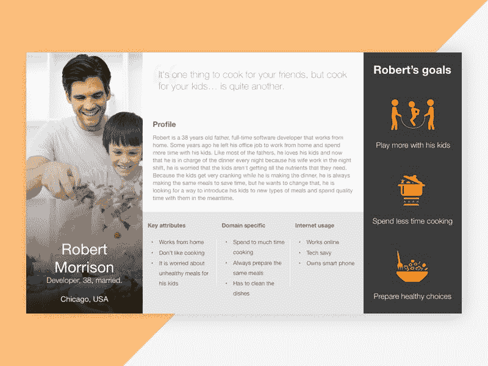

# 具有用户角色的产品开发

> 原文：<https://dev.to/devcord/product-development-with-user-personas-3f4k>

产品的生死掌握在顾客手中。

如果你的用户没有发现你所构建的东西的价值，他们就不会使用它。如果你的顾客发现价值低于你的要价，他们就不会买。

> 虽然我用的是业务和客户这样的词，但这也适用于非商业项目。客户就是谁用了你的产品，我就把客户和用户互换使用。

当你创造了一个人们喜欢使用的产品后，很少有比这更愉快的感觉了。但是我们怎么做呢？

我们如何将头脑中的想法转化为客户喜欢使用的业务、产品或功能？

通过与顾客交谈。

通过了解他们是谁，他们需要什么，以及他们每天实际面临的问题，你开始从客户的角度看待问题，这是你推动发展所需的知识。

对你来说，很好地了解你的顾客来解决他们的问题比你的顾客很好地了解你的手艺来解决他们自己的问题要容易得多。

# 用户调研

> “大楼里没有事实。所以出去！”~史蒂夫·布兰克

用户研究是一个广泛的范畴，包含了帮助你了解你的客户的每一点知识。

探索访谈、可用性测试和调查都很重要，但真实世界的体验也很重要。如果你在一个行业工作了足够长的时间，发现了一个问题，并提出了解决方案，这就是最纯粹的有形用户研究。

有很多方法可以研究你的客户，但最终都要面对会使用你产品的人。

对于这些类型的用户，在一个**角色**中记录他们的信息。

# 用户

人物角色是客户开发和产品开发之间的接口。人物角色是指一个虚构的特定客户，他代表相似用户的原型。

随着你对不同客户的了解越来越多，你可以提炼和提高你的人物角色的质量，并且你将利用这些信息来推动产品开发决策的每一步。

第一步是集思广益，找出你可能拥有的所有类型的客户。例如，一个普通约会网站的客户可能是人:

*   寻找婚姻
*   寻找关系
*   寻找朋友
*   寻找一夜情

在每一个类别中(可能彼此重叠)，你都有人们正在寻找的所有不同的东西

*   类似活动
*   电影里类似的味道
*   相似的职业
*   特定物理属性
*   特定的社会阶层/经济地位

—你可以看到这是如何很快变得详尽的。但这也有一个目的:通过考虑每个可能使用我们产品的人，我们可以有意识地决定我们将关注谁的需求。

> 你可以一直取悦一些人，你可以在某段时间取悦所有的人，但你不可能一直取悦所有的人。

# 建立人物角色

一个好的人物角色是高度详细的，代表特定类型的顾客，包含足够的事实和情感信息来推动产品决策。

你可以使用统计数据和调查来帮助设计它们，但是记住要让它们变得现实。在你居住的社区，平均每个家庭有 2.3 个孩子，但是没有母亲有 2.3 个孩子。对于你的角色，选择 2 或 3。

想象一下，我们正在创建一个应用程序，记录每个人在不同咖啡店最喜欢的咖啡。如果你有一个很大的社交圈，可能很难记住谁喜欢黑咖啡，谁喜欢无咖啡因咖啡。

除非你的一个朋友喝了一杯 Wayne Gretzky(对🇨🇦以外的任何人来说，就是九块糖，九块奶油)，否则他们点的东西可能不会很容易记住。每个人都记得自己点的咖啡，所以我们最初的客户群是*为同伴*买咖啡的人。

那些是什么样的人？

*   员工为同事购物
*   为与会者购买活动主持人
*   ~~为配偶/朋友购买的人~~

大多数经常为一个人购买的人会记得订单，所以我们可以把他们作为主要的客户群

人们购买咖啡的方式有哪些？

*   ~~咖啡豆，在家研磨和冲泡~~
*   ~~在家冲泡的咖啡渣~~
*   ~~在家冲泡的咖啡包~~
*   ~~工作时冲泡的咖啡盒~~
*   亲自从咖啡店购买
*   从咖啡店购买，通过免下车服务

虽然有些人会自己制作咖啡，但他们的需求差异很大，所以我们的重点将严格放在那些购买现成咖啡的人身上。

人们在哪里买咖啡？

*   星巴克
*   蒂姆·霍顿斯
*   麦当劳
*   方便店

为了简洁起见，这个列表将非常简短。由于星巴克有各种不同语言的花式咖啡名称、大小和风格，下至加油站可能只有一台机器有两种口味的奶精，下订单时考虑*我们在哪里*很重要。

# 举例人物角色

> **姓名:**雅各布
> **年龄:** 18
> **职业:**焊工助手
> **最爱咖啡:**白热巧克力
> 
> 雅各布不太擅长喝咖啡。他不喝咖啡，所以咖啡店是一个充满外语的令人生畏的地方。
> 
> 作为一名焊工的助手，他无时无刻不在与不同的焊工合作，有时会轮换回到以前合作过的人身边。
> 
> 在休息时间，他经常开车去附近的便利店买零食，他的主管会点一杯咖啡。甚至在澄清之后，那个*“如果我只是要一杯咖啡，他们会知道那是什么意思吗？”*，点餐后，他被问及类似*的问题:“轻烤、中烤还是深烤？”雅各布只想熬过这一天，而不必回答他不知道答案的问题*

那是一个真实的故事。我总觉得别人生来就有这一套基础知识，不知怎么就从我身边经过了。

> **姓名:**艾琳
> **年龄:** 29
> **职业:**秘书
> **最爱咖啡:**橙子摩卡星冰乐
> 
> **描述:** Erin 是她工作中的佼佼者——电话铃响三声之内就有人接听，每份文件都被精心归档。当老板们知道他们需要什么的时候，她已经准备好了。在一次大型会议之前，她用公司的信用卡给每个与会者买了他们选择的咖啡，这样他们就在他们的游戏中处于领先地位。
> 
> 但是随着公司的成长，*比以前*更大，跟踪所有这些不同的人变得越来越难。当她休假时，她的临时替代者很难完成她的日常工作，更不用说安排所有的咖啡订单了。Erin 希望不要费力去记住所有这些订单，并想有一种简单的方法来分享这些信息

当你第一次写人物角色时，匿名化一个你采访过的特定潜在客户是有帮助的，然后随着你的学习充实它。

这里有一个用户界面/UX 设计师[安吉尔·马丁内斯](https://dribbble.com/Ange1Martin3z)的人物角色概念的例子

