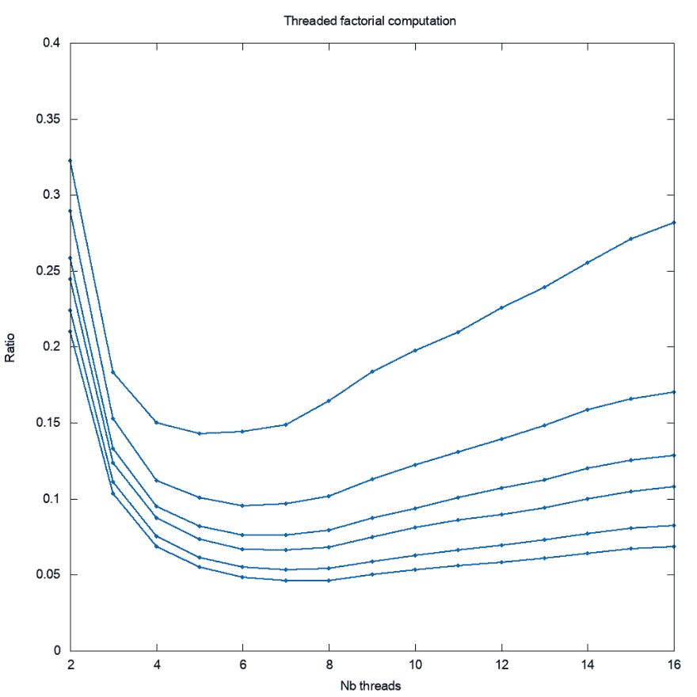

# 在铁锈上使用螺纹(第 3 部分)

> 原文：<https://dev.to/dandyvica/using-threads-on-rust-part-3-2bpf>

如果您阅读了我以前关于使用 Rust 本机线程的文章，您会知道如何并行化应用于元素向量的函数。为了说明这一点，一个很好的例子是阶乘计算:第一个*个*整数的乘积。这种计算是在几个线程上运行
的完美目标:整个过程可以被分割成不同的部分，整个产品仅仅是部分产品的产品。

为了有意义，这样一个数的阶乘应该足够大，并且超出了 u128 的能力。因为 Rust 不像 Java 那样有内置的 *BigInteger* 类，所以我使用了 *num* crate，它提供了 *BigUint* struct。请注意，这可能不是最佳方案(例如与 GMP 相比)。

显然，使用向量来计算整数的阶乘不是最有效的方法。这样做只是为了说明我的例子。

只要导入 *num* 板条箱就可以使用 *BigUint* type:

```
extern crate num;
use num::bigint::BigUint; 
```

<svg width="20px" height="20px" viewBox="0 0 24 24" class="highlight-action crayons-icon highlight-action--fullscreen-on"><title>Enter fullscreen mode</title></svg> <svg width="20px" height="20px" viewBox="0 0 24 24" class="highlight-action crayons-icon highlight-action--fullscreen-off"><title>Exit fullscreen mode</title></svg>

首先，获取命令行参数:

```
// get arguments
let upper_bound = match args[1].parse::<u32>() {
    Ok(n) => n,
    Err(e) => panic!("error {} converting {} to an integer !", e, &args[1]),
};
let nb_threads = match args[2].parse::<u32>() {
    Ok(n) => n,
    Err(e) => panic!("error {} converting {} to an integer !", e, &args[2]),
}; 
```

<svg width="20px" height="20px" viewBox="0 0 24 24" class="highlight-action crayons-icon highlight-action--fullscreen-on"><title>Enter fullscreen mode</title></svg> <svg width="20px" height="20px" viewBox="0 0 24 24" class="highlight-action crayons-icon highlight-action--fullscreen-off"><title>Exit fullscreen mode</title></svg>

为了得到阶乘，我们首先需要填充第一个 *n* *BigUint* :
的向量

```
// fill-in vector
let v: Vec<BigUint> = (1..=upper_bound).map(|i| BigUint::from(i)).collect(); 
```

<svg width="20px" height="20px" viewBox="0 0 24 24" class="highlight-action crayons-icon highlight-action--fullscreen-on"><title>Enter fullscreen mode</title></svg> <svg width="20px" height="20px" viewBox="0 0 24 24" class="highlight-action crayons-icon highlight-action--fullscreen-off"><title>Exit fullscreen mode</title></svg>

现在，单线程计算非常简单，使用*产品*特征:

```
// get time for the mono-threaded product
let mut start = Instant::now();
let mono_fact = v.iter().product::<BigUint>();
let duration_mono = start.elapsed(); 
```

<svg width="20px" height="20px" viewBox="0 0 24 24" class="highlight-action crayons-icon highlight-action--fullscreen-on"><title>Enter fullscreen mode</title></svg> <svg width="20px" height="20px" viewBox="0 0 24 24" class="highlight-action crayons-icon highlight-action--fullscreen-off"><title>Exit fullscreen mode</title></svg>

计算部分和与最终乘积是一样的:

```
// get time for multi-threaded computation
for num_thread in 2..=nb_threads {
    start = Instant::now();
    let partial_fact = v.parallel_task(num_thread as usize, prod_fn);
    let multi_fact = partial_fact.iter().product::<BigUint>();
    let duration_multi = start.elapsed();

    // validity check: check if products are equal
    assert_eq!(mono_fact, multi_fact);

    println!(
        "n={}, #threads={}, mono_threaded={:?}, {}_threaded={:?}, ratio={:.6}",
        upper_bound,
        num_thread,
        duration_mono,
        num_thread,
        duration_multi,
        duration_multi.as_nanos() as f64 / duration_mono.as_nanos() as f64
    );
} 
```

<svg width="20px" height="20px" viewBox="0 0 24 24" class="highlight-action crayons-icon highlight-action--fullscreen-on"><title>Enter fullscreen mode</title></svg> <svg width="20px" height="20px" viewBox="0 0 24 24" class="highlight-action crayons-icon highlight-action--fullscreen-off"><title>Exit fullscreen mode</title></svg>

*assert_eq！这里的行只是为了确保计算是相等的。这是防止错误的明智措施！*

*prod_fn* 函数和我之前的文章一样:

```
// product of elements
fn prod_fn<'a, T: Product<&'a T>>(chunk: &'a [T]) -> T {
    chunk.into_iter().product::<T>()
} 
```

<svg width="20px" height="20px" viewBox="0 0 24 24" class="highlight-action crayons-icon highlight-action--fullscreen-on"><title>Enter fullscreen mode</title></svg> <svg width="20px" height="20px" viewBox="0 0 24 24" class="highlight-action crayons-icon highlight-action--fullscreen-off"><title>Exit fullscreen mode</title></svg>

现在可以比较单线程和多线程计算的运行时间了。有意义的是，我刚刚创建了一个 16 核 Amazon AWS 实例，在发布模式下编译了全部代码，并在我的实例上运行。我运行了 n=20k、50k、75k、100k、150k 和 200k 的过程。

以下是结果:

[](https://res.cloudinary.com/practicaldev/image/fetch/s--Ks5rEUSG--/c_limit%2Cf_auto%2Cfl_progressive%2Cq_auto%2Cw_880/https://thepracticaldev.s3.amazonaws.com/i/e8ni62hsjfpuas3glspj.png)

最佳时间在 6 到 8 个内核之间。几个因素可以解释这一结果:

*   AWS 实例处理器是一个具有 16 个内核的*英特尔至强白金 8124M CPU @ 3.00GHz* 处理器，但具有超线程功能，而不是真正的内核。看起来 CPU 有 16 个内核，但实际上只有 8 个物理内核，这可能是计算的最佳数字
*   CPU 缓存机制
*   线程越多，产品的最终*产品花费的时间就越多*

希望大家欣赏！

> 格雷戈里·库尔默在 Unsplash 上的照片