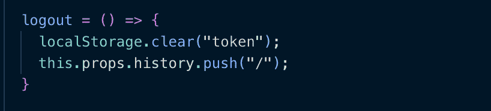
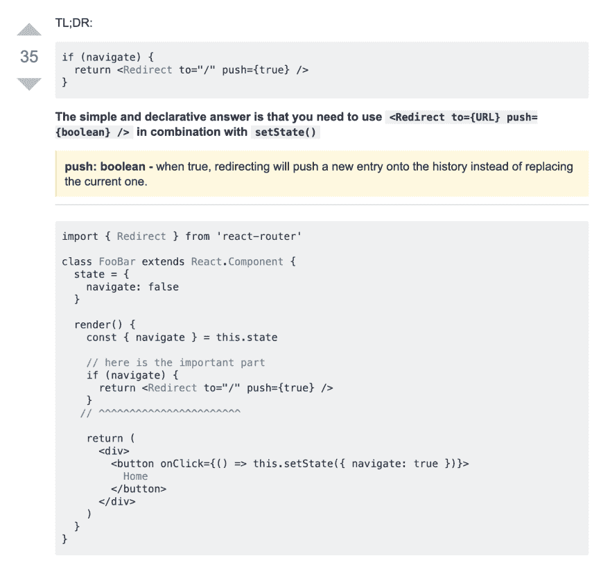

# 用 React 路由器 V4 实现客户端注销

> 原文：<https://dev.to/calier/implementing-client-side-logout-with-react-router-v4-3a84>

如果你读了我的最后一篇文章，你会知道我正在重建我在 bootcamp 结束时构建的一个应用程序的前端，使用路线而不是状态的条件渲染。我只是实现了一个让用户从应用中注销的按钮，花费的时间比我预期的要长，所以事情是这样的:

我现在使用 Routes 的事实让我有点困惑——我以为会有一个包含按钮的注销组件，一旦用户登录，它就会由 AlbumsPage 组件(AuthenticatedRoute)呈现。虽然我知道这不需要它自己的路由，但我为什么需要“myapp/logout”或其他什么的 URL 呢？此时，我只处理客户端的身份验证，这只是在 localStorage 中设置和清除令牌的问题。稍后我会解决服务器端的问题。

**问正确的问题**

对我来说，要完成这项工作，我必须做两件事:

1.  清除 localStorage 中的令牌
2.  将主页的 url 推送到历史道具上

我在我的注销组件中有这个函数，并把它作为一个道具传递给按钮，但是当我在应用程序中单击按钮时，我得到一个*类型错误:无法读取未定义的属性‘props’。*我如何定义这些道具？我必须从某个地方传入它们吗？

对我来说，我想要的答案似乎总是在谷歌上搜索到正确的东西后才出现。我用谷歌搜索了这个错误，以及其他一些东西，比如*“注销时反应路由器重定向”*，得出的结论是这是一个范围问题。那么我需要绑定函数吗？也许我应该使用“WithRouter”导出注销组件？？

显然这些都不起作用，所以我想，“我到底想在这里做什么？”。我有一个写着“注销”的按钮。当那个按钮被点击时，我想把用户重定向到主页。当我最终尝试了*“react router 4 redirect on button click”*，[这段极其简单(但有效)的代码在 StackOverflow(还能在哪里？):](https://stackoverflow.com/questions/42123261/programmatically-navigate-using-react-router-v4)

谢谢 [@lyubomir](https://dev.to/lyubomir) ！！对我来说，这里有两个灵光一现的时刻:

1.  了解如何单独使用重定向，而不是在 route 的 render 方法或任何类似的方法中使用。react 培训网站有更多关于此处的内容。
2.  除了写入' this.props.history.push('/')'之外，还有另一种将新条目推送到历史属性上的方法。历史道具是另一件让我真正思考/写另一篇博客的事情。

我特别喜欢的 [@lyubomir](https://dev.to/lyubomir) 所做的是从 react 培训网站上的[完整示例](https://reacttraining.com/react-router/web/example/auth-workflow)中提取必要的代码。我实际上已经看过了，但是有时候(特别是如果你已经感到困惑的话)识别你真正在找的那段代码，并把它放在你自己的上下文中是很棘手的。我真的很喜欢这些人在我们陷入困境时帮助我们度过难关！

这就是我可爱的注销组件现在的样子:

至关重要的是，这一切工作！此外，还有一个很好的提醒，在这次重建中我想做的另一件事是多练习使用析构。我认为，我的下一项工作是在我的应用程序中首次使用嵌套路线。