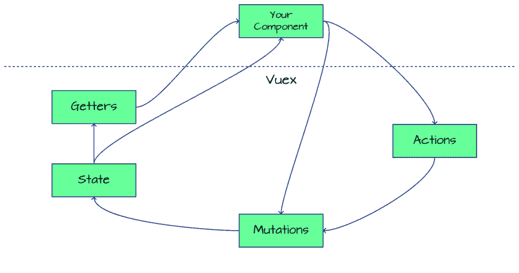
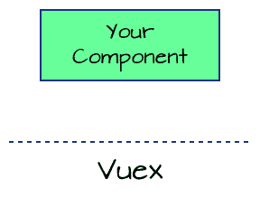
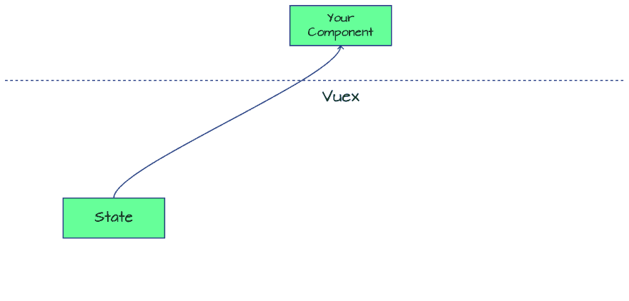
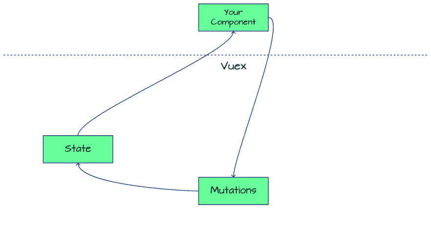
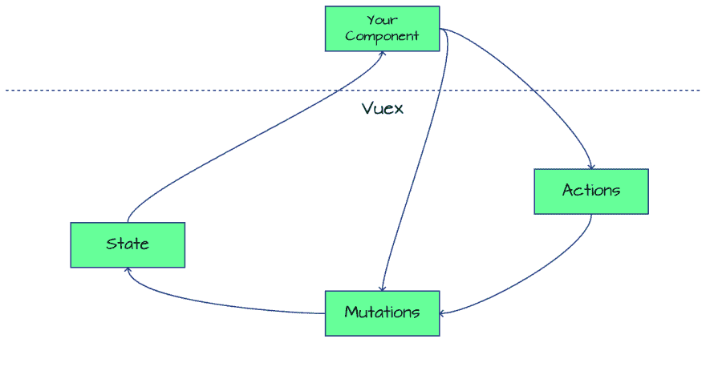

# 了解 Vuex 中的数据流

> 原文：<https://dev.to/firstclown/understanding-data-flow-in-vuex-b5b>

如果你像我一样，当你第一次遇到 Vuex 时，你可能会想“这到底是怎么回事？”这些类型的状态管理系统是如何工作的还不是很明显，尤其是如果您有 SQL 背景的话。我需要它吗？事实上，Vuex 文档中有一段话很好地总结了这一点:

> 通量库就像眼镜:当你需要它们的时候你会知道。
> 
> *   Dan Abramov

Flux、Vuex、Mobx...这些 x 是关于什么的？嗯，在某些时候，我的数据变得太模糊了，我意识到我需要一些 Vuex 眼镜。因此，我前往 Vuex 网站，看看到底发生了什么。

也许是我，也许我只是变老了，但那个网站没有很好地解释 heck Vuex 是如何工作的。它看起来非常复杂和精细，我真的不想使用它。所有这些核心概念和应用程序结构。

谢天谢地，我深入研究了一下，发现它并不那么复杂。我只需要在一张餐巾纸素描里把它分解开来。

Tada！清澈如泥！

也许我应该把这个再分解一下。

## Vuex 是一种将所有数据保存在一个地方的方法

从根本上说，这就是 Vuex 的全部。这就叫做为你的应用程序提供一个“真实的来源”。您的组件将连接到 Vuex 来访问驻留在那里的共享数据。但是这到底是怎么回事呢？

## 数据保持在状态

数据保存在 Vuex 数据存储器的`state`中。您的组件可以读取该数据，并且由于它是反应式的，所以当状态中的数据更新时，它会自我更新。应用程序中的每个组件都在监听相同的状态，所以每个人都保持同步。

## 通过突变改变数据

现在数据在那里，你可以直接更新它，对吗？

**号**

关于 Vuex 的一个重要概念是，你不应该直接改变`state`。只能通过一个`mutation`来改变。所有的`state`变化都将通过突变发生。一直都是。记住这一点，你会没事的。

此外，突变应该非常简单，获取数据并将其设置在状态中，仅此而已。任何比这更有逻辑性的东西都会被付诸行动，你接下来会看到。

> ### 为什么只改`state`到`mutations`？
> 
> 去看看我的文章[为什么你应该总是在 Vuex](https://jerickson.net/why-should-change-state-vuex-mutations/) 中使用突变。你会看到我对突变的一些想法。

## 动作中与数据相关的逻辑运算

有时可能存在与数据相关的逻辑操作，比如将数据拉入应用程序的 AJAX 调用或创建新 GUIDs 的生成器。它不应该存在于一个特定的组件中，它是一个数据操作，所以它应该与数据在一起。这就是行动的目的。

任何需要长期运行的东西都应该存在于行动中。同样，动作从不更新状态，但是它们可以调用更新状态的突变。

## getter 用于数据的通用过滤器和格式化器

Getters 的用法很像 Vue 组件中的计算属性，这是一种从任何组件都可以连接的状态中过滤或格式化数据的方法。您可以创建一个新的 getter，而不是在每个组件中都有一个 computed 属性，组件可以共享这个 getter，当状态更新时，getter 也会更新。

有一个问题是[在访问状态](https://jerickson.net/should-you-always-use-getters-in-vuex/)时应该总是使用 getters，我最近也回答了这个问题。如果你想知道的话，可以去看看。

所以实际上，这只是访问状态的另一种方式(但从不更新它！).

希望这能让你更好地理解 Vuex 正在做的事情，如果你之前还在纠结的话。我知道它帮助了我。