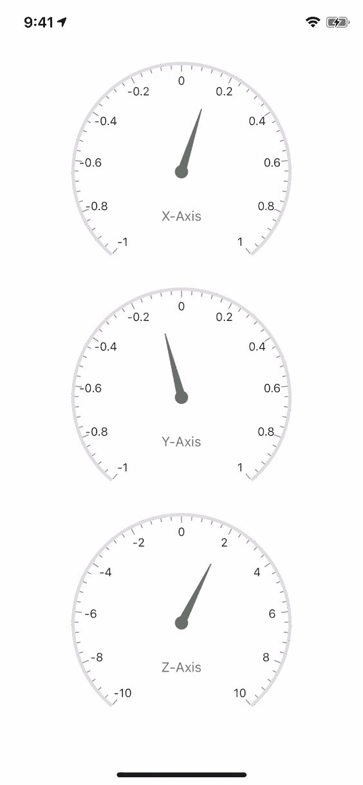
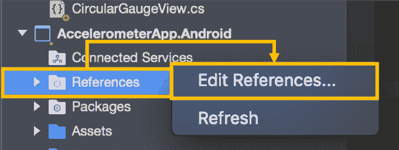
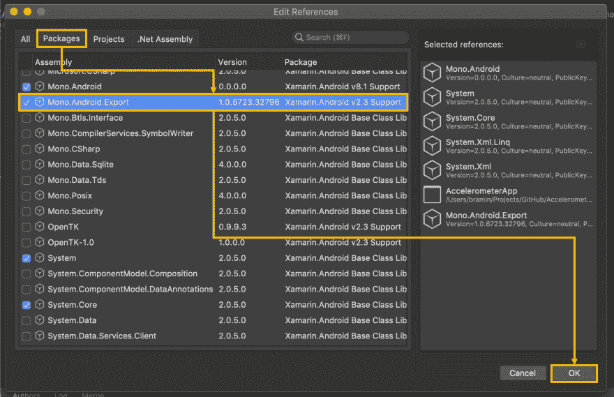

# 如何创建监控加速度计数据的移动应用

> 原文：<https://dev.to/syncfusion/how-to-create-a-mobile-app-that-monitors-accelerometer-data-1359>

感谢 [Xamarin。Essentials](https://docs.microsoft.com/en-us/xamarin/essentials/?WT.mc_id=none-SyncFusionBlog-bramin) 和 [Syncfusion 的圆形仪表控制](https://www.syncfusion.com/xamarin-ui-controls/xamarin-circular-gauge)，创建一个监控加速度计数据的移动应用从未如此简单！

让我们看看如何在 Xamarin 中实现这个控件。表单应用程序。

[T4】](https://res.cloudinary.com/practicaldev/image/fetch/s--hP_UcK-6--/c_limit%2Cf_auto%2Cfl_progressive%2Cq_66%2Cw_880/https://blog.syncfusion.com/wp-content/uploads/2018/08/43228875-b2c516ee-9017-11e8-9350-1016d7451a8f.gif)

## 演练

**1。安装 NuGet 包**

a.安装[同步融合器。Xamarin.SfGauge NuGet 包](https://www.nuget.org/packages/Syncfusion.Xamarin.SfGauge)到每个项目中，这包括 Xamarin.iOS，Xamarin。安卓和。NET 标准项目(如果正在使用)。
b .安装 [Xamarin。Essentials NuGet 包](https://www.nuget.org/packages/Xamarin.Essentials)到每个项目中，这包括 Xamarin.iOS，Xamarin。安卓和。NET 标准项目(如果正在使用)。

**2。在 iOS 上初始化 sync fusion**

要使用 Syncfusion 圆形标尺，我们首先需要在 app delegate . finished launching .
中初始化它

```
public partial class AppDelegate : global::Xamarin.Forms.Platform.iOS.FormsApplicationDelegate
{
    ...

    public override bool FinishedLaunching(UIApplication uiApplication, NSDictionary launchOptions)
    {
        ...

        Syncfusion.SfGauge.XForms.iOS.SfGaugeRenderer.Init();
        Syncfusion.Licensing.SyncfusionLicenseProvider.RegisterLicense("Your SyncFusion License Key");

        ...
    }
} 
```

**3。在 Android 上初始化 sync fusion**

要使用 Syncfusion 圆形标尺，我们首先需要在 MainActivity 中初始化它。OnCreate:

```
public class MainActivity : global::Xamarin.Forms.Platform.Android.FormsAppCompatActivity
{
    ...

    protected override void OnCreate(Bundle savedInstanceState)
    {
        ...

        Syncfusion.Licensing.SyncfusionLicenseProvider.RegisterLicense("Your SyncFusion License Key");

        ...
    }
} 
```

**4。参考单声道。Android.Export**

a.在 Android 项目的解决方案浏览器中，右键单击 References。在参考菜单中，选择编辑参考。
[](https://res.cloudinary.com/practicaldev/image/fetch/s--hdb5crUD--/c_limit%2Cf_auto%2Cfl_progressive%2Cq_auto%2Cw_880/https://blog.syncfusion.com/wp-content/uploads/2018/08/43227940-0804184c-9015-11e8-8225-0b04b5507219.png) 
c .在编辑引用窗口中，选择 Packages 选项卡。
d .在“包”选项卡中，找到 Mono . Android . export。
e .在“包”选项卡中，确保 Mono。Android.Export 已检查。
f .在编辑引用窗口中，点击确定。
[](https://res.cloudinary.com/practicaldev/image/fetch/s--Ebg9r_4u--/c_limit%2Cf_auto%2Cfl_progressive%2Cq_auto%2Cw_880/https://blog.syncfusion.com/wp-content/uploads/2018/08/43227949-0c77ed0e-9015-11e8-8ff5-26d9f767e095.png) 
**5。在 Xamarin 中实现 SfCircularGauge。表格**

这个应用程序需要我们的应用程序中的圆形仪表控件的三个实例，所以让我们从创建 SfCircularGauge 的一个实现开始。

```
public class CircularGaugeView : SfCircularGauge
{
    public CircularGaugeView(string headerText, double startValue, double endValue)
    {
        Pointer = new NeedlePointer { AnimationDuration = 0.5 };

        var header = new Header
        {
            Text = headerText,
            ForegroundColor = Color.Gray
        };

        var circularGaugeScale = new Scale
        {
            Interval = (endValue - startValue) / 10,
            StartValue = startValue,
            EndValue = endValue,
            ShowTicks = true,
            ShowLabels = true,
            Pointers = { Pointer },
            MinorTicksPerInterval = 4,
        };

        Scales = new ObservableCollection<Scale> { circularGaugeScale };
        Headers = new ObservableCollection<Header> { header };
    }

    public NeedlePointer Pointer { get; }
} 
```

**6。创建加速度计页面**

在 Xamarin。Forms 项目，创建一个新类 AccelerometerPage.cs:

```
public class AccelerometerPage : ContentPage
{
    readonly CircularGaugeView xCircularGauge, yCircularGauge, zCircularGauge;

    public AccelerometerPage()
    {
        Icon = "Accelerometer";
        Title = "Accelerometer";

        xCircularGauge = new CircularGaugeView("X-Axis", -1, 1);
        yCircularGauge = new CircularGaugeView("Y-Axis", -1, 1);
        zCircularGauge = new CircularGaugeView("Z-Axis", -10, 10);

        var grid = new Grid
        {
            Margin = new Thickness(0, 20),
            RowDefinitions = {
                new RowDefinition { Height = new GridLength(1, GridUnitType.Star) },
                new RowDefinition { Height = new GridLength(1, GridUnitType.Star) },
                new RowDefinition { Height = new GridLength(1, GridUnitType.Star) },
            },
            ColumnDefinitions = {
                new ColumnDefinition { Width = new GridLength(1, GridUnitType.Star) }
            }
        };
        grid.Children.Add(xCircularGauge, 0, 0);
        grid.Children.Add(yCircularGauge, 0, 1);
        grid.Children.Add(zCircularGauge, 0, 2);

        Content = grid;

        On<Xamarin.Forms.PlatformConfiguration.iOS>().SetUseSafeArea(true);
    }

    protected override void OnAppearing()
    {
        base.OnAppearing();

        InitializeAccelerometer();
    }

    void InitializeAccelerometer()
    {
        try
        {
            Accelerometer.Start(SensorSpeed.Normal);
            Accelerometer.ReadingChanged += HandleAccelerometerReadingChanged;
        }
        catch (FeatureNotSupportedException)
        {
            Debug.WriteLine("Accelerometer Unavailable");
        }
    }

    void HandleAccelerometerReadingChanged(AccelerometerChangedEventArgs e)
    {
        Device.BeginInvokeOnMainThread(() =>
        {
            xCircularGauge.Pointer.Value = e.Reading.Acceleration.X;
            yCircularGauge.Pointer.Value = e.Reading.Acceleration.Y;
            zCircularGauge.Pointer.Value = e.Reading.Acceleration.Z;
        });
    }
} 
```

7 .**。将 AccelerometerPage 设置为主页**

在 App.cs 中，确保 main page = new accelerometer page()；

```
public class App : Xamarin.Forms.Application
{
    public App()
    {
        MainPage = new AccelerometerPage();
    }
} 
```

**8。在 iOS 或 Android 设备上启动应用程序**

## 关于作者

Brandon Minnick 是微软的一名开发人员，专门研究 Xamarin 和 Azure。作为一名开发者倡导者，Brandon 与移动应用社区密切合作，帮助他们创建五星级应用，并向微软产品团队提供反馈，以帮助改进我们的工具，并让地球上的每个人和每个组织都能实现更多。

[@TheCodeTraveler](https://twitter.com/intent/user?user_id=3418408341)

## 资源

[Xamarin](https://visualstudio.microsoft.com/xamarin/?WT.mc_id=none-SyncFusionBlog-bramin)
T3】Xamarin。要领
[Azure 物联网中央](https://azure.microsoft.com/en-us/services/iot-central/?WT.mc_id=none-SyncFusionBlog-bramin)
[Syncfusion 的圆形量规](https://www.syncfusion.com/xamarin-ui-controls/xamarin-circular-gauge)

如果你喜欢这篇博文，我们认为你也会喜欢下面的免费电子书:

[Xamarin。形式简洁地](https://www.syncfusion.com/ebooks/xamarin-forms-succinctly)
[Xamarin。简洁的 macOS 表单](https://www.syncfusion.com/ebooks/xamarin_forms_for_mac_os_succinctly)
[用函数式语言简洁地编写本地移动应用](https://www.syncfusion.com/ebooks/writing_native_mobile_apps_in_a_functional_language_succinctly)

帖子[如何创建一个监控加速度计数据的移动应用](https://www.syncfusion.com/blogs/post/how-to-create-a-mobile-app-that-monitors-accelerometer-data.aspx)首先出现在 [Syncfusion 博客](https://www.syncfusion.com/blogs)上。