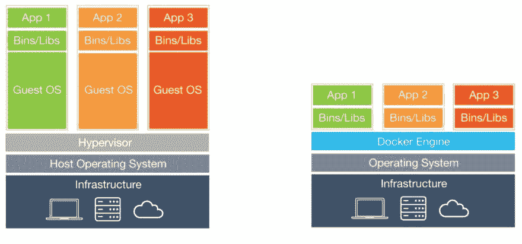
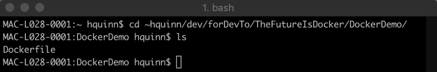
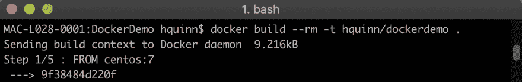
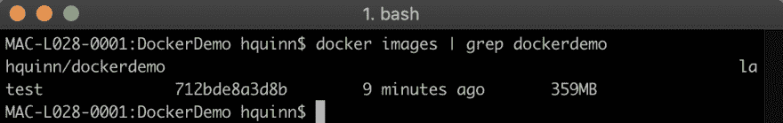
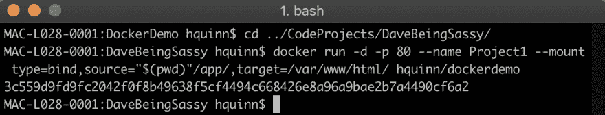
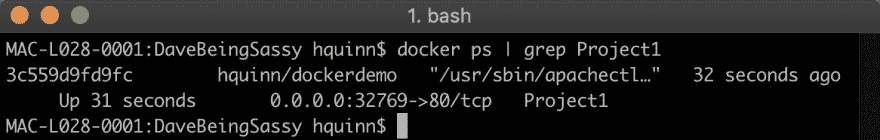
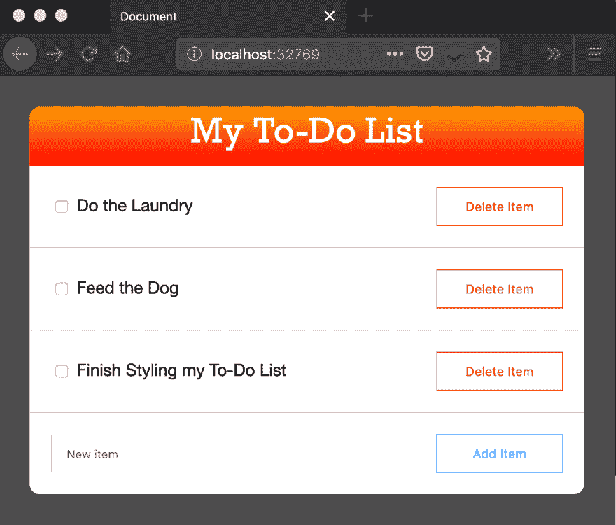
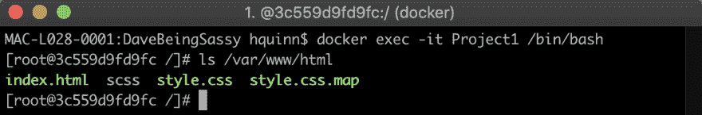
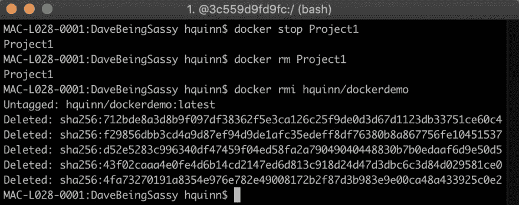

# 码头集装箱的前景

> 原文：<https://dev.to/quinncuatro/the-promise-of-docker-containers-57fd>

嘿伙计们！我的上一篇文章名为[如何将容器融入到你的日常工作中](https://dev.to/quinncuatro/cool-but-what-can-you-actually-use-containers-for-228d)，是关于作为一名开发人员如何使用容器来改进你的工作。

这样做的问题是，它需要你知道如何设置、配置和运行 Docker 容器。

我不应该假设每个人都是带着必备的知识来看这个帖子的，所以这里有一篇我一年半前写的文章。它涵盖了两件事:

1.  作为一名开发人员，容器给你带来了什么好处。

2.  基于 CentOS LAMP 堆栈从头构建映像并旋转容器以服务于 web 应用程序的演示/演练。

我还更新了本文档末尾的附加资源，因此它们是截至 2019 年 7 月 31 日的最新链接/文档/安装程序。

希望你喜欢！

* * *

## 容器的承诺

作为一名 web 开发人员，我相信您已经构建了一两台服务器。你可能会组装一个 Linux 机器，安装一些像 Apache、MySQL 或 PHP 这样的包。也许你从 GitHub 中提取了一些代码，拼凑了一个数据库，并编辑了一些配置文件来使服务器符合你的喜好。

(如果您还没有构建服务器，并且有兴趣了解如何构建，请查看我的 LearnToProgram。名为“服务器管理介绍”的电视课程。-[https://www . udemy . com/introduction-to-server-administration/](https://www.udemy.com/introduction-to-server-administration/))

但是，如果您的服务器损坏了，您的备份在您没有注意到的情况下失败了，或者您的站点像病毒一样传播，流量开始超出您的基础架构所能处理的范围，会发生什么呢？

如果您是服务器管理的新手，这些事件中的任何一个都可能让人望而生畏。如果发生这种情况，您将面临比手动重建服务器更大的问题。您还必须希望您的文档足够全面，能够涵盖您对原始系统所做的每一次修改。你有文件，对吧？

简而言之，任何规模的灾难都会让你沮丧一天或一个深夜。灾难确实会发生，为它们做好准备是明智的。我给你介绍一下 Docker，这是一个容器管理系统。

> "但是亨利，容器到底是什么，我为什么要关心它们？"

问得好。在软件开发的上下文中，容器最好被定义为存在于内核之上的分段的和隔离的用户空间实例。

> “是啊……你能说得简单一点吗？”

我当然可以。解释容器最简单的方法是将它们比作虚拟机。在一台服务器上运行三个不同应用程序的一种方法是运行三个不同的虚拟机，这三个虚拟机由操作系统、应用程序以及应用程序运行所需的任何依赖项组成。在本例的上下文中，容器是运行应用程序所需的最少代码和依赖项的组合。Docker 充当任何数量或类型的容器的客户操作系统。明显的好处是，它比运行几个虚拟机更节省资源。

[](https://res.cloudinary.com/practicaldev/image/fetch/s--mDvfUPxI--/c_limit%2Cf_auto%2Cfl_progressive%2Cq_auto%2Cw_880/https://thepracticaldev.s3.amazonaws.com/i/zg0rqa3mvjifcluo3r97.jpg) 
*来源:[https://images . idgesg . nimg/article/2017/06/virtual machines-vs-containers-100727624-large . jpg](https://images.idgesg.nimg/article/2017/06/virtualmachines-vs-containers-100727624-large.jpg)*

> “字。这开始有意义了。给我画个字图。”

你猜对了。让我们深入了解一下 Docker(和一般的容器)将如何把你的游戏带到另一个高度。使用 Docker 的好处有 50 多种，但是为了简洁起见，我想把重点放在我认为最重要的 5 种上。

### 1。速度

最重要的是，Docker 允许您以编程方式构建基础设施。这意味着，不必在每次需要新服务器时手动构建另一个服务器，您只需根据您需要的最终容器的预定义映像来构建一个服务器。在一个新项目的开始构建这个映像需要更多的时间，但是每次你需要建立一个复制的环境，只需要几分钟而不是几个小时。

### 2。易用性

除了速度之外，在任何给定时刻快速启动您需要的基础架构实例的能力对您的组织来说也是一个巨大的推动。假设你正在开发的应用程序点击了 Reddit 的首页，你的流量失控了。你也可能会被黑客攻击，让你的网站离线。不管怎样，你都需要尽快恢复网络。你的生意很可能依赖于它。至少十次中有九次，启动一个容器比构建一个新的服务器要快。

### 3。安全性

容器的一个基本原则是它们是有围墙的花园。最初的好处是，你可以把应用程序和它们各自的依赖项捆绑在一起，这样如果容器 A 需要 PHP5，容器 B 需要 PHP7，就可以处理好，而不必担心依赖冲突。这两个容器可以并排运行，但它们不会相互妨碍。

围墙花园方法还意味着您可以精确地定义您希望以及是否希望数据流入和流出容器。你会在演示中看到，我们明确地告诉我们的容器“暴露 80”。也就是说，将容器中的端口 80 向运行它的更广泛的系统开放是可以的，这样 Apache 就可以通过该端口完成工作和托管内容。当您开始使用 Docker 构建更复杂的系统时，您可以使用这种安全性将某些运行应用程序的容器链接到其他保存数据库或运行某些特定微服务的特定容器。

### 4。轻便

因为容器(从简单的角度来看)是一个打包了正确运行所需的最少资源的应用程序，所以你可以在任何可以运行 Docker 的设备上运行容器。无论是在 Red Hat Enterprise Linux、MacBook Pro 还是 Windows Server 2016 上，该容器都将按照其应有的方式旋转和运行。

一个额外的好处是，您可以在最终成为您的生产环境的环境中进行开发。您的容器将基于一个图像，图像是关于如何构建一个特定环境的指令的编译列表。您可以使用该图像在笔记本电脑上旋转一个容器，并在其中构建您的应用程序。当您准备好启动时，您可以使用同一个映像在公共服务器上部署一个容器，并完全相信它会像在本地一样运行。

### 5。版本可控性

最后，由于 Docker 允许您以代码的形式构建基础设施，因此您的基础设施可以进入版本控制系统。再给后面的人一次机会。您的基础设施现在可以进行版本控制了。如果您进行了更改，但出现了问题，只需回滚即可。如果您的数据中心不知何故被夷为平地，您可以从远程存储库中取出您的图像和代码。未来的你会感谢现在的你让他们的生活变得更容易。

* * *

## 码头示范

说了这么多，让我们来构建我们的第一个容器。我假设我已经让你相信了 Docker 的有用性，你已经下载并安装了它。如果你还没有，请现在就去做。

[https://docs.docker.com/install/](https://docs.docker.com/install/)

只是为了搞笑，假设我需要一个运行在 CentOS 服务器上的基本站点来做演示。我有两种方法可以做到这一点:我可以花 20 分钟从头开始创建一个新的服务器，或者我可以使用 Docker 构建一个映像，然后可以实例化无数个相同的容器来运行我的站点。

### 1 -创建 Dockerfile

首先，创建一个新的项目目录并创建一个名为`Dockerfile`的文件，这是一个关于如何在一个基础映像上构建一个系统的指令列表。基本映像可以基于 PHP 之类的语言、Node 之类的运行时或 Ubuntu 之类的操作系统。它们通常由源产品的维护者提供。这意味着它们是由软件的创造者专门为与 Docker 良好协作而构建的。

然后，我们需要如何在这个基础上进行建设的指示。我们可以使用一些命令，比如:`RUN`、`ADD`和`CMD`。它们分别运行外壳级命令，将文件从主机映射到容器，并指定在引导时运行的命令。我们采取配置服务器的步骤，并将它们转换成 Docker 可以用来自动化该过程的任务。

这类似于 Git 在幕后的工作方式，因为每次提交(或指令)都是对最后一次提交的一组更改，而不是当时的整个代码库。

为了简单起见，我们将建立一个非常基本的形象。我们的 docker 文件如下:

```
# Dockerfile
# Basic Setup

FROM centos:7
LABEL maintainer="henry@tld.com"

# Update repos and install httpd
RUN yum -y update && \
    yum -y install httpd && \
    yum clean all

# Expose a port from the container to Docker and run the startup script on launch
EXPOSE 80
CMD ["/usr/sbin/apachectl", "-DFOREGROUND"] 
```

<svg width="20px" height="20px" viewBox="0 0 24 24" class="highlight-action crayons-icon highlight-action--fullscreen-on"><title>Enter fullscreen mode</title></svg> <svg width="20px" height="20px" viewBox="0 0 24 24" class="highlight-action crayons-icon highlight-action--fullscreen-off"><title>Exit fullscreen mode</title></svg>

docker 文件读起来惊人地像英语。它只是说，我们希望使用 CENTOS y 作为基础，安装 Apache，公开端口 80 以映射到不同的主机端口，并在引导时启动 Apache。

### 2 -建立你的形象

一旦 Docker 文件被保存，我们将在终端中运行一个“build”命令/这告诉 Docker(实用程序)使用我们的 Docker 文件(指令列表)来构建一个系统。

首先，我们需要打开终端，进入包含 Dockerfile 的目录。对我来说，这个目录就是`~hquinn/dev/forDevTo/TheFutureIsDocker/DockerDemo/`。

[](https://res.cloudinary.com/practicaldev/image/fetch/s--RUXjtvqz--/c_limit%2Cf_auto%2Cfl_progressive%2Cq_auto%2Cw_880/https://thepracticaldev.s3.amazonaws.com/i/x7vv3ghrxf8zcvxs1fwg.png)

然后，我们需要告诉 Docker 实用程序构建 Docker 文件所描述的图像。

[](https://res.cloudinary.com/practicaldev/image/fetch/s--q0ten1b---/c_limit%2Cf_auto%2Cfl_progressive%2Cq_auto%2Cw_880/https://thepracticaldev.s3.amazonaws.com/i/l11fcrekx15c91zumm3z.png)

`--rm`表示我们希望自动删除构建过程中生成的中间容器，`-t hquinn/dockerdemo`用一个名称标记我们的构建，以便我们以后可以更容易地引用它，结尾的`.`表示我们希望在当前的工作目录中运行这个命令。

此命令将把构建过程的每个部分都注销到控制台。这可能需要几分钟，这完全正常。让它坐一会儿；它会告诉你什么时候结束。

### 3 -验证你的形象

一旦 Docker 取下我们选择使用的基础(CentOS 7)，安装 Apache，并完成所有其他指令，我们就会得到一个完成的映像，它是根据 build 命令中的标记命名的。您可以通过列出系统上的 Docker 映像来查看它(以及 CentOS 7 基本映像)。

[](https://res.cloudinary.com/practicaldev/image/fetch/s--B7Quau_3--/c_limit%2Cf_auto%2Cfl_progressive%2Cq_auto%2Cw_880/https://thepracticaldev.s3.amazonaws.com/i/9cvvcz9lz4ebzdf08yos.png)

### 4 -旋转容器

既然映像现在已经构建好了，我们可以用它来生成一个运行的容器。我们将把目录改为我们希望在第一个容器上运行的项目，然后运行一个`docker run`命令。

(在这里，我使用的是戴夫·莫兰的 LTP 课程中的一个示例项目，名为“学习萨斯和 SCSS”——[https://www.udemy.com/learn-sass-and-scss/](https://www.udemy.com/learn-sass-and-scss/)

[](https://res.cloudinary.com/practicaldev/image/fetch/s--0xBdMhkV--/c_limit%2Cf_auto%2Cfl_progressive%2Cq_auto%2Cw_880/https://thepracticaldev.s3.amazonaws.com/i/0qromylrljd4jpsqlesm.png)

这个命令告诉 Docker 运行一个容器——基于我们刚刚构建的映像，但它是一些其他参数。`-d`告诉 Docker 将容器作为守护进程运行(在后台)，`-p 80`将容器上的端口 80 映射到主机上的一个端口，以便可以通过浏览器查看，`--name Project1`也是一种命名资源的方式，`--mount type=bind,source="$(pwd)"/app/,target=/var/www/html/`告诉 Docker 将我们本地的`./app/`目录映射到容器中的`/var/www/html/`，以便 Apache 可以为我们托管它。

### 5 -验证您的容器

既然容器已经加载了我们的代码，我们就可以在浏览器中看到它了。首先，我们需要弄清楚容器的公开端口绑定到哪个本地端口。

[](https://res.cloudinary.com/practicaldev/image/fetch/s--oyIy5dLW--/c_limit%2Cf_auto%2Cfl_progressive%2Cq_auto%2Cw_880/https://thepracticaldev.s3.amazonaws.com/i/n0bsjvk986xe43r4zilb.png)

我们可以看到名为`Project1`的正在运行的容器已经将我们的本地端口 32769 映射到容器上的端口 80(主机端口在您的机器上可能不同)。如果我们打开浏览器，前往`localhost:32769`，我们可以看到我们的代码正在运行。

[](https://res.cloudinary.com/practicaldev/image/fetch/s--iy5uO23M--/c_limit%2Cf_auto%2Cfl_progressive%2Cq_auto%2Cw_880/https://thepracticaldev.s3.amazonaws.com/i/nuitkzsmypz8uuhq62wl.png)

### 6 -放入容器的外壳

这就是全部了。我们可以将基本的 HTML/CSS/JS 应用程序转移到不同的目录，放在名为`./app/`的子目录中，并继续使用相同的命令来生成更多的容器。它们将各自旋转，将代码映射到`/var/www/html/`，并在`localhost`上为每个容器分配一个端口。

我们可以通过运行 Docker 命令来验证容器是否正在拉入我们的代码，该命令授予我们对它的 shell 访问权限。它会让我们作为根用户直接进入 CentOS 系统的根目录。如果我们查看 web 目录，我们可以看到它将我们的文件放入并使用 Apache 托管它们，就像在传统 VPS 上一样。

[](https://res.cloudinary.com/practicaldev/image/fetch/s--ratY59AT--/c_limit%2Cf_auto%2Cfl_progressive%2Cq_auto%2Cw_880/https://thepracticaldev.s3.amazonaws.com/i/zyuiyfkbg96bb93uov84.png)

### 7 -清理

没有一些文件清理，什么样的演示是完整的？如果我们不做任何维护就不断产生容器，我们最终会达到硬件的极限。那不理想。让我们关闭并删除我们旋转的容器，然后删除它所基于的图像。

容器是无形的。一旦用`docker stop`命令停止了一个，我们就可以将它旋转回来，这将与我们第一次启动它时完全相同。为了摆脱一个停止的容器，我们将运行一个`docker rm`命令。为了去掉它所基于的图像，我们将运行一个`docker rmi`命令。

[](https://res.cloudinary.com/practicaldev/image/fetch/s--i0-7udED--/c_limit%2Cf_auto%2Cfl_progressive%2Cq_auto%2Cw_880/https://thepracticaldev.s3.amazonaws.com/i/2tfha1domsdmke9l9nll.png)

* * *

## 其他

Docker 并不像看起来那样是一项不可逾越的技术。可能很难理解，但是一旦你理解了，就很容易看到它能带来的好处。它不仅允许您在与生产环境相同的环境中进行本地开发，还允许您调整基础架构以满足您的需求:无论是扩展以满足病毒式需求，还是从灾难事件中恢复。

此外，这只是 Docker 功能的一小部分。您的构建可以根据需要简单或复杂。例如，我有一个由一组三个容器组成的构建:一个运行节点应用程序，另一个运行 PostgreSQL，通过数据卷的帮助实现数据持久性，第三个充当查询缓存。

作为一名开发人员，Docker 是一个非常强大的工具。老实说，即使它是为了解决一个你还没有的问题。你最终会发现自己处于 Docker 可以拯救你的处境，当你这么做的时候，你就已经准备好了。文档是不可思议的，听起来很老套，但唯一真正的限制是你的想象力。现在，开始以代码形式构建您的基础设施。

* * *

## 附加资源

[文章&对应代码](https://github.com/Quinncuatro/TheFutureIsDocker.git)
[Docker 桌面版安装程序](https://docs.docker.com/install/)
[Docker 入门指南](https://docs.docker.com/get-started/)
[Docker Labs-kata coda](https://www.katacoda.com/courses/docker)
[Docker file 文档](https://docs.docker.com/engine/reference/builder/)

* * *

容器可能是一个很难开始讨论的话题，因为从外部来看，这个领域似乎有太多东西需要学习。然而，一旦你深入研究，它只是一些自动化的轻型系统管理工作，所以你只需要在第一次投入相当多的努力。

希望这篇文章足以帮助至少一个人开始容器启蒙之旅！

此外，我的树莓派 K8s 树莓的零件都在邮件中慢慢到来。明天下午在我的冷却架上等着。迫不及待地开始把这些放在一起，为你们创造更多的内容。

在那之前，保持冷静。

[https://Henry needs . coffee](https://henryneeds.coffee)
[博客](https://henryneeds.coffee/blog)
[LinkedIn](https://linkedin.com/in/henryquinniv)
[Twitter](https://twitter.com/quinncuatro)