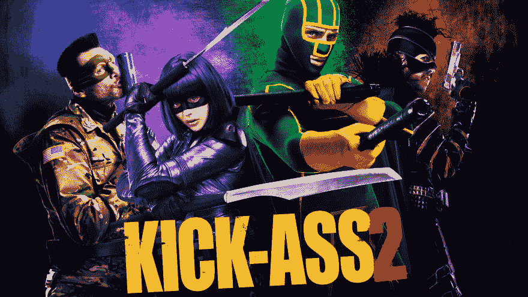
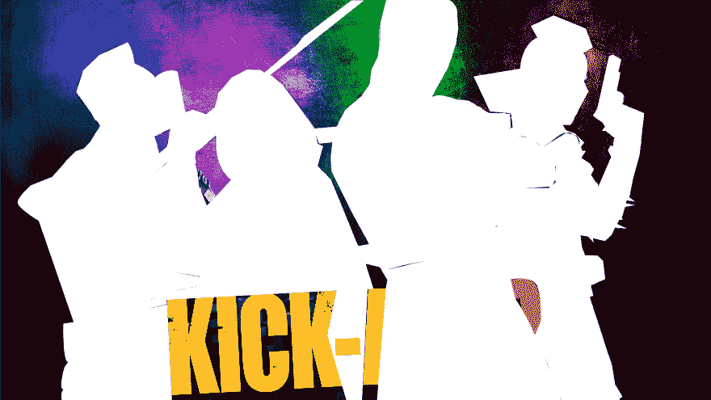

# SVG 技巧:超赞热点！

> 原文：<https://dev.to/jamesthomson/svg-tricks-kickass-hotspots-904>

前驱:本文假设您了解 SVG 的基础知识。如果您还没有发现 SVG，那么现在是最佳时机。SVG 特性背后的力量非常惊人，而且非常有用。今天我们将只讨论其中的一个特性。

## 问题

你可能已经很清楚了，网站上的一切都是一个盒子。我们可以让元素看起来不像盒子，但最终元素和它占据的空间是一个盒子。

在很大程度上，这不是一个问题。我们创造的很多东西都很适合放在一个盒子里，但是当我们不得不创造一些不适合这个模型的东西时，我们该怎么办呢？

例如，假设我们有下面的图像，需要每个字符都是可点击的。

此时你可能会想，“好吧，我可以只使用一个[图像地图](https://developer.mozilla.org/en-US/docs/Web/HTML/Element/map)”，这是真的，但也有局限性，而且使用起来很乏味。

另一个解决方案是将一些元素完全放置在图像的上方，如下所示:

[https://jsfiddle.net/jamesbrndwgn/hvtcnsrj//embedded/result,html,css//dark](https://jsfiddle.net/jamesbrndwgn/hvtcnsrj//embedded/result,html,css//dark)

但是，您会注意到，因为字符相互重叠，所以很难可靠地选择您想要的字符。

## 解

因此，我相信您已经猜到了，我们的解决方案将是使用 SVG！使用 Illustrator(当然，你也可以使用 Inkscape 或任何其他首选工具来创建 SVG ),我导入图像，并使用钢笔工具在每个字符周围创建路径。

这看起来是这样的:

我知道这不太好，但我们会在代码中做一些清理。

简单地改变我们的路径填充属性为透明，我们现在有了不可见的点击区域，就像你制作的一样完美😉)追踪我们的角色...

[https://jsfiddle.net/jamesbrndwgn/6zp92kg0/5//embedded/result,html,css//dark](https://jsfiddle.net/jamesbrndwgn/6zp92kg0/5//embedded/result,html,css//dark)

很酷，是吧？添加一点 javascript 和一些 CSS，世界就是你的了。哦，我有没有提到它完全是流动的？

## 只是为了好玩

我想看看我是否能在一个视频上达到同样的效果，事实证明，通过一点绝对定位，这肯定是可以实现的，如下图所示:

[https://jsfiddle.net/jamesbrndwgn/pjwhez4y/2//embedded/result,html,css//dark](https://jsfiddle.net/jamesbrndwgn/pjwhez4y/2//embedded/result,html,css//dark)

所以现在你有了它，继续前进，尝试你自己的，并在评论中发表你的想法。🙂

一如既往，快乐编码！🤓