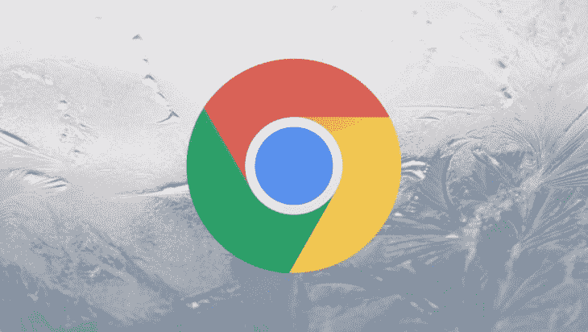
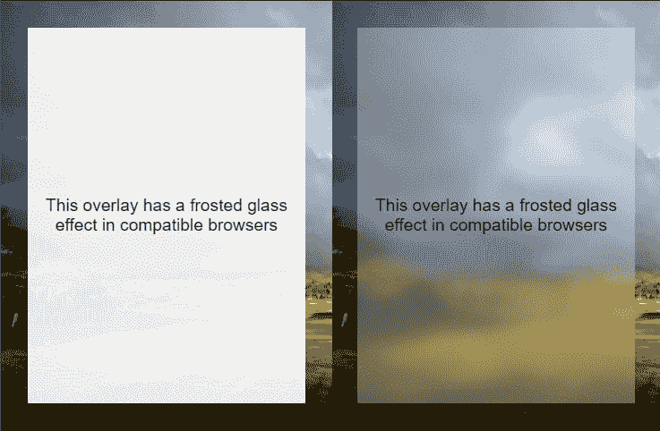
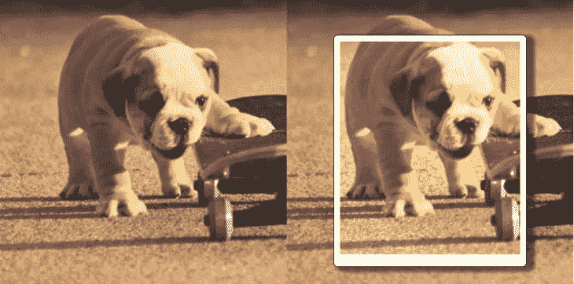

# Chrome 76 的新功能:带背景滤镜的磨砂玻璃效果

> 原文：<https://dev.to/bnevilleoneill/new-in-chrome-76-the-frosted-glass-effect-with-backdrop-filter-hgb>

[](https://res.cloudinary.com/practicaldev/image/fetch/s--GEn4qd9m--/c_limit%2Cf_auto%2Cfl_progressive%2Cq_auto%2Cw_880/https://thepracticaldev.s3.amazonaws.com/i/913i11wqd2uc4tlobzj9.png)

你有没有想过在网络上重现 iOS 设备上那种典型的毛玻璃效果/背景模糊？Google Chrome 最新版本只需要几行 CSS 就可以实现，这要感谢 background-filter 属性的实现！

## 了解背景-滤镜属性

正如自我描述的名字告诉我们的那样，background-filter 允许我们对元素的背景应用 CSS 过滤器。但是我们如何定义背景呢？

在 CSS 中“背景”代表元素后面*所画的[。当然，这意味着使用`backdrop-filter`的第一件事是增加某种透明度，让我们可以看透它。](https://drafts.fxtf.org/filter-effects-2/#backdrop-root-image)*

为此，我们可以不对元素应用任何背景，通过 RGBA 将其设置为半透明，或者对整个元素应用不透明度。请记住，后者还会影响元素的文本节点和所有后代，因此对于大多数情况来说，这可能不是正确的选择。让我们从半透明的白色背景开始:

[](https://logrocket.com/signup/)T3】

```
.frosted{
      background: rgba(255, 255, 255, 0.3);
    } 
```

<svg width="20px" height="20px" viewBox="0 0 24 24" class="highlight-action crayons-icon highlight-action--fullscreen-on"><title>Enter fullscreen mode</title></svg> <svg width="20px" height="20px" viewBox="0 0 24 24" class="highlight-action crayons-icon highlight-action--fullscreen-off"><title>Exit fullscreen mode</title></svg>

接下来，我们要声明过滤器本身。background-filter 接受与 [filter](https://developer.mozilla.org/en-US/docs/Web/CSS/filter) 属性完全相同的值，因此我们可以以多种方式影响背景。从简单的模糊到灰度或棕褐色，甚至任何花哨的类似 Instagram 的滤镜都可以改变图像的色调、亮度、饱和度和对比度。

让我们为毛玻璃效果应用模糊:

```
.frosted{
  background: rgba(255, 255, 255, 0.3);
  backdrop-filter: blur(8px);
} 
```

<svg width="20px" height="20px" viewBox="0 0 24 24" class="highlight-action crayons-icon highlight-action--fullscreen-on"><title>Enter fullscreen mode</title></svg> <svg width="20px" height="20px" viewBox="0 0 24 24" class="highlight-action crayons-icon highlight-action--fullscreen-off"><title>Exit fullscreen mode</title></svg>

差不多就是这样。我说“几行”是认真的。借助一些定位魔法，我们可以得到如下结果:
[https://codepen.io/facundocorradini/embed/OKpreN?height=600&default-tab=result&embed-version=2](https://codepen.io/facundocorradini/embed/OKpreN?height=600&default-tab=result&embed-version=2)

<figure>[](https://res.cloudinary.com/practicaldev/image/fetch/s--vB584Rlo--/c_limit%2Cf_auto%2Cfl_progressive%2Cq_auto%2Cw_880/https://i0.wp.com/blog.logrocket.com/wp-content/uploads/2019/07/frosted-glass-overlay.png%3Fresize%3D737%252C482%26ssl%3D1)

<figcaption id="caption-attachment-4340">结果无背景——滤镜(左)和有背景(右)</figcaption>

</figure>

## 使其对其他浏览器安全

起初只有 [Safari 和 Edge](https://caniuse.com/#search=backdrop-filter) 支持这个属性，现在 Chrome 和基于 Chrome 的浏览器也加入进来。但是我们仍然应该让我们的代码对于 Firefox 和其他小型浏览器和设备是安全的。

好消息是，就像 CSS 中的任何东西一样，如果浏览器发现它不理解的声明，它会简单地忽略它。因此，我们上面使用的方法是安全的，因为任何缺乏背景过滤支持的浏览器都会提供半透明的白色背景，没有任何效果。

但是有些情况下这还不够。也许没有模糊背景的半透明背景无法为文本提供足够的对比度，或者我们希望为不支持背景过滤的浏览器提供完全不同的元素样式。

更安全的方法是使用@supports 查询和渐进式改进。我们应该从声明不支持它的浏览器的样式开始。

在这种情况下，我将使用几乎不透明的白色背景，以增加可读性时，没有模糊应用。

```
.frosted{
  background: rgba(255, 255, 255, 0.9);
} 
```

<svg width="20px" height="20px" viewBox="0 0 24 24" class="highlight-action crayons-icon highlight-action--fullscreen-on"><title>Enter fullscreen mode</title></svg> <svg width="20px" height="20px" viewBox="0 0 24 24" class="highlight-action crayons-icon highlight-action--fullscreen-off"><title>Exit fullscreen mode</title></svg>

然后使用@supports 查询，我们可以在任何支持它的浏览器上应用该效果，并调低 alpha 通道以增加透明度。

```
/* sets default styling */
.frosted{
  background: rgba(255, 255, 255, 0.9);
}

/* applies semi-transparent background for browsers that support backdrop-filter */
@supports (backdrop-filter: none) {
  .frosted {
      background: rgba(255, 255, 255, 0.3);
      backdrop-filter: blur(8px);
  }
} 
```

<svg width="20px" height="20px" viewBox="0 0 24 24" class="highlight-action crayons-icon highlight-action--fullscreen-on"><title>Enter fullscreen mode</title></svg> <svg width="20px" height="20px" viewBox="0 0 24 24" class="highlight-action crayons-icon highlight-action--fullscreen-off"><title>Exit fullscreen mode</title></svg>

请注意，我使用“背景-过滤器:无”作为条件。在检查浏览器支持时，使用最简单的属性值通常被认为是一个好习惯。我可以使用类似于“@ supports(background-filter:blur(8px))”的东西，但这将是重复的，如果有人在将来更改过滤器，可能会看起来非常混乱。

## 不仅仅是磨砂玻璃

我把重点放在磨砂玻璃上，因为这是我长久以来一直想用的，但我们可以应用任何我们想要的滤镜，包括:

*   虚化
*   聪明
*   对比
*   灰度等级
*   色调-旋转
*   转化的
*   不透明
*   饱和的
*   乌贼的墨

此外，我们甚至可以将它们组合成高级的。为此，我们只需定义属性中的所有过滤器(记住，值必须**而不是**是逗号分隔的…不同 CSS 属性之间相当不一致)。

例如，为了重现瓦尔登效应，我们可以使用:

```
.walden{
  backdrop-filter:
    contrast(100%)
    brightness(110%)
    saturate(160%)
    sepia(30%)
    hue-rotate(350deg)
  ;
} 
```

<svg width="20px" height="20px" viewBox="0 0 24 24" class="highlight-action crayons-icon highlight-action--fullscreen-on"><title>Enter fullscreen mode</title></svg> <svg width="20px" height="20px" viewBox="0 0 24 24" class="highlight-action crayons-icon highlight-action--fullscreen-off"><title>Exit fullscreen mode</title></svg>

(来自[尤娜·克拉韦茨](https://twitter.com/una)'[CSS gram](https://una.im/CSSgram/))
[https://codepen.io/facundocorradini/embed/RXpOqX?height=600&default-tab=result&embed-version=2](https://codepen.io/facundocorradini/embed/RXpOqX?height=600&default-tab=result&embed-version=2)

<figure>[](https://res.cloudinary.com/practicaldev/image/fetch/s--z6Xazcpq--/c_limit%2Cf_auto%2Cfl_progressive%2Cq_auto%2Cw_880/https://i1.wp.com/blog.logrocket.com/wp-content/uploads/2019/07/waldeneffect.png%3Fresize%3D730%252C362%26ssl%3D1)

<figcaption id="caption-attachment-4343">不支持背景的浏览器中的结果——过滤器(左)与支持背景的过滤器(右)</figcaption>

</figure>

## Chrome 76 里多了！

当然，背景过滤只是这个新版本的众多改进之一。其他好消息包括对[偏好配色方案媒体查询](https://blog.logrocket.com/whats-new-in-firefox-67-prefers-color-scheme-and-more-195be81df03f/)的支持、omnibar 中简化 pwa 安装的新按钮、对众多 apk 的更新等等。你可以在 [Chrome 的博客](https://developers.google.com/web/updates/2019/07/nic76)上读到它们。

* * *

## Plug: [LogRocket](https://logrocket.com/signup/) ，一款适用于网络应用的 DVR

[](https://res.cloudinary.com/practicaldev/image/fetch/s--6FG5kvEL--/c_limit%2Cf_auto%2Cfl_progressive%2Cq_auto%2Cw_880/https://i2.wp.com/blog.logrocket.com/wp-content/uploads/2017/03/1d0cd-1s_rmyo6nbrasp-xtvbaxfg.png%3Fresize%3D1200%252C677%26ssl%3D1)

[log rocket](https://logrocket.com/signup/)是一个前端日志工具，让你重放问题，就像它们发生在你自己的浏览器中一样。LogRocket 不需要猜测错误发生的原因，也不需要向用户询问截图和日志转储，而是让您重放会话以快速了解哪里出错了。它可以与任何应用程序完美配合，不管是什么框架，并且有插件可以记录来自 Redux、Vuex 和@ngrx/store 的额外上下文。

除了记录 Redux 动作和状态，LogRocket 还记录控制台日志、JavaScript 错误、stacktraces、带有头+体的网络请求/响应、浏览器元数据、自定义日志。它还使用 DOM 来记录页面上的 HTML 和 CSS，甚至为最复杂的单页面应用程序重新创建像素级完美视频。

[免费试用](https://logrocket.com/signup/)。

* * *

Chrome 76 中的新帖子[:带有背景滤镜的磨砂玻璃效果](https://blog.logrocket.com/new-in-chrome-76/)最早出现在[博客](https://blog.logrocket.com)上。