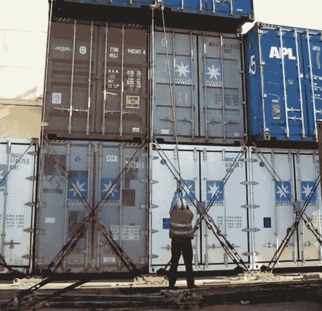

# 镇上新来的小孩:Fedora Silverblue！

> 原文：<https://dev.to/andreanidouglas/the-new-kid-in-town-fedora-silverblue-j0g>

2019 年 4 月 30 日， [Fedora 项目](https://getfedora.org/)发布了其 Linux 发行版的第 30 版。

在被 IBM 收购后，Fedora 不再由 Red Had 维护，它现在是一个基于 **4 Foundations** (自由、朋友、特性和优先)的完整的基于社区的发行版。

对于这个版本，Fedora 还提供了 3 个额外的*新兴*来完善其阵容:

*   Fedora CoreOS(最小容器焦点发行版)
*   Fedora IoT(物联网基础设施 OSS 平台)
*   Fedora Silverblue(基于容器工作流的不可变工作站)

在这篇文章中，我将讨论最后一个，但是请在评论中告诉我，我们也可以讨论其他两个。

## 整体

Silverblue 是 linux 发行版中的一个新概念。如前所述，是一个不可变的操作系统。它的目标是为开发者和专业人士提供一个强大、稳定和可靠的平台。

不可变意味着每一个安装都是完全一样的，更容易开发和测试，更不容易出错。但这也意味着用户不允许改变操作系统的结构。

不过用户世界的体验会和标准的 Linux 发行版有所不同。乍一看，您将拥有正常的 Gnome 环境，**应用程序商店**将拥有您需要的大多数熟悉的应用程序。除了不会直接安装到操作系统之外，它们将作为常规应用程序运行。每个应用程序都将存在于一个名为 Flatpak 的沙盒环境中。

对于开发者来说，游戏的名字是容器化。Silverblue 提供了许多功能来为您的所有项目创建和部署容器。

## 使用银蓝色

安装 Fedora Silverblue 就像普通的 Fedora 工作站一样简单，只需从主网站[silverblue.fedoraproject.org](https://silverblue.fedoraproject.org/)下载镜像，创建一个可启动的闪存驱动器(你可以使用 Etcher 来完成这个)，然后按照说明提示进行操作。

当你第一次登录时，你会看到一个漂亮的 Gnome 环境，就像其他发行版一样。如果可用，它将开始下载当前环境的任何可用更新，并在完成后提示您安装它们。

这些下载是软件的新版本，但更重要的是操作系统更新。这些更新由维护者小组正式发布，可以用命令`$ rpm-ostree status`检查。

要强制下载新版本，只需发出`$ rpm-ostree update`(每次更新都需要重启工作站)。如果任何升级试图破坏您的操作系统或任何功能，只需回滚到以前的状态`$ rpm-ostree rollback`。

软件可以通过**软件中心**获得(阅读这个[链接](https://docs.fedoraproject.org/en-US/fedora-silverblue/getting-started/)来添加更多的库到列表中)。

对于开发者来说，最重要的特性是**工具箱**:

工具箱是基于容器的开发环境，您可以在其中创建和探索，而不会损坏基础系统。输入`# toolbox create --container=<container_name>`可以创建一个简单的容器。

这将下载一个最小 fedora 容器的最新映像，发出`# toolbox enter --container=<container_name>`进入其中的一个 shell 会话。从这里开始，你可以把它当作一个普通的 Fedora 工作站发行版，命令`dnf`会成为你朋友下载任何必要的软件包(例如`$ dnf install python3.7`)

## 结论

那么，你对这种新方法有什么想法？您认为自己会利用 Silverblue 的任何功能吗？我的笔记本电脑已经安装了 Silverblue，并且随时可以使用，静态不可变操作系统是个好主意。不用再搞混内核版本或处理同一软件的多个版本(例如 python2.7 对 python3.7)。