# 使用 pipenv 设置 Python 开发环境

> 原文：<https://dev.to/davidshare/setting-up-a-python-development-environment-with-pipenv-3lfj>

## pipenv 是什么？

 照片来源:[拍个 Mem.org](https://makeameme.org/meme/you-have-a-h86fi4)

根据官方文档，“ [Pipenv](https://docs.pipenv.org/en/latest/) 是一个工具，旨在将所有包装领域(捆扎机、作曲家、npm、货物、纱线等)的精华。)到 Python 世界。”"它将 Pipfile、pip 和 virtualenv 整合到一个命令中."

## 这是什么意思？

 照片来源:[拍个 Mem.org](https://makeameme.org/meme/what-do-you-5c1659)

首先，我们需要理解什么是包管理器。软件包管理器是在管理(安装、卸载和升级)软件包或模块的过程中提供帮助的工具。如果你以前用过 node.js，你应该用过 NPM (node Package Manager ),它用于管理你在 Node 上使用的 JavaScript 模块。pipenv 所做的是帮助管理用于构建项目的 python 包，就像 NPM 所做的那样。

Pipenv 通过创建一个虚拟环境来隔离您为项目安装的不同软件包。在 pipenv 之前，它们是用于创建虚拟环境的其他 python 包管理器，如 virtualenv，但是它们有自己的问题。

## 为什么要虚拟环境？

嗨！我叫皮普。我是 python 的标准包管理器。我可以帮你安装和卸载 python 包。但是，我将它们安装在您系统环境的全局范围内。

### 为什么这是个问题？

假设您的计算机上有大约 5 个 Django 项目，每个项目都使用自己的 Django 版本，每个版本的 Django 都有不同版本的依赖项。如果你真的和我一起想象，你会很快意识到依赖关系之间必然会有冲突。也许，较低版本的依赖项将被覆盖，导致您的某个应用程序中断，这不是您想要的。

一个简单的解决方案是为每个项目创建一种隔离形式，这样它们就不会互相干扰，从而避免 Django 内战。这就是虚拟环境的用武之地。在从事单个项目的软件开发团队中，共享包含运行应用程序所需的所有包的描述的文件是一种常见的做法。Pip 使用 requirement.txt 文件。然而，随之而来的是一些问题。

requirements.txt 文件没有注意到正在安装的软件包的具体版本。这可能会导致未来的问题，因为运行“pip 安装”将获得最新版本的软件包，这可能会导致应用程序中断。虽然这个问题可以通过固定(手动指定)版本来解决，但是这对于包的依赖关系是无效的，因为它们被记录在 requirements.txt 文件中。

让我更清楚地说明一下——假设您有两个用 pip 安装的包(p1 v.0.01 和 p2 v.0.02)。这些包都有自己的依赖项。requirements.txt 文件中只会记录上述包。因此，即使它们没有升级到最新版本，它们的依赖关系也不会被固定，并且可以升级，从而导致应用程序中断。

## 为什么 pipenv

*   Pipenv 通过为运行每个单独的项目创建虚拟环境来解决上述问题，因此它们的包和依赖项不会冲突。

*   第二，pipenv 使用 pipfile 和 pipfile.lock 文件管理已安装的包及其依赖项的记录。pipfile 跟踪所有已安装的软件包，pipfile.lock 文件跟踪它们的依赖关系。整个事情有趣的地方在于，您可以很容易地为还没有使用 pipenv 的人生成 requirements.txt 文件。

*   过去，我们有其他用于创建虚拟环境的包来帮助解决这个问题，其中之一是 virtualenv 包，但它的设置和使用有点繁琐。Pipenv 让你更容易管理你的软件包。它结合了 pip 和 virtualenv 来为您的项目创建虚拟环境。

[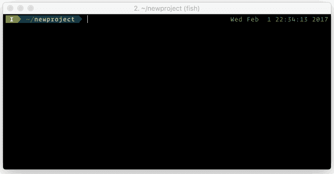 ](https://res.cloudinary.com/practicaldev/image/fetch/s--SqEJYBlL--/c_limit%2Cf_auto%2Cfl_progressive%2Cq_66%2Cw_880/https://thepracticaldev.s3.amazonaws.com/i/epdxe11gnoglo79ltx9c.gif) `Image Source: https://docs.pipenv.org/en/latest/`

说够了，让我们开始工作吧。
 
图片来源: [imgflip](https://imgflip.com/i/kv4si)

## 设置 pipenv

为了演示 pipenv 是如何工作的，我们将建立一个基本的 Django 项目。但是要做到这一点，我们需要安装 python 和 pip。

### 安装 python3

我们将安装 python3，这是 python 的最新版本。最简单的方法是访问:[https://www.python.org/downloads/](https://www.python.org/downloads/)，下载适合你的操作系统的软件包并安装。对于本文，我将在 Mac OSX 环境下工作。因此，您也可以通过终端安装 python，步骤如下:

*   如果您还没有安装 Xcode，请访问 app store 安装它:[https://apps.apple.com/us/app/xcode/id497799835](https://apps.apple.com/us/app/xcode/id497799835)。安装完成后，打开您的终端并输入以下代码:xcode-select - install

*   如果尚未安装 homebrew，请在您的终端上运行以下代码进行安装:/usr/bin/ruby-e " $(curl-fsSL[https://raw . githubusercontent . com/home brew/install/master/install)](https://raw.githubusercontent.com/Homebrew/install/master/install))"

安装过程运行完毕后，您可以键入`which brew`来查看安装的自制软件的位置。家酿是一个用于 mac 的软件包管理器，你的输出应该类似于这个
[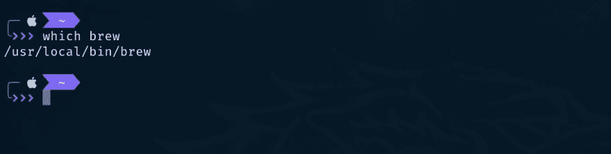](https://res.cloudinary.com/practicaldev/image/fetch/s--cI4FYIQk--/c_limit%2Cf_auto%2Cfl_progressive%2Cq_auto%2Cw_880/https://thepracticaldev.s3.amazonaws.com/i/rmb0gqi273eoh8ky2g9q.png)

*   安装 python 3。要安装 python3，请运行 brew install python3 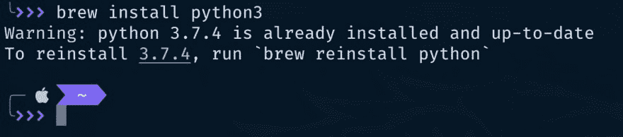

在我的电脑上，它显示我已经安装了 python3，它还显示我已经安装的 python3 的版本。

要验证是否安装了 python3，请在终端上键入:`which python3`
[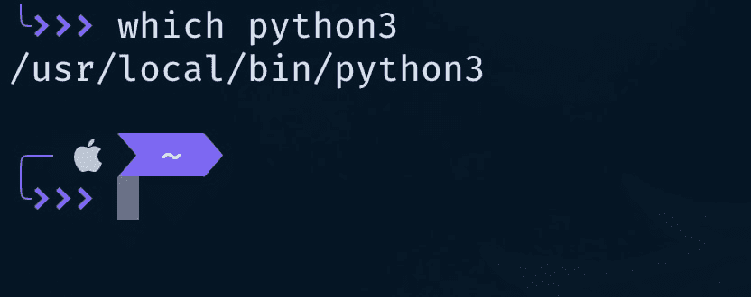](https://res.cloudinary.com/practicaldev/image/fetch/s--P5NBvb3x--/c_limit%2Cf_auto%2Cfl_progressive%2Cq_auto%2Cw_880/https://thepracticaldev.s3.amazonaws.com/i/9warcnhv786i2n0zus92.png)

当你使用 homebrew 安装 python3 时，它会自动安装 pip3
你可以通过运行`which pip3`或`pip3 --version`来验证 pip3 是否已安装

### 安装 pipenv

要安装 pipenv，运行 Pip3 安装 pipenv
[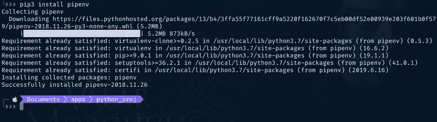](https://res.cloudinary.com/practicaldev/image/fetch/s--u4KQU4RH--/c_limit%2Cf_auto%2Cfl_progressive%2Cq_auto%2Cw_880/https://thepracticaldev.s3.amazonaws.com/i/nukyhxweyq126lxg7f3q.png)

如果您在屏幕截图中查看我的输出，您会看到一些地方写着“需求已经满足”——这是因为我已经安装了 virtualenv，还记得我告诉过您 pipenv 可以与 virtualenv 和 pip 一起工作。

### 我们目前处于哪个环境？

当我运行“pip3 freeze”时，您会看到它显示了我当前环境(即全局环境)中的所有包。当我们在没有安装任何软件包的情况下，在虚拟环境中运行相同的命令时，您很快就会看到不同之处。
[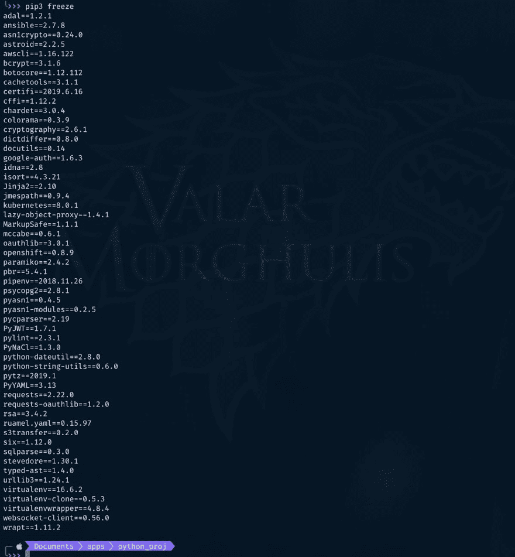T3】](https://res.cloudinary.com/practicaldev/image/fetch/s--dpAjEkSG--/c_limit%2Cf_auto%2Cfl_progressive%2Cq_auto%2Cw_880/https://thepracticaldev.s3.amazonaws.com/i/2whv2b7hoq7kz50ohjuz.png)

### 启动虚拟环境

为了创建我们的虚拟环境，我们必须为我们的项目创建一个目录，并在该目录中运行命令。
[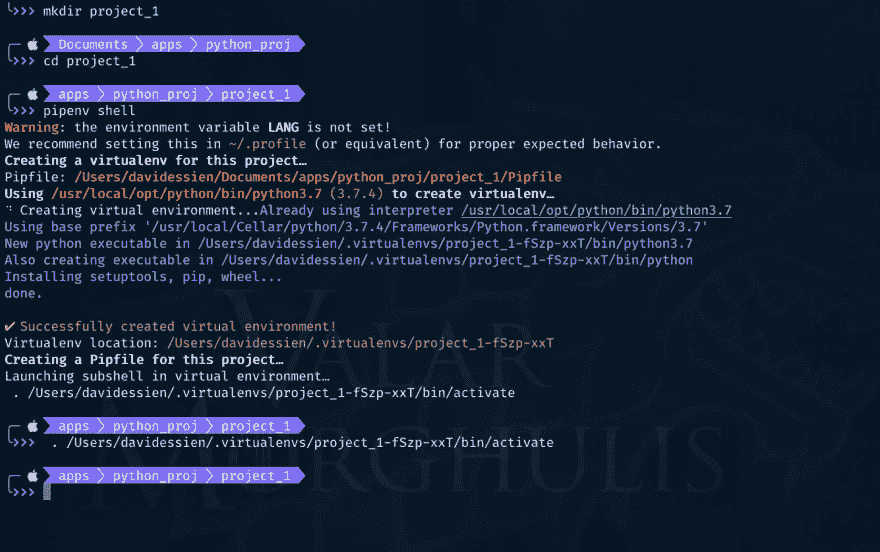T3】](https://res.cloudinary.com/practicaldev/image/fetch/s--_mpETI8R--/c_limit%2Cf_auto%2Cfl_progressive%2Cq_auto%2Cw_880/https://thepracticaldev.s3.amazonaws.com/i/z43lmdxjao13ypq4pxa9.png)

查看上面的截图，您会发现我运行了以下命令:

*   `mkdir project_1` -创建新的项目目录
*   `cd project_1` -将我当前的工作目录更改为我刚刚创建的新目录
*   `pipenv shell` -创建一个新的虚拟环境，您会注意到环境已经成功创建。

### 验证我们所处的环境

为了验证我们已经更改了环境，运行`pip3 freeze again` :
[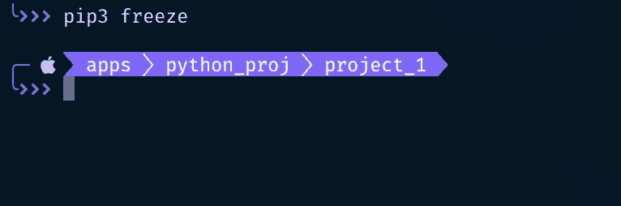](https://res.cloudinary.com/practicaldev/image/fetch/s--Vp_x1HKP--/c_limit%2Cf_auto%2Cfl_progressive%2Cq_auto%2Cw_880/https://thepracticaldev.s3.amazonaws.com/i/3g85xffdhs2eu38v31tz.png) 
与前面的输出不同，您会注意到没有任何结果。这是因为我们已经不在全球范围内，在这个新环境下，我们没有安装任何 app。另外，如果您检查项目目录，您会注意到已经创建了一个新的 Pipfile。
[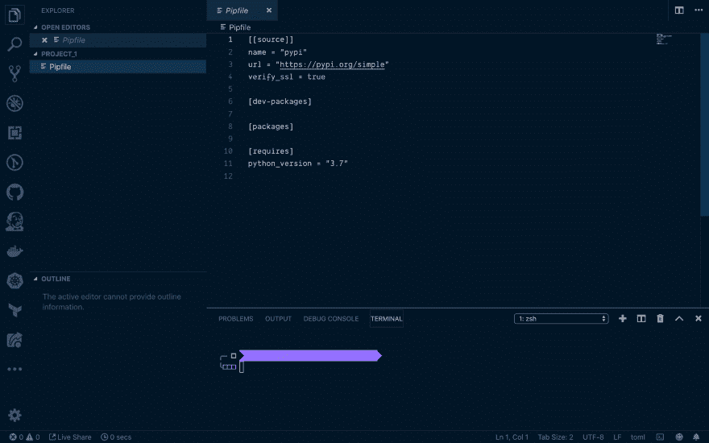](https://res.cloudinary.com/practicaldev/image/fetch/s--q0DZT3Yx--/c_limit%2Cf_auto%2Cfl_progressive%2Cq_auto%2Cw_880/https://thepracticaldev.s3.amazonaws.com/i/0pgkhgle6h6ecte87hr0.png)

pipfile 是用一种叫做 TOML 的配置语言(Tom 的明显的最小化语言)编写的。它意味着编写易于阅读的配置文件。我们不会为前四行而烦恼。

*   第 6 行指出了仅用于开发目的的包将被列出的位置。这些包不会安装在生产环境中，只会安装在测试和开发环境中。
*   第 8 行表示将列出基于生产的包的部分
*   第 11 行表示使用或需要的 python 版本。
*   注意，您可以手动将包添加到这个文件中，并在您的终端上运行`pipenv install`来安装它们。

现在，让我们安装一个新的包，看看会发生什么。我们将安装姜戈
[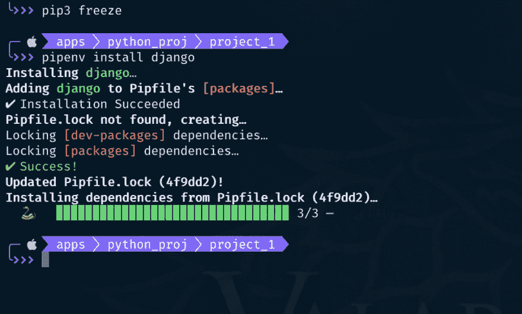](https://res.cloudinary.com/practicaldev/image/fetch/s--KaCbwtSx--/c_limit%2Cf_auto%2Cfl_progressive%2Cq_auto%2Cw_880/https://thepracticaldev.s3.amazonaws.com/i/tco3hp0blyqu8528q3xr.png)

您会注意到我没有指定要安装的 Django 版本。您还会注意到，它搜索了一个 Pipfile.lock 文件，并在找不到任何文件时创建了一个。
[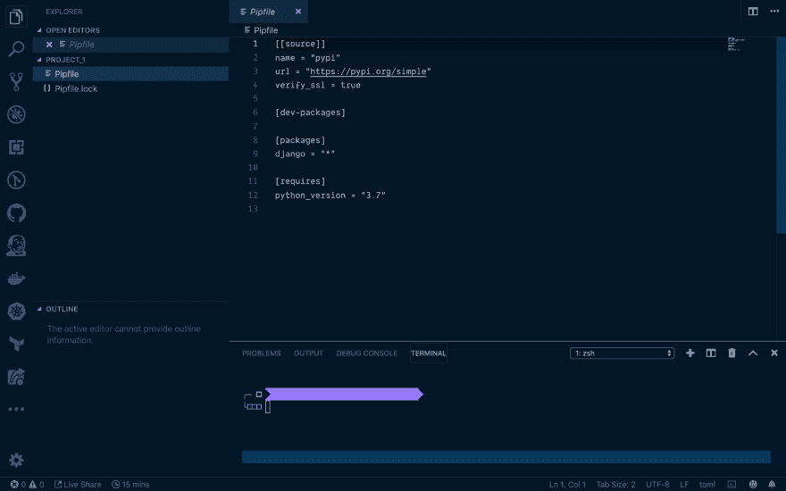T3】](https://res.cloudinary.com/practicaldev/image/fetch/s--NuwcUpQw--/c_limit%2Cf_auto%2Cfl_progressive%2Cq_auto%2Cw_880/https://thepracticaldev.s3.amazonaws.com/i/i8ky59w8bi07kwo14ujl.png)

在我们的代码编辑器中，您还会发现 Django 已经被添加到包列表中。版本用星号指定。这意味着每当有人运行 pipenv install 时，它将总是安装最新版本。我们也可以将星号更改为我们想要的版本。您还会注意到生成了一个 piplefile.lock 文件。这将跟踪所有已安装的软件包及其依赖项。
[T3】](https://res.cloudinary.com/practicaldev/image/fetch/s--fPa0NEiv--/c_limit%2Cf_auto%2Cfl_progressive%2Cq_auto%2Cw_880/https://thepracticaldev.s3.amazonaws.com/i/nzm2c06rue54k0eao57i.png)

我们可以做的另一件事是再次运行 pip3 freeze 命令。您会注意到这里只列出了 pipfile.lock 文件中列出的包。
[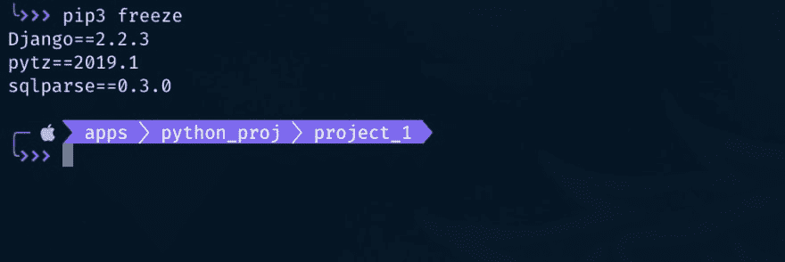T3】](https://res.cloudinary.com/practicaldev/image/fetch/s--ztjHAux---/c_limit%2Cf_auto%2Cfl_progressive%2Cq_auto%2Cw_880/https://thepracticaldev.s3.amazonaws.com/i/bokkkzm6q1u3uh8l1hw4.png)

### 检查当前环境

您可以键入以下命令来验证您所处的环境:

*   `Python` -这将启动 python shell，如下图所示。
*   `Import sys` -导入 sys 模块
*   `Sys.excutable`——这应该打印出您正在运行的当前 python 环境的路径
*   键入`exit()` -退出 python shell 键入`exit` -退出环境。
*   重复前 3 个命令，您会注意到输出是不同的。这是因为截至目前，mac 预装了 python 2.7。由于您不再处于您创建的虚拟环境中，您将获得不同的输出。您也可以运行 pip3 冻结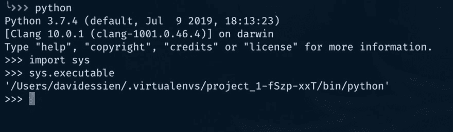

### 测试我们的 Django 安装

*   确保您位于创建环境的目录中
*   键入`pipenv shell` -激活环境
*   运行`django-admin startproject bookstore .` -句号(。)表示应该将它安装在当前目录中，并调用项目书店。执行该命令后，您可能看不到任何输出。
*   在终端上键入`ls`，您将看到一个名为 bookstore 的新目录已经创建。您还会注意到另一个名为 manage.py. 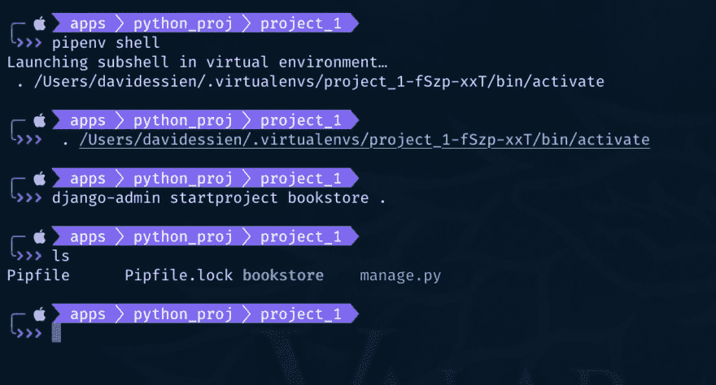的文件

### 运行 Django app

要运行 Django 应用程序，请在终端上键入以下命令:

*   `python manage.py runserver`
*   复制终端中突出显示的 URL，将其粘贴到浏览器地址栏中，然后按 enter 键运行它。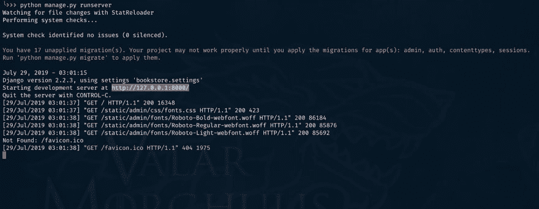

### 现在你有了你的 Django 应用程序

[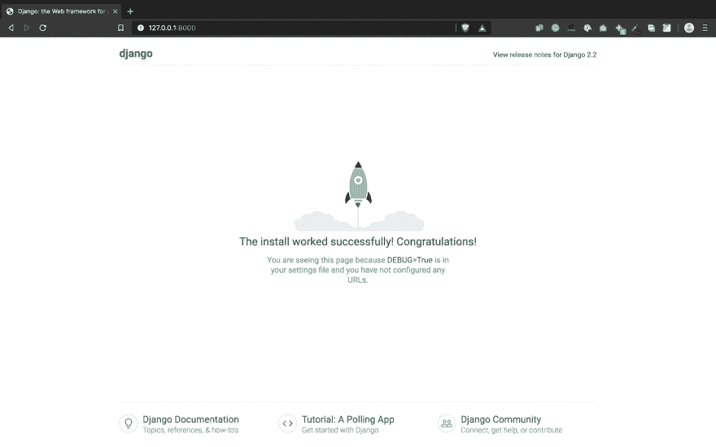](https://res.cloudinary.com/practicaldev/image/fetch/s--D_vX6Jno--/c_limit%2Cf_auto%2Cfl_progressive%2Cq_auto%2Cw_880/https://thepracticaldev.s3.amazonaws.com/i/syfvhg88wx9lrz8ziyn4.png)

## 需求. txt 文件

如前所述，requirements.txt 文件用于在使用 pip 时记录已安装的软件包。如果您需要与使用 pip 而不是 pipenv 的人一起工作，您可以与他们共享 requirements.txt 文件:

### 创建一个 requirements.txt 文件

*   运行`pipenv lock -r`命令显示已安装软件包的列表。
*   复制上面执行的命令的输出，并将其粘贴到 requirements.txt 文件中，并将其推送到您的项目存储库中。另一个开发者，只需要运行`pip install`，所有的包和它们的依赖项都会被安装。

## 生成自己的 pipfile.lock

如果您有一个 requirements.txt 文件，您可以生成您的 pipfile.lock

*   将 requirements.txt 文件放在您的项目目录中
*   运行`pipenv lock`
*   运行`pipenv install --ignore-pipfile`——这将使用 pipfile.lock 安装所有软件包及其依赖项，并将忽略 pipfile。

# 其他有用的 pipenv 命令

### 列出当前环境中安装的软件包

*   Pipenv lock -r
    [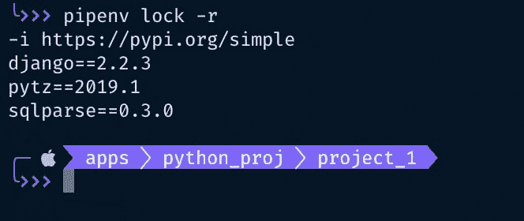](https://res.cloudinary.com/practicaldev/image/fetch/s--thSSmhTO--/c_limit%2Cf_auto%2Cfl_progressive%2Cq_auto%2Cw_880/https://thepracticaldev.s3.amazonaws.com/i/7qbp6qy6tu95slb2jr9r.png)

*   Pipenv 卸载软件包卸载软件包
    [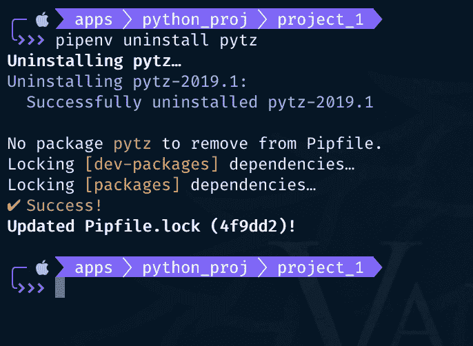](https://res.cloudinary.com/practicaldev/image/fetch/s--iKiRWOmW--/c_limit%2Cf_auto%2Cfl_progressive%2Cq_auto%2Cw_880/https://thepracticaldev.s3.amazonaws.com/i/fap3pavtyn7c2k7wp2zm.png)

*   为开发环境安装软件包
    [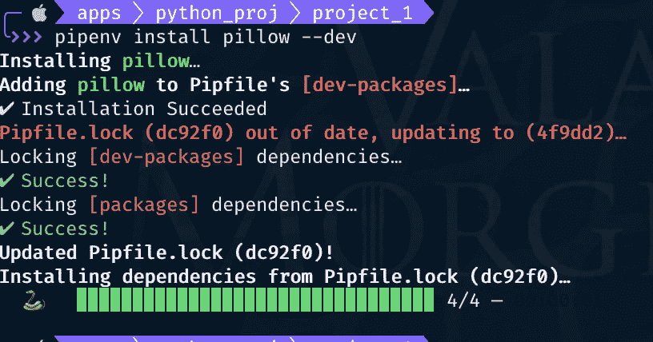](https://res.cloudinary.com/practicaldev/image/fetch/s--5oK0gfxW--/c_limit%2Cf_auto%2Cfl_progressive%2Cq_auto%2Cw_880/https://thepracticaldev.s3.amazonaws.com/i/mkiyp4cbnmn363tymogz.png)

*   检查安全漏洞
    要检查包中的漏洞，可以运行`pipenv check`
    [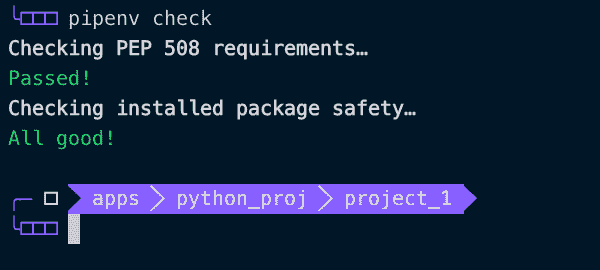](https://res.cloudinary.com/practicaldev/image/fetch/s--PYNP-VJI--/c_limit%2Cf_auto%2Cfl_progressive%2Cq_auto%2Cw_880/https://thepracticaldev.s3.amazonaws.com/i/td7dvn88b3n0k3r17d6e.png)

*   查看包依赖图
    通过运行:`pipenv graph`
     可以看到你项目的所有包及其依赖关系

*   环境变量
    你也可以将环境变量添加到你的项目中

    *   创建一个. env 文件
    *   向其中添加环境变量
    *   密码= '我的密码'
    *   `pipenv run python`你会看到环境变量加载导入 OS OS . environ[' PASSWORD ']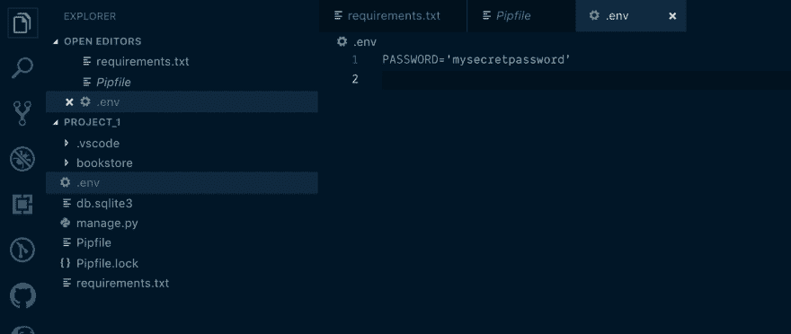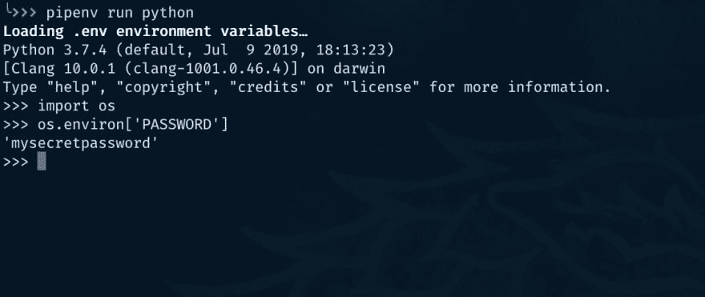
*   删除一个虚拟环境
    你也可以删除这个环境。请注意，这不会删除在项目中创建的资源或文件。它只是让环境变得不活跃。
    T3[T5](https://res.cloudinary.com/practicaldev/image/fetch/s--SqOdvUun--/c_limit%2Cf_auto%2Cfl_progressive%2Cq_auto%2Cw_880/https://thepracticaldev.s3.amazonaws.com/i/bz2ct1u93epuw49oscmh.png)

我希望你喜欢我的教程。请留下您的反馈，以便我可以更好地分享。记得喜欢和分享，这样别人才会从中学习。