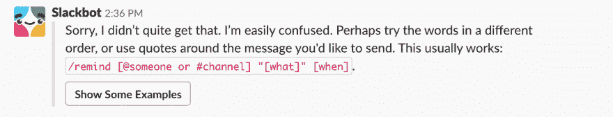
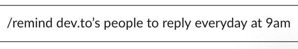

# slack 中`/remind '命令的有趣例子

> 原文：<https://dev.to/leojpod/the-interesting-case-of-the-remind-command-in-slack-ihl>

不久前，当我在 slack 上设置一些提醒以便我不会忘记我应该做的代码审查时，我错过了键入我想让 slack 记住的内容。它给我看了这条求助信息:

我以前无数次看到过这条信息，但我不知道为什么我停顿了一下。`@someone`？真的吗？我可以让 slackbot 随时通知其他人吗？即使我不在线？让我们试一试，好吗！

接下来，我给我的同事们设置了几个提醒，这样他们就不会忘记时不时地喝点咖啡、散散步来提神...

然而，当专注力可能是开发人员最宝贵的资产时，我们却能在一条线上偷走我们同事的专注力，这不是很奇怪吗？
为了防止任何报复，我开始使用`/dnd`命令在给定的时间内关闭任何通知。作为一个偶尔吃番茄的人，我必须承认使用`/dnd 25 minutes`效果很好。

有人发现了一个有用的用例来提醒其他人吗？

