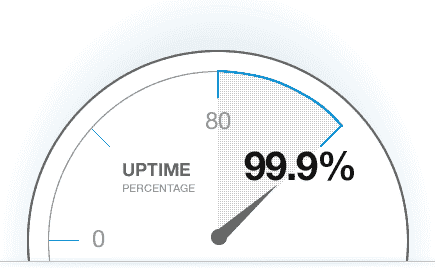
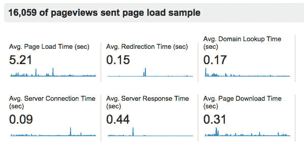
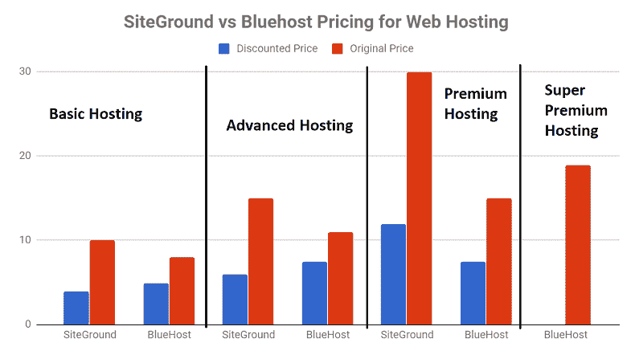

# 选择共享虚拟主机时要考虑的 4 个重要因素

> 原文：<https://dev.to/ndiatko/4-important-factors-to-consider-when-choosing-shared-web-hosting-3p2m>

当他们有选择共享虚拟主机的任务时，大多数人只关注它的一个方面:负担能力。

无可否认，好的共享虚拟主机并不需要花费很多钱。但这是唯一应该考虑的因素吗？

让我来看看“伟大的主机提供商”这个概念。

应该是什么样的？

这个概念的关键方面是什么？

首先，它的服务器，即主机，应该工作。(显而易见，确实如此。)如果没有，你就不能使用你的网站。如果无法访问您的页面，您的受众将无法在网上找到您并实际向您购买。因此，简单的工作可以被认为是一个标准。有主机服务提供商，往往是停机！

让我想想是什么造就了优秀的主机性能。

有两个关键的东西:**正常运行时间和加载时间**。也就是说，页面运行了多长时间，加载速度有多快。

第二，你不应该被留在自己的设备，所以有人代表公司可能是有用的。

所以第二个因素是**客户支持**。

最后，价格标签很重要。如果你负担不起，你将无法使用这些服务。

总而言之，当选择共享虚拟主机时，要考虑的最重要的因素是:

*   正常运行时间
*   加载速度(响应)
*   客户支持
*   价格。

让我仔细看看它们。

## 正常运行时间

正常运行时间。这篇文章中值得强调的事情。选择共享虚拟主机是一个非常重要的考虑因素，原因有二。

1.  如果正常运行时间不尽如人意，你的受众将无法访问你的页面并与你联系。
2.  正常运行时间是一个相当不稳定的特征。比如可以优秀一年左右，然后砰！你的网站关闭了几个小时。

这就是为什么你应该设法找到你选择的主机提供商有多好的信息。不仅仅是最近有多好，而是在一年或更长的时间里。通过这样做，您将能够看到最近的问题是否是一个暂时的问题。或者相反，它已经持续走下坡路十个月了。

正常运行时间会受到多种因素的影响。这是其中的一些。

*   服务器过于拥挤(如果你使用共享主机)；
*   安全问题。

不管他们是什么，选择稳定的共享虚拟主机。

今天，高质量的主机可以吹嘘 99.998%甚至更高的正常运行时间。99.970%可能看起来也很棒。但是，即使是这样令人印象深刻的数字也可能转化为几十分钟的停机时间。根据你的网站的要求，这可能是一个问题。有些页面应该可以在任何时候立即获得。在这种情况下，正常运行时间变得更加重要。

除了研究和分析长期表现的统计数据，你可以尝试另一种策略:依靠团队建立测试页面和监控正常运行时间的网站(使用各种[监控软件](https://www.techradar.com/best/best-website-monitoring-software))来了解特定的共享虚拟主机公司有多好。

此外，还有一些服务可以识别网站属于哪个主机提供商，并试图[监控其正常运行时间](https://www.hrank.com/)。他们定期检查网站是否在线，这使他们能够提供关于特定主机提供商正常运行时间的客观数据。

传统的“阅读评论”方法也可以。不过，要小心。不是都是真实用户发的。

例如，最受欢迎的托管论坛是[webhostingtalk.com](http://www.webhostingtalk.com/)。

使用谷歌，你可以搜索关于一个特定的主机提供商的信息和讨论它的线索:

site:webhostingtalk . com+" site ground "
[site ground](https://www.siteground.com)这里是以托管公司为例。

## (响应加载速度)

响应时间是服务器响应所需的时间，而加载时间是服务器有效通信和网站本身加载所需的总时间。意味着你的网站速度有多快，不仅取决于你的主机提供商的设备有多好，还取决于你用的是什么内容。后者包括代码错误(这些错误会阻止页面正常加载，从而影响速度)和未优化的内容。

然而，如果内容是你可以调整的，调整服务器是不可能的。这就是为什么在分析提供商服务器的性能统计数据时，响应时间是首先要注意的事情之一。

如果接近 300-400ms，说明速度够用。从目前公司提供的服务来看，这是一个不错的结果。相反，如果是 1000 毫秒左右或更长，你应该三思而行。问题是有些项目可以忍受 1000 毫秒，而有些项目需要更快的时间。这是因为他们的要求更高，因为他们很受欢迎。

## 客户支持

客户支持是您与主机提供商互动的地方。这是你必须联系的人。)出现问题。

这就是为什么你应该试着了解团队是否 24 小时可用，以及可用的沟通方式(聊天、门票、电话等)。)。

能够获得 24/7 的**技术支持至关重要。确保不仅有销售支持聊天，还有技术支持，并且可以通过实时聊天获得，因为它使您能够快速解决问题。当一个网站享有巨大的流量时，在几分钟内解决它们是至关重要的。这就是为什么售票系统并不总是一种快捷的通信方式。**

此外，还有一个选择是尝试提前联系团队。

这样你可以看到他们是否有帮助，并真正倾听你想说的话。一些公司因发送没有真正建议的机器人信息而臭名昭著。

## 价格

没有太多可以添加的，选择一个在你预算内的选项。这取决于你想发起什么样的项目。

不过，对过于便宜的报价要小心。质量不一定会像价格标签那样吸引人。

平均来说，你可以找到低至 5 美元甚至更低的高质量主机。价格由包含的功能、带宽、额外选项和其他因素决定。另一件要记住的事情是，你应该仔细阅读报价的细节。这是因为托管公司经常显示一个很大的价格，只是为了在“促销月”结束后向你收取更多的费用。

这也是价格重要的原因。当你计划你的预算时，想一想初始阶段后你将被收取多少费用。也要小心追加销售！

在选择共享虚拟主机时，这四个因素都很重要。我按优先顺序排列它们。一般来说，选择新进入这个领域的人只基于一个因素，那就是支付能力。

可以理解。由于评估正常运行时间和响应并不总是可能的，您应该寻找专门从事正常运行时间监控的第三方服务。在支付托管服务费用之前，查看一下实时聊天，看看技术支持有多好。万一出现问题，这对你来说非常重要。

做研究，并考虑所有这些因素时，寻找一个好的网站住所。