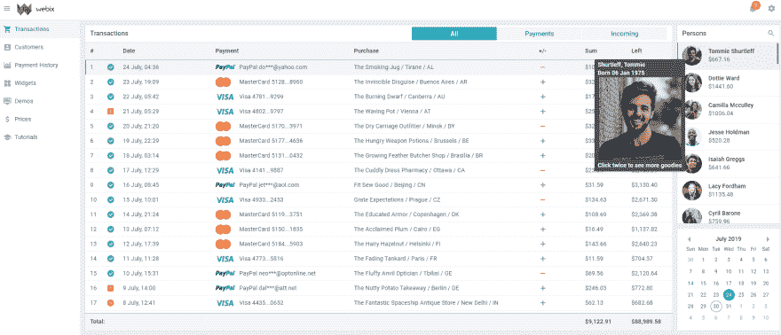

# 用于改善用户体验的 Webix 工具提示

> 原文：<https://dev.to/webixui/webix-tooltips-for-improving-user-experience-32eb>

工具提示是改善用户体验的冠军。这些弹出消息会引导用户浏览您的 web 应用程序，提供线索和其他有用的信息。Webix 工具提示可以添加到任何地方:数据表的页眉和页脚、控件、HTML 元素等等。
[](https://res.cloudinary.com/practicaldev/image/fetch/s--SCZXFwt0--/c_limit%2Cf_auto%2Cfl_progressive%2Cq_auto%2Cw_880/https://thepracticaldev.s3.amazonaws.com/i/bm1s1gra6k2ejapma71s.png) 
[现场试玩> >](https://hexlet.io)

与 HTML 工具提示相比，Webix JavaScript 工具提示有几个优点:

*   您可以添加任何文本、标记或图像。
*   根据不同的条件，在工具提示窗口中显示不同的文本是可能的(当你将工具提示定义为一个函数时)；
*   你可以毫不费力地定制工具提示的方式与 [Webix 数据模板](https://docs.webix.com/desktop__html_templates.html)相同。

## 如何应用

您可以轻松地将 Webix 工具提示添加到您的应用程序中。你只需要一个设置。参见下面的例子:

```
{ view:"button", value:"Make everything great", tooltip:true },
{ view:"datatable", autoConfig:true, tooltip:true }
Good
Great
Make everything Great 
```

[查看代码> >](https://snippet.webix.com/lp2hiy8e)

如果你想让工具提示的内容更加多样化，你可以使用熟悉的模板策略。这样的方法会让你得到你努力争取的结果。下面有一些提示显示如何实现它。注意，添加工具提示的方式取决于目标小部件或 UI 元素。

### 在你喜欢的任何地方添加工具提示

你几乎可以给你的应用程序的任何项目配备工具提示。看看下面的橱窗。

[T4】](https://res.cloudinary.com/practicaldev/image/fetch/s--v35p8cng--/c_limit%2Cf_auto%2Cfl_progressive%2Cq_auto%2Cw_880/https://thepracticaldev.s3.amazonaws.com/i/c1cxzg58wn227xq3f5f2.png)

### [Webix 数据控件](https://webix.com/widget/data-widgets/)

### T5】

如果您需要一个包含数据小部件的小文本消息的工具提示，您可以通过 tooltip: true 添加它。但是您也可以在邮件中附加图像或动态文本。Webix 工具提示也可以显示任何 HTML 内容。

```
{
    view:"list",
    width:250,
    select:true,
    tooltip:function(obj){
        return "<div>" + obj.lname + ", " + obj.fname + "</div>";    
    },
    // ...rest of the config
} 
```

也可以使用 CSS 类来改变工具提示弹出的位置。为此，将 tooltip 定义为一个对象，并添加必要的设置:

```
{
  view:"list",
  width:250,
  select:true,
  tooltip:{
    template:obj => {
      //... same tooltip template as above
    },
    dx:10, dy:10,
    css:"persons_tooltip"
  },
  // ...rest of the config
} 
```

[查看代码> >](https://snippet.webix.com/xz81ww4n)

### 工具提示和控件

您可以通过 tooltip: true 为任何窗体控件设置工具提示。它允许添加显示控件值的简单默认工具提示。请看一下如何插入工具提示的例子，它显示了数据选择器的选定日期。

```
webix.ui({
  view:"datepicker", tooltip:true
}); 
```

您也可以使用与数据项工具提示相同的原理创建更复杂的东西。唯一的是工具提示显示的内容来自控件设置，而不是来自数据。

```
{
  view:"datepicker",
  tooltip:obj => {
    var result = "";
    if (obj.value){
      var age = Math.floor((new Date() - obj.value) / (1000 * 60 * 60 * 24 * 365));
      result += "Client is " + age + " years old";
    }
    return result || "Age is unknown";
  }
} 
```

带有选项的控件是另一回事。在这种情况下，您可以为每个选项添加工具提示。

```
{
  view:"radio", name:"notifications",
  label:"Notifications",
  tooltip:obj => {
    var result = obj.id%2 ? "" : "no";
    return "You will receive" + result + "email notifications.";
  },
  options:[
    { id:1, value:"Yes" },
    { id:2, value:"No" }
  ]
} 
```

[查看代码> >](https://snippet.webix.com/6wcbiy58)

### DataTable 和 Webix 工具提示

Webix 工具提示为用户提供了出色的数据表体验。几乎可以给它的任何元素添加线索。

#### 页眉页脚

页眉和页脚的工具提示允许你通知用户他们可能不知道的功能。例如，将鼠标悬停在标题上，将会调用一个窗口，显示当您单击标题时，列表可以按名称排序的信息。您也可以将工具提示设定为:

1.  true(显示标题“文本”的默认工具提示)，
2.  字符串，
3.  接收标题行对象的函数。

```
webix.ui({
  view:"datatable",
  tooltip:true, footer:true,
  columns:[
    {
      id:"", header:{
        text:"Purchase",
        tooltip:"Click to sort the list by #text# name"
        // "Click to sort the list by Purchase name"
      }
    },
    {
      id:"sum", header:"Cost",
      tooltip:false,
      footer:{
        content:"summColumn",
        tooltip:"Total money flow"
      }
    }
    // ...other columns
  ]
}); 
```

带有过滤器或聚集器的页眉或页脚需要更复杂的工具提示功能。您可以使用 [getHeaderContent](https://docs.webix.com/api__ui.datatable_getheadercontent.html) 方法在列的页脚显示总和。

```
webix.ui({
  view:"datatable",
  tooltip:true, footer:true,
  columns:[
    {
      id:"", header:{
        text:"Purchase",
        tooltip:"Click to sort the list by #text# name"
      }
    },
    {
      id:"sum", header:"Cost",
      tooltip:false,
      footer:{
        content:"summColumn",
        tooltip:obj => {
          var sum = this.$$("grid").getHeaderContent(obj.contentId).getValue();
          return "Total money flow: " + sum;
        }
      }
    }
    // ...other columns
  ]
}); 
```

### 迷你图工具提示

您可以为显示迷你图的单元格添加工具提示。你有两个选择:

1.工具提示:true 允许您显示更大的迷你图，

1.  如果要为迷你图项目显示它们，可以使用特殊的列工具提示。

为此，将工具提示定义为一个函数，在本例中，该函数接收一个参数，即迷你图项目的值。

```
webix.ui({
  view:"datatable",
  data:[
    { id:1, name:"Austria", income:[710, 780, 390, 660, 600] },
    { id:2, name:"France", income:[810, 500, 780, 800, 940] }
  ],
  tooltip:true,
  columns:[
    {
      id:"income", header:"Income per Month",
      template:"{common.sparklines()}", width:200,
      tooltip:function(obj,common,value){
        return value || "";
      }
    }
  ]
}); 
```

[查看代码> >](https://snippet.webix.com/nk7rlr9i)

### 任何 HTML 区域的工具提示

Webix 工具提示可以在你喜欢的任何地方弹出，例如，当你将鼠标悬停在一张图片上时。你需要做的就是:

1.  要使用工具提示设置为小部件设置工具提示，
2.  将工具提示文本设置为 HTML 元素的 webix_tooltip 属性。

```
{
  view:"multicombo", name:"tags", id:"mcb",
  placeholder:"Click to add tags",
  options:tags,
  tooltip:true
}
// ...
var delIcons = $$("mcb").$view.querySelectorAll(".webix_multicombo_delete");
for (var i = 0; i &lt; delIcons.length; i++){
  delIcons[i].setAttribute(
    "webix_tooltip",
    "<span class="danger">Click to remove the badge</span>"
  );
} 
```

上面的例子显示了如何将工具提示应用于整个小部件。如果希望工具提示只在特定区域显示，可以使用低级别的 API。[工具提示控制([https://docs.webix.com/api__refs__tooltipcontrol.html)将](https://docs.webix.com/api__refs__tooltipcontrol.html)%C2%A0will)帮助在这种情况下:

```
webix.ui({
 id:"photo",
 template:``,
 // ... other config
});
...
webix.TooltipControl.addTooltip($$("photo").$view); 
```

[查看代码> >](https://snippet.webix.com/xpp58v40)

### HTML 元素的工具提示

您甚至可以在文档的正文中添加 Webix 工具提示，在正文中可以放置 Webix 和非 Webix 布局。

查看创建静态文本工具提示的指南:

*   给 HTML 区域一个 ID。
*   使用 TooltipControl mixin 及其 addTooltip()方法，该方法需要工具提示的 ID 和文本。

```
// html code
<div class="label"><label for="title">Book title</label></div>
<div><input id="title" name="title" type="text" value="" placeholder="Title" /></div> // js code
webix.TooltipControl.addTooltip("title", "Enter book title");

It would be inconvenient to call addTooltip() many times, especially when you need a lot of tooltips for several HTML areas. Luckily, you can add the webix_tooltip attribute with the text to the areas and then enable “tooltip ability” for their common parent area with addTooltip():
// html code
<fieldset id="genre">
  <div id="genre1"><label for="genre1">Poetry</label></div>
  <div id="genre2"><label for="genre2">Horror</label></div>
</fieldset> //js code
webix.TooltipControl.addTooltip("genre"); 
```

您也可以创建动态工具提示。它们将取决于主区域内容的变化。为此，您必须在 addTooltip()中提供额外的定制处理程序。处理程序定义了工具提示的行为，并且可以用来改变它。

查看如何为文本区域创建动态工具提示的示例。请注意，如果您不输入任何内容，工具提示将显示一个空字段。$tooltipIn 处理程序将确定工具提示的视图。

```
// html code
<div class="label">
  <label for="annotation">Annotation</label> </div> <textarea id="annotation" cols="40" name="annotation" rows="5">
  Some book annotation is here
</textarea> 
// js code
webix.TooltipControl.addTooltip("annotation", {
  $tooltipIn:function(node){
    var tooltip = webix.TooltipControl.getTooltip();
    tooltip.define("template", function(){
      return node.value||"Empty field";
    });
    return node;
  }
}); 
```

[现场试玩> >](https://snippet.webix.com/d3zxgjbn)

### 底线

在寻找改善用户体验的技巧时，关注工具提示是明智的。如果它们设计得很好并且应用在正确的地方，用户可以很快很容易地学会如何使用你的 web 应用。如果您使用 UI 库构建软件解决方案，请确保它的工具提示是可定制的，以便您可以更改它们来满足您的需求。