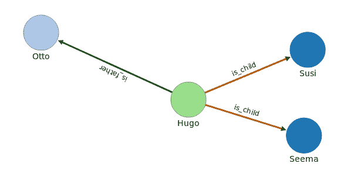

# ActiveOrient:继承、边和节点

> 原文：<https://dev.to/topofocus/activeorient-inheritance-edges-and-nodes-3d4f>

这是 ActiveOrient 系列的第 3 部分。

在[第 2 部分](https://dev.to/topofocus/activeorient-joins-and-links-j2d)中，我们研究了 RDMS(active record)-连接和单向链接以及`ActiveOrient`中的连接之间的相似性。

我们的示例数据库由人员组成，我们是父亲、孩子或(隐式)父母启用的查询，如

*   哪些是父亲的孙子孙女？
*   谁是父亲？
*   谁没有孩子。

现在，我们坚持使用我们的`Person`类，但是用定向链接组织数据并引入继承。

## 继承

在自引用方法中，孩子就是孩子，因为在`Person`的`children`-属性中有一个链接。如果我们必须决定，是否允许这个人采取某些行动，我们必须查询数据库并寻找这些条目。那是低效的。

```
 > Person.create_class :child, :father
  # INFO->CREATE CLASS child EXTENDS person
  # INFO->CREATE CLASS father EXTENDS person
 => [Child, Father] 
```

<svg viewBox="0 0 448 512" class="highlight-action highlight-action--fullscreen-on"><title>Enter fullscreen mode</title></svg> <svg viewBox="0 0 448 512" class="highlight-action highlight-action--fullscreen-off"><title>Exit fullscreen mode</title></svg>

创建继承类。一个`Child`，它是专门的`Person`。在模型文件(`/model/child.rb`)中，我们可以通过定义定制的方法来表达这一点。不出所料，孩子和父亲都是人:

```
 > ['Andrea','Susi','Seema'].map  {|c| Child.create name: c}
 > ["Otto","Joseph"].map  { |c| Father.create name: c}
 > Person.count     => 5
 > Father.count     => 2 
```

<svg viewBox="0 0 448 512" class="highlight-action highlight-action--fullscreen-on"><title>Enter fullscreen mode</title></svg> <svg viewBox="0 0 448 512" class="highlight-action highlight-action--fullscreen-off"><title>Exit fullscreen mode</title></svg>

我们不需要在数据库中查询对`Person.children`中一个人记录的引用，我们只需要查询这个类，就知道这是一个子类。要列出所有的孩子，我们不必查询所有的人，我们只需表示`Child.query.order(name: :asc).execute`。好多了。

该实现不需要改变我们的数据库模式。和以前一样，任何东西都可以使用自引用链接。而且还是静态的。所以让我们改变这一点。

## 边缘和节点

*图形数据库*最常见的特征是顶点和边的存在。我们目前的方法只使用顶点。

*   边双向连接顶点。
*   任何顶点都有特殊的属性:`in`和`out`，它们是指向边的链接数组。
*   `ActiveOrient`提供了一个方法`nodes`。它跟随附加的边，并列出存在于边的另一侧的任何顶点。
*   顶点通过`:assign`方法连接。

假设，我们想要表示上面创建的人的关系，

```
 > E.create_class :is_family
 > IS_FAMILY.create_class :is_child, :is_father
 > hugo =  Person.create( name: 'Hugo')
 > hugo.assign( via: IS_CHILD, vertex: Child.like( 'name = S*'))
 # INFO->select from child where name.left(1) = 'S' order by name asc
 # INFO->CREATE EDGE is_child from #29:6 to [#54:0, #53:0] 
 > hugo.assign( via: IS_FATHER, vertex: Father.where( name: 'Otto'))
 # INFO->CREATE EDGE is_father from #29:6 to [#59:0]
 # then
 > hugo.reload!
 > hugo.nodes( :out, via: /is/).count  => 3
 > hugo.nodes( :out, via: IS_FATHER ).first.name => 'otto'
 > Child.where( name: 'Seema').first.nodes( :in).to_human 
 => ["<Person[29:6]: out: {IS_FATHER=>1, IS_CHILD=>2}, name : Hugo>"] 
```

<svg viewBox="0 0 448 512" class="highlight-action highlight-action--fullscreen-on"><title>Enter fullscreen mode</title></svg> <svg viewBox="0 0 448 512" class="highlight-action highlight-action--fullscreen-off"><title>Exit fullscreen mode</title></svg>

[](https://res.cloudinary.com/practicaldev/image/fetch/s--3LBuL-Va--/c_limit%2Cf_auto%2Cfl_progressive%2Cq_auto%2Cw_880/https://thepracticaldev.s3.amazonaws.com/i/ktuv7lsieqbzdo1l9lg4.png)

首先，我们创建固有边:IS_Family、IS_CHILD 和 IS_FATHER。

*注*:在`ActiveOrient`中，边类是超格。数据库类仍然是小写的。

雨果，一个人，被创造出来。然后，通过 IS_CHILD-Edges 将新记录分配给符合搜索标准的任何子记录。我们设法把苏西和 Seema 联系起来。接下来是奥托通过他父亲的转让。

最后，我们询问了这些关系。方法`:nodes`区分`:in-`走向和`:out`走向边缘。分配发生在 hugo 的`:out`侧。`:via`-参数通过提供 EDGE_CLASS 或适合小写数据库类名的正则表达式来过滤边。
节点双向工作。上一个查询演示了这一点。我们从一个孩子开始，问任何关系。只有一个，到父亲-顶点。

也许你会有这样的想法:这不是终点。很简单，调查父亲的关系，例如，显示祖父母，他们的孩子等等。

## 结论

图形顶点和边方法的继承性和灵活性打开了突然的机会。为那些认为关系到一生的人(如作者)提供了一些减轻转变的方法。

这带来了许多机会。就像在现实生活中一样:生活在一个有着简单规则的良好基础的环境中，然后负责一条体面的道路，通常会更舒服。使用 ActiveOrient(和 OrientDB ),开发人员可以选择使用关系或图形，并且他/她可以从两个世界的成熟布局中受益。

在下一部分，我们将开发一个时间图，能够有效地组织任何基于时间的数据、事件、时间序列等等。