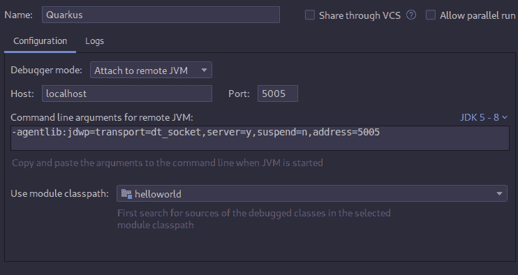
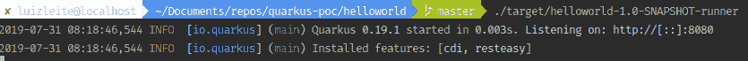

# 我和夸克的第一个应用

> [https://dev . to/luizlite _/my-first-app-com-quark us-3ocb](https://dev.to/luizleite_/meu-primeiro-app-com-quarkus-3ocb)

今天我决定用夸克来创造我的第一个应用程序，但是为什么呢？！事实上，这只是一种验证，即使我知道 Spring boot 在某些方面领先，但 [Quarkus](https://quarkus.io/) 和 [Micronaut](https://micronaut.io/) 是很好的替代方案，而且它们正在获得空间，主要是因为我们有 graal _ vm 的繁荣。

事实上，这是我和夸克的第二个项目，我第一次有机会做的是在 devoxxuk 19，以及该项目的承建商和创造者。在那里我有机会消除疑虑我看到了这部分的潜力。

## O que é QUARKUS。木卫一？

Quarkus 是 java 框架的替代方案，spring boot 和 micronaut 也是如此。它的目的是成为容器第一有些人甚至声称自己是库柏人。项目主页显示了一个非常酷的概念，即成为超音速 Java，这是可能的。
我发现最有趣的事情之一是读了他们评论实时编码的网站的这一部分。几乎是 Java 范式的转变。
从:
撰写程式码- >【汇编】>【部署】>【刷新】>【重复】
:撰写程式码- >【刷新】>重复
并且看起来

## 项目启动

要在项目中启动，只需运行以下命令

```
mvn io.quarkus:quarkus-maven-plugin:0.19.1:create \
    -DprojectGroupId=com.luizleiteoliveira \
    -DprojectArtifactId=helloworld \
    -DclassName="com.luizleiteoliveira.helloworld.ApplicationResource" \
    -Dpath="/hello" 
```

这个命令产生什么？

*   Maven 的完整结构
*   Uma 类应用资源 dentro de /hello
*   与上面的类关联的测试类
*   将应用程序上传到 http://localhost:8080 时可用的登录页
*   本地模式和 jvm 的两个 Dockerfile 示例

## 你好 O 世界

要在 rest 创建您的第一个 Hello World，并不需要太多的努力，因为在您启动的类中，它已经自动出现，如下所示:

```
@Path("/hello")
public class ApplicationResource {

    @GET
    @Produces(MediaType.TEXT_PLAIN)
    public String hello() {
        return "hello";
    }
} 
```

之后只需在终端上运行命令即可在开发模式下旋转 quakus:

```
./mvnw compile quarkus:dev 
```

此命令已启用 5005 端口进行调试，因此必须在您最喜欢的 IDE 中执行远程调试设置。

## 配置 Intellij 远程调试:

在 Intellij 设置编辑(ctrl+shit+a-> edit settings)中，
单击“+”并为端口 5005 添加一个设置，该设置应如下所示:

[](https://res.cloudinary.com/practicaldev/image/fetch/s--X78eJoSk--/c_limit%2Cf_auto%2Cfl_progressive%2Cq_auto%2Cw_880/https://raw.githubusercontent.com/luizleite-hotmart/presentations/mastimg/post-quarkus/Screenshot%2520from%25202019-07-31%252008-10-24.png)

## 第一次测试‘hot deploy’

在我做以上部分的时候，我已经想，是我失去了我的 Hotdeploy。我将不得不把它扔在地上每一个小时，然后我决定做一个测试，当我的应用程序运行时，我把我的 hello 改为:

```
@Path("/hello")
public class ApplicationResource {

    @GET
    @Produces(MediaType.TEXT_PLAIN)
    public String hello(@QueryParam("who") final String who) {
        return "hello "+ who;
    }
} 
```

我一叫端点 [http://localhost:8080/hello？who = test](http://localhost:8080/hello?who=teste)在我的终端上显示消息:“hot replace total time:0.726”，但我的端点并没有真正更改，这种情况下，我必须重新启动我的应用程序，但他没有抱怨。
当然我没有深入研究，但到目前为止效果很好。从下一次开始我要用夸克来做一个更真实的应用看看保存数据的感觉也许会用到 API 什么的。

## 行动中的权力

到目前为止，没有巨大的优势，现在是我们进入法律部分的时候了，让我们去本土吧。应用程序保持原样后，有一个 maven 命令用于构建应用程序二进制文件。

`mvn package -Pnative`

要运行此命令，您的环境变量以及圣杯必须已配置为正常工作。运行后将在/target 中创建一个可执行文件，运行起来非常简单。/现在是 0.003 秒的惊吓我的应用程序正在运行。
[](https://res.cloudinary.com/practicaldev/image/fetch/s--eH5FZ47W--/c_limit%2Cf_auto%2Cfl_progressive%2Cq_auto%2Cw_880/https://raw.githubusercontent.com/luizleite-hotmart/presentations/mastimg/post-quarkus/Screenshot%2520from%25202019-07-31%252008-19-33.png)

## 结论。

就像我之前说的，我做的测试不仅仅是一种第一印象，但是到目前为止，它很安静。我觉得这个项目的第一次启动很简单把它投入运行是多么的荒谬，如此之快。
我喜欢的另一点是在网站内有[指南](https://quarkus.io/guides/)的一部分，展示了如何在夸克中执行‘x’东西的各种教程。

关于我的项目，你可以在 github 内查询。

## /[夸尔库斯-poc](https://github.com/luizleite-hotmart/quarkus-poc)

### 来自 quartus 的概念证明

<article class="markdown-body entry-content container-lg" itemprop="text">

# quarkus-poc

来自 quartus 的概念证明

</article>

[View on GitHub](https://github.com/luizleite-hotmart/quarkus-poc)