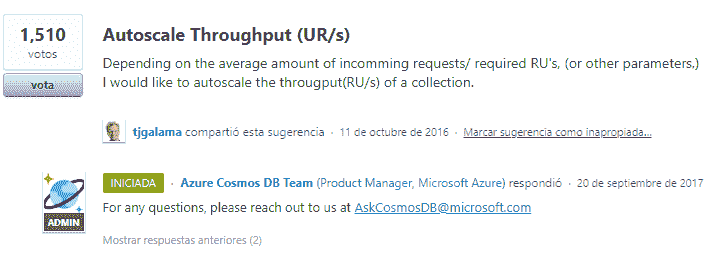

# Cosmos DB 的自动缩放

> 原文：<https://dev.to/dr_donoso/autoscale-for-cosmos-db-aj3>

如果您曾经在您的项目中使用过 Cosmos DB，也许您会意识到使用 Cosmos DB 的一个主要问题是它没有 autoscale。微软两年前开始致力于此。

[](https://res.cloudinary.com/practicaldev/image/fetch/s--WuTLZ1KZ--/c_limit%2Cf_auto%2Cfl_progressive%2Cq_auto%2Cw_880/https://thepracticaldev.s3.amazonaws.com/i/0e2pef8gci80rkjz64ri.png)

一个问题是当你在几个小时内有很多请求时，或者可能是因为一些事情触发了很多用户同时使用应用程序。

# 怎么办

首先，我们需要修改报价的方法。为此，我添加了一些方法来获取报价并对其进行缩放:

```
private async Task ScaleAsync(string database, string collection, int scaleBatch, int minThroughput, int maxThroughput)
{
    var offer = await GetOfferAsync(database, collection);
    await ScaleAsync(offer, scaleBatch, minThroughput, maxThroughput);
}

private async Task ScaleAsync(OfferV2 offer, int scaleBatch, int minThroughput, int maxThroughput)
{
    var currentThroughput = offer.Content.OfferThroughput;

    var newThroughput = currentThroughput + scaleBatch;
    if (newThroughput < minThroughput)
    {
        newThroughput = minThroughput;
    }

    if (newThroughput > maxThroughput)
    {
        newThroughput = maxThroughput;
    }
    var updatedOffer = new OfferV2(offer, newThroughput);
    await documentClient.ReplaceOfferAsync(updatedOffer);
}

private async Task<OfferV2> GetOfferAsync(string database, string collection)
{
    return await GetCollectionOfferAsync(database, collection) ?? await GetDatabaseOfferAsync(database);
}

private async Task<OfferV2> GetCollectionOfferAsync(string database, string collection)
{
    var collectionUri = UriFactory.CreateDocumentCollectionUri(databaseName, collectionName);
    var collection = (await _documentClient.ReadDocumentCollectionAsync(collectionUri)).Resource;

    return await GetOfferAsync(collection.SelfLink);
}

private async Task<OfferV2> GetDatabaseOfferAsync(string database)
{
    var databaseUri = UriFactory.CreateDatabaseUri(databaseName);
    var database = (await _documentClient.ReadDatabaseAsync(databaseUri)).Resource;

    return await GetOfferAsync(database.SelfLink);
}

private async Task<OfferV2> GetOfferAsync(string selfLink)
{
    return (await _documentClient.CreateOfferQuery()
                .Where(o => o.ResourceLink == selfLink)
                .AsDocumentQuery()
                .ExecuteNextAsync<OfferV2>()).FirstOrDefault();
} 
```

<svg width="20px" height="20px" viewBox="0 0 24 24" class="highlight-action crayons-icon highlight-action--fullscreen-on"><title>Enter fullscreen mode</title></svg> <svg width="20px" height="20px" viewBox="0 0 24 24" class="highlight-action crayons-icon highlight-action--fullscreen-off"><title>Exit fullscreen mode</title></svg>

## 放大

当有一个请求超过了您为数据库或集合提供的吞吐量时，Cosmos 会抛出一个状态代码为 429 的`DocumentClientException`。
因此，我们应该做的是捕获这个异常，扩展这个数据库或集合，然后重试执行:

```
public async Task<T> ExecuteAsync<T>(Func<IDocumentClient, Task<T>> func, string database, string collection, int scaleUpBatch, int minThroughput, int maxThroughput, int retries = 0)
{
    try
    {
        return await func(_documentClient);
    }
    catch (DocumentClientException exception) when ((int)exception.StatusCode == 429)
    {
        retries++;
        await ScaleAsync(database, collection, scaleUpBatch, minThroughput, maxThroughput);
        if (retries < _config.MaxRetries) return await ExecuteAsync(func, database, collection, scaleUpBatch, minThroughput, maxThroughput, retries);
        throw;
    }
} 
```

<svg width="20px" height="20px" viewBox="0 0 24 24" class="highlight-action crayons-icon highlight-action--fullscreen-on"><title>Enter fullscreen mode</title></svg> <svg width="20px" height="20px" viewBox="0 0 24 24" class="highlight-action crayons-icon highlight-action--fullscreen-off"><title>Exit fullscreen mode</title></svg>

## 缩小比例

为了缩小规模，我们应该使用 cronjob，我使用 Azure 函数来缩小所有的集合。

```
public async Task ScaleDownAll(int scaleDownBatch, int minThroughput, int maxThroughput)
{
    var scaleBatch = Math.Abs(scaleDownBatch) * -1;
    var databases = _documentClient.CreateDatabaseQuery().AsEnumerable().ToList();

    foreach (var database in databases)
    {
        var offer = await GetOfferAsync(database.SelfLink);

        if (offer != null)
        {
            await ScaleAsync(offer, scaleBatch, minThroughput, maxThroughput);
        }
        else
        {
            var collections = _documentClient.CreateDocumentCollectionQuery(database.SelfLink).ToList();
            foreach (var collection in collections)
            {
                offer = await GetOfferAsync(collection.SelfLink);
                await ScaleAsync(offer, scaleBatch, minThroughput, maxThroughput);
            }
        }
    }
} 
```

<svg width="20px" height="20px" viewBox="0 0 24 24" class="highlight-action crayons-icon highlight-action--fullscreen-on"><title>Enter fullscreen mode</title></svg> <svg width="20px" height="20px" viewBox="0 0 24 24" class="highlight-action crayons-icon highlight-action--fullscreen-off"><title>Exit fullscreen mode</title></svg>

如果你想了解更多，我在 Github 上发起了一个回购:

[https://github.com/DrDonoso/Cosmos-Autoscale](https://github.com/DrDonoso/Cosmos-Autoscale)