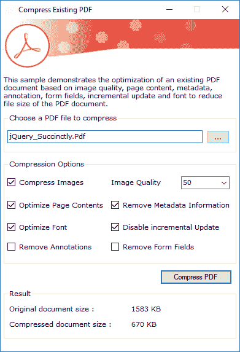

# 用 C#压缩 PDF 文件的 7 种方法，VB.NET

> 原文：<https://dev.to/syncfusion/7-ways-to-compress-pdf-files-in-c-vb-net-4b97>

Syncfusion [Essential PDF](https://www.syncfusion.com/products/file-formats/pdf/) 是一个. NET PDF 库，可用于优化或压缩您的 PDF 文档。减小 PDF 文件大小可以帮助您优化带宽成本、网络传输和数字存储。它在存档、发送电子邮件和在基于 web 的应用程序中使用 PDF 文档等领域特别有用。基本 PDF 支持以下优化:

*   缩小所有图像。
*   优化字体。
*   正在删除元数据。
*   优化页面内容。
*   禁用增量更新。
*   删除或拼合表单域。
*   移除或平面化注释。

在这篇博客中，我们将看看每一个优化，以及如何实现它们。

## 通过缩小所有图像来减小 PDF 文件大小

PDF 文件可能包含许多图像。从 PDF 文件中删除图像通常不是一个选项，因为它们对于许多 PDF 文件是必需的。对图像进行缩减像素采样将减少像素数量，这可能是减小 PDF 文件大小的最有效方法。用户可以根据图像质量控制 PDF 文件的大小。

```
//Create a new compression option object.
PdfCompressionOptions options = new PdfCompressionOptions();
options.CompressImages = true;
//Image quality is a percentage.
options.ImageQuality = 10; 
```

## 通过优化字体减小 PDF 文件大小

并非所有的字形数据和字体表都是呈现 PDF 文档中的文本所必需的。从 PDF 文档的嵌入字体中删除不使用的字形和不需要的字体表，使其变小。

```
PdfCompressionOptions options = new PdfCompressionOptions();
options.OptimizeFont = true; 
```

## 通过删除元数据减小 PDF 文件大小

有时，PDF 文件中可能会出现不必要的元数据。删除不必要的元数据，以减小 PDF 的大小。

```
PdfCompressionOptions options = new PdfCompressionOptions();
options.RemoveMetadata = true; 
```

## 通过优化页面内容减小 PDF 文件大小

优化页面内容将删除不需要的注释行、空格，将行尾字符转换为空格，并压缩所有未压缩的内容。

```
PdfCompressionOptions options = new PdfCompressionOptions();
options.OptimizePageContents = true; 
```

## 通过禁用增量更新来减小 PDF 文件大小

增量更新选项可用于增量更新 PDF 文件，而无需重写整个文件。在这里，更改被附加到文件的末尾，保持其原始内容不变。禁用增量更新将重写整个文件，从而生成一个更小的 PDF。

```
//Load the existing PDF document.
PdfLoadedDocument loadedDocument = new PdfLoadedDocument(@"input.pdf");
//Restructure the complete document.
loadedDocument.FileStructure.IncrementalUpdate = false; 
```

## 通过删除表单域来减小 PDF 文件的大小

删除或拼合表单域有助于减小文件大小。当不需要表单域及其值时，可以删除它们。当它们是必需的但不需要进一步编辑时，可以将其展平。这两种操作都会减小文件大小。

```
public void RemoveFormFields(PdfLoadedDocument ldoc, bool flatten)
{
    if (flatten)
    {
        ldoc.Form.Flatten = true;
    }
    else
    {
        int count = ldoc.Form.Fields.Count;
        for (int i = count - 1; i >= 0; i--)
        {
            ldoc.Form.Fields.RemoveAt(i);
        }
    }
} 
```

## 通过移除注释来减小 PDF 文件的大小

删除或拼合注释有助于减小文件大小。当不需要注释及其内容时，可以将其删除。当它们是必需的但不需要额外编辑时，它们可以被展平。这两个选项都会减小文件大小。

```
public void RemoveAnnotations(PdfLoadedDocument ldoc, bool flatten)
{
    foreach(PdfPageBase page in ldoc.Pages)
    {
        if (flatten)
        {
           page.Annotations.Flatten = true;
        }
        else
        {
            int count = page.Annotations.Count;
            for (int i = count - 1;i >= 0; i--)
            {
              page.Annotations.RemoveAt(i);
            }
        }
    }  
} 
```

<figure>

[](https://res.cloudinary.com/practicaldev/image/fetch/s--Wcr4eJip--/c_limit%2Cf_auto%2Cfl_progressive%2Cq_auto%2Cw_880/https://blog.syncfusion.com/wp-content/uploads/2018/08/image-309.png)

<figcaption>PDF compression options</figcaption>

</figure>

演示 Essential PDF 中可用压缩选项的示例可从这里下载:[optimizedpfsample . zip](https://www.syncfusion.com/downloads/support/directtrac/general/ze/OptimizePDFSample-1079315236)。

## 包装完毕

如您所见， [Essential PDF](https://www.syncfusion.com/products/file-formats/pdf/) 提供了多种压缩 PDF 文档的优化机制。有效地使用它们来生成压缩文档，以提高文档管理系统的效率和生产率。花点时间细读一下[文档](https://help.syncfusion.com/file-formats/pdf/working-with-compression)，在那里你会找到其他选项和特性，都附有代码示例。

如果您不熟悉我们的 PDF 库，强烈建议您遵循我们的[入门指南](https://help.syncfusion.com/file-formats/pdf/getting-started)。

如果你已经是 Syncfusion 用户，你可以在这里下载产品设置，或者，你可以在这里下载 30 天免费试用。

对这些功能有任何问题或需要澄清吗？请在下面的评论中告诉我们，您也可以通过我们的[支持论坛](https://www.syncfusion.com/forums)或 [Direct-Trac](https://www.syncfusion.com/support/directtrac/) 联系我们。我们很乐意为您提供帮助！

如果你喜欢这篇博文，我们认为你也会喜欢下面的相关博文:

[在 Linux Docker 中使用 ASP.NET 核心进行 HTML 到 PDF 的转换](https://blog.syncfusion.com/post/html-to-pdf-conversion-using-asp-net-core-in-linux-docker.aspx)
[在 Xamarin 中为您的 PDF 添加 RTL 支持](https://blog.syncfusion.com/post/adding-rtl-support-to-your-pdf-in-xamarin.aspx)
[现在您的 PDF 文档更安全了！](https://blog.syncfusion.com/post/now-your-pdf-documents-are-safer.aspx)
[将数据网格导出到 Xamarin 中的特定 PDF 页面。表单](https://blog.syncfusion.com/post/exporting-the-data-grid-to-a-specific-pdf-page-in-xamarin-forms.aspx)
[使用宇宙魔方开源引擎在 PDF 中进行光学字符识别](https://blog.syncfusion.com/post/optical-character-recognition-in-pdf-using-tesseract-open-source-engine.aspx)

帖子[用 C#压缩 PDF 文件的 7 种方法，VB.NET](https://www.syncfusion.com/blogs/post/7-ways-to-compress-pdf-files.aspx)最先出现在 [Syncfusion 博客](https://www.syncfusion.com/blogs)上。