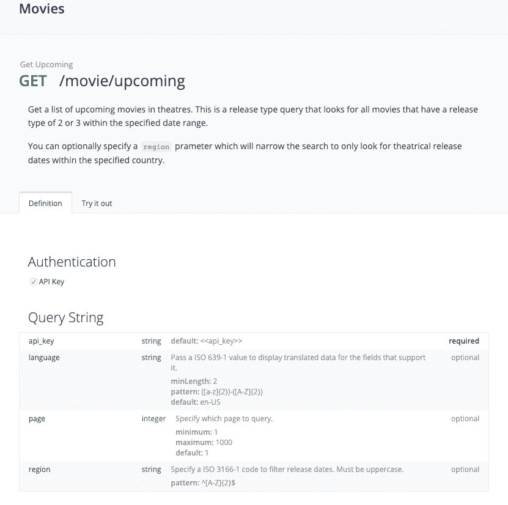
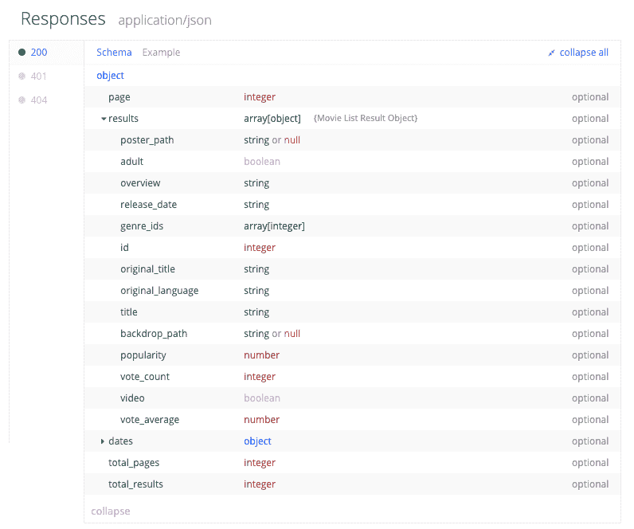

# 将技能的 lambda 连接到外部 api

> [https://dev . to/kini/连接-El-lambda-de-una-skill-a-una-API-external-4c 6h](https://dev.to/kini/conectando-el-lambda-de-una-skill-a-una-api-externa-4c6h)

我技巧中的一个悬而未决的题目[【电影明星】](https://www.amazon.es/Kinisoftware-Estrenos-de-cine/dp/B07MKCLZ62)是把它连接到一个外部 API，给我电影的信息。到目前为止，它在 lambda 本身有一个 JSON 格式的文件，但它必须手动更新，而且很明显，这不是缩放。)

将技能连接到外部 API 不应影响模型，因为更改的是在 lambda 中使用的数据的“源”。您不需要再次通过认证，因为我们正在更改的是服务器，并且只需更新部署到使用 live 技能版本的代码即可。

## 电影 DB API

首先是找到适合我们技能的 API。我的技能需要的信息是一个特定国家/地区即将上映的电影列表，每个电影至少包含以下数据:标题和首映日期。

虽然看起来很简单，但题目有其有趣的部分。至少在西班牙，我们翻译(或完全更改)了电影的标题。有时，这种西班牙文译文并不完整，但在同一标题下，我们将几种语言合并为"复仇者:吞下去"。有时候我们不翻译"玩具总动员 4 "。

这对于为我们的技能创建答案是一个挑战，因为它是为西班牙语创建的，因此将使用该语言。但在上述示例中，如果我们要尝试为用户提供最佳体验，我们将不得不考虑如何处理这些方案。我会在另一篇文章里告诉你们我是如何处理这个案子的，用[SSM](https://developer.amazon.com/docs/custom-skills/speech-synthesis-markup-language-ssml-reference.html)来告诉 Alexa 每部电影的标题时要使用的语言。

抛开这个话题，我找到了一个 API 来满足我的需求:

*   可以订购即将上映的电影
*   能够指出落后的国家和语言
*   拥有至少包含影片标题及其首映日期的响应模型

有鉴于此，我找到了 [TheMovieDB API](https://developers.themoviedb.org/3/getting-started/introduction) ，这是一个免费使用的 API，可通过 HTTP 访问，具有 JSON 响应，但有一些限制，不会对我的技能的使用造成问题。此外，它还有一个很好的支持论坛和每日使用统计数据。

他拥有的众多端点中，[有一个正好给我想要的](https://developers.themoviedb.org/3/movies/get-upcoming)，另外，如果我为此准备好技能，我也可以支付成绩。page up 主题和语音助手经验也为另一个职位提供了机会:)

从上图中可以看出，我们可以生成我们感兴趣的查询。我们只需使用指定的格式并获得一个 key API 即可。这个过程非常简单，不值得在这里描述。我将链接到开始所需的信息。

如果我们提出一个测试请求，我们就可以看到调用所产生的模型。如果你看上图，你会发现，除了标题和首映日期之外，我们还有一种原始语言和一个原始标题。我们将使用它来决定 Alexa 要用哪种语言告诉用户。

## 使用改造 2 将 lambda 与 API 连接起来

从 JVM 世界来看，选择改造 2 连接 API 是相当自然和简单的。我已经用过很多次了，而且我无法与许多其他选择相比，我觉得我所需要的东西是最简单的。没有单一的方法可以做到这一点，而且我的设计不适合于较大的系统和测试等主题。任何反馈意见都是值得欢迎的，但因为它明确了期望:d