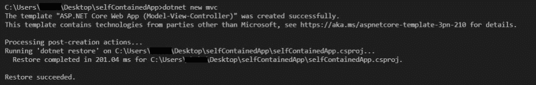
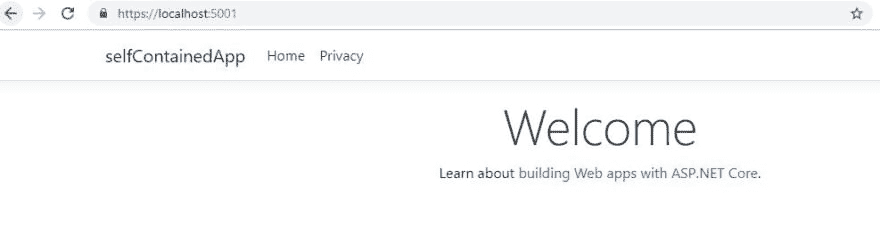
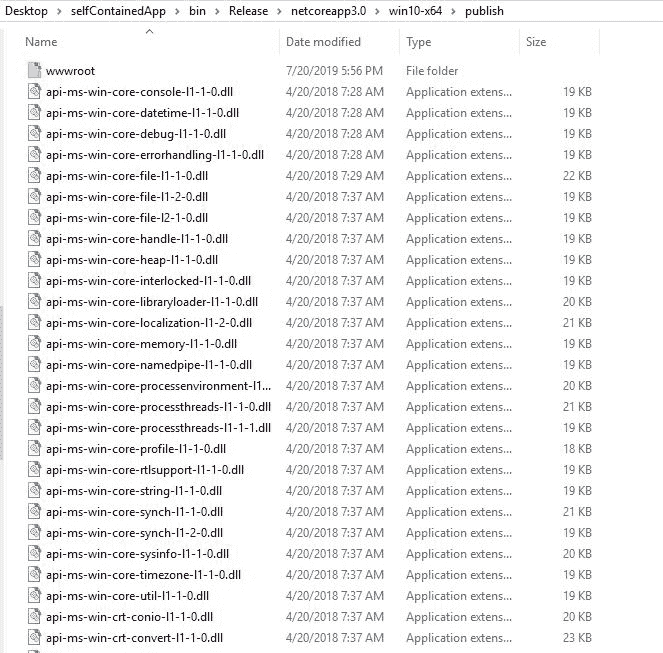
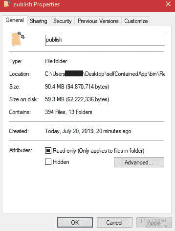
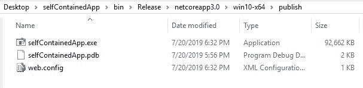
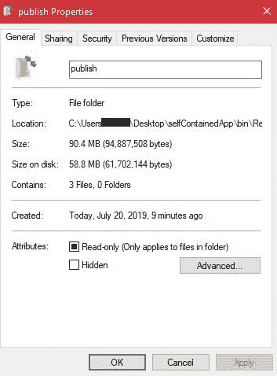
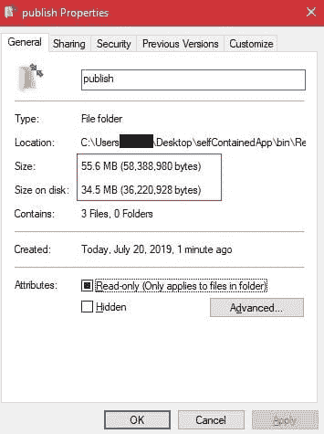

# 创造。使用 VS 代码的 NET Core 3.0 裁剪后的独立可执行应用程序

> 原文：<https://dev.to/abubakarsiddiq/create-net-core-3-0-trimmed-self-contained-single-executable-app-using-vs-code-3jmf>

在本教程中，我们将学习如何使用 visual studio 代码创建一个 Asp.NET 核心 3.0 裁剪的自包含应用程序。通过这种方式，我们可以共享我们的应用程序，而无需安装。目标计算机上的. NET SDK。因此，首先，我们将创建一个 Asp.Net 核心 3.0 应用程序，然后我们将它发布为自包含应用程序，然后我们将了解如何使用 PublishSingleFile 标志来减少文件，然后我们将了解如何使用 PublishTrimmed 标志来减少可执行文件的大小，这是的一项新功能。网芯 3.0 预览版 6。

## 本教程的先决条件

在进入下一步之前，您必须已经安装了以下先决条件。

*   Visual Studio 代码
*   。NET Core 3.0 预览版 6

## 如何使用 VS 代码创建一个. NET Core 3.0 裁剪后的自含单个可执行 app？

让我们一步一步来看看如何使用 VS 代码创建一个. NET Core 3.0 裁剪后的自包含单可执行 app。

# 第一步:使用 VS 代码创建一个 Asp.Net 核心 3.0 应用。

因此，首先，在这一步我们将使用 Visual Studio 代码创建一个 Asp.Net 核心应用程序。因此，打开 Visual Studio 代码，然后打开命令终端，然后选择要创建项目的目录，然后运行下面的
命令。

`dotnet new mvc`

运行上述命令后，您将看到一个新的“Asp。Net Core web App(模型-视图-控制器)”项目创建完成。
[T3】](https://res.cloudinary.com/practicaldev/image/fetch/s--hM6COaVz--/c_limit%2Cf_auto%2Cfl_progressive%2Cq_auto%2Cw_880/https://thepracticaldev.s3.amazonaws.com/i/opz0arxariffhelgz3u7.JPG)

现在，通过运行下面的命令来运行这个项目。

`dotnet run`

现在，您将看到输出，就像您在下面的截图中看到的那样。
[T3】](https://res.cloudinary.com/practicaldev/image/fetch/s--Tns4pRAV--/c_limit%2Cf_auto%2Cfl_progressive%2Cq_auto%2Cw_880/https://thepracticaldev.s3.amazonaws.com/i/cbh75i33x6p5a37kw9sd.JPG)

# 第二步:如何发布自带 app？

现在，在这一步中，我们将看到如何发布自包含应用程序。因此，请转到终端并运行以下命令。

`dotnet publish -r win10-x64 -c Release --self-contained`

因此，上述命令将在发布模式下构建应用程序，并将发布自包含应用程序。它将创建一个名为 publish 的新文件夹，其中包含许多带有。exe 文件。因此，现在我们可以在任何其他机器上运行这个应用程序。我们只需要复制完整的文件夹，并粘贴到任何其他机器。最后，运行。exe 文件。
 
因此，我们发布了包含大量文件的文件夹，其大小也非常大，如下图所示。所以，问题是，我们如何减少文件和大小？下一步再看。
[T8】](https://res.cloudinary.com/practicaldev/image/fetch/s--_m_IPMiz--/c_limit%2Cf_auto%2Cfl_progressive%2Cq_auto%2Cw_880/https://thepracticaldev.s3.amazonaws.com/i/dkweqov70eh233zvihcg.JPG)

# 第三步:如何减少自带 app 中的文件？

在这一步，我们将看到如何减少自含式 app 中的文件。所以根据。NET Core 3.0 预览版 5，我们可以使用 PublishSingleFile 标志发布单文件可执行文件。让我们看看它是如何工作的。

现在，运行下面的命令。

`dotnet publish -r win10-x64 -c Release /p:PublishSingleFile=true`

现在，您将看到输出，就像您在下面的截图中看到的那样。
 
所以，正如你看到的上面我们已经缩减了我们的文件。只有一个。exe 文件与 web.config 文件。但是，尺寸的问题仍然和你在下面的截图中看到的一样。
 
我们来看看如何缩小尺寸。

# 第四步:如何缩小自带 app 的尺寸？

在这一步，我们将看到如何减少自含式应用程序的大小。所以根据。NET Core 3.0 预览版 6，我们可以使用 PublishTrimmed flag 来缩小自带 app 的大小。让我们看看它是如何工作的。

现在，运行以下命令并发布自包含应用程序。

`dotnet publish -r win10-x64 -c Release /p:PublishSingleFile=true /p:PublishTrimmed=true`

现在，你会看到，上面的命令会给出你在下面的截图中看到的输出。
 
感谢阅读。请继续访问并在您的社区内分享它。
你可以在下面的链接中阅读更多关于应用部署的内容:
[如何在 IIS 8 中部署 Angular 6 和 Asp Net 核心应用？](http://dotnetdetail.net/how-to-deploy-angular-6-and-asp-net-core-application-in-iis-8/)
[如何使用 Visual Studio 将 Angular 6 & Asp Net Core App 部署到 Azure](http://dotnetdetail.net/how-to-deploy-angular-6-asp-net-core-app-to-azure-using-visual-studio/)
[持续集成和持续部署在 DevOps 中使用 Visual Studio 2019](http://dotnetdetail.net/continuous-integration-and-continuous-deployment-in-devops-using-visual-studio-2019/)